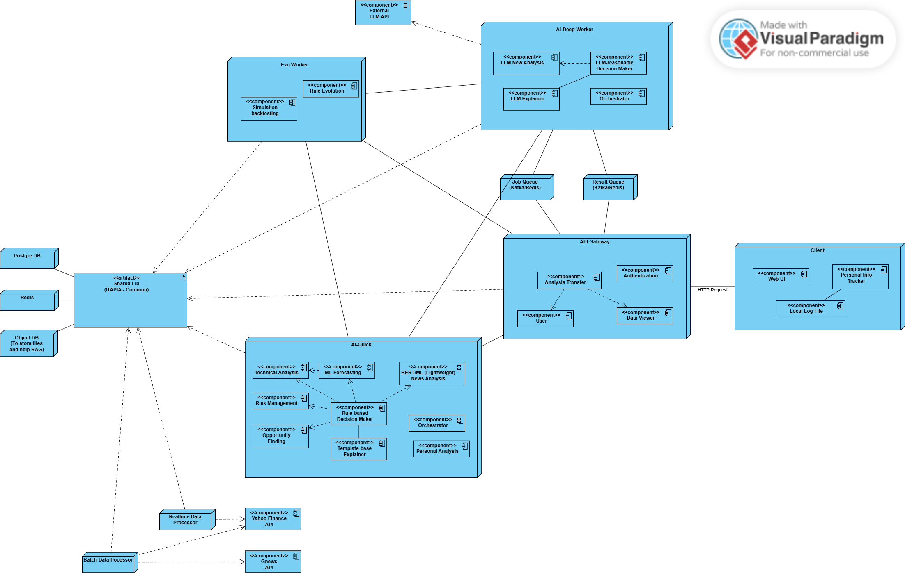

# ITAPIA - Intelligent and Transparent AI-Powered Personal Investment Assistant

ITAPIA (Intelligent and Transparent AI-Powered Personal Investment Assistant) is a graduation thesis project aimed at building an intelligent stock investment support platform. The project is specifically designed for individual investors with limited capital, who prioritize risk management and desire a clear understanding of the investment recommendations provided by AI.

Unlike traditional "black box" tools, ITAPIA focuses on **Explainability (XAI)**, **low cost**, and the ability to **learn and evolve** alongside its users.

**Vietnamese version of README**: [README.md](./README.md)

---

## 🏗️ System Architecture

The system is built on a microservices architecture, comprising the following core components:

-   **API Gateway** (`api_gateway`): Serves as the Single Entry Point, handling authentication (future), routing, and orchestrating requests to internal services.
-   **AI Service Quick** (`ai_service_quick`): Runs on CPU infrastructure, responsible for fast analysis and forecasting processes (Quick Check), delivering near-instantaneous results.
-   **AI Service Deep** (`ai_service_deep` - Future): Runs on GPU infrastructure, dedicated to computationally intensive AI/LLM tasks (Deep Dive), operating asynchronously.
-   **Data Processing**: Independent scripts and services for running scheduled or real-time data collection and processing pipelines (ETL/ELT).
-   **Databases**: PostgreSQL for persistent, structured data storage and Redis for caching and real-time streaming data.

### Deployment Diagram

The system adheres to the deployment diagram below, with a clear separation between components.



*Within the scope of this thesis, all components are deployed using Docker and Docker Compose for development and testing purposes.*

### Project Documentation

Further detailed documentation regarding architecture, design, and technical decisions can be found in the `doc` directory.

---

## 🚀 Getting Started

### System Requirements

#### Development Environment
- **Docker & Docker Compose**: 4.41.2+
- **Python**: 3.11+ (recommended within a Conda environment for compatibility with data science libraries like TA-Lib)

#### Component Versions
- **PostgreSQL**: 15 (Alpine Image)
- **Redis**: 7 (Alpine Image)

#### Supporting Tools
- **DBeaver 25**: For managing the database through a graphical interface.

### Installation

#### 1. Clone the Repository
```bash
git clone https://github.com/triet4p/itapia.git
cd itapia
```

#### 2. Configure Environment Variables
The project uses a single `.env` file in the root directory for all necessary environment variables.

Create a `.env` file in the root directory from the `.env.example` file and fill in your values:
```ini
# Postgre
POSTGRES_USER=itapia_user
POSTGRES_PASSWORD=123456
POSTGRES_DB=stocks_db
POSTGRES_HOST=stocks_postgre_db
POSTGRES_PORT=5432

# Redis
REDIS_HOST=realtime_redis_db
REDIS_PORT=6379

# API GATEWAY
GATEWAY_HOST=api-gateway
GATEWAY_PORT=8000
GATEWAY_V1_BASE_ROUTE=/api/v1

# AI Service Quick
AI_QUICK_HOST=ai-service-quick
AI_QUICK_PORT=8000
AI_QUICK_V1_BASE_ROUTE=/api/v1

# Kaggle Secrets (required for the AI Service to download models)
KAGGLE_KEY=<your-kaggle-key>
KAGGLE_USERNAME=<your-kaggle-username>
```

---

## 📊 Data Pipeline Setup

### 1. Build the Image
```bash
# Image for data processing scripts
docker build -t itapia-data-processor:latest -f data_processing/Dockerfile .
```

### 2. Start Database Services
```bash
# Start PostgreSQL and Redis in detached mode
docker-compose up -d stocks_postgre_db realtime_redis_db
```

### 3. Initialize the Database Schema
Using DBeaver or the command line, connect to the database and execute the SQL commands in `db/ddl.sql` to create the necessary tables. You will also need to seed data for static tables like `exchanges` and `sectors` from the files in `db/seeds`.

### 4. Run Batch Data Collection Scripts
These scripts will automatically fetch the list of tickers from the database to process.
```bash
# Fetch historical price data
docker-compose run --rm batch-data-processor python scripts/fetch_daily_prices.py

# Fetch relevant news (for specific tickers)
docker-compose run --rm batch-data-processor python scripts/fetch_relevant_news.py

# Fetch universal news (by keywords)
docker-compose run --rm batch-data-processor python scripts/fetch_universal_news.py
```
*The scripts will automatically find the most recent date collected and fetch only new data. You can add or change the universal news keywords in the [utils.py](./data_processing/scripts/utils.py) file.*

### 5. Run Real-time Data Collection
This service will automatically scan and fetch data only for stocks whose markets are currently open.
```bash
docker-compose up -d realtime-data-processor
```
---
## 🧠 AI Service & API Gateway Setup

### 1. Build the Images
```bash
# Build AI service quick
docker build -t itapia-ai-service-quick:latest -f ai_service_quick/Dockerfile .

# Build API Gateway
docker build -t itapia-api-gateway:latest -f api_gateway/Dockerfile .
```

### 2. Start the Services
Ensure the database services are running, then start the application services:
```bash
# Start all application services
docker-compose up -d ai-service-quick api-gateway
```
*Note: `ai-service-quick` may take a few minutes on its first launch to download and cache the AI models.*

### 3. Access API Documentation
With the services running, you can access the OpenAPI (Swagger UI) documentation to interact with the APIs:
- **API Gateway (Public Endpoints)**: **http://localhost:8000/docs**
- **AI Service Quick (Internal Endpoints)**: http://localhost:8001/docs

---

## 🗺️ API Endpoints

All external interactions are handled through the **API Gateway**.

### AI - Analysis and Forecasting
-   `GET /api/v1/ai/quick/analysis/full/{ticker}`: Get a **full** quick analysis report (JSON).
-   `GET /api/v1/ai/quick/analysis/technical/{ticker}`: Get only the **Technical Analysis** report (JSON).
-   `GET /api/v1/ai/quick/analysis/forecasting/{ticker}`: Get only the **Forecasting** report (JSON).
-   `GET /api/v1/ai/quick/analysis/news/{ticker}`: Get only the **News Analysis** report (JSON).
-   `GET /api/v1/ai/quick/analysis/explanation/{ticker}`: Get the analysis summary as **plain-text**, suitable for human reading.

### Prices - Price Data
-   `GET /api/v1/prices/daily/{ticker}`: Get historical daily price data.
-   `GET /api/v1/prices/sector/daily/{sector}`: Get daily price data for an entire sector.
-   `GET /api/v1/prices/intraday/last/{ticker}`: Get the latest intraday price data point.
-   `GET /api/v1/prices/intraday/history/{ticker}`: Get the full intraday price history.

### News - News Data
-   `GET /api/v1/news/relevants/{ticker}`: Get news directly relevant to a stock.
-   `GET /api/v1/news/universal`: Get universal (macro) news by keywords (passed as query params).

### Metadata - Background Data
-   `GET /api/v1/metadata/sectors`: Get the list of all supported market sectors.

---

## 📈 Model Training Workflow

Due to resource limitations, the model training and optimization processes are performed on cloud platforms like Kaggle or Google Colab.

#### 1. Prepare Training Data
The `ai-service-quick` provides a mechanism to export enriched data to a CSV file, ready for training.
```bash
# Create the local directory if it doesn't exist
mkdir -p ./ai_service_quick/local

# Run the exec command to trigger the data export script
docker exec itapia-ai-service-quick-1 conda run -n itapia python -m app.orchestrator <SECTOR-CODE>
```
*The CSV file will be saved in the `ai_service_quick/local/` directory.*

#### 2. Upload Data and Train on Kaggle
-   Create a new dataset on [Kagle Datasets](https://www.kaggle.com/datasets) and upload the exported CSV file.
-   Create a new Kaggle notebook and use the provided template to train, optimize, and save the model.
    -   [Kaggle Template Training Notebook](https://www.kaggle.com/code/trietp1253201581/itapia-training)
    -   [Local Template Training Notebook](./notebooks/itapia-training.ipynb)

#### 3. Reusing Models
The `ai-service-quick` is designed to automatically download trained model versions from Kaggle Datasets on startup. Details can be found in [model.py](./ai_service_quick/app/forecasting/model.py).

---

## 🔧 Project Structure
```
itapia/
├── api_gateway/             # API Gateway Service (FastAPI)
├── ai_service_quick/        # AI Service for Quick Check (FastAPI, CPU)
├── data_processing/         # Data processing scripts and services (ETL)
├── db/                      # DDL schema and seed data
├── doc/                     # Detailed project documentation
├── shared/                  # Shared library
├── docker-compose.yml       # Docker services configuration
├── .env.example             # Template for environment variables
└── README.md
```

---

## 📈 Key Features

- **Explainable AI (XAI)**: Transparent investment recommendations with clear reasons and supporting "evidence".
- **Two-Tier Architecture (Quick Check & Deep Dive)**: Provides both instant analysis and comprehensive deep analysis.
- **Real-time Data**: Updates prices and analyzes intraday movements.
- **Evolutionary Optimization (`Evo Agent` - Future)**: The ability to automatically discover and optimize trading strategies.

---

## 🤝 Contribution & Citation

This is a graduation thesis project. For any questions or suggestions, please refer to the documents in the `doc` directory.

### Citation

If you use this work in your research, please cite it as:
```txt
[Le, Minh Triet]. (2025). ITAPIA: An Intelligent and Transparent AI-Powered Personal Investment Assistant. 
Graduation Thesis, Hanoi University of Science and Technology, Vietnam.
```
**Model Citation:**
This project utilizes a fine-tuned financial sentiment analysis model provided by Ankit Aglawe.
```bibtex
@misc{AnkitAI_2024_financial_sentiment_model,
  title={DistilBERT Fine-Tuned for Financial Sentiment Analysis},
  author={Ankit Aglawe},
  year={2024},
  howpublished={\url{https://huggingface.co/AnkitAI/distilbert-base-uncased-financial-news-sentiment-analysis}},
}
```
For commercial purposes or collaboration, please contact `trietlm0306@gmail.com`.

---

## 📄 License

This project was developed as part of a graduation thesis. The source code is available for academic and educational purposes.