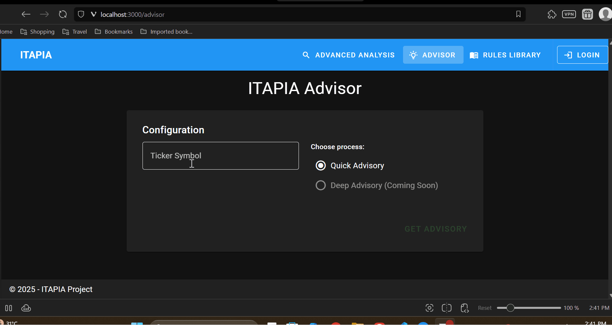

# ITAPIA
### Intelligent & Transparent AI-Powered Personal Investment Assistant

  

ITAPIA là một nền tảng hỗ trợ đầu tư chứng khoán thông minh, được xây dựng với triết lý cốt lõi là **sự minh bạch** và **khả năng giải thích (Explainability - XAI)**. Dự án này không chỉ cung cấp các khuyến nghị, mà còn cho phép người dùng hiểu rõ "tại sao" đằng sau mỗi quyết định.

---

### Vấn đề & Giải pháp của ITAPIA

*   **Vấn đề:** Thị trường hiện nay, các công cụ đầu tư "hộp đen" (black box), đưa ra các tín hiệu mua/bán bí ẩn, làm xói mòn niềm tin và biến việc đầu tư thành một trò chơi may rủi.
*   **Giải pháp của ITAPIA:** Chúng tôi xây dựng một "hộp kính" (glass box). Bằng cách kết hợp các mô hình AI/ML truyền thống và một Rule Engine mạnh mẽ, mọi lời khuyên đều được truy vết ngược lại đến các "bằng chứng" và "quy tắc" đã kích hoạt nó, trao toàn quyền kiểm soát và sự tự tin cho người dùng.

---

### Demo
<!-- Chèn ảnh chụp màn hình hoặc GIF demo tại đây -->

*(Giao diện Advisor)*

---

### 📈 Các Tính năng Chính

*   🧠 **Kiến trúc AI Lai (Hybrid AI):** Kết hợp sức mạnh của các mô hình Machine Learning truyền thống (Forecasting), Xử lý Ngôn ngữ Tự nhiên (NLP), và một hệ thống Rule Engine suy luận tượng trưng.
*   🔍 **Khuyến nghị Giải thích được (XAI):** Mọi lời khuyên về Quyết định, Rủi ro, và Cơ hội đều đi kèm với một danh sách các quy tắc đã được kích hoạt làm bằng chứng.
*   🧬 **Rule Engine có khả năng Tiến hóa:** Được xây dựng trên nền tảng Cây Biểu thức Tượng trưng (Symbolic Expression Trees), sẵn sàng cho việc áp dụng các thuật toán di truyền để tự động khám phá ra các chiến lược mới.
*   👤 **Hồ sơ Đầu tư Cá nhân hóa:** Cho phép người dùng tạo và thử nghiệm nhiều "persona" đầu tư khác nhau, mỗi persona có các tham số về khẩu vị rủi ro, mục tiêu, và kinh nghiệm riêng.
*   ⚙️ **Hệ thống Full-stack Hiện đại:** Được xây dựng hoàn chỉnh với Backend (Python, FastAPI, Docker) và Frontend (Vue.js, TypeScript, Vuetify), mang lại trải nghiệm mượt mà và chuyên nghiệp.

---

### 🏗️ Kiến trúc Tổng quan

ITAPIA được thiết kế theo kiến trúc microservices, đảm bảo tính độc lập, khả năng mở rộng và bảo trì.


> Dive deeper into our system design in the **[Architecture Documentation](./doc/public/itapia-mvp-v1.0.md)**.

---

### 🚀 Bắt đầu Nhanh (Quick Start)

**Yêu cầu:**
*   Git
*   Docker & Docker Compose
*   Python (Python 3.11 phù hợp nhất)
*   npm
*   OpenSSL

#### 1. Cài đặt

```bash
# Clone the repository
git clone https://github.com/your-username/itapia.git
cd itapia
```

#### 2. Cài đặt Môi trường & Lấy Credentials

Trước khi chạy dự án, bạn cần chuẩn bị các thông tin bí mật sau:

**a. Lấy Kaggle API Key:**
*   Đăng nhập vào [Kaggle](https://www.kaggle.com/).
*   Đi đến trang tài khoản của bạn (click vào avatar -> Account).
*   Trong phần "API", click vào **"Create New API Token"**.
*   Một file `kaggle.json` sẽ được tải về. Mở nó ra, bạn sẽ cần giá trị của `username` và `key`.

**b. Lấy Google OAuth 2.0 Credentials:**
*   Truy cập [Google Cloud Console](https://console.cloud.google.com/) và tạo một dự án mới.
*   Vào **APIs & Services** -> **OAuth consent screen**, chọn **External** và điền các thông tin cần thiết cho ứng dụng. Thêm các scope `.../auth/userinfo.email` và `.../auth/userinfo.profile`.
*   Vào **Credentials**, click **+ CREATE CREDENTIALS** -> **OAuth client ID**.
*   Chọn **Web application** và cấu hình:
    *   **Authorized JavaScript origins:** `http://localhost:3000`
    *   **Authorized redirect URIs:** `http://localhost:8000/api/v1/auth/google/callback`
*   Sau khi tạo, copy lại **Client ID** và **Client Secret**.

**c. Tạo JWT Secret Key:**
*   Mở terminal và chạy lệnh sau:
    ```bash
    openssl rand -hex 32
    ```
*   Copy chuỗi ký tự ngẫu nhiên được tạo ra.

**d. Cấu hình các file `.env`:**
Copy các file cấu hình theo template có sẵn và điền vào các giá trị cần thiết.
```bash
# Backend
cp ./backend/.env.template ./backend/.env

# Frontend
cp ./frontend/.env.template ./frontend/.env
```

#### 3. Chạy Backend

```bash
# Navigate to the backend directory
cd backend

# Build and run all backend services in detached mode
docker-compose up --build -d api-gateway
```

#### 4. Chạy Frontend

```bash
# Navigate to the frontend directory from the root
cd frontend

# Install dependencies
npm install

# Sync schemas if neccessary
npm run sync:schemas

# Run the development server
npm run dev
```

#### 5. Truy cập Hệ thống
*   **Frontend Application:** [http://localhost:5173](http://localhost:3000)
*   **Backend API Docs (Swagger UI):** [http://localhost:8000/docs](http://localhost:8000/docs)

---

### 📁 Cấu trúc Dự án

```
itapia/
├── backend/            # Chứa tất cả các microservices, Docker config, và .env cho backend
├── frontend/           # Ứng dụng Vue.js SPA, chứa .env riêng cho frontend
├── .gitignore
└── README.md           # Bạn đang ở đây
```

---

### 🗺️ Lộ trình Phát triển

-   ✅ **Giai đoạn 1: MVP Cốt lõi** (Analysis, Advisor, Rules, Auth)
-   ✅ **Giai đoạn 2: Hoàn thiện Giao diện & Cá nhân hóa** (UX Polish, Profile Management)
-   ▶️ **Giai đoạn 3: Tự động Tối ưu hóa (`Evo-worker`)**
-   ▶️ **Giai đoạn 4: Phân tích Sâu (`Deep Dive`) & Tích hợp LLM**

---

### 📚 Tài liệu Chi tiết

*   **[Kiến trúc Hệ thống](./doc/public/itapia-mvp-v1.0.md):** Giải thích sâu về các microservices, luồng dữ liệu, và các quyết định thiết kế.
*   **[Tham khảo API](./doc/public/API-doc-v1.pdf):** Danh sách và mô tả chi tiết tất cả các API endpoint.
*   **[Kiến trúc Rule Engine](./doc/public/rule-architecture.pdf):** Giải thích về thiết kế Cây Biểu thức Tượng trưng.

---

### 🤝 Đóng góp & Trích dẫn

Đây là một dự án đồ án tốt nghiệp. Mọi ý kiến đóng góp hoặc câu hỏi đều được chào đón. Vui lòng tạo một Issue để thảo luận.

Nếu bạn sử dụng công trình này, xin vui lòng trích dẫn:
```
[Lê Minh Triết]. (2025). ITAPIA: Trợ lý Đầu tư Cá nhân Thông minh và Minh bạch dựa trên Trí tuệ Nhân tạo. Đồ án Tốt nghiệp, Đại học Bách khoa Hà Nội, Việt Nam.
```