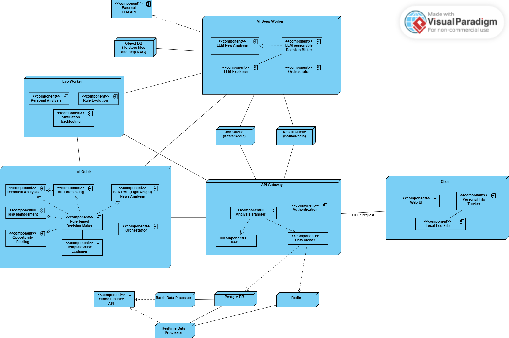

# ITAPIA - Trợ lý Đầu tư Cá nhân Thông minh và Minh bạch dựa trên AI

ITAPIA (Intelligent and Transparent AI-Powered Personal Investment Assistant) là một dự án đồ án tốt nghiệp với mục tiêu xây dựng một nền tảng hỗ trợ đầu tư chứng khoán thông minh. Dự án được thiết kế đặc biệt cho các nhà đầu tư cá nhân với vốn hạn chế, ưu tiên việc quản lý rủi ro và mong muốn hiểu rõ các khuyến nghị đầu tư do AI đưa ra.

Khác với các công cụ "hộp đen" truyền thống, ITAPIA tập trung vào **khả năng giải thích (Explainability)**, **chi phí thấp**, và khả năng **học hỏi, đồng phát triển** cùng người dùng.

**English version of README**: [README-en.md](./README-en.md)

---

## 🏗️ Kiến trúc Hệ thống

Hệ thống được xây dựng theo kiến trúc microservices, bao gồm các thành phần cốt lõi sau:

-   **API Gateway** (`api_gateway`): Đóng vai trò là cổng giao tiếp duy nhất, xử lý xác thực và điều phối request đến các dịch vụ nội bộ.
-   **AI Service Quick** (`ai_service_quick`): Chạy trên hạ tầng CPU, chịu trách nhiệm cho các quy trình phân tích và dự báo nhanh (Quick Check).
-   **AI Service Deep** (Tương lai): Chạy trên hạ tầng GPU, dành cho các tác vụ AI/LLM phức tạp (Deep Dive).
-   **Data Processing**: Các script độc lập để chạy các pipeline thu thập và xử lý dữ liệu theo lịch trình (ETL).
-   **Databases**: PostgreSQL để lưu trữ dữ liệu bền vững và Redis để lưu cache và dữ liệu thời gian thực.

### Sơ đồ Triển khai

Hệ thống tuân theo sơ đồ triển khai dưới đây, với sự tách biệt rõ ràng giữa các thành phần.

`

Trong phạm vi đồ án, tất cả các thành phần được triển khai bằng Docker để phục vụ mục đích phát triển và kiểm thử.

### Tài liệu Dự án

Các tài liệu chi tiết khác về dự án có thể được tìm thấy trong thư mục `doc`.

---

## 🚀 Bắt đầu

### Yêu cầu Hệ thống

#### Môi trường Phát triển
- **Docker**: 4.41.2+
- **Python**: 3.11+ (khuyến nghị cho môi trường Conda và tương thích với TA-Lib)

#### Phiên bản Thành phần
- **PostgreSQL**: 15 (Image Alpine)
- **Redis**: 7 (Image Alpine)

#### Công cụ Hỗ trợ
- **DBeaver 25**: Dành cho các thao tác với cơ sở dữ liệu qua giao diện đồ họa.

### Cài đặt

#### 1. Clone Repository
```bash
git clone https://github.com/triet4p/itapia.git
cd itapia
```

#### 2. Cấu hình Biến môi trường
Dự án sử dụng một file `.env` duy nhất ở thư mục gốc chứa tất cả các biến môi trường cần thiết.

Tạo một file `.env` ở thư mục gốc với nội dung sau:
```ini
# Postgre
POSTGRES_USER=itapia_user
POSTGRES_PASSWORD=123456
POSTGRES_DB=stocks_db
POSTGRES_HOST=stocks_postgre_db
POSTGRES_PORT=5432

# Redis
REDIS_HOST=realtime_redis_db
REDIS_PORT=6379

# API GATEWAY
GATEWAY_HOST=api-gateway
GATEWAY_PORT=8000
GATEWAY_V1_BASE_ROUTE=/api/v1

# AI Service Quick
AI_QUICK_HOST=ai-service-quick
AI_QUICK_PORT=8000
AI_QUICK_V1_BASE_ROUTE=/api/v1

# Kaggle Secrets
KAGGLE_KEY=<your-kaggle-key>
KAGGLE_USERNAME=<your-kaggle-username>
```

---

## 📊 Cài đặt Pipeline Dữ liệu

### 1. Build các Image cần thiết
```bash
# Image cho các script xử lý dữ liệu
docker build -t itapia-data-processor:latest -f data_processing/Dockerfile .
```

### 2. Khởi động các Dịch vụ Cơ sở dữ liệu
- Khởi động PostgreSQL ở chế độ detached:
```bash
docker-compose up -d stocks_postgre_db
```

- Khởi động container Redis (In-memory):
```bash
docker-compose up -d realtime_redis_db
```

### 3. Khởi tạo Bảng trong Database
Sử dụng DBeaver hoặc dòng lệnh để kết nối tới database và thực thi các câu lệnh SQL trong `db/ddl.sql` để tạo các bảng cần thiết trong PostgreSQL. Bạn cũng cần "seed" dữ liệu cho các bảng tĩnh như `exchanges` và `sectors`.

### 4. Chạy các Script Thu thập Dữ liệu Lô (Batch)
Các script này sẽ tự động lấy danh sách ticker từ CSDL để xử lý.

```bash
# Thu thập dữ liệu giá lịch sử
docker-compose run --rm batch-data-processor python scripts/fetch_daily_prices.py

# Thu thập dữ liệu tin tức
docker-compose run --rm batch-data-processor python scripts/fetch_relevant_news.py
```
Các script sẽ tự động tìm ngày gần nhất đã lấy và chỉ thu thập dữ liệu mới cho 92 cổ phiếu đã được cấu hình.

### 5. Chạy Thu thập Dữ liệu Thời gian thực
Dịch vụ này sẽ tự động quét và chỉ lấy dữ liệu cho các cổ phiếu có thị trường đang mở cửa.
```bash
docker-compose up -d realtime-data-processor
```

---

## 🤖 Cài đặt API Gateway

### 1. Build các Image
```bash
# Build API Gateway
docker build -t itapia-api-gateway:latest -f api_gateway/Dockerfile .
```

### 2. Khởi động các Dịch vụ
Đảm bảo các dịch vụ CSDL đang chạy, sau đó khởi động các service ứng dụng:
```bash
docker-compose up -d api-gateway
```

### 3. Truy cập Tài liệu API
Khi các dịch vụ đang chạy, bạn có thể truy cập:
- **Tài liệu API Gateway**: http://localhost:8000/docs
- **URL cơ sở của API Gateway**: http://localhost:8000/api/v1

### 4. Các Endpoint chính
- **GET /api/v1/metadata/sectors**: Lấy danh sách tất cả các nhóm ngành.
- **GET /api/v1/prices/sector/daily/{sector_code}**: Lấy dữ liệu giá hàng ngày cho cả một ngành.
- **GET /api/v1/prices/daily/{ticker}**: Lấy dữ liệu giá lịch sử cho một cổ phiếu.
- **GET /api/v1/prices/intraday/last/{ticker}**: Lấy giá mới nhất của một cổ phiếu trong ngày.
- **GET /api/v1/prices/intraday/history/{ticker}**: Lấy giá intraday lưu trữ trong 1-2 ngày gần nhất.

---
## 🤖 Cài đặt AI Service Quick

### 1. Build các Image
```bash
# Build AI service quick
docker build -t itapia-ai-service-quick:latest -f ai_service_quick/Dockerfile .
```

### 2. Khởi động các Dịch vụ
Đảm bảo các dịch vụ CSDL đang chạy, sau đó khởi động các service ứng dụng:
```bash
docker-compose up -d ai-service-quick
```

### 3. Truy cập Tài liệu API
Khi các dịch vụ đang chạy, bạn có thể truy cập:
- **Tài liệu AI Service Quick**: http://localhost:8001/docs
- **URL cơ sở của AI Service Quick**: http://localhost:8001/api/v1

### 4. Các Endpoint chính
- **GET /api/v1/ai/quick/analysis/full/{ticker}**: Yêu cầu một phân tích nhanh hoàn chỉnh cho một cổ phiếu.

### 5. Quy trình huấn luyện trên Kaggle
Do giới hạn tài nguyên của máy local và docker, các quy trình huấn luyện nên được thực hiện trên các dịch vụ hỗ trợ mạnh tài nguyên như Kaggle hoặc Google Colab.

Sau đây là hướng dẫn huấn luyện trên Kaggle, tương tự trên Colab.

- **Lưu ý**: Với mỗi session (12 tiếng) của Kaggle, ta sẽ huấn luyện mô hình cho 3 task của cùng 1 sector, đó là:
  - Triple Barrier Classification.
  - 5-days Distribution Regression.
  - 20-days Distribution Regression.

#### 5.1. Chuẩn bị dữ liệu
Do không thể kết nối trực tiếp Internet vào Docker Network để lấy dữ liệu từ API Gateway, nên ta sẽ lấy và lưu ở local trước, sau đó upload trên Kaggle Datasets.

Thư mục dùng để lưu trữ tạm thời mặc định là `/ai-service-quick/local`. Bạn có thể tạo trước để không bị lỗi không mong muốn.

Sau đó, xuất dữ liệu CSV bằng lệnh
```bash
docker exec -d itapia-ai-service-quick conda run -n itapia python -m app.orchestrator.orchestrator <SECTOR-CODE>
```
- **Lưu ý**: Để lấy đúng sector, hãy dùng API để xem danh sách sector.

#### 5.2. Tải dữ liệu trên Kaggle Datasets
Tạo mới một Datasets và tải lên các file ở thư mục tạm. 
[Kaggle Datasets](https://www.kaggle.com/datasets)

#### 5.3. Tạo Notebook trên Kaggle và chạy script
Tạo một notebook trên Kaggle để chạy huấn luyện và tối ưu hóa mô hình. Template của notebook có thể tham khảo ở
[Kaggle Template Training Notebook](https://www.kaggle.com/code/trietp1253201581/itapia-training)
hoặc [Local Template Training Notebook](./notebooks/itapia-training.ipynb)

#### 5.4. Tái sử dụng mô hình
Trong mã nguồn đã cung cấp các phương thức để đăng ký và load lại các mô hình được quản lý bởi Kaggle, có thể xem trong [model.py](./ai_service_quick/app/forecasting/model.py).

- **Lưu ý**: Khi bạn tạo một `ForecastingModel` để huấn luyện, **`Model Slug`** (đường dẫn truy cập model trên kaggle) sẽ được tạo tự động theo template.
    ```python
    MODEL_SLUG_TEMPLATE = 'itapia-final-{id}'
    ```
    với `id` thường được tạo thành bới `name` của `ForecastingModel` và `task_id` của `ForecastingTask` mà nó giải quyết. Để dễ quản lý, bạn nên đặt tên `model` trùng với tên thuật toán nó sử dụng và `task_id` dùng template đã được định nghĩa trong [config.py](./ai_service_quick/app/core/config.py):
    ```python
    TASK_ID_SECTOR_TEMPLATE = '{problem}-{sector}'
    ```
    với `problem` chính là tên bài toán giải quyết, bao gồm:
    - `clf-triple-barrier`
    - `reg-5d-dis`
    - `reg-20d-dis`

---

## 🔧 Cấu trúc Dự án

```
itapia/
├── api_gateway/             # Dịch vụ API Gateway (FastAPI)
│   ├── app/
│   └── Dockerfile
├── ai_service_quick/        # Dịch vụ AI cho Quick Check (FastAPI, CPU)
│   ├── app/
│   │   ├── common/
│   │   ├── core/
│   │   ├── data_prepare/
│   │   └── technical/
│   │   └── forecasting/
│   └── Dockerfile
├── data_processing/         # Các script xử lý dữ liệu (ETL)
│   ├── scripts/
│   └── ...
├── db/                      # Schema và migrations
├── doc/                     # Tài liệu dự án
├── docker-compose.yml       # Cấu hình các dịch vụ Docker
├── .env                     # (Cần tạo) Biến môi trường
└── README.md
```

---

## 📈 Các Tính năng Chính

- **AI Giải thích được (XAI)**: Các khuyến nghị đầu tư minh bạch với lý do rõ ràng và "bằng chứng" đi kèm.
- **Kiến trúc Hai cấp độ (Quick Check & Deep Dive)**: Cung cấp cả phân tích nhanh tức thời và phân tích sâu toàn diện.
- **Hỗ trợ Đa thị trường**: Nền tảng được thiết kế để xử lý dữ liệu từ nhiều thị trường với các múi giờ và tiền tệ khác nhau. Mặc dù hiện tại chỉ gói gọn trong thị trường Mĩ nhưng với thiết kế theo framework không phụ thuộc dữ liệu thì sẽ dễ dàng mở rộng sau này.
- **Dữ liệu Thời gian thực**: Cập nhật giá và phân tích các động thái trong ngày.
- **Tối ưu hóa Tiến hóa (`Evo Agent`)**: Khả năng tự động tìm kiếm và tối ưu hóa các chiến lược giao dịch.

---

## 🤝 Đóng góp

Đây là một dự án đồ án tốt nghiệp. Mọi câu hỏi hoặc gợi ý, xin vui lòng tham khảo các tài liệu trong thư mục `doc`.

---

## 📄 Giấy phép

Dự án này được phát triển như một phần của đồ án tốt nghiệp. Mã nguồn có sẵn cho các mục đích học thuật và giáo dục.

### Trích dẫn
Nếu bạn sử dụng công trình này trong nghiên cứu của mình, xin vui lòng trích dẫn:
```txt
[Lê Minh Triết]. (2025). ITAPIA: Trợ lý Đầu tư Cá nhân Thông minh và Minh bạch dựa trên Trí tuệ Nhân tạo. 
Đồ án Tốt nghiệp, Đại học Bách khoa Hà Nội, Việt Nam.
```
Đối với mục đích thương mại hoặc hợp tác, xin vui lòng liên hệ `trietlm0306@gmail.com`.