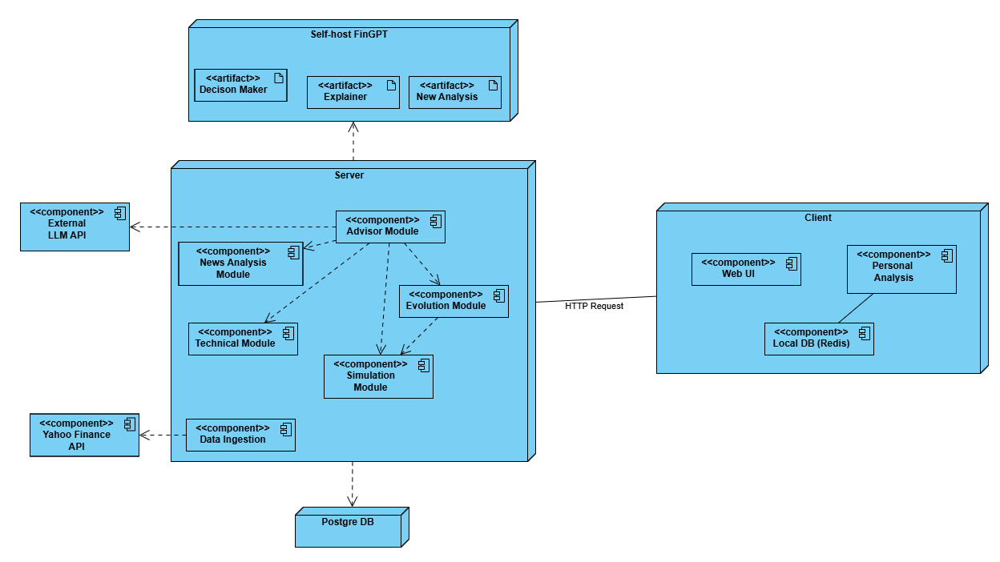

# itapia
 ITAPIA (Intelligent and Transparent AI-Powered Personal Investment Assistant) là một dự án đồ án tốt nghiệp nhằm xây dựng một nền tảng hỗ trợ đầu tư chứng khoán thông minh. Dự án được thiết kế đặc biệt cho các nhà đầu tư cá nhân vốn ít, ưu tiên quản lý rủi ro và mong muốn hiểu rõ các quyết định do AI gợi ý.

Khác với các công cụ "hộp đen", ITAPIA tập trung vào tính giải thích được (Explainability), chi phí thấp, và khả năng học hỏi, phát triển cùng người dùng.

-----

## Kiến trúc tổng quan
Hệ thống được thiết kế theo kiến trúc microservices đơn giản hóa, bao gồm các thành phần chính:
- Frontend: Giao diện người dùng bằng React, nơi chứa các logic cá nhân hóa tại client-side.
- API Service (CPU-based): Đóng vai trò API Gateway, xử lý logic nghiệp vụ thông thường.
- AI Service (GPU-based): Chịu trách nhiệm chạy các mô hình AI/LLM nặng.
- Data Processing: Các script độc lập để chạy các pipeline ETL theo lịch trình.
- Databases: PostgreSQL cho dữ liệu bền bỉ và Redis cho cache & dữ liệu real-time.

### Kiến trúc triển khai
Hệ thống được triển khai theo biểu đồ


Trong khuôn khổ dự án, các thành phần được deploy trên `Docker` để phát triển và thử nghiệm.
### Tài liệu dự án
Tài liệu dự án bạn có thể xem trong thư mục `doc`.
## Getting Started
### Yêu cầu hệ thống
#### Môi trường phát triển
- Docker: 4.41.2+
- Python: 3.11+
#### Phiên bản các thành phần
- Postgre DB: 15 (image từ alphine)
#### Các công cụ hỗ trợ
- DBeaver 25 để hỗ trợ thao tác CSDL qua GUI.
### Cài đặt
#### 1. Clone repository:
```bash
git clone https://github.com/trietp1253201581/itapia.git
cd itapia
```
#### 2. Tạo file chứa các biến môi trường
Trong dự án này đang dùng 1 file `.env` chung ở thư mục gốc chứa toàn bộ biến môi trường cần thiết.

Bạn cần tạo file `.env` ở thư mục gốc dự án với nội dung sau
```ini
POSTGRES_USER=itapia_user
POSTGRES_PASSWORD=123456
POSTGRES_DB=stocks_db
POSTGRES_HOST=stocks_postgre_db
POSTGRES_PORT=5432
```

### Chạy pipeline dữ liệu
#### 1. Tạo các image cần thiết
```bash
docker build -t itapia-data-processor data_processing
```
#### 2. Khởi động CSDL
- Khởi động Postgre SQL ở chế độ nền
```bash
docker-compose up -d stocks_postgre_db
```
#### 3. Tạo bảng cần thiết.
- Sử dụng DBeaver hoặc dòng lệnh để kết nối CSDL và chạy lệnh trong `db/create_table.sql` để tạo các bảng cần thiết trong Postgre SQL.
#### 4. Chạy script thu thập dữ liệu.
Để thu thập dữ liệu cho một khu vực cụ thể (ví dụ: americas), chạy lệnh sau:
```bash
# history price
docker-compose run --rm data-processor python scripts/fetch_history.py americas

# news
docker-compose run --rm data-processor python scripts/fetch_news.py americas
```
Bạn cần chỉ định rõ 1 trong 3 region sau:
- americas
- europe
- asia_pacific

Sau đó scripts sẽ tự lấy dữ liệu OHLCV từ lần gần nhất (mặc định là `2018-01-01` cho lần đầu) của các cổ phiếu (89 cổ phiếu - xem trong [tickers](data_processing/scripts/utils.py)) rồi tái cấu trúc response, điền giá trị thiếu và load vào bảng dữ liệu.