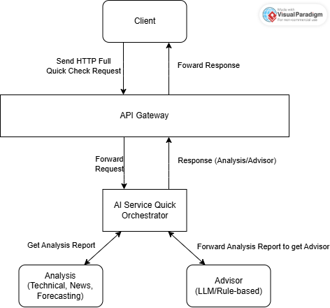
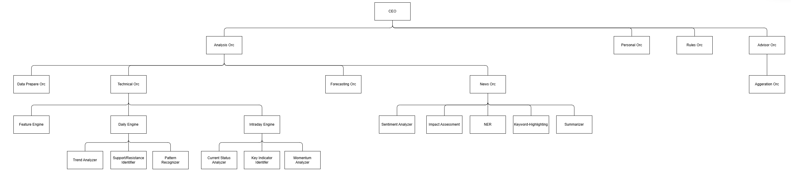

---

# **Tài liệu Kiến trúc & Kỹ thuật - ITAPIA Quick Check (MVP v1.0)**

**Ngày cập nhật:** [Ngày hiện tại]
**Phiên bản:** 1.0

---

## **Mục lục**

**Phần I: Tổng quan và Triết lý**
1.  **Giới thiệu (Introduction)**
    1.1. Tên dự án: ITAPIA - Trợ lý Đầu tư Cá nhân Thông minh và Minh bạch.
    1.2. Sứ mệnh & Tầm nhìn: Dân chủ hóa công cụ hỗ trợ đầu tư, tập trung vào sự minh bạch, trao quyền và học hỏi.
    1.3. Vấn đề cần giải quyết: "Hộp đen" vs. "Công cụ chuyên nghiệp", khoảng trống cho nhà đầu tư cá nhân.
    1.4. Đối tượng mục tiêu: Nhà đầu tư cá nhân ưu tiên sự an toàn và hiểu biết.

2.  **Triết lý Thiết kế Cốt lõi**
    2.1. **Minh bạch và Giải thích được (XAI):** "Hộp kính" thay vì "Hộp đen".
    2.2. **Hệ thống có Kiểm soát:** Vai trò của AI là "cố vấn", không phải "nhà độc tài".
    2.3. **Kiến trúc Thực dụng:** Cân bằng giữa lý thuyết và thực tế (ví dụ: `Quick Check` vs. `Deep Dive`).
    2.4. **"Kết quả không phải là Mục tiêu Tối thượng":** Tập trung vào việc nâng cao năng lực và sự tự tin cho người dùng.
    2.5. **Phát triển cùng Người dùng:** Giới thiệu về tầm nhìn cá nhân hóa và tiến hóa.

**Phần II: Kiến trúc Hệ thống Tổng thể**

3.  **Kiến trúc Microservices & Luồng Dữ liệu**
    3.1. Sơ đồ Kiến trúc Tổng thể (Sơ đồ bạn đã cung cấp).
    3.2. Mô tả vai trò các Service chính:
        *   `API Gateway`: Cổng vào, định tuyến, xác thực.
        *   `AI Service Quick`: Bộ não xử lý nhanh trên CPU.
        *   `Data Processing`: Các pipeline thu thập dữ liệu.
        *   `PostgreSQL` & `Redis`: Vai trò của từng CSDL.
    3.3. Luồng dữ liệu cho một yêu cầu `Quick Check` điển hình.

4.  **Thư viện Chung (Shared Library)**
    4.1. Giới thiệu về `itapia_common` - Nền tảng của hệ thống.
    4.2. **`contracts`:** "Hiến pháp" của hệ thống.
        *   `enums`: Định nghĩa `SemanticType`.
        *   `schemas`: Phân biệt vai trò của `entities` và `api`.
    4.3. **`dblib`:** Lớp truy cập dữ liệu.
        *   Kiến trúc 2 tầng `CRUD` và `Service`.
        *   Tận dụng `JSONB` trong PostgreSQL.
    4.4. **`rules`:** Trái tim của logic suy luận. (Sẽ được mô tả chi tiết ở Phần III).

**Phần III: Kiến trúc Rule Engine - Trái tim của ITAPIA**

5.  **Tổng quan về Rule Architecture**
    5.1. Tại sao lại là Symbolic Rules thay vì Decision Tree?
    5.2. Mô hình 3 trạng thái của một Quy tắc: In-memory, Persistence, API.

6.  **Các Thành phần Cốt lõi**
    6.1. Lớp `_TreeNode` và các lớp con (`Constant`, `Var`, `Operator`).
    6.2. Hệ thống Định kiểu Ngữ nghĩa (STGP) với `SemanticType`.
    6.3. `Registry` và `Node Factory`: "Từ điển" và "Nhà máy" sản xuất Node.
    6.4. Các file `_builtin`: Nơi định nghĩa "vốn từ vựng" dựng sẵn.
    6.5. `Parser` & `Serializer`: Cầu nối giữa trạng thái In-memory và Persistence.
    6.6. Lớp `Rule`: Đóng gói một cây logic hoàn chỉnh.

**Phần IV: Chi tiết Triển khai `AI Service Quick` (MVP)**

7.  **Cấu trúc Orchestrator Phân cấp**
    7.1. **`CEO` (`AIServiceQuickOrchestrator`):** Vai trò điều phối cấp cao.
    7.2. **"Phó CEO" `AnalysisOrchestrator`:** Trách nhiệm và các "Trưởng phòng" (`Technical`, `News`, `Forecasting`).
    7.3. **"Phó CEO" `RulesOrchestrator`:** Trách nhiệm và luồng hoạt động.
    7.4. **"Phó CEO" `AdvisorOrchestrator`:** Trách nhiệm và các "Trưởng phòng" (`Aggregation`, `Explainer`).

8.  **Chi tiết Luồng xử lý của `Advisor`**
    8.1. Sơ đồ luồng: `Analysis` -> `Rules Execution` -> `Aggregation` -> `Meta-Synthesis` -> `Mapping`.
    8.2. **`ScoreAggregator`:** Các phương thức tổng hợp điểm thô.
    8.3. **`Meta-Synthesis`:** Logic tổng hợp có trọng số (hiện tại là placeholder).
    8.4. **`ScoreFinalMapper` và `final_thresholds.py`:** Logic diễn giải điểm số cuối cùng.

9.  **Hệ thống Giải thích (Explainer Framework)**
    9.1. Kiến trúc Explainer phân cấp: `AnalysisExplainer` và `AdvisorExplainer`.
    9.2. `RuleExplainer`: Khả năng "dịch" một quy tắc đơn lẻ.
    9.3. Luồng tạo ra một bản giải thích end-to-end.

**Phần V: Hướng dẫn và Lộ trình Tương lai**

10. **Hướng dẫn Sử dụng API**
    10.1. Danh sách các API Endpoint chính (đã được tái cấu trúc).
    10.2. Ví dụ về một request và response cho `GET /advisor/quick/{ticker}`.

11. **Tình trạng Dự án và Các Thành phần Đã hoàn thành (Cột mốc MVP)**
    11.1. Hoàn thành toàn bộ `Rule Architecture` và `sharedlib`.
    11.2. Hoàn thành các module `Analysis` (Technical, News, Forecasting).
    11.3. Hoàn thành `Advisor Module` với bộ quy tắc dựng sẵn.
    11.4. Hoàn thành hệ thống `Explainer` end-to-end.

12. **Lộ trình Phát triển Dự kiến (Roadmap)**
    12.1. **Giai đoạn 2: Giao diện và Cá nhân hóa**
        *   Xây dựng Web UI đơn giản (React/Vue).
        *   Tích hợp Authentication.
        *   Triển khai `PersonalAnalysisOrchestrator` (hoàn thiện placeholder).
    12.2. **Giai đoạn 3: Tự động Tối ưu hóa (`Evo-worker`)**
        *   Xây dựng Backtester.
        *   Triển khai các thuật toán tiến hóa (DEAP) tuân thủ STGP.
        *   Tiến hóa các `Rule` và `MetaRule` weights.
    12.3. **Giai đoạn 4 (Tầm nhìn xa): `Deep Dive`**
        *   Tích hợp LLM có kiểm soát cho các tác vụ phân tích sâu hơn.

---

## **Phần I: Tổng quan và Triết lý**

Phần này giới thiệu về dự án ITAPIA, bao gồm sứ mệnh, vấn đề cần giải quyết, và quan trọng nhất là các nguyên tắc triết lý cốt lõi đã định hình nên mọi quyết định kiến trúc và kỹ thuật của hệ thống.

---

### **1. Giới thiệu (Introduction)**

#### **1.1. Tên dự án: ITAPIA - Trợ lý Đầu tư Cá nhân Thông minh và Minh bạch**

ITAPIA là viết tắt của **I**ntelligent and **T**ransparent **AI**-**P**owered **P**ersonal **I**nvestment **A**ssistant. Cái tên này không chỉ là một danh xưng, mà còn là bản tuyên ngôn về sứ mệnh của dự án: xây dựng một trợ lý đầu tư thực sự thông minh, được vận hành bởi Trí tuệ Nhân tạo (AI), nhưng phải luôn đặt sự **minh bạch** và **cá nhân hóa** làm trọng tâm.

#### **1.2. Sứ mệnh & Tầm nhìn**

**Sứ mệnh:** Dân chủ hóa khả năng tiếp cận các công cụ hỗ trợ đầu tư tài chính tiên tiến. ITAPIA được tạo ra để trao quyền cho các nhà đầu tư cá nhân, đặc biệt là những người có nguồn vốn hạn chế, bằng cách cung cấp những phân tích sâu sắc, dễ hiểu và đáng tin cậy.

**Tầm nhìn:** Trở thành một "người bạn đồng hành" đáng tin cậy trên hành trình đầu tư của người dùng. Thay vì chỉ đưa ra các tín hiệu giao dịch, ITAPIA hướng tới việc xây dựng một mối quan hệ cộng sinh, nơi hệ thống không chỉ giúp người dùng ra quyết định tốt hơn mà còn giúp họ học hỏi, nâng cao kiến thức và sự tự tin, cùng nhau "trưởng thành" và "tiến hóa".

#### **1.3. Vấn đề cần giải quyết**

Thị trường công cụ hỗ trợ đầu tư cho cá nhân hiện nay đang bị phân mảnh và rơi vào hai thái cực:

1.  **Công cụ Chuyên nghiệp (ví dụ: Bloomberg Terminal, Eikon):** Cung cấp dữ liệu và phân tích cực kỳ mạnh mẽ nhưng đi kèm với chi phí rất cao và độ phức tạp lớn, nằm ngoài tầm với của đại đa số nhà đầu tư cá nhân.
2.  **Các Bot Giao dịch "Hộp đen" (Black Box):** Hứa hẹn lợi nhuận cao thông qua các thuật toán bí mật, nhưng không cung cấp bất kỳ lời giải thích nào cho các quyết định của chúng. Điều này tạo ra một rủi ro cực lớn và làm xói mòn niềm tin của người dùng, biến việc đầu tư thành một trò chơi may rủi.

ITAPIA được sinh ra để lấp đầy khoảng trống này. Dự án giải quyết bài toán cốt lõi: Làm thế nào để cung cấp một công cụ mạnh mẽ như các nền tảng chuyên nghiệp, nhưng với chi phí thấp, dễ tiếp cận, và quan trọng nhất là phải hoàn toàn minh bạch?

#### **1.4. Đối tượng mục tiêu**

ITAPIA được thiết kế đặc biệt cho thế hệ nhà đầu tư cá nhân mới:
*   Những người có hiểu biết về công nghệ và sẵn sàng sử dụng AI làm công cụ hỗ trợ.
*   Những người ưu tiên việc **hiểu tại sao** họ lại đưa ra một quyết định đầu tư, thay vì chỉ làm theo một cách mù quáng.
*   Những người coi trọng việc **quản lý rủi ro** và sự an toàn của nguồn vốn hơn là việc theo đuổi những lợi nhuận viển vông.
*   Những người có mong muốn học hỏi và phát triển năng lực đầu tư của bản thân một cách bền vững.

---

### **2. Triết lý Thiết kế Cốt lõi**

Mọi dòng code, mọi quyết định kiến trúc trong ITAPIA đều phải tuân thủ năm nguyên tắc triết lý nền tảng sau đây. Chúng là "kim chỉ nam" định hình nên bản sắc độc đáo của sản phẩm.

#### **2.1. Minh bạch và Giải thích được (XAI): "Hộp kính" thay vì "Hộp đen"**

Đây là nguyên tắc quan trọng nhất. Chúng tôi tin rằng trong lĩnh vực tài chính, nơi tiền bạc thật đang bị đe dọa, không thể có chỗ cho sự mơ hồ. Mọi khuyến nghị do ITAPIA đưa ra đều phải đi kèm với một lời giải thích rõ ràng, mạch lạc và có thể truy vết được. Hệ thống được xây dựng như một "hộp kính" (glass box), cho phép người dùng nhìn thấu vào logic bên trong. Điều này được thực hiện thông qua **Rule Engine** và **Explainer Framework**, nơi mỗi kết luận đều được gắn với các quy tắc và bằng chứng cụ thể đã kích hoạt nó.

#### **2.2. Hệ thống có Kiểm soát: AI là "Cố vấn", không phải "Nhà độc tài"**

Sự phát triển vũ bão của các công nghệ AI tạo sinh (Generative AI) và LLM có thể dẫn đến một lầm tưởng rằng AI nên đưa ra mọi quyết định. ITAPIA đi ngược lại triết lý đó. Chúng tôi tin rằng AI mạnh nhất khi nó đóng vai trò là một "cố vấn" thông thái, có khả năng phân tích một lượng lớn thông tin và trình bày các kết luận một cách có cấu trúc. Tuy nhiên, **quyết định cuối cùng luôn thuộc về con người.** Kiến trúc của ITAPIA được thiết kế để **trao quyền (empower)** cho người dùng, cung cấp cho họ những công cụ tốt nhất để họ có thể tự mình đưa ra quyết định cuối cùng một cách tự tin.

#### **2.3. Kiến trúc Thực dụng: Cân bằng giữa Lý thuyết và Thực tế**

ITAPIA nhận thức rằng không có giải pháp nào là hoàn hảo cho mọi tình huống. Do đó, kiến trúc của hệ thống được xây dựng dựa trên sự cân bằng thực tế:
*   **`Quick Check` vs. `Deep Dive`:** Cung cấp cả một quy trình phân tích nhanh, hiệu quả trên CPU (Quick Check) cho các quyết định hàng ngày, và một tầm nhìn về quy trình phân tích sâu, toàn diện hơn trên GPU (Deep Dive) cho các nghiên cứu chuyên sâu. Điều này giúp tối ưu hóa giữa chi phí, tốc độ và chiều sâu phân tích.
*   **AI Cổ điển & Hiện đại:** Kết hợp sức mạnh của các thuật toán Machine Learning có thể giải thích được (như các mô hình dựa trên cây quyết định) cho các tác vụ dự báo có cấu trúc, và tận dụng các mô hình ngôn ngữ lớn (LLM) một cách có kiểm soát cho các tác vụ xử lý dữ liệu phi cấu trúc (như phân tích tin tức).

#### **2.4. "Kết quả không phải là Mục tiêu Tối thượng"**
 
Khác với các công cụ chỉ tập trung vào việc tối đa hóa lợi nhuận, mục tiêu tối thượng của ITAPIA là **sự phát triển toàn diện của người dùng**. Chúng tôi tin rằng một quyết định đầu tư tốt không chỉ được đo bằng lợi nhuận, mà còn bằng sự tự tin và sự hiểu biết đằng sau quyết định đó. Do đó, thành công của ITAPIA được đo lường bằng việc người dùng có trở nên hiểu biết hơn, kỷ luật hơn và tự tin hơn trên hành trình đầu tư của họ hay không. Lợi nhuận là một hệ quả quan trọng, nhưng không phải là mục tiêu duy nhất.

#### **2.5. Phát triển cùng Người dùng: Tầm nhìn về một Hệ sinh thái Cộng sinh**

ITAPIA được thiết kế để không phải là một sản phẩm tĩnh, mà là một hệ thống "sống", có khả năng học hỏi và đồng tiến hóa với người dùng. Tầm nhìn này được hiện thực hóa thông qua hai cơ chế chính trong tương lai:
*   **Cá nhân hóa Sâu:** Hồ sơ rủi ro của người dùng không chỉ là một bộ lọc, mà sẽ trực tiếp định hình hàm `fitness` của thuật toán tiến hóa (`Evo-worker`), "dạy" cho AI biết "thành công" có ý nghĩa như thế nào đối với từng cá nhân.
*   **Trao quyền Sáng tạo:** Người dùng sẽ có khả năng sử dụng `Evo-worker` để tiến hóa ra các bộ quy tắc của riêng mình, thử nghiệm chúng, và áp dụng chúng vào quá trình ra quyết định với trọng số cao hơn.

Vòng lặp này tạo ra một hệ sinh thái cộng sinh: Người dùng thông minh hơn sẽ tạo ra một AI tốt hơn, và một AI tốt hơn sẽ giúp người dùng ngày càng thông minh hơn.

---

## **Phần II: Kiến trúc Hệ thống Tổng thể**

Phần này mô tả cấu trúc tổng thể của hệ thống ITAPIA, các thành phần cốt lõi của nó, và cách chúng tương tác với nhau để tạo ra quy trình "Quick Check".

### **3. Kiến trúc Microservices & Luồng Dữ liệu**

ITAPIA được thiết kế theo kiến trúc microservices phân tán (được triển khai bằng Docker), cho phép mỗi thành phần hoạt động độc lập, tăng khả năng mở rộng và dễ bảo trì. Kiến trúc này được hình thành dựa trên việc tách biệt các trách nhiệm cốt lõi.

#### **3.1. Sơ đồ Triển khai (Deployment Diagram)**


#### **3.2. Mô tả các Service Chính**

Hệ thống ITAPIA hiện tại bao gồm các service chính sau, được quản lý bởi `docker-compose`:

*   **`stocks_postgre_db` & `realtime_redis_db`:** Các hệ thống cơ sở dữ liệu cốt lõi. PostgreSQL đóng vai trò là kho dữ liệu bền vững (Persistence Layer) cho dữ liệu lịch sử giá, tin tức, và các quy tắc (lưu dưới dạng `JSONB`). Redis được sử dụng cho dữ liệu thời gian thực và cache.
*   **`data-seeds`:** Một container tạm thời, chạy một lần để khởi tạo cơ sở dữ liệu với các cấu trúc bảng (DDL) và dữ liệu hạt giống (seed data) ban đầu (ví dụ: các quy tắc Built-in).
*   **`data-processing` (Batch & Realtime):** Các service chạy nền, chịu trách nhiệm thu thập dữ liệu thô từ các nguồn bên ngoài (yfinance, GNews) và chuẩn hóa dữ liệu đó trước khi lưu trữ vào PostgreSQL và Redis.
*   **`ai-service-quick`:** Trái tim của hệ thống. Một dịch vụ FastAPI chạy trên hạ tầng CPU (được tối ưu hóa cho tác vụ Quick Check), chịu trách nhiệm thực hiện các phân tích phức tạp (Technical, News, Forecasting) và đưa ra các khuyến nghị cuối cùng (`Advisor`).
*   **`api-gateway`:** Cổng vào công khai duy nhất của hệ thống. Nó tiếp nhận các yêu cầu HTTP từ client, điều phối đến các dịch vụ nội bộ (hiện tại là `ai-service-quick`), và xử lý xác thực/ủy quyền (trong tương lai).

#### **3.3. Luồng Dữ liệu cho Quy trình `Quick Check`**

Luồng hoạt động chính của ITAPIA là quy trình `Quick Check`, được thiết kế để cung cấp một báo cáo tư vấn toàn diện một cách nhanh chóng. Luồng này tuân theo sơ đồ logic sau:



1.  **Yêu cầu:** Client gửi yêu cầu phân tích `Quick Check` (ví dụ: `GET /advisor/quick/AAPL`) đến `API Gateway`.
2.  **Điều phối Gateway:** `API Gateway` nhận yêu cầu và điều phối nó đến service nội bộ `ai-service-quick`.
3.  **Điều phối CEO (`ai-service-quick/app/orchestrator.py`):** "CEO" Orchestrator (`AIServiceQuickOrchestrator`) bắt đầu quy trình.
4.  **Giai đoạn Phân tích (Analysis):**
    *   `CEO` ủy quyền cho `AnalysisOrchestrator` để thu thập dữ liệu thô và thực hiện các phân tích chuyên sâu (Technical, News, Forecasting).
    *   Các tác vụ này được chạy song song (sử dụng `asyncio.gather`) và sau đó được tổng hợp thành một `QuickCheckAnalysisReport` có cấu trúc chặt chẽ.
5.  **Giai đoạn Quy tắc (Rules Execution):**
    *   `CEO` ủy quyền cho `RulesOrchestrator` để thực thi các quy tắc (lấy từ CSDL) dựa trên `QuickCheckAnalysisReport`.
    *   `RulesOrchestrator` chạy các bộ quy tắc `DECISION`, `RISK`, và `OPPORTUNITY` song song và trả về các điểm số thô cùng với bằng chứng (các quy tắc đã kích hoạt).
6.  **Giai đoạn Tư vấn (Advisor Synthesis):**
    *   `CEO` ủy quyền cho `AdvisorOrchestrator` để tổng hợp các kết quả thô từ `RulesOrchestrator`.
    *   `AdvisorOrchestrator` áp dụng logic tổng hợp (voting, meta-rule, cá nhân hóa) và `ScoreFinalMapper` để đưa ra các kết luận cuối cùng (ví dụ: "Strong Buy", "High Risk").
7.  **Phản hồi:** Báo cáo `AdvisorReportSchema` được gửi ngược lại qua `API Gateway` về client.

---

### **4. Thư viện Chung (Shared Library - `itapia_common`)**

Mã nguồn cốt lõi của ITAPIA được tổ chức trong thư viện `itapia_common`, chia sẻ giữa các service (`ai-service-quick`, `data-processing`, `api-gateway`).

#### **4.1. `schemas`**

Đây là "Hiến pháp" của hệ thống, định nghĩa tất cả các hợp đồng dữ liệu cốt lõi (schemas và enums).

*   **`schemas/enums.py`:** Chứa các định nghĩa `Enum` như `SemanticType`, là nền tảng cho hệ thống định kiểu mạnh (STGP).
*   **`schemas/entities/`:** Chứa các `Schema` đại diện cho các thực thể và báo cáo dữ liệu nội bộ đầy đủ (ví dụ: `RuleEntity`, `QuickCheckAnalysisReport`).
*   **`schemas/api/`:** Chứa các `Schema` đại diện cho các hợp đồng API công khai (`RuleCreateRequest`, `AdvisorResponse`).

#### **4.2. `dblib`**

Module này quản lý việc tương tác với cơ sở dữ liệu (PostgreSQL và Redis).

*   **Kiến trúc 2 tầng `CRUD` và `Service`:** Tầng `CRUD` (Create, Read, Update, Delete) chỉ làm việc với các câu lệnh SQL và dữ liệu thô (dictionaries). Tầng `Service` (như `RuleService`) đóng vai trò là lớp nghiệp vụ, làm việc với các đối tượng Pydantic và gọi tầng `CRUD`.
*   **Quản lý `JSONB`:** PostgreSQL được sử dụng để lưu trữ các định nghĩa `Rule` dưới dạng `JSONB` trong bảng `rules`, cho phép lưu trữ cấu trúc cây biểu thức và truy vấn hiệu quả.

#### **4.3. `rules`**

Trái tim của Rule Engine. Đây là module chịu trách nhiệm về biểu diễn, thực thi và quản lý quy tắc.

*   **`nodes/`:** Định nghĩa các lớp `_TreeNode` (Constant, Var, Operator) và `Registry/Factory` để tạo ra chúng.
*   **`builtin/`:** Chứa các quy tắc, biến, và hằng số dựng sẵn.
*   **`rule.py`:** Định nghĩa lớp `Rule` cấp cao, kết hợp logic thực thi và siêu dữ liệu.
*   **`parser.py`:** Chuyển đổi giữa đối tượng `Rule` trong bộ nhớ và định dạng lưu trữ (Persistence).
*   **`final_thresholds.py`:** Chứa các hằng số dữ liệu để diễn giải điểm số cuối cùng thành các nhãn có ý nghĩa.
*   **`score.py`:** Chứa logic tổng hợp (`ScoreAggregator`, `ScoreFinalMapper`).


---

## Phần III: Kiến trúc Rule Engine - Trái tim của ITAPIA

Nếu `AI Service Quick` là bộ não của hệ thống, thì `Rule Engine` chính là vỏ não - nơi diễn ra các quá trình suy luận bậc cao, logic, và ra quyết định. Toàn bộ triết lý về sự minh bạch, kiểm soát và giải thích được của ITAPIA đều được hiện thực hóa thông qua kiến trúc của thành phần này.

Đây không chỉ là một bộ các câu lệnh `if-else`, mà là một "ngôn ngữ lập trình miền" (Domain-Specific Language - DSL) hoàn chỉnh, được thiết kế đặc biệt cho việc phân tích tài chính.

---

### 5. Tổng quan về Rule Architecture

Kiến trúc của Rule Engine được xây dựng dựa trên các nguyên tắc nền tảng nhằm đảm bảo sự linh hoạt, mạnh mẽ và minh bạch.

#### **5.1. Tại sao lại là Symbolic Rules thay vì Decision Tree?**

Mặc dù Cây Quyết định (Decision Tree) là một công cụ mạnh mẽ và cũng có thể được tiến hóa, ITAPIA đã lựa chọn một hướng tiếp cận cao cấp hơn: **Symbolic Rules** dưới dạng **Cây Biểu thức (Expression Tree)**. Lựa chọn này mang lại những lợi thế vượt trội cho bài toán tài chính:

1.  **Kết quả Đầu ra "Giàu thông tin":** Một Cây Quyết định thường chỉ trả về một nhãn kết luận rời rạc (ví dụ: "Mua", "Bán"). Ngược lại, Cây Biểu thức của ITAPIA trả về một **điểm số liên tục (continuous score)**. Con số này không chỉ cho biết *hướng* của tín hiệu (dương/âm) mà còn cả *cường độ* của nó. Khả năng này là cực kỳ quan trọng cho các logic tổng hợp như "Major Voting", nơi các điểm số cần được tính trung bình hoặc so sánh.

2.  **Khả năng Biểu diễn Vượt trội:** Cây Biểu thức có thể biểu diễn gần như bất kỳ công thức toán học hoặc logic phức tạp nào, ví dụ như một phép tính tổng hợp có trọng số giữa nhiều chỉ báo. Điều này cho phép `Evo-worker` trong tương lai có thể khám phá ra các chiến lược và công thức hoàn toàn mới mà con người chưa từng nghĩ đến, thay vì chỉ bị giới hạn trong việc tối ưu các ngưỡng của một cấu trúc `if-else` cố định.

3.  **Không gian Tìm kiếm Rộng lớn:** Bằng cách cung cấp các "nguyên tử" là Biến, Hằng số và các Phép toán, `Evo-worker` có một sân chơi sáng tạo hơn rất nhiều. Nó có thể tự do kết hợp, đột biến và lai ghép các biểu thức để tạo ra các quy tắc thực sự độc đáo.

#### **5.2. Mô hình 3 Trạng thái của một Quy tắc**

Để quản lý sự phức tạp, một "Quy tắc" trong ITAPIA tồn tại ở ba trạng thái khác nhau, với các đối tượng đại diện riêng biệt cho từng trạng thái:

1.  **Trạng thái In-memory (Lớp `Rule`):** Đây là trạng thái "sống" của quy tắc, một đối tượng nghiệp vụ phức tạp chứa cây `_TreeNode` và có các phương thức (`.execute()`). Trạng thái này được tối ưu cho việc thực thi logic.
2.  **Trạng thái Persistence (Schema `RuleEntity` & JSONB):** Đây là trạng thái "nghỉ" của quy tắc, một biểu diễn dữ liệu tuần tự hóa được (dưới dạng JSON) để lưu trữ bền vững trong CSDL. Trạng thái này được tối ưu cho việc lưu trữ và truy xuất.
3.  **Trạng thái API Contract (Schemas `RuleCreateRequest`, `RuleResponse`):** Đây là trạng thái "giao tiếp", các Đối tượng Truyền tải Dữ liệu (DTO) được thiết kế chuyên biệt để xác thực đầu vào và định dạng đầu ra cho các API endpoint, đóng vai trò là hợp đồng với thế giới bên ngoài.

---

### 6. Các Thành phần Cốt lõi

Rule Engine được cấu thành từ các module được thiết kế cẩn thận, mỗi module có một trách nhiệm duy nhất.

#### **6.1. Lớp `_TreeNode` và các lớp con**

Nền tảng của mọi quy tắc là Cây Biểu thức, được xây dựng từ ba loại Node cơ bản, kế thừa từ lớp trừu tượng `_TreeNode`:

*   **`ConstantNode`:** Đại diện cho một giá trị hằng số. Nó được thiết kế thông minh với khả năng tự chuẩn hóa (`normalize`), cho phép định nghĩa các ngưỡng một cách tự nhiên (ví dụ `value=70.0`) và để hệ thống tự động chuyển nó về không gian tính toán chung (`[-1, 1]`).
*   **`VarNode`:** Đại diện cho một điểm dữ liệu được trích xuất từ `QuickCheckAnalysisReport`. Nó chứa thông tin về `path` để lấy dữ liệu và logic `encode` để chuyển đổi dữ liệu thô (số hoặc hạng mục) thành một giá trị số thống nhất.
*   **`OperatorNode`:** Đại diện cho một phép toán hoặc hàm. Các lớp con như `FunctionalOperatorNode` và `BranchOperatorNode` đóng gói các hành vi tính toán, so sánh, logic (`AND`, `OR`), và điều kiện (`IF-THEN-ELSE`).

#### **6.2. Hệ thống Định kiểu Ngữ nghĩa (STGP) với `SemanticType`**

Để ngăn chặn `Evo-worker` tạo ra các quy tắc vô nghĩa (ví dụ: so sánh giá cổ phiếu với chỉ báo RSI), ITAPIA triển khai một hệ thống **Lập trình Di truyền Định kiểu Mạnh (Strongly Typed Genetic Programming - STGP)**. Trái tim của hệ thống này là `SemanticType` Enum, định nghĩa các "kiểu" dữ liệu nghiệp vụ như `MOMENTUM`, `TREND`, `PRICE`, `DECISION_SIGNAL`... Mỗi `_TreeNode` đều có một thuộc tính `return_type`, và các `OperatorNode` có thể có một danh sách `args_type`. Điều này cho phép các thuật toán tiến hóa thực hiện các phép lai ghép và đột biến một cách "thông minh", đảm bảo các cây quy tắc mới được tạo ra luôn hợp lệ về mặt ngữ nghĩa.

#### **6.3. `Registry` và `Node Factory`**

Thay vì mã hóa cứng việc tạo Node, hệ thống sử dụng một **Node Factory** mạnh mẽ.
*   **`registry.py`:** Chứa một `_NODE_REGISTRY` trung tâm. Đây là nơi tất cả các "bản thiết kế" (`NodeSpec`) cho các Node dựng sẵn được đăng ký khi ứng dụng khởi động.
*   **`NodeSpec`:** Một `NamedTuple` định nghĩa mọi thứ về một Node: lớp Python của nó (`node_class`), các tham số mặc định (`params`), kiểu trả về (`return_type`), v.v.
*   **`create_node()`:** Một hàm "nhà máy" duy nhất, nhận vào tên của một Node và các tham số động (như `children`), sau đó tự động tra cứu registry và khởi tạo đúng đối tượng Node. Kiến trúc này làm cho hệ thống cực kỳ linh hoạt và dễ mở rộng.

#### **6.4. Các file `_builtin`**

Toàn bộ "vốn từ vựng" dựng sẵn của Rule Engine được định nghĩa trong các file riêng biệt trong package `rules/builtin/`.
*   **`_constant_builtin.py`, `_variable_builtin.py`, `_operator_builtin.py`:** Các file này chứa logic đăng ký hàng chục hằng số, biến và toán tử dựng sẵn vào `Registry` khi ứng dụng khởi động.
*   **`_rules_builtin.py`:** Sử dụng các "từ vựng" đã được đăng ký để "lắp ráp" nên các quy tắc nghiệp vụ hoàn chỉnh, đóng vai trò là bộ não ban đầu cho `Advisor`.
*   **`names.py`:** Tập trung tất cả các chuỗi định danh của Node vào một nơi duy nhất, tránh "magic strings" và tăng khả năng bảo trì.

#### **6.5. `Parser` & `Serializer`**

Đây là cặp công cụ đóng vai trò "cầu nối" giữa các trạng thái của một Quy tắc.
*   **`serialize_tree_to_dict()`:** Duyệt đệ quy một cây `_TreeNode` (trạng thái In-memory) và chuyển nó thành một cấu trúc `dictionary` đơn giản, phù hợp để lưu dưới dạng JSON (trạng thái Persistence).
*   **`parse_tree_from_dict()`:** Nhận một `dictionary` (đọc từ CSDL) và sử dụng `Node Factory` để tái tạo lại một cây `_TreeNode` hoàn chỉnh trong bộ nhớ.

#### **6.6. Lớp `Rule`**

Đây là đối tượng cấp cao nhất, đóng gói toàn bộ một quy tắc nghiệp vụ.
*   Nó chứa các **siêu dữ liệu** (`rule_id`, `name`, `description`, `version`...) để quản lý.
*   Thuộc tính quan trọng nhất của nó là `root`, một `OperatorNode` đại diện cho điểm bắt đầu của cây logic.
*   Nó cung cấp một giao diện đơn giản (`.execute()`) để thực thi quy tắc, che giấu sự phức tạp của việc duyệt cây đệ quy.
*   Mục đích (`purpose`) của một `Rule` được suy ra trực tiếp từ `return_type` của `root` node, đảm bảo tính nhất quán của hệ thống.

---

## Phần IV: Chi tiết Triển khai `AI Service Quick` (MVP)

Phần này đi sâu vào kiến trúc bên trong của `ai-service-quick`, là bộ não thực thi toàn bộ quy trình `Quick Check`. Hệ thống được xây dựng dựa trên nguyên tắc **Dependency Injection Phân cấp** và **Tách biệt Trách nhiệm**, tạo ra một cấu trúc mô-đun hóa, dễ kiểm thử và dễ mở rộng.

### 7. Cấu trúc Orchestrator Phân cấp

Kiến trúc của `ai-service-quick` được mô phỏng theo một sơ đồ tổ chức công ty, với các cấp bậc rõ ràng từ `CEO` (điều phối viên cấp cao nhất) xuống các "Phó CEO" và "Trưởng phòng", mỗi cấp chỉ chịu trách nhiệm về lĩnh vực của mình.



*Sơ đồ trên minh họa cấu trúc phân cấp của các Orchestrator trong `ai-service-quick`. `CEO` ở cấp cao nhất điều phối bốn "Phó CEO" độc lập: `Analysis`, `Rules`, `Advisor`, và `Personal`. Mỗi "Phó CEO" lại quản lý các "Trưởng phòng" (các engine hoặc sub-module) của riêng mình, tạo ra một sự phân tách trách nhiệm rõ ràng trong toàn bộ hệ thống.*

#### **7.1. "CEO" (`AIServiceQuickOrchestrator`)**

*   **Vị trí:** `app/orchestrator.py`
*   **Vai trò:** Là điểm điều phối trung tâm và cao nhất của toàn bộ service. Nó không chứa logic nghiệp vụ phức tạp. Thay vào đó, trách nhiệm chính của nó là điều phối luồng công việc giữa các "Phó CEO" cấp dưới. Trong `app/main.py`, `CEO` được khởi tạo bằng cách "tiêm" (inject) tất cả các "Phó CEO" vào, thể hiện rõ sự phụ thuộc cấp cao của nó.
*   **Luồng hoạt động chính (`get_full_advisor_report`):**
    1.  **Gọi `AnalysisOrchestrator`:** Yêu cầu tạo ra một báo cáo phân tích toàn diện (`QuickCheckAnalysisReport`). Đây là bước thu thập "bằng chứng".
    2.  **Gọi `PersonalAnalysisOrchestrator`:** Yêu cầu lấy các cấu hình cá nhân hóa (ví dụ: hàm `rule_selector`, bộ trọng số `meta_weights`) dựa trên hồ sơ người dùng.
    3.  **Gọi `RulesOrchestrator`:** Yêu cầu thực thi song song các bộ quy tắc (Decision, Risk, Opportunity) dựa trên báo cáo phân tích và các cấu hình cá nhân hóa, nhận về các điểm số thô.
    4.  **Gọi `AdvisorOrchestrator`:** Truyền tất cả các kết quả này vào để tổng hợp, diễn giải, và tạo ra một báo cáo khuyến nghị cuối cùng (`AdvisorReportSchema`).

#### **7.2. "Phó CEO" `AnalysisOrchestrator`**

*   **Vị trí:** `app/analysis/orchestrator.py`
*   **Vai trò:** Chuyên trách toàn bộ quy trình **Phân tích**, chịu trách nhiệm tạo ra `QuickCheckAnalysisReport`. Nó là "cỗ máy" biến dữ liệu thô thành các tín hiệu có cấu trúc.
*   **Các "Trưởng phòng" trực thuộc (Dependencies):**
    *   **`DataPrepareOrchestrator`:** Cung cấp giao diện duy nhất để lấy dữ liệu đã được làm sạch từ `dblib` (PostgreSQL, Redis).
    *   **`TechnicalOrchestrator`:** Chứa logic nghiệp vụ cho phân tích kỹ thuật. Bên trong nó lại chứa các engine chuyên biệt (`DailyAnalysisEngine`, `IntradayAnalysisEngine`) để phân tích xu hướng, S/R, mẫu hình, v.v.
    *   **`NewsOrchestrator`:** Điều phối một pipeline các mô hình xử lý ngôn ngữ tự nhiên, bao gồm `SentimentAnalysisModel`, `SpacyNERModel`, `ImpactAssessmentModel`, và `ResultSummarizer` để tạo ra một báo cáo tin tức toàn diện.
    *   **`ForecastingOrchestrator`:** Quản lý vòng đời của các mô hình Machine Learning. Nó chịu trách nhiệm tải các mô hình (`.pkl`) từ cache hoặc Kaggle, thực hiện dự báo, và tạo ra các giải thích SHAP.
*   **Luồng hoạt động:** Sử dụng `asyncio.gather` để thực thi đồng thời các tác vụ phân tích, đặc biệt là các tác vụ nặng như `News` và `Forecasting`, giúp tối ưu hóa đáng kể thời gian xử lý.

#### **7.3. "Phó CEO" `RulesOrchestrator`**

*   **Vị trí:** `app/rules/orchestrator.py`
*   **Vai trò:** Là "Người Gác đền của Thư viện Quy tắc". Nó là giao diện duy nhất để tương tác với các quy tắc nghiệp vụ.
*   **Luồng hoạt động (`run_for_purpose`):**
    1.  Nhận `purpose` (ví dụ: `DECISION_SIGNAL`) và hàm `rule_selector` từ `CEO`.
    2.  Sử dụng `RuleService` được tiêm vào để thực hiện thao tác I/O, lấy các schema quy tắc tương ứng từ CSDL.
    3.  Tái tạo các đối tượng `Rule` in-memory từ schema.
    4.  Áp dụng hàm `rule_selector` để lọc ra danh sách các quy tắc cuối cùng sẽ được thực thi.
    5.  Thực thi các quy tắc song song (sử dụng `asyncio.run_in_executor` để các tác vụ CPU-bound không làm block event loop) và trả về danh sách điểm số cùng thông tin về các quy tắc đã được kích hoạt.

#### **7.4. "Phó CEO" `AdvisorOrchestrator`**

*   **Vị trí:** `app/advisor/orchestrator.py`
*   **Vai trò:** "Chiến lược gia" cuối cùng. Nó không phân tích dữ liệu thô hay chạy quy tắc, mà chỉ nhận vào các **kết quả đã được diễn giải** và tổng hợp chúng thành một lời khuyên hoàn chỉnh.
*   **Các "Trưởng phòng" trực thuộc (Dependencies):**
    *   **`AggregationOrchestrator`:** Chứa logic toán học thuần túy để tổng hợp và ánh xạ điểm số.
    *   **`AdvisorExplainerOrchestrator`:** Chịu trách nhiệm tạo ra các bản giải thích bằng ngôn ngữ tự nhiên cho báo cáo cuối cùng.

### 8. Chi tiết Luồng xử lý của `Advisor`

Luồng xử lý bên trong `Advisor` là một quy trình đa tầng, biến đổi các điểm số thô từ hàng chục quy tắc thành một vài khuyến nghị súc tích và có thể hành động được.

#### **8.1. Sơ đồ luồng: `Rules Execution` -> `Aggregation` -> `Meta-Synthesis` -> `Mapping`**

1.  **Rules Execution:** Giai đoạn này được thực hiện bởi `RulesOrchestrator` theo yêu cầu của `CEO`, tạo ra ba bộ kết quả.
2.  **Aggregation (Tổng hợp Thô):** `CEO` truyền các kết quả này vào `AdvisorOrchestrator`. `Advisor` sử dụng `AggregationOrchestrator` để áp dụng các phương pháp tổng hợp khác nhau (ví dụ: `average` cho Decision, `get_highest_score` cho Risk/Opportunity) để tạo ra `AggregatedScoreInfo`.
3.  **Meta-Synthesis (Tổng hợp Cuối cùng):** `AggregationOrchestrator` tiếp tục áp dụng một công thức tổng hợp có trọng số (lấy từ `PersonalAnalysisOrchestrator` thông qua `CEO`) lên ba điểm số thô để tính toán ra `final_decision_score`. Các điểm `final_risk` và `final_opportunity` trong MVP được giữ nguyên từ điểm số thô để đảm bảo tính cảnh báo không bị suy giảm.
4.  **Mapping (ánh xạ):** Cuối cùng, `AggregationOrchestrator` sử dụng `ScoreFinalMapper` và các ngưỡng trong `final_thresholds.py` để ánh xạ ba điểm số cuối cùng thành các nhãn khuyến nghị mà con người có thể đọc được.

#### **8.2. `AggregationOrchestrator`**

*   **Vị trí:** `app/advisor/aggeration.py`
*   **Vai trò:** Đóng gói toàn bộ logic toán học của tầng tổng hợp, bao gồm các instance của `ScoreAggregator` và `ScoreFinalMapper`. Nó cung cấp các phương thức cấp cao có tên gọi rõ ràng như `aggregate_raw_scores`, `run_meta_synthesis`, và `map_final_scores`, giúp cho code của `AdvisorOrchestrator` trở nên sạch sẽ và dễ đọc.

#### **8.3. `PersonalAnalysisOrchestrator` (Placeholder)**

*   **Vị trí:** `app/personal/orchestrator.py`
*   **Vai trò:** Là một "Phó CEO" placeholder trong MVP, chịu trách nhiệm về logic cá nhân hóa. Trong tương lai, nó sẽ đọc hồ sơ người dùng để cung cấp các cấu hình động (trọng số, bộ lọc quy tắc) cho `CEO`. Hiện tại, nó trả về các giá trị mặc định.

### 9. Hệ thống Giải thích (Explainer Framework)

Triết lý "Hộp kính" của ITAPIA được hiện thực hóa thông qua một hệ thống `Explainer` phân cấp, được tích hợp chặt chẽ vào từng module chức năng.

#### **9.1. Kiến trúc Explainer Phân cấp và Gắn kết**

Logic giải thích được đặt ngay bên cạnh module mà nó chịu trách nhiệm giải thích, đảm bảo tính gắn kết cao.
*   **`analysis/explainer/`:** Chứa `AnalysisExplainerOrchestrator`, người điều phối việc giải thích `QuickCheckAnalysisReport`. Bên trong nó là các "nhân viên" chuyên giải thích cho từng lĩnh vực (`Technical`, `News`, `Forecasting`), và kiến trúc này tiếp tục được phân rã sâu hơn nữa (ví dụ: `technical/explainer` có các sub-explainer cho `daily` và `intraday`).
*   **`advisor/explainer/`:** Chứa `AdvisorExplainerOrchestrator`, chịu trách nhiệm giải thích báo cáo `AdvisorReportSchema` cấp cao.

#### **9.2. `RuleExplainer`**

*   **Vị trí:** `app/rules/explainer/orchestrator.py`
*   **Vai trò:** Một thành phần đặc biệt, có khả năng "dịch" một `Rule` object phức tạp thành một chuỗi văn bản logic. Nó được `RulesOrchestrator` sử dụng để cung cấp các API giải thích quy tắc đơn lẻ, cho phép người dùng "đào sâu" vào tận cùng của logic hệ thống.

#### **9.3. Luồng tạo ra một bản giải thích End-to-End**

Khi người dùng yêu cầu một bản giải thích đầy đủ, `CEO` sẽ điều phối một quy trình hai bước:
1.  **Tạo Báo cáo Dữ liệu:** `CEO` thực hiện toàn bộ quy trình `get_full_advisor_report` để tạo ra cả `QuickCheckAnalysisReport` và `AdvisorReportSchema`.
2.  **Tạo Báo cáo Văn bản:** `CEO` sau đó ủy nhiệm các "Phó CEO" phụ trách và các "Phó CEO" đó gọi đến hai "Trưởng phòng" Explainer tương ứng:
    *   `AdvisorExplainer` tạo ra bản tóm tắt cấp cao về khuyến nghị cuối cùng, trả lời câu hỏi "Tôi nên làm gì?".
    *   `AnalysisExplainer` tạo ra bản tóm tắt chi tiết về các bằng chứng, trả lời câu hỏi "Tại sao lại có những tín hiệu này?".
`CEO` nối hai chuỗi văn bản này lại, cung cấp một cái nhìn toàn diện từ kết luận xuống đến bằng chứng.
Chắc chắn rồi. Đây là phần cuối cùng của tài liệu kỹ thuật, tổng kết lại những gì đã hoàn thành và vạch ra một lộ trình rõ ràng cho tương lai.

---

## Phần V: Hướng dẫn và Lộ trình Tương lai

### 10. Hướng dẫn Sử dụng API

Tất cả các tương tác với hệ thống ITAPIA đều được thực hiện thông qua `API Gateway`. Dưới đây là danh sách các endpoint chính đã được triển khai trong phiên bản MVP.

#### **10.1. Danh sách các API Endpoint chính**
*(Tất cả các endpoint đều có prefix `/api/v1`)*

*   **Nhóm Advisor (Dành cho người dùng cuối):**
    *   `GET /advisor/quick/{ticker}`: Endpoint quan trọng nhất. Trả về báo cáo khuyến nghị đầy đủ (`AdvisorResponse`) cho một mã cổ phiếu.
    *   `GET /advisor/quick/{ticker}/explain`: Trả về bản giải thích bằng ngôn ngữ tự nhiên cho báo cáo khuyến nghị.

*   **Nhóm Analysis (Dành cho việc xem chi tiết):**
    *   `GET /analysis/quick/{ticker}`: Trả về báo cáo phân tích tổng hợp (`QuickCheckReportResponse`).
    *   `GET /analysis/quick/{ticker}/technical`: Chỉ trả về báo cáo Phân tích Kỹ thuật.
    *   `GET /analysis/quick/{ticker}/forecasting`: Chỉ trả về báo cáo Dự báo.
    *   `GET /analysis/quick/{ticker}/news`: Chỉ trả về báo cáo Phân tích Tin tức.

*   **Nhóm Rules (Dành cho quản lý và XAI):**
    *   `GET /rules`: Lấy danh sách tóm tắt tất cả các quy tắc có trong hệ thống.
    *   `GET /rules/{rule_id}`: Lấy chi tiết cấu trúc (cây logic JSON) của một quy tắc cụ thể.
    *   `GET /rules/{rule_id}/explain`: Lấy bản giải thích bằng ngôn ngữ tự nhiên về logic của một quy tắc.

#### **10.2. Ví dụ về một Request và Response**

*   **Request:**
    ```
    GET http://localhost:8000/api/v1/advisor/quick/AAPL
    ```
*   **Response (Cấu trúc `AdvisorResponse`):**
    ```json
    {
      "final_decision": {
        "final_score": 0.187,
        "final_recommend": "Hold with positive outlook",
        "triggered_rules": [...]
      },
      "final_risk": {
        "final_score": 0.622,
        "final_recommend": "Moderate, balanced risk/reward",
        "triggered_rules": [...]
      },
      "final_opportunity": {
        "final_score": 0.731,
        "final_recommend": "Interesting, add to watchlist",
        "triggered_rules": [...]
      },
      "aggregated_scores": {
        "raw_decision_score": 0.187,
        "raw_risk_score": 0.622,
        "raw_opportunity_score": 0.731
      },
      "ticker": "AAPL",
      "generated_at_utc": "2025-07-31T09:40:57.461507+00:00",
      "generated_timestamp": 1753954857
    }
    ```

### 11. Tình trạng Dự án và Các Thành phần Đã hoàn thành (Cột mốc MVP)

Cột mốc MVP của quy trình `Quick Check` đã được hoàn thành, cung cấp một hệ thống phân tích và tư vấn end-to-end. Các thành tựu chính bao gồm:

#### **11.1. Hoàn thành toàn bộ `Rule Architecture` và `sharedlib`:**
*   Xây dựng thành công một "ngôn ngữ" quy tắc mạnh mẽ dựa trên Cây Biểu thức và Hệ thống Định kiểu Ngữ nghĩa (STGP).
*   Hoàn thiện một `Node Factory` linh hoạt và một `Registry` trung tâm.
*   Thiết lập một kiến trúc `sharedlib` sạch sẽ với các package độc lập (`contracts`, `dblib`, `rules`).

#### **11.2. Hoàn thành các module `Analysis`:**
*   Tích hợp đầy đủ các module Phân tích Kỹ thuật (Daily & Intraday), Dự báo Machine Learning (với giải thích SHAP), và Phân tích Tin tức (Sentiment, NER, Impact).
*   Xây dựng `AnalysisOrchestrator` có khả năng thực thi các tác vụ song song để tối ưu hóa hiệu năng.

#### **11.3. Hoàn thành `Advisor Module` với bộ quy tắc dựng sẵn:**
*   Triển khai kiến trúc `Advisor` phân cấp, bao gồm `RulesOrchestrator` và `AggregationOrchestrator`.
*   Mã hóa và "seed" thành công một bộ quy tắc chuyên gia ban đầu cho các mục đích Decision, Risk, và Opportunity.
*   Xây dựng logic tổng hợp và `Meta-Synthesis` (dưới dạng placeholder) để đưa ra khuyến nghị cuối cùng.

#### **11.4. Hoàn thành hệ thống `Explainer` end-to-end:**
*   Xây dựng một framework `Explainer` phân cấp, có khả năng tạo ra các bản giải thích bằng ngôn ngữ tự nhiên cho cả báo cáo `Analysis` và báo cáo `Advisor`.
*   Cung cấp API cho phép người dùng "đào sâu" vào logic của từng quy tắc riêng lẻ.

### 12. Lộ trình Phát triển Dự kiến (Roadmap)

Với nền tảng MVP vững chắc, ITAPIA đã sẵn sàng cho các giai đoạn phát triển tiếp theo, tập trung vào việc nâng cao trải nghiệm người dùng và trí thông minh của hệ thống.

#### **12.1. Giai đoạn 2: Giao diện và Cá nhân hóa**
*   **Xây dựng Web UI:** Phát triển một giao diện người dùng đơn giản (sử dụng Vue.js/React) để người dùng có thể tương tác với hệ thống một cách trực quan, bao gồm các trang đăng nhập, trang tổng quan và trang xem chi tiết phân tích.
*   **Tích hợp Authentication:** Triển khai luồng xác thực người dùng (ví dụ: OAuth2 với Google) để quản lý các phiên làm việc và làm nền tảng cho các tính năng cá nhân.
*   **Hoàn thiện `PersonalAnalysisOrchestrator`:** Xây dựng logic để tạo hồ sơ rủi ro cho người dùng (qua bảng câu hỏi) và sử dụng hồ sơ đó để điều chỉnh các trọng số trong tầng `Meta-Synthesis`, cung cấp các khuyến nghị phù hợp hơn với từng cá nhân.

#### **12.2. Giai đoạn 3: Tự động Tối ưu hóa (`Evo-worker`)**
*   **Xây dựng Backtester:** Phát triển một engine backtesting hiệu quả (dựa trên vector) để có thể đánh giá hiệu suất của các quy tắc trên dữ liệu lịch sử.
*   **Triển khai Thuật toán Tiến hóa:** Sử dụng thư viện DEAP để xây dựng `Evo-worker`. Triển khai các toán tử di truyền (crossover, mutation) "thông minh", tuân thủ chặt chẽ các quy tắc của Hệ thống Định kiểu Ngữ nghĩa (STGP).
*   **Tiến hóa `Rule` và `MetaRule`:**
    *   Chạy các chiến dịch tiến hóa "công khai" để liên tục cải tiến và khám phá ra các quy tắc (`Rule`) mới hiệu quả hơn cho bộ quy tắc chung.
    *   Chạy các chiến dịch tiến hóa "cá nhân" để tối ưu hóa các trọng số của `MetaRule` cho từng hồ sơ rủi ro người dùng.

#### **12.3. Giai đoạn 4 (Tầm nhìn xa): `Deep Dive`**
*   **Tích hợp LLM có Kiểm soát:** Xây dựng quy trình `Deep Dive` bất đồng bộ, nơi các mô hình ngôn ngữ lớn (LLM) được sử dụng cho các tác vụ phân tích sâu hơn, ví dụ như tự động tóm tắt các báo cáo tài chính, phân tích các cuộc họp cổ đông, hoặc tạo ra các giả thuyết đầu tư phức tạp.
*   **`Agentic LLM`:** Khám phá việc sử dụng kiến trúc Multi-Agent LLM, nơi `QuickCheckReport` đóng vai trò là "bộ bằng chứng" đầu vào có cấu trúc để một Agent LLM đưa ra các lập luận và quyết định ở mức độ sâu hơn.