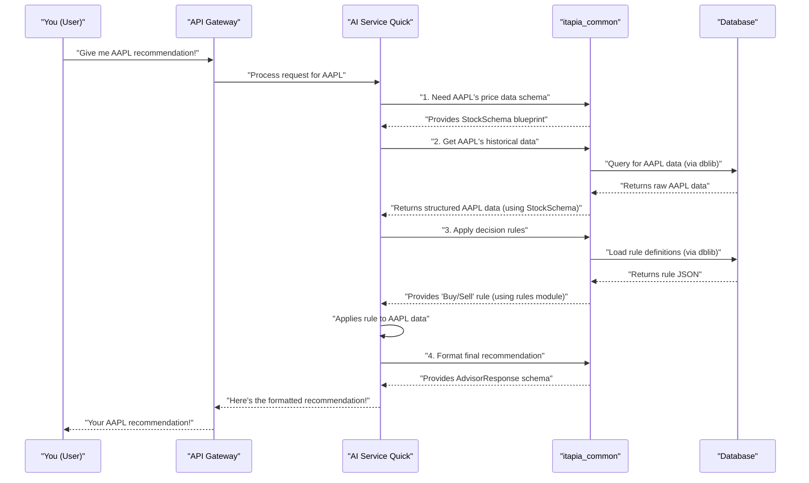

# Chapter 1: Shared Library (itapia_common)

### The Need for a Common Language

Imagine you're building a big robot, like ITAPIA, that has many different parts: an "AI brain" that crunches numbers, an "API gateway" that talks to the outside world, and other parts that fetch data or manage user accounts. If each part of this robot spoke a different language or used different kinds of wires, they couldn't work together! It would be a complete mess.

This is the problem that `itapia_common`, our "Shared Library," solves. Think of `itapia_common` as the **universal language** and the **central toolkit** for all parts of our ITAPIA robot. It's like the "company handbook" that everyone follows.

### What is `itapia_common`?

`itapia_common` is a special collection of core tools and definitions that every single part of the ITAPIA system uses. It lives in the `backend/shared/itapia_common` folder in our project. You can see it listed as a Python package in `backend/shared/setup.py`:

```python
# From backend/shared/setup.py
from setuptools import setup, find_packages

setup(
    name='itapia_common', # Here it is!
    version='0.5.1',
    packages=find_packages(),
    description='The common lib to connect db, get logger of ITAPIA, and define schemas between modules',
    install_requires=['numpy==1.26.4','pandas', 'sqlalchemy', 'psycopg2-binary',
                      'python-dotenv', 'redis', 'pydantic', 'fastapi']
)
```
This `setup.py` file tells Python how to install and recognize `itapia_common` as a library that other parts of our project can use.

The main goals of `itapia_common` are:

*   **Speak the Same Language:** Ensures all parts of ITAPIA understand each other.
*   **Reuse Code:** Instead of writing the same basic functions everywhere, we write them once here.
*   **Simplify Development:** Developers don't have to guess how things work; they just check the handbook.
*   **Maintain Data Integrity:** Helps prevent errors by making sure data always looks the same.

Let's look at its three most important sections: `schemas`, `dblib`, and `rules`.

### 1. `schemas`: The Standard Forms

Imagine you're ordering a pizza online. The website asks for your address, phone number, and pizza toppings in a specific way, right? That's a "schema" for your order!

In ITAPIA, `schemas` define the **standard format for all data** that moves around our system. When the AI brain wants to tell the API Gateway about a stock's price, it uses a specific `schema` for that price data. This ensures everyone understands exactly what "price" means and how it's structured.

You can find these definitions in the `backend/shared/itapia_common/schemas` folder.

#### How `schemas` are used:

Let's say we want to define what a "Stock" looks like in our system. We use something called `Pydantic` models (which are Python classes) to do this.

```python
# Simplified from backend/shared/itapia_common/schemas/entities/stock.py
from pydantic import BaseModel, Field

# This is like our standard "Stock Information Form"
class StockSchema(BaseModel):
    ticker: str = Field(..., description="Unique stock symbol, e.g., 'AAPL'")
    company_name: str = Field(..., description="Full name of the company")
    current_price: float = Field(..., description="Latest observed price")

# We can create a "Stock" based on this form
apple_stock = StockSchema(
    ticker="AAPL",
    company_name="Apple Inc.",
    current_price=170.50
)

print(apple_stock.model_dump_json(indent=2))
```
This code creates a blueprint for a `StockSchema`. Any part of ITAPIA that deals with stock information will use this exact blueprint. If the `Data Processing` service sends stock data to the `AI Service Quick`, they both know it will have a `ticker`, `company_name`, and `current_price` in the specified format. This prevents misunderstandings!

#### Inside `schemas`:

The `schemas` folder is further organized:
*   **`schemas/enums.py`**: Contains special lists of choices (like `SemanticType` which we'll discuss in [Chapter 2: Semantic Type System (STGP)](02_semantic_type_system__stgp__.md)).
*   **`schemas/entities/`**: These are the "master blueprints" for important pieces of data in our system, like `RuleEntity` (how a rule is structured) or `QuickCheckAnalysisReport` (the full report from the AI brain).
*   **`schemas/api/`**: These are like "request/response forms" used when different parts of ITAPIA talk to each other, especially for what the API Gateway sends out or receives (e.g., `AdvisorResponse`).

This separation helps keep our internal data formats clean and consistent, even if the public API needs a slightly different structure.

### 2. `dblib`: The Central Filing System

Every big company needs a central place to store its important documents, right? In ITAPIA, our "central filing system" is our database (PostgreSQL and Redis). `dblib` is the part of `itapia_common` that provides the **standard way for all services to talk to these databases.**

Instead of each service figuring out how to connect to the database on its own, they all use `dblib`. This ensures that data is saved and retrieved correctly, consistently, and securely.

You'll find `dblib` in the `backend/shared/itapia_common/dblib` folder.

#### How `dblib` is used:

Let's imagine we want to get the latest stock price data from our database. `dblib` provides helper functions for this.

```python
# Simplified example - actual dblib uses SQLAlchemy for more power
# from backend/shared/itapia_common/dblib/stock.py (conceptual)

class StockDBService:
    def __init__(self, db_connection):
        self.db = db_connection # This would be a real database connection

    def get_latest_price(self, ticker: str) -> float:
        """
        Fetches the latest closing price for a given stock ticker.
        (In a real system, this would query a database)
        """
        # Simulate fetching from a database
        if ticker == "AAPL":
            return 170.50
        elif ticker == "GOOG":
            return 150.25
        else:
            return 0.0 # Not found

# Example: AI brain wants the price of Apple stock
# In a real app, db_connection would be managed by FastAPI
mock_db_connection = None # Represents our database connection
stock_service = StockDBService(mock_db_connection)

apple_price = stock_service.get_latest_price("AAPL")
print(f"Latest price for AAPL: ${apple_price}")

google_price = stock_service.get_latest_price("GOOG")
print(f"Latest price for GOOG: ${google_price}")
```
Here, `StockDBService` (a part of `dblib` conceptually) provides a clean way to ask for data without needing to know the complex details of how the database works internally. Any service that needs stock prices just calls `get_latest_price()`, and `dblib` handles the rest.

#### Inside `dblib`:

`dblib` often works with two main layers:
*   **CRUD (Create, Read, Update, Delete) Layer:** This layer is closest to the database. It handles the raw commands to save, get, change, or remove data. It deals with basic data like dictionaries.
*   **Service Layer:** This layer works with our `Pydantic` schema objects (like `StockSchema`). It uses the CRUD layer to get data from the database and then converts it into the nice, structured objects that other parts of ITAPIA understand. This `Service` layer is what most developers interact with.

ITAPIA also uses special database features like `JSONB` in PostgreSQL to store complex data (like our [Rule Engine (Symbolic Expression Trees)](05_rule_engine__symbolic_expression_trees__.md) definitions) in a flexible way.

### 3. `rules`: The Fundamental Building Blocks

ITAPIA's intelligence comes from its "Rule Engine." This engine uses `rules` to make decisions, like "If the stock price goes up and news sentiment is positive, then it's a 'Buy' signal." `rules` in `itapia_common` provide the **fundamental building blocks** for creating these intelligent rules.

Think of it like LEGO bricks. `rules` provides the basic bricks (like variables, constants, and operators) that we can combine to build very complex logic structures.

You'll find these building blocks in the `backend/shared/itapia_common/rules` folder.

#### How `rules` are used:

In [Chapter 5: Rule Engine (Symbolic Expression Trees)](05_rule_engine__symbolic_expression_trees__.md), we'll dive deep into the Rule Engine. For now, let's just see a tiny example of a building block called a `ConstantNode`. This is like a basic "number brick" in our rule system.

```python
# Simplified example from backend/shared/itapia_common/rules/nodes/constant.py
from pydantic import Field
from typing import ClassVar
from enum import Enum

# Imagine we have types for our data, like 'Price' or 'Score'
class SemanticType(str, Enum):
    NUMERIC = "NUMERIC"
    DECISION_SIGNAL = "DECISION_SIGNAL"
    # ... many other types

# This is a basic "number brick" for our rules
class ConstantNode:
    type: ClassVar[str] = "constant" # Tells us what kind of brick this is
    return_type: SemanticType = SemanticType.NUMERIC # What kind of value it holds

    def __init__(self, value: float):
        self.value = value

    def execute(self, data: dict) -> float:
        """
        When this brick is used, it just gives its value.
        'data' would be the input from our analysis.
        """
        return self.value

# Create a "number brick" with the value 0.5
half_point_node = ConstantNode(value=0.5)

# When we "execute" this brick, it simply gives us its value
result = half_point_node.execute({}) # No data needed for a constant
print(f"The value of our constant brick is: {result}")
```
This simple `ConstantNode` is just one type of "brick." Other bricks might represent actual stock data (`VarNode`) or mathematical operations (`OperatorNode`) like adding or comparing numbers. By combining these bricks, we build powerful rules!

### How ITAPIA Uses `itapia_common` in Action

Let's trace a simple journey: You ask ITAPIA for a stock recommendation. How does `itapia_common` help all the different parts of the system communicate and work together?



In this diagram:
1.  When `AI Service Quick` needs to understand data, it asks `itapia_common` for the correct `schema` (like asking for the right form).
2.  When `AI Service Quick` needs to get data from the `Database`, it uses `itapia_common`'s `dblib` (like using the standard procedure for getting files from the central filing system).
3.  When `AI Service Quick` needs to apply complex logic, it uses `itapia_common`'s `rules` building blocks (like assembling a complex decision from basic company guidelines).
4.  When `AI Service Quick` sends the final answer back, it formats it using another `schema` from `itapia_common`.

This shows how `itapia_common` acts as a crucial bridge, making sure all parts of ITAPIA communicate smoothly and efficiently.

### Summary

In this chapter, we learned that `itapia_common` is the "company handbook" or "central toolkit" that helps all parts of the ITAPIA system work together seamlessly. We explored its three key components:

*   **`schemas`**: Provide standard data formats, like official forms, ensuring everyone understands the structure of information.
*   **`dblib`**: Offers a consistent way to interact with databases, acting as the central filing system.
*   **`rules`**: Contains the basic building blocks for our intelligent Rule Engine, like LEGO bricks for logic.

By using `itapia_common`, we promote code reuse, simplify development, and maintain data consistency across the entire ITAPIA project.

Next, we'll dive into another core concept that helps ITAPIA understand and process data intelligently: the [Semantic Type System (STGP)](02_semantic_type_system__stgp__.md).

---

<sub><sup>Generated by [AI Codebase Knowledge Builder](https://github.com/The-Pocket/Tutorial-Codebase-Knowledge).</sup></sub> <sub><sup>**References**: [[1]](https://github.com/triet4p/itapia/blob/5d35c08e0ff059435cc497af3e4d25f0eb1eba5c/README.md), [[2]](https://github.com/triet4p/itapia/blob/5d35c08e0ff059435cc497af3e4d25f0eb1eba5c/backend/shared/itapia_common/__init__.py), [[3]](https://github.com/triet4p/itapia/blob/5d35c08e0ff059435cc497af3e4d25f0eb1eba5c/backend/shared/itapia_common/dblib/__init__.py), [[4]](https://github.com/triet4p/itapia/blob/5d35c08e0ff059435cc497af3e4d25f0eb1eba5c/backend/shared/itapia_common/rules/__init__.py), [[5]](https://github.com/triet4p/itapia/blob/5d35c08e0ff059435cc497af3e4d25f0eb1eba5c/backend/shared/itapia_common/schemas/__init__.py), [[6]](https://github.com/triet4p/itapia/blob/5d35c08e0ff059435cc497af3e4d25f0eb1eba5c/backend/shared/setup.py), [[7]](https://github.com/triet4p/itapia/blob/5d35c08e0ff059435cc497af3e4d25f0eb1eba5c/doc/public/itapia-mvp-v2.0.md)</sup></sub>