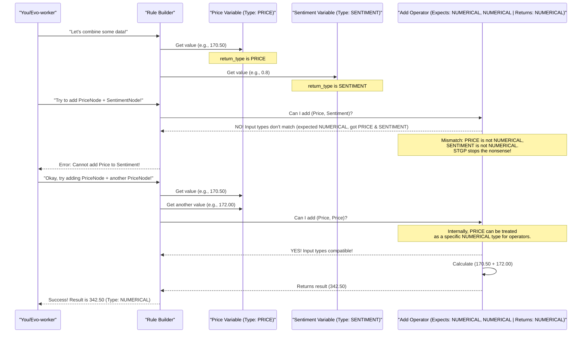

# Chapter 2: Semantic Type System (STGP)

In [Chapter 1: Shared Library (itapia_common)](01_shared_library__itapia_common__.md), we learned about `itapia_common`, the "universal language" and "central toolkit" for ITAPIA. We briefly mentioned `SemanticType` inside `schemas/enums.py`. Now, let's dive much deeper into why this little piece of code is actually one of the smartest parts of our entire system!

### What Problem Does STGP Solve?

Imagine you're trying to build a sentence, but instead of words, you're using pieces of data. What if you tried to say: "The **stock price** is **happy**"? Or "Add the **news sentiment** to the **trading volume**"?

These sentences don't make sense, right? A stock price is a number, not an emotion. You can't add an emotion to a number.

In ITAPIA, our "Rule Engine" (which we'll explore in [Chapter 5: Rule Engine (Symbolic Expression Trees)](05_rule_engine__symbolic_expression_trees__.md)) creates its "sentences" using different pieces of data and mathematical operations. Without rules, it could easily try to do something illogical, like comparing a stock's `PRICE` with its `MOMENTUM` as if they were the same thing, or even worse, comparing a `PRICE` directly with a `BOOLEAN` (True/False) value! This would lead to complete nonsense outputs from our AI.

This is where the **Semantic Type System (STGP)** comes in. Think of STGP as a super-smart **grammar checker** for our Rule Engine's language. It's like having specific shapes on your LEGO bricks – you can only connect them if the shapes match.

The core goal of STGP is simple: **ensure that only logically sensible rules can be built, preventing meaningless AI outputs.**

### What is a Semantic Type?

A "Semantic Type" is a special label we give to every piece of data and every operation in ITAPIA. This label tells us what the data *means* or what kind of information it represents, not just if it's a number or text.

For example:
*   `MOMENTUM`: This isn't just a number; it's a number representing how fast a stock's price is changing.
*   `PRICE`: This is a number, but it specifically means a stock's actual price.
*   `BOOLEAN`: This is a True/False value, representing a yes/no answer.
*   `SENTIMENT`: This is a score representing emotion or opinion.

These labels are defined in `itapia_common/schemas/enums.py` as an `Enum` called `SemanticType`.

```python
# Simplified from backend/shared/itapia_common/schemas/enums.py
from enum import Enum

class SemanticType(str, Enum):
    """
    Defines semantic types for values in the rule tree.
    This is the heart of Strongly Typed Genetic Programming (STGP).
    """
    NUMERICAL = 'NUMERICAL'      # Any general number
    BOOLEAN = 'BOOLEAN'        # True/False signal (1.0 / 0.0)

    PRICE = 'PRICE'              # Price-related value (e.g., close, open)
    MOMENTUM = 'MOMENTUM'           # Momentum indicator (RSI, Stochastic)
    TREND = 'TREND'              # Trend indicator (MACD, ADX)
    SENTIMENT = 'SENTIMENT'         # Sentiment score
    DECISION_SIGNAL = 'DECISION_SIGNAL' # A final buy/sell/hold signal

    ANY = 'ANY'                # Can be any type (for flexible operators)
```
As you can see, `SemanticType` helps us categorize our data beyond just basic numbers or text. It gives them meaning in the context of finance and analysis.

### How STGP Works: Rules as Smart LEGO Bricks

Remember the "LEGO bricks" analogy from [Chapter 1: Shared Library (itapia_common)](01_shared_library__itapia_common__.md) for our `rules` building blocks? STGP adds a crucial layer to these bricks: **each brick now has a specific *type* of connector, and operators only connect bricks with matching types.**

In our Rule Engine, every "node" (whether it's a `ConstantNode`, `VarNode`, or `OperatorNode`) has:
1.  **`return_type`**: The semantic type of the value this node will produce. This is like the type of connector *on the output* of the brick.
2.  **`args_type` (for `OperatorNode`s)**: A list of semantic types that this operator expects for its input "children" nodes. This is like the specific types of connectors *on the inputs* of the brick.

Let's look at a simplified example of how our rule nodes inherit these types:

```python
# Simplified from backend/shared/itapia_common/rules/nodes/_nodes.py
from itapia_common.schemas.enums import SemanticType, NodeType
from abc import ABC, abstractmethod

class _TreeNode(ABC): # Base class for all rule parts
    def __init__(self, node_name: str, node_type: NodeType,
                 description: str, return_type: SemanticType):
        self.node_name = node_name
        self.node_type = node_type
        self.description = description
        self.return_type = return_type # What kind of value this node gives

    @abstractmethod
    def evaluate(self, report) -> float:
        pass

class ConstantNode(_TreeNode):
    def __init__(self, node_name: str, description: str, return_type: SemanticType, value: float):
        super().__init__(node_name, NodeType.CONSTANT, description, return_type)
        self.value = value

# An example of a "Price Threshold" constant
price_threshold_node = ConstantNode(
    node_name="PRICE_THRESHOLD_200",
    description="A constant price threshold of 200.",
    return_type=SemanticType.PRICE, # This constant *is* a Price
    value=200.0
)
print(f"Constant node type: {price_threshold_node.return_type}")
```
Here, a `ConstantNode` is defined with a `return_type` of `PRICE`. This tells the system that this "brick" represents a price value.

Now, consider an `OperatorNode`, which takes other nodes as inputs.

```python
# Simplified from backend/shared/itapia_common/rules/nodes/_nodes.py
from typing import List

class OperatorNode(_TreeNode):
    def __init__(self, node_name: str, description: str, num_child: int|None,
                 return_type: SemanticType, args_type: List[SemanticType], # Expected input types!
                 children: List[_TreeNode] = []):
        super().__init__(node_name, NodeType.OPERATOR, description, return_type)
        self.num_child = num_child
        self.children = children
        self.args_type = args_type # List of types it expects from its children

    def add_child_node(self, child_node: _TreeNode):
        # In the real system, this is where type checking happens!
        # It checks if child_node.return_type matches self.args_type[len(self.children)]
        # If not, it raises an error.
        if self.num_child is not None and len(self.children) >= self.num_child:
            raise ValueError('Children list is full!')
        self.children.append(child_node)

    # ... other methods ...

# Example: A "GreaterThan" operator
# It expects two NUMERICAL inputs and returns a BOOLEAN (True/False)
greater_than_op = OperatorNode(
    node_name="GREATER_THAN",
    description="Checks if the first argument is greater than the second.",
    num_child=2,
    return_type=SemanticType.BOOLEAN, # Output type is True/False
    args_type=[SemanticType.NUMERICAL, SemanticType.NUMERICAL] # Expects two numbers
)
print(f"Greater Than operator expects: {greater_than_op.args_type}")
print(f"Greater Than operator returns: {greater_than_op.return_type}")
```
The `GreaterThan` operator clearly states: "I need two inputs that are `NUMERICAL` (numbers), and I will give you back a `BOOLEAN` (True/False) result."

### How STGP Prevents Nonsense: A Simple Flow

When our system or the future "Evo-worker" tries to build a rule (a tree of these `_TreeNode`s), the STGP acts like a strict supervisor.

Let's imagine the "Rule Builder" is trying to connect different nodes:


This diagram shows how the STGP acts as a gatekeeper. When the Rule Builder tries to connect `PriceNode` (which has `return_type: PRICE`) and `SentimentNode` (which has `return_type: SENTIMENT`) to an `AddOperator` that expects `NUMERICAL` types, it immediately identifies the mismatch and prevents the operation. This ensures that the generated rules are always logically coherent.

### How it's Implemented Under the Hood

The magic of STGP is woven throughout the `rules` module in `itapia_common`.

1.  **Node Definitions (`_nodes.py`):**
    As shown earlier, every base `_TreeNode` and its specialized versions (`ConstantNode`, `VarNode`, `OperatorNode`) are designed to carry their `return_type`. Crucially, `OperatorNode` also specifies its `args_type` list, which details the `SemanticType` it expects for each of its child inputs.

    ```python
    # From backend/shared/itapia_common/rules/nodes/_nodes.py (simplified)
    class OperatorNode(_TreeNode):
        def __init__(self, node_name: str, description: str, num_child: int|None,
                     return_type: SemanticType, args_type: List[SemanticType], # <--- Here!
                     children: List[_TreeNode] = []):
            super().__init__(node_name, node_type=NodeType.OPERATOR, description=description, return_type=return_type)
            self.num_child = num_child
            self.children = children
            self.args_type = args_type # Stored list of expected input types
            # ... (more internal logic) ...

        def check_valid_children(self) -> bool:
            # This method (simplified) would loop through children
            # and compare their return_type with self.args_type
            if self.num_child is not None and len(self.children) != self.num_child:
                return False
            # Example: Ensure each child's type matches the expected arg_type
            for i, child in enumerate(self.children):
                expected_type = self.args_type[i]
                # If expected_type is NUMERICAL, then PRICE, MOMENTUM, etc., are compatible.
                # If expected_type is specific (e.g., BOOLEAN), then it must match exactly.
                if expected_type != SemanticType.ANY and child.return_type != expected_type:
                    # In reality, there's more complex compatibility logic here
                    # For example, PRICE is compatible with NUMERICAL
                    return False
            return True
    ```
    The `check_valid_children` method is where the `OperatorNode` verifies that the `return_type` of its connected child nodes matches its `args_type` requirements. This is like checking if the LEGO connectors fit!

2.  **Node Registry and Factory (`registry.py`):**
    The `registry.py` holds the "blueprints" for all available nodes in our system. Each blueprint, called a `NodeSpec`, clearly defines the `return_type` and `args_type` for that node. When `create_node()` is called to build a new part of a rule, it uses these specifications to ensure type compatibility.

    ```python
    # From backend/shared/itapia_common/rules/nodes/registry.py (simplified)
    from typing import NamedTuple, Dict, List, Any, Type
    from itapia_common.schemas.enums import SemanticType, NodeType
    from ._nodes import _TreeNode

    class NodeSpec(NamedTuple):
        node_class: Type[_TreeNode]
        description: str
        node_type: NodeType
        params: Dict[str, Any]
        return_type: SemanticType       # <--- Node's output type
        args_type: List[SemanticType]|None = None # <--- Operator's input types

    _NODE_REGISTRY: Dict[str, NodeSpec] = {} # Stores all node blueprints

    def create_node(node_name: str, **kwargs) -> _TreeNode:
        """
        Creates a Node object based on its registered name and checks parameters.
        This factory function uses the NodeSpec to understand types.
        """
        spec = _NODE_REGISTRY.get(node_name.upper())
        if spec is None:
            raise ValueError(f"Node '{node_name}' not found.")

        # The factory uses spec.return_type and spec.args_type
        # to ensure the node is created correctly and compatible
        # with how it will be used in a rule tree.
        # ... (complex logic to initialize the node based on spec and kwargs) ...
        # For example, it might pass spec.return_type and spec.args_type
        # directly to the OperatorNode's constructor.
        final_params = {
            'node_name': node_name,
            'description': spec.description,
            'return_type': spec.return_type,
            'args_type': spec.args_type # Passed to operator nodes
        }
        return spec.node_class(**final_params) # Creates the actual node instance
    ```
    The `create_node` function (our "Node Factory") ensures that when a new "brick" is made, it's given the correct type information from its `NodeSpec`. This is crucial because it's how the `OperatorNode` gets its `args_type` information.

### The Benefits of STGP

By implementing this Semantic Type System, ITAPIA gains several major advantages:

| Feature           | Without STGP                                     | With STGP (Our Approach)                                  |
| :---------------- | :----------------------------------------------- | :-------------------------------------------------------- |
| **Rule Validity** | AI might generate nonsensical rules (e.g., comparing a price with a news sentiment score directly). | **Guaranteed logically sensible rules.** Only valid combinations of data and operations are allowed. |
| **AI Evolution**  | The future "Evo-worker" could spend ages trying out millions of meaningless rules. | **Smarter Evolution:** The "Evo-worker" is guided to discover new, *valid* investment strategies much faster because it only explores meaningful combinations. |
| **Transparency**  | Hard to explain why a rule works if it contains illogical steps. | **Clearer Explanations:** Rules are inherently more understandable and easier to explain since they are logically sound. |
| **Debugging**     | Hard to find errors when type mismatches aren't caught early. | **Prevents errors:** Many common logic errors are caught even before a rule is fully built. |

This makes the STGP a vital part of ITAPIA, ensuring the reliability, intelligence, and explainability of our AI's outputs.

### Summary

In this chapter, we explored the **Semantic Type System (STGP)**, which acts as a powerful "grammar checker" for ITAPIA's Rule Engine. We learned:

*   **Problem Solved**: STGP prevents the creation of illogical and meaningless rules by enforcing type compatibility.
*   **`SemanticType`**: A special `Enum` in `itapia_common/schemas/enums.py` that gives meaningful labels (like `PRICE`, `MOMENTUM`, `BOOLEAN`) to data and operations.
*   **How it Works**: Every `_TreeNode` has a `return_type` (its output type), and `OperatorNode`s also have `args_type` (their expected input types). The system only allows connections when these types are compatible.
*   **Benefits**: Leads to logically sound rules, accelerates the discovery of valid strategies by the "Evo-worker", and improves transparency and debugging.

Next, we'll shift our focus to how ITAPIA efficiently stores and retrieves all the data it needs to make these intelligent decisions: [Data Persistence & Caching](03_data_persistence___caching_.md).

---

<sub><sup>Generated by [AI Codebase Knowledge Builder](https://github.com/The-Pocket/Tutorial-Codebase-Knowledge).</sup></sub> <sub><sup>**References**: [[1]](https://github.com/triet4p/itapia/blob/5d35c08e0ff059435cc497af3e4d25f0eb1eba5c/backend/shared/itapia_common/rules/nodes/_nodes.py), [[2]](https://github.com/triet4p/itapia/blob/5d35c08e0ff059435cc497af3e4d25f0eb1eba5c/backend/shared/itapia_common/rules/nodes/registry.py), [[3]](https://github.com/triet4p/itapia/blob/5d35c08e0ff059435cc497af3e4d25f0eb1eba5c/backend/shared/itapia_common/schemas/enums.py), [[4]](https://github.com/triet4p/itapia/blob/5d35c08e0ff059435cc497af3e4d25f0eb1eba5c/doc/public/itapia-mvp-v2.0.md)</sup></sub>