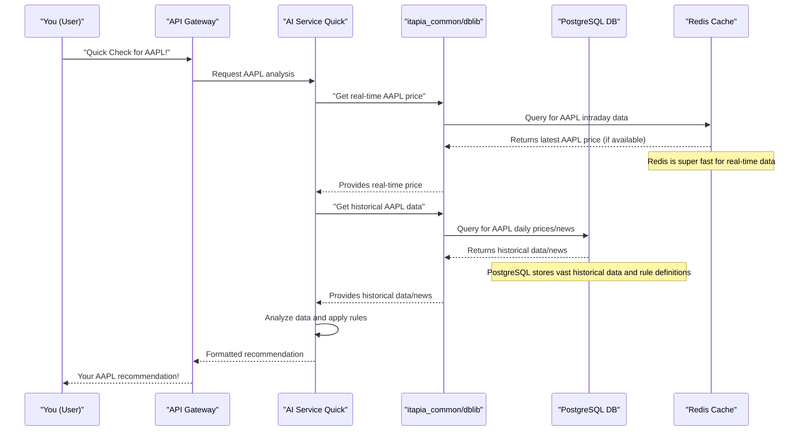

# Chapter 3: Data Persistence & Caching

In [Chapter 2: Semantic Type System (STGP)](02_semantic_type_system__stgp__.md), we learned how ITAPIA uses a clever "grammar checker" to build smart and sensible rules. But where do these rules get the data they need to make decisions? And where are the rules themselves stored so ITAPIA can remember them? This is where **Data Persistence & Caching** comes in.

### The Problem: Where to Keep ITAPIA's Memory?

Imagine ITAPIA as a brilliant financial advisor. This advisor needs to remember a lot of things:
*   **Historical Data:** Prices of stocks from years ago, old news articles, long-term trends. This is like a massive, well-organized library.
*   **Real-time Data:** What's the stock price *right now*? What's the latest breaking news? This is like quickly checking a live ticker or a fresh scratchpad.
*   **Rule Definitions:** The complex logical rules ITAPIA uses to make decisions. These need to be saved reliably, sometimes in very flexible ways, because they might change or evolve over time.

We need a way for ITAPIA to store this vast amount of financial data safely for the long term, but also to access frequently used or real-time data incredibly fast. Storing everything in one place, or storing everything slowly, wouldn't work for a "Quick Check" system!

### The Solution: Two Kinds of Memory

ITAPIA solves this challenge by using two different types of databases, each suited for a specific job:

1.  **PostgreSQL: The Long-Term Archive (Our "Library")**
    *   **What it is:** PostgreSQL is a very powerful and reliable database. Think of it as a huge, well-organized library where ITAPIA keeps all its important, long-term records.
    *   **What it stores:** This is where ITAPIA archives **historical prices** (daily, weekly, monthly), all past **news articles**, and the detailed **rule definitions** (which can be quite complex).
    *   **Why it's good:** PostgreSQL is excellent for storing large amounts of structured data reliably. It allows ITAPIA to ask complex questions about historical trends and to save flexible data structures using a special feature called `JSONB` for our rules.

2.  **Redis: The Super-Fast Scratchpad (Our "Whiteboard")**
    *   **What it is:** Redis is a super-fast "in-memory" data store. Imagine a giant, lightning-fast whiteboard where ITAPIA can quickly jot down and erase notes.
    *   **What it stores:** Redis is used for **real-time market data streams** (like intraday stock prices that change every second) and for **frequently accessed AI models or data** that need to be ready instantly.
    *   **Why it's good:** It's blazing fast because it keeps data mostly in the computer's memory. This is crucial for "Quick Check" analyses that demand instant responses.

And just like we learned in [Chapter 1: Shared Library (itapia_common)](01_shared_library__itapia_common__.md), our `itapia_common/dblib` module acts as the "librarian" or "data manager," knowing exactly how to talk to both PostgreSQL and Redis to get the right information efficiently.

### Use Case: Getting Real-Time Stock Price for a "Quick Check"

Let's say you want to use ITAPIA for a "Quick Check" on a stock like AAPL. A crucial piece of information ITAPIA needs is the *current* real-time price. This price changes very quickly, so it needs to be fetched from our super-fast memory, Redis.

### How ITAPIA Connects to its "Memory"

ITAPIA uses **Docker** to set up and manage these databases. Think of Docker as creating separate, self-contained "boxes" for each part of our system, including our databases.

Here's how `docker-compose.yml` (a file that tells Docker what boxes to create) defines our databases:

```yaml
# From backend/docker-compose.yml (simplified)
services:
  stocks_postgre_db:
    image: postgres:15-alpine # Use the official PostgreSQL image
    container_name: itapia-stocks_postgre_db # A friendly name for our PostgreSQL box
    ports:
      - "5432:5432" # Make PostgreSQL reachable on port 5432
    volumes:
      - postgres_data:/var/lib/postgresql/data/ # Save data permanently
    networks:
      - itapia-network # Allow ITAPIA services to talk to it

  realtime_redis_db:
    image: redis:7-alpine # Use the official Redis image
    container_name: itapia-redis_db # A friendly name for our Redis box
    ports:
      - "6379:6379" # Make Redis reachable on port 6379
    volumes:
      - redis_data:/data # Save data permanently (for Redis persistence)
    networks:
      - itapia-network # Allow ITAPIA services to talk to it
```
**Explanation:** This part of the `docker-compose.yml` file tells Docker to run two separate "boxes" (called containers) for our databases. `stocks_postgre_db` is our reliable, long-term PostgreSQL database, and `realtime_redis_db` is our super-fast, short-term Redis memory. `ports` connect them to your computer, `volumes` make sure the data is saved even if the "box" restarts, and `networks` allow other ITAPIA "boxes" (like `ai-service-quick`) to talk to them.

### Finding the "Memory" Addresses (`db_config.py`)

Just like you need an address to find a library or a friend's house, ITAPIA needs the addresses of its databases. These addresses are stored in a configuration file:

```python
# From backend/shared/itapia_common/dblib/db_config.py (simplified)
import os
from dotenv import load_dotenv # Helps load settings from a .env file

# Load settings from our .env file
load_dotenv()

# PostgreSQL settings (default to 'localhost' if not specified)
POSTGRES_HOST = os.getenv("POSTGRES_HOST", "localhost")
POSTGRES_PORT = os.getenv("POSTGRES_PORT", 5432)
# This creates the full address for PostgreSQL
DATABASE_URL = f"postgresql+psycopg2://{POSTGRES_USER}:{POSTGRES_PASSWORD}@{POSTGRES_HOST}:{POSTGRES_PORT}/{POSTGRES_DB}"

# Redis settings
REDIS_HOST = os.getenv("REDIS_HOST", "localhost")
REDIS_PORT = int(os.getenv("REDIS_PORT", 6379))

# Names for common tables/keys in the databases
DAILY_PRICES_TABLE_NAME = 'daily_prices'
INTRADAY_STREAM_PREFIX = 'intraday_stream' # Prefix for real-time data in Redis
```
**Explanation:** This `db_config.py` file is like ITAPIA's address book. It uses settings from an `.env` file (which holds secret information like usernames and passwords) to build the full connection addresses for both PostgreSQL (`DATABASE_URL`) and Redis. It also defines common names for data tables or keys, ensuring all parts of ITAPIA use the same names when looking for specific data.

### Making Connections Efficiently (`session.py`)

Once ITAPIA knows the addresses, it needs to connect to the databases. To avoid opening a new connection every single time it needs data (which would be slow!), `itapia_common/dblib/session.py` ensures that only one main connection is created for each database type. This is called a "singleton" pattern – meaning there's only *one* instance of something throughout the program.

```python
# From backend/shared/itapia_common/dblib/session.py (simplified)
from sqlalchemy import create_engine # For PostgreSQL connections
import redis # For Redis connections

import itapia_common.dblib.db_config as cfg # Our address book

_SINGLETON_RDBMS_ENGINE = None # Holds our single PostgreSQL connection
_SINGLETON_REDIS_CLIENT = None # Holds our single Redis connection

def get_singleton_rdbms_engine():
    global _SINGLETON_RDBMS_ENGINE
    if _SINGLETON_RDBMS_ENGINE is None:
        # Create connection if it doesn't exist yet
        _SINGLETON_RDBMS_ENGINE = create_engine(cfg.DATABASE_URL, pool_pre_ping=True)
    return _SINGLETON_RDBMS_ENGINE

def get_singleton_redis_client():
    global _SINGLETON_REDIS_CLIENT
    if _SINGLETON_REDIS_CLIENT is None:
        try:
            # Create connection if it doesn't exist yet
            _SINGLETON_REDIS_CLIENT = redis.Redis(
                host=cfg.REDIS_HOST, port=cfg.REDIS_PORT, db=0,
                decode_responses=True # Makes Redis return normal text
            )
            _SINGLETON_REDIS_CLIENT.ping() # Check if connection works
        except redis.exceptions.ConnectionError:
            raise # Problem connecting to Redis!
    return _SINGLETON_REDIS_CLIENT

# ... (other functions for getting temporary database "sessions" for FastAPI) ...
```
**Explanation:** These functions are designed to be smart. The very first time `get_singleton_rdbms_engine()` or `get_singleton_redis_client()` is called, they create the connection to PostgreSQL or Redis. After that, every time these functions are called, they just return the *same existing connection*. This saves a lot of time and resources.

### Storing Complex Data: The Magic of `JSONB` in PostgreSQL

One of the cool features ITAPIA uses with PostgreSQL is `JSONB`. This allows us to store complex, structured data (like our flexible [Rule Engine (Symbolic Expression Trees)](05_rule_engine__symbolic_expression_trees__.md) definitions) directly within a single database column, instead of having to break it down into many tiny pieces across different tables. It's like having a special section in our library where we can put entire books that contain other books inside!

When ITAPIA wants to save or update many pieces of data at once, it uses a smart function called `bulk_insert` within `dblib`. This function can also handle "conflicts" – what happens if you try to save data that already exists?

```python
# Simplified from backend/shared/itapia_common/dblib/crud/general_update.py
from sqlalchemy import Engine
from sqlalchemy.dialects.postgresql import insert as pg_insert
from typing import Literal, List, Dict

def bulk_insert(engine: Engine, table_name: str,
                data: List[Dict], unique_cols: List[str],
                on_conflict: Literal['nothing', 'update'] = 'nothing'):
    """
    Inserts many records into a table, handling conflicts efficiently.

    Args:
        engine: The database connection engine.
        table_name: The table to insert into.
        data: A list of dictionaries, where each dictionary is a row of data.
        unique_cols: Columns that identify a unique record (e.g., stock ticker).
        on_conflict: What to do if a record with same unique_cols already exists.
                     'nothing' (ignore new record) or 'update' (update existing record).
    """
    # Create a database table object for the given name
    table = Table(table_name, MetaData(), autoload_with=engine)

    with engine.begin() as connection: # Start a transaction (all or nothing)
        # Prepare the insert statement with the data
        stmt = pg_insert(table).values(data)

        if on_conflict == 'update':
            # If there's a conflict (record already exists based on unique_cols),
            # UPDATE the existing record with the new data. This is called "UPSERT".
            update_cols = {col.name: col for col in stmt.excluded if col.name not in unique_cols}
            final_stmt = stmt.on_conflict_do_update(
                index_elements=unique_cols,
                set_=update_cols
            )
        else: # on_conflict == 'nothing'
            # If there's a conflict, just DO NOTHING (ignore the new record).
            final_stmt = stmt.on_conflict_do_nothing(
                index_elements=unique_cols
            )
        # Execute the final statement
        connection.execute(final_stmt)
```
**Explanation:** This `bulk_insert` function in `dblib` is how ITAPIA efficiently saves many pieces of data to PostgreSQL at once. The clever part is the `on_conflict` setting. If `on_conflict='update'`, it means: "If this new piece of data (like a stock's daily price for a specific date) already exists, don't create a duplicate, just update the old one with the latest info!" This is a very common and powerful operation called "UPSERT" (Update or Insert).

### The Data Flow for a "Quick Check"

Now, let's trace how ITAPIA uses both PostgreSQL and Redis to get the data it needs for a "Quick Check":


**Explanation:**
1.  You (the **User**) ask the `API Gateway` for a "Quick Check" on AAPL.
2.  The `API Gateway` passes this request to the `AI Service Quick`.
3.  `AI Service Quick` needs the *very latest* price, so it asks `itapia_common/dblib` to fetch it.
4.  `DBLib` knows that real-time prices are in **Redis**, so it queries Redis. Redis quickly sends back the latest price.
5.  Next, `AI Service Quick` needs *historical* data and news for deeper analysis. It asks `DBLib` again.
6.  `DBLib` knows this long-term data is in **PostgreSQL**, so it queries PostgreSQL. PostgreSQL retrieves the historical prices and news articles.
7.  With both real-time and historical data, `AI Service Quick` can now perform its analysis and apply its rules (which are also loaded from PostgreSQL, as mentioned in [Chapter 1: Shared Library (itapia_common)](01_shared_library__itapia_common__.md)).
8.  Finally, `AI Service Quick` sends its formatted recommendation back through the `API Gateway` to you!

This shows how ITAPIA cleverly uses the right "memory" (PostgreSQL for long-term, Redis for quick-term) for the right job, all managed by `itapia_common/dblib`.

### Summary

In this chapter, we explored how ITAPIA efficiently manages its vast amounts of financial data using two distinct database systems:

*   **PostgreSQL**: Serves as the reliable, **long-term archive** for historical prices, news articles, and complex rule definitions (using its flexible `JSONB` feature).
*   **Redis**: Acts as the **super-fast scratchpad** for real-time market data streams and frequently accessed information, ensuring quick responses.

We saw how `itapia_common/dblib` acts as the central data manager, knowing how to connect to and interact with both databases efficiently. This dual-memory approach ensures ITAPIA can perform both deep historical analysis and lightning-fast "Quick Checks."

Next, we'll dive into how ITAPIA actually *uses* this data to perform its intelligent analyses: [Analysis Modules](04_analysis_modules_.md).

---

<sub><sup>Generated by [AI Codebase Knowledge Builder](https://github.com/The-Pocket/Tutorial-Codebase-Knowledge).</sup></sub> <sub><sup>**References**: [[1]](https://github.com/triet4p/itapia/blob/5d35c08e0ff059435cc497af3e4d25f0eb1eba5c/backend/docker-compose.yml), [[2]](https://github.com/triet4p/itapia/blob/5d35c08e0ff059435cc497af3e4d25f0eb1eba5c/backend/shared/itapia_common/dblib/crud/general_update.py), [[3]](https://github.com/triet4p/itapia/blob/5d35c08e0ff059435cc497af3e4d25f0eb1eba5c/backend/shared/itapia_common/dblib/db_config.py), [[4]](https://github.com/triet4p/itapia/blob/5d35c08e0ff059435cc497af3e4d25f0eb1eba5c/backend/shared/itapia_common/dblib/session.py), [[5]](https://github.com/triet4p/itapia/blob/5d35c08e0ff059435cc497af3e4d25f0eb1eba5c/doc/public/itapia-mvp-v2.0.md)</sup></sub>