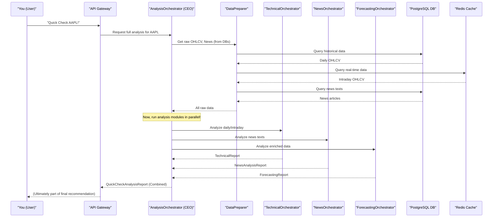

# Chapter 4: Analysis Modules

In [Chapter 3: Data Persistence & Caching](03_data_persistence___caching_.md), we learned how ITAPIA stores all its valuable financial data, both historical and real-time. But simply *having* data isn't enough; ITAPIA needs to make sense of it, to turn raw numbers and texts into meaningful insights.

### What Problem Do Analysis Modules Solve?

Imagine ITAPIA is a highly specialized financial research firm. This firm doesn't just collect piles of newspapers and market data; it has different departments, each with its own experts and tools, dedicated to analyzing specific types of information.

*   One department looks at charts and numbers (`Technical` analysis).
*   Another department reads news articles and understands the mood (`News` analysis).
*   A third department uses advanced math to predict what might happen next (`Forecasting`).

These departments are ITAPIA's **Analysis Modules**. They are the specialized "intelligence units" that dive deep into raw market data, interpret it, and then produce a structured, insightful report. This report isn't just a jumble of data; it's the *evidence* that the [Rule Engine](05_rule_engine__symbolic_expression_trees__.md) will later use to form its investment recommendations.

The main challenge these modules solve is: **How do we efficiently and intelligently transform vast amounts of raw market data into clear, actionable insights for the Rule Engine?**

### The Core Analysis Modules

ITAPIA currently features three primary Analysis Modules, each focusing on a distinct aspect of market intelligence:

1.  **`Technical` Module:**
    *   **Purpose:** This module is like a seasoned chart analyst. It looks at historical price movements (Open, High, Low, Close, Volume - OHLCV), calculates various indicators (like RSI, MACD, Moving Averages), and identifies trends, support/resistance levels, and chart patterns.
    *   **Input:** Raw daily and intraday (within-day) price data.
    *   **Output:** A `TechnicalReport` filled with insights about price trends, momentum, and volatility.

2.  **`News` Module:**
    *   **Purpose:** This module acts as an expert financial journalist, equipped with advanced Natural Language Processing (NLP) tools. It reads financial articles related to a stock and extracts crucial information, such as the overall sentiment (positive, negative, neutral) and identifying key entities or events.
    *   **Input:** Raw news article texts.
    *   **Output:** A `NewsAnalysisReport` detailing the sentiment, key entities mentioned, and overall impact of recent news.

3.  **`Forecasting` Module:**
    *   **Purpose:** This module is ITAPIA's data scientist. It leverages machine learning models (like LightGBM) to predict future price movements or probabilities based on historical data and calculated features.
    *   **Input:** Enriched historical price data with technical features.
    *   **Output:** A `ForecastingReport` containing predictions (e.g., probability of price going up/down) and explanations for those predictions (using SHAP values).

Each of these modules is designed to provide a comprehensive, structured report, serving as valuable evidence for the [Rule Engine](05_rule_engine__symbolic_expression_trees__.md).

### How Analysis Modules Work Together: The `AnalysisOrchestrator`

Just like a CEO coordinates different departments, the `AnalysisOrchestrator` is the central "brain" responsible for coordinating these three specialized Analysis Modules. It ensures that all necessary analyses are performed efficiently and that their results are combined into a single, comprehensive report.

You can find the `AnalysisOrchestrator` in `backend/ai_service_quick/app/analysis/orchestrator.py`.

Let's look at a simplified example of how it asks each module to do its job:

```python
# Simplified from backend/ai_service_quick/app/analysis/orchestrator.py

import asyncio # For running tasks at the same time
import pandas as pd
from typing import Literal

# We will import the "bosses" of each analysis module
from .technical.orchestrator import TechnicalOrchestrator
from .forecasting.orchestrator import ForecastingOrchestrator
from .news.orchestrator import NewsOrchestrator

# The blueprint for the final combined report
from itapia_common.schemas.entities.analysis._full import QuickCheckAnalysisReport

class AnalysisOrchestrator:
    def __init__(self, data_preparer, tech_analyzer, forecaster, news_analyzer):
        # The "CEO" AnalysisOrchestrator gets its "department heads"
        self.data_preparer = data_preparer # Handles fetching raw data
        self.tech_analyzer = tech_analyzer
        self.forecaster = forecaster
        self.news_analyzer = news_analyzer

    async def get_full_analysis_report(self, ticker: str) -> QuickCheckAnalysisReport:
        # 1. Fetch raw data using the Data Preparer (from Chapter 3)
        # This part happens first because all modules need data
        daily_df = self.data_preparer.get_daily_ohlcv_for_ticker(ticker)
        intraday_df = self.data_preparer.get_intraday_ohlcv_for_ticker(ticker)
        news_texts = self.data_preparer.get_all_news_text_for_ticker(ticker)

        # 2. Ask each "department head" to run its analysis, all at the same time!
        loop = asyncio.get_running_loop()
        results = await asyncio.gather(
            # Call Technical Analysis (runs quickly)
            loop.run_in_executor(None, self.tech_analyzer.get_full_analysis, daily_df, intraday_df, 'medium', 'all'),
            # Call Forecasting Analysis (can be heavy)
            self.forecaster.generate_report(self.tech_analyzer.get_daily_features(daily_df).iloc[-1:], ticker, self.data_preparer.get_sector_code_of(ticker)),
            # Call News Analysis (can be heavy)
            self.news_analyzer.generate_report(ticker, news_texts),
            return_exceptions=True # Important to catch errors
        )

        # 3. Collect the reports from each department
        technical_report, forecasting_report, news_report = results

        # (Error checking and final report assembly happens here)
        # ...
        final_report = QuickCheckAnalysisReport(
            ticker=ticker,
            # ... other fields ...
            technical_report=technical_report,
            forecasting_report=forecasting_report,
            news_report=news_report
        )
        return final_report
```
**Explanation:**
*   The `get_full_analysis_report` method is the main entry point for asking ITAPIA to do a complete analysis.
*   First, it uses the `data_preparer` (which connects to [Data Persistence & Caching](03_data_persistence___caching_.md)) to fetch all the raw data for the given stock `ticker`.
*   Then, the magic happens with `asyncio.gather`. This Python feature allows the `AnalysisOrchestrator` to tell the `technical`, `forecasting`, and `news` modules to start their work **at the same time**. This makes the entire process much faster!
*   Once all modules finish, their individual reports (`technical_report`, `forecasting_report`, `news_report`) are collected.
*   Finally, these individual reports are combined into one big `QuickCheckAnalysisReport` (defined using [schemas from itapia_common](01_shared_library__itapia_common__.md)). This is the comprehensive evidence that the [Rule Engine](05_rule_engine__symbolic_expression_trees__.md) needs.

### Diving Deeper: Inside Each Module's "Orchestrator"

Each of the three analysis modules (`Technical`, `News`, `Forecasting`) also has its own "orchestrator" or "manager" class. These classes manage the specific tools and processes for their area of expertise.

#### 1. The `TechnicalOrchestrator`

This orchestrator manages the calculation of technical indicators and the generation of technical analysis reports.

```python
# Simplified from backend/ai_service_quick/app/analysis/technical/orchestrator.py
import pandas as pd
from typing import Literal
from itapia_common.schemas.entities.analysis.technical import TechnicalReport

class TechnicalOrchestrator:
    # ... (other internal components like DailyFeatureEngine) ...

    def get_daily_features(self, ohlcv_df: pd.DataFrame):
        # This part calculates indicators like RSI, MACD from daily prices
        # Example: Just returning a dummy DataFrame for simplicity
        return pd.DataFrame({'ticker': ['AAPL'], 'date': ['2024-01-01'], 'RSI': [70.5], 'MACD': [2.1]})

    def get_full_analysis(self, ohlcv_daily_df: pd.DataFrame,
                          ohlcv_intraday_df: pd.DataFrame,
                          required_type: Literal['daily', 'intraday', 'all'] = 'all',
                          daily_analysis_type: Literal['short', 'medium', 'long'] = 'medium') -> TechnicalReport:
        # This method uses internal "engines" to perform the analysis
        daily_report = None
        intraday_report = None

        if required_type == 'daily' or required_type == 'all':
            # Imagine this calls an internal engine that creates daily analysis
            daily_report = {'trends': 'Upward', 'signals': ['Buy on dip']}

        if required_type == 'intraday' or required_type == 'all':
            # Imagine this calls an internal engine for intraday analysis
            intraday_report = {'volatility': 'High', 'patterns': ['Breakout']}

        return TechnicalReport(
            report_type=required_type,
            daily_report=daily_report,
            intraday_report=intraday_report
        )
```
**Explanation:**
*   The `TechnicalOrchestrator` has methods like `get_daily_features` (to calculate indicators) and `get_full_analysis` (to generate the final report).
*   It takes raw historical `ohlcv_daily_df` (Open-High-Low-Close-Volume data) and `ohlcv_intraday_df` as input.
*   It then processes this data using its internal "feature engines" and "analysis engines" to produce a `TechnicalReport`.

#### 2. The `NewsOrchestrator`

This orchestrator manages all the Natural Language Processing (NLP) models used for news analysis.

```python
# Simplified from backend/ai_service_quick/app/analysis/news/orchestrator.py
from typing import List
from itapia_common.schemas.entities.analysis.news import NewsAnalysisReport

class NewsOrchestrator:
    def __init__(self):
        # Internal: Caches and loads NLP models like SentimentAnalysisModel
        self.model_cache = None # Using a cache from Chapter 3

    async def generate_report(self, ticker: str, texts: List[str]) -> NewsAnalysisReport:
        # Load (or get from cache) the sentiment model, NER model etc.
        sentiment_model = None # ... (code to get model) ...
        ner_model = None # ... (code to get model) ...

        # Run sentiment analysis and Named Entity Recognition (NER) on news texts
        # These operations might be heavy, so they run asynchronously
        sentiment_analysis_reports = ['positive', 'negative'] # Example output
        ner_reports = [{'entities': ['Apple', 'Tim Cook']}] # Example output

        # Assemble individual news reports and then summarize them
        single_reports = [] # ... (assemble SingleNewsAnalysisReport for each text) ...
        summary = "Overall sentiment for Apple is positive based on recent news."

        return NewsAnalysisReport(
            ticker=ticker,
            reports=single_reports,
            summary=summary
        )
```
**Explanation:**
*   The `NewsOrchestrator`'s core method is `generate_report`, which takes a `ticker` and a list of `texts` (news articles).
*   It internally uses a `model_cache` (leveraging [Data Persistence & Caching](03_data_persistence___caching_.md)) to efficiently load NLP models like `SentimentAnalysisModel`.
*   It runs sentiment analysis and Named Entity Recognition (NER) on the news texts, and then compiles all the findings into a `NewsAnalysisReport`.

#### 3. The `ForecastingOrchestrator`

This orchestrator manages the machine learning models that predict future price movements.

```python
# Simplified from backend/ai_service_quick/app/analysis/forecasting/orchestrator.py
import pandas as pd
from itapia_common.schemas.entities.analysis.forecasting import ForecastingReport

class ForecastingOrchestrator:
    def __init__(self):
        # Internal: Caches and loads ML models and explainers (like SHAP)
        self.model_cache = None # Using a cache from Chapter 3

    async def generate_report(self, latest_enriched_data: pd.DataFrame, ticker: str, sector: str) -> ForecastingReport:
        # Load (or get from cache) the specific forecasting model for this sector/task
        model_wrapper = None # ... (code to get model) ...
        explainer = None # ... (code to get explainer) ...

        # Make predictions and generate explanations
        prediction_array = [0.65, 0.20, 0.15] # Example: prob of up/flat/down
        explanations = [{'feature_X': 0.1, 'feature_Y': -0.05}] # Example SHAP values

        # Compile results into a report
        forecasts_list = [] # ... (assemble SingleTaskForecastReport for each prediction) ...

        return ForecastingReport(
            ticker=ticker,
            sector=sector,
            forecasts=forecasts_list
        )
```
**Explanation:**
*   The `ForecastingOrchestrator`'s `generate_report` method takes `latest_enriched_data` (data with technical features already added by `TechnicalOrchestrator`), a `ticker`, and its `sector`.
*   It uses a `model_cache` to efficiently load the correct machine learning model and a SHAP explainer (SHAP helps explain *why* the model made a certain prediction).
*   It then makes predictions and generates explanations, returning a `ForecastingReport`.

### The Big Picture: A Quick Check Request

Let's put it all together. When you ask ITAPIA for a "Quick Check" on a stock, here's how the Analysis Modules contribute:


**Explanation:**
1.  **You** send a request to the `API Gateway`.
2.  The `API Gateway` forwards it to the `AnalysisOrchestrator`.
3.  The `AnalysisOrchestrator` first asks the `DataPreparer` (which uses connections to `PostgreSQL` and `Redis` as described in [Chapter 3: Data Persistence & Caching](03_data_persistence___caching_.md)) to fetch all the raw data (prices, news).
4.  Once the raw data is ready, the `AnalysisOrchestrator` then *simultaneously* dispatches tasks to the `TechnicalOrchestrator`, `NewsOrchestrator`, and `ForecastingOrchestrator`. They all work in parallel to save time.
5.  Each specialized orchestrator performs its analysis and returns its specific report.
6.  The `AnalysisOrchestrator` collects all these individual reports and combines them into one final, comprehensive `QuickCheckAnalysisReport`. This report now holds all the crucial insights derived from the raw data.
7.  This combined report is then passed up the chain to the [Rule Engine](05_rule_engine__symbolic_expression_trees__.md) (via the `API Gateway`), ready to be interpreted for investment recommendations.

### Benefits of this Modular Approach

Organizing ITAPIA's intelligence into distinct Analysis Modules offers significant advantages:

| Feature           | Benefit                                                                 |
| :---------------- | :---------------------------------------------------------------------- |
| **Clear Responsibility** | Each module has a specific, well-defined job, making the system easier to understand and manage. |
| **Maintainability** | If we need to update how technical analysis is done (e.g., add a new indicator), we only change the `Technical` module, without affecting News or Forecasting. |
| **Scalability**   | Heavy analysis tasks (like News NLP or Forecasting ML) can potentially be run on different machines if needed, allowing ITAPIA to handle more requests. |
| **Testability**   | Each module can be tested independently, ensuring that each part of the "intelligence unit" works correctly before combining them. |
| **Parallel Processing** | By having separate modules, we can run them all at the same time (`asyncio.gather`), significantly speeding up the overall analysis. |

### Summary

In this chapter, we explored ITAPIA's **Analysis Modules**, which are the specialized "intelligence units" responsible for transforming raw market data into meaningful insights. We learned about the three core modules:

*   **`Technical`**: Analyzes price charts and indicators.
*   **`News`**: Extracts sentiment and information from financial articles using NLP.
*   **`Forecasting`**: Uses machine learning to predict future price movements.

We saw how the `AnalysisOrchestrator` acts as the "CEO" that coordinates these modules, running them in parallel to efficiently generate a comprehensive `QuickCheckAnalysisReport`. This modular design ensures clarity, maintainability, and high performance.

Now that we understand how ITAPIA generates these detailed analysis reports, the next step is to learn how it actually *uses* this evidence to make intelligent investment recommendations. This leads us to [Chapter 5: Rule Engine (Symbolic Expression Trees)](05_rule_engine__symbolic_expression_trees__.md).

---

<sub><sup>Generated by [AI Codebase Knowledge Builder](https://github.com/The-Pocket/Tutorial-Codebase-Knowledge).</sup></sub> <sub><sup>**References**: [[1]](https://github.com/triet4p/itapia/blob/5d35c08e0ff059435cc497af3e4d25f0eb1eba5c/backend/ai_service_quick/app/analysis/forecasting/orchestrator.py), [[2]](https://github.com/triet4p/itapia/blob/5d35c08e0ff059435cc497af3e4d25f0eb1eba5c/backend/ai_service_quick/app/analysis/news/orchestrator.py), [[3]](https://github.com/triet4p/itapia/blob/5d35c08e0ff059435cc497af3e4d25f0eb1eba5c/backend/ai_service_quick/app/analysis/orchestrator.py), [[4]](https://github.com/triet4p/itapia/blob/5d35c08e0ff059435cc497af3e4d25f0eb1eba5c/backend/ai_service_quick/app/analysis/technical/orchestrator.py), [[5]](https://github.com/triet4p/itapia/blob/5d35c08e0ff059435cc497af3e4d25f0eb1eba5c/backend/shared/itapia_common/schemas/entities/analysis/_full.py), [[6]](https://github.com/triet4p/itapia/blob/5d35c08e0ff059435cc497af3e4d25f0eb1eba5c/doc/public/itapia-mvp-v2.0.md)</sup></sub>