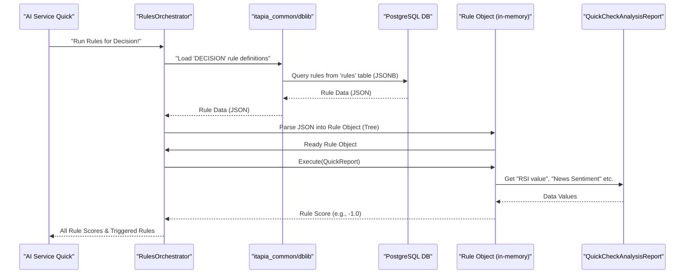

# Chapter 5: Rule Engine (Symbolic Expression Trees)

In [Chapter 4: Analysis Modules](04_analysis_modules_.md), we learned how ITAPIA's specialized "intelligence units" process raw market data and generate a comprehensive `QuickCheckAnalysisReport`. This report is full of valuable "evidence" – things like RSI values, news sentiment scores, and forecasted price movements. But simply having evidence isn't enough; ITAPIA needs to use this evidence to make intelligent investment recommendations, and crucially, explain *why* it made them.

### What Problem Does the Rule Engine Solve?

Imagine ITAPIA as a wise financial advisor. [Analysis Modules](04_analysis_modules_.md) are like the research team, providing all the facts and figures. Now, the advisor needs to synthesize these facts into clear advice: "Should I buy Apple stock?" or "Is this a risky investment?"

Traditional AI models might give a "Buy" or "Sell" signal, but often, they are "black boxes." You get the answer, but you don't understand the reasoning. This lack of transparency erodes trust.

This is the problem our **Rule Engine** solves. Think of it as ITAPIA's **"glass box" brain**. Instead of a mysterious "black box" AI, the Rule Engine makes decisions based on transparent, understandable logic. It's like having a detailed recipe that shows exactly how each "ingredient" from the `QuickCheckAnalysisReport` is combined to form the final "dish" – a clear investment recommendation.

The core idea is to build rules from simple, recognizable pieces that reveal the "why" behind every recommendation, empowering you to understand ITAPIA's thinking.

### The Core Concept: Symbolic Expression Trees

At the heart of the Rule Engine are **Symbolic Expression Trees**. This sounds complicated, but it's really just a fancy name for building rules like you build a mathematical equation or a sentence, using distinct "building blocks."

Imagine you're building with special LEGO bricks:

1.  **Variables (VarNode): The "Facts" Bricks**
    *   These bricks represent pieces of data that come *from* the `QuickCheckAnalysisReport` (our "evidence"). They are not fixed; their values change depending on the stock and the market.
    *   Examples: "RSI value" (e.g., 65), "News Sentiment Score" (e.g., 0.7), "Mid-term Trend Direction" (e.g., 'Uptrend').
    *   They are called `VarNode`s (Variable Nodes).

2.  **Constants (ConstantNode): The "Fixed Number" Bricks**
    *   These are bricks with fixed, unchanging numerical values.
    *   Examples: "70" (for an RSI overbought threshold), "0.5" (a neutral score).
    *   They are called `ConstantNode`s.

3.  **Operators (OperatorNode): The "Action" Bricks**
    *   These bricks perform actions or operations on other bricks connected to them. They can be mathematical (add, subtract), comparison (greater than, equal to), or logical (AND, OR, IF-THEN-ELSE).
    *   Examples: "greater than", "add", "multiply", "IF...THEN...ELSE...".
    *   They are called `OperatorNode`s.

#### Building a "Tree"

When you connect these `VarNode`s, `ConstantNode`s, and `OperatorNode`s together, you form a "tree" structure. Each `OperatorNode` has "children" (its inputs), and it uses their values to produce its own output. The very top `OperatorNode` is called the "root" of the tree, and its final output is the score for the entire rule.

**Key Features of these Trees:**

*   **Continuous Score Output**: Unlike simple True/False decisions, each rule outputs a continuous numerical score (e.g., from -1.0 to 1.0). This allows for nuanced recommendations and lets ITAPIA understand the *strength* of a signal, not just its presence. For example, a "Buy" rule might output `0.9` for a strong signal or `0.2` for a weak one.
*   **Transparent Reasoning**: Because each part of the tree is an understandable variable, constant, or operation, the entire logic of the rule can be explicitly explained. This is crucial for ITAPIA's transparency and links directly to our [Explainer Framework](07_explainer_framework_.md) in a later chapter.

### How ITAPIA Uses Rules: A Simple Example

Let's look at a simple rule that checks if the RSI (Relative Strength Index) is "overbought" (meaning the stock might be due for a pullback).

**Rule Logic:** *If the RSI value is greater than 70, then the score is -1.0 (indicating a potential sell signal), otherwise the score is 0.0 (neutral).*

This rule will live inside a `Rule` object (defined in `itapia_common/rules/rule.py`). This `Rule` object has a `.execute()` method that takes the `QuickCheckAnalysisReport` as input and gives you back a numerical score.

```python
# Simplified example of a Rule object and its execution
from itapia_common.rules.rule import Rule
from itapia_common.schemas.entities.analysis import QuickCheckAnalysisReport
from itapia_common.rules.nodes.registry import create_node # Our "Node Factory"
from itapia_common.rules import names as nms # Shortcut for Node Names

# Imagine our QuickCheckAnalysisReport has an RSI value
# In real life, this comes from Chapter 4's Analysis Modules
dummy_report = QuickCheckAnalysisReport(
    ticker="AAPL",
    technical_report={"daily_report": {"RSI_14": 75.0}},
    # ... other parts of report not relevant for this rule
)

# --- Building the Rule's Logic Tree (The "Recipe") ---
# Logic: IF RSI_14 > CONST_RSI_OVERBOUGHT THEN -1.0 ELSE 0.0

# 1. Get the RSI_14 value (VarNode)
rsi_var = create_node(nms.VAR_D_RSI_14)

# 2. Get the Overbought Constant (ConstantNode)
rsi_overbought_const = create_node(nms.CONST_RSI_OVERBOUGHT) # This represents 70.0

# 3. Create a "Greater Than" operator (OperatorNode)
condition = create_node(nms.OPR_GT, children=[rsi_var, rsi_overbought_const])

# 4. Create Constant scores for THEN (-1.0) and ELSE (0.0)
sell_score = create_node(nms.CONST_NUM(-1.0))
neutral_score = create_node(nms.CONST_NUM(0.0))

# 5. Create the "If-Then-Else" operator (BranchOperatorNode)
# This is the "root" of our logic tree
logic_root = create_node(
    nms.OPR_IF_THEN_ELSE,
    children=[condition, sell_score, neutral_score]
)

# --- Create the full Rule object ---
rsi_overbought_rule = Rule(
    rule_id="RSI_OVERBOUGHT_SIGNAL",
    name="RSI Overbought Signal",
    description="Scores -1 if RSI > 70, else 0.",
    root=logic_root # The logic tree is the brain of the rule
)

# --- Execute the Rule ---
# This is where the magic happens: the rule "reads" the report and calculates its score
score = rsi_overbought_rule.execute(dummy_report)
print(f"RSI Overbought Rule Score: {score}")

# If RSI was 60.0 (not overbought), the score would be 0.0
dummy_report_not_overbought = QuickCheckAnalysisReport(
    ticker="AAPL", technical_report={"daily_report": {"RSI_14": 60.0}},
)
score_not_overbought = rsi_overbought_rule.execute(dummy_report_not_overbought)
print(f"RSI Not Overbought Rule Score: {score_not_overbought}")
```
**Explanation:**
1.  We define our "evidence" (a `dummy_report` with an RSI of 75.0).
2.  We use `create_node()` (our "Node Factory" which we'll discuss soon) to build the parts of our rule: a `VarNode` for RSI, `ConstantNode`s for numbers like 70, -1.0, and 0.0.
3.  We connect these parts using `OperatorNode`s like "Greater Than" (`OPR_GT`) and "If-Then-Else" (`OPR_IF_THEN_ELSE`). This forms our Symbolic Expression Tree.
4.  Finally, we wrap this entire logic tree inside a `Rule` object.
5.  When `rsi_overbought_rule.execute(dummy_report)` is called, the `Rule` object traverses its tree. It gets the RSI value from the `report`, compares it to 70, and based on the result, returns either -1.0 or 0.0. In our example, 75 > 70, so the score is -1.0.

This simple example shows how ITAPIA uses these transparent logic trees to turn analysis data into meaningful scores.

### Under the Hood: The Rule Engine's Inner Workings

Let's peek behind the curtain to see how these Symbolic Expression Trees are built and executed.

#### The Overall Flow of Rules Execution

When the `AI Service Quick` needs to make a recommendation, it relies on the `RulesOrchestrator` to manage and run various rules.


**Explanation:**
1.  The `AI Service Quick` (our main brain) asks the `RulesOrchestrator` to run a set of rules (e.g., all "Decision" rules).
2.  The `RulesOrchestrator` doesn't store rules directly; it asks `itapia_common/dblib` (our data manager from [Chapter 3: Data Persistence & Caching](03_data_persistence___caching_.md)) to load the rule definitions from the `PostgreSQL` database. These rule definitions are stored as flexible `JSONB` data.
3.  Once the `RulesOrchestrator` gets the rule data (as JSON), it "parses" each JSON definition into a living, breathing `Rule` object (including its Symbolic Expression Tree) in the computer's memory.
4.  For each `Rule` object, the `RulesOrchestrator` calls its `.execute()` method, passing in the `QuickCheckAnalysisReport` (our "evidence" from [Chapter 4: Analysis Modules](04_analysis_modules_.md)).
5.  The `Rule` object's internal tree then works its magic: it retrieves the necessary data from the `QuickCheckAnalysisReport` and performs all the operations.
6.  Finally, the `Rule` object returns its calculated score, and the `RulesOrchestrator` collects all these scores to pass back to `AI Service Quick`.

#### The `Rule` Class: The Rule Container

The `Rule` class (`backend/shared/itapia_common/rules/rule.py`) is like a folder that holds everything about a single rule: its unique ID, name, description, and most importantly, its `root` node (the very top `OperatorNode` of its expression tree).

```python
# Simplified from backend/shared/itapia_common/rules/rule.py
from itapia_common.rules.nodes import OperatorNode # Important: root must be an OperatorNode
from itapia_common.schemas.entities.analysis import QuickCheckAnalysisReport

class Rule:
    def __init__(self, root: OperatorNode, name: str = "Untitled Rule", **kwargs):
        if not isinstance(root, OperatorNode):
            raise TypeError("Root of a rule must be an OperatorNode.")
        self.name = name
        self.root = root # This is the Symbolic Expression Tree!
        # ... (other metadata like rule_id, description, version) ...

    def execute(self, report: QuickCheckAnalysisReport) -> float:
        """Execute the rule's logic tree and return the score."""
        # The 'root' node handles the actual recursive evaluation
        return self.root.evaluate(report)

    # @classmethod
    # def from_entity(cls, data: RuleEntity) -> 'Rule': # Converts stored JSON to Rule object
    #    # ... uses parse_tree to re-create the tree ...

    # def to_entity(self): # Converts Rule object to JSON for storage
    #    # ... uses serialize_tree to turn tree into JSON ...
```
**Explanation:** The `Rule` class is a high-level wrapper. When you call `rule.execute(report)`, it simply tells its `root` node to `evaluate()` itself with the given `report`. The complexity of traversing the tree happens internally within the `_TreeNode` objects. The `from_entity` and `to_entity` methods (conceptually mentioned here) are what allow rules to be saved to and loaded from our database as `JSONB` data ([Chapter 3: Data Persistence & Caching](03_data_persistence___caching_.md)).

#### The `_TreeNode` Hierarchy: The Building Blocks Come Alive

All the "bricks" in our Rule Engine inherit from a base class `_TreeNode` (`backend/shared/itapia_common/rules/nodes/_nodes.py`). Each type of node knows how to `evaluate()` itself.

1.  **`ConstantNode` (The "Fixed Number" Brick)**:
    It simply holds a value and returns it.

    ```python
    # Simplified from backend/shared/itapia_common/rules/nodes/_nodes.py
    from itapia_common.schemas.enums import SemanticType, NodeType

    class ConstantNode:
        def __init__(self, node_name: str, description: str, return_type: SemanticType, value: float):
            self.node_name = node_name
            self.description = description
            self.return_type = return_type # What kind of value this constant represents
            self.value = value

        def evaluate(self, report):
            """Just return the stored value."""
            return self.value
    ```
    **Explanation:** A `ConstantNode` is the simplest brick. When asked to `evaluate()`, it just gives you its `value`. It also has a `return_type` (like `SemanticType.NUMERICAL` or `SemanticType.PRICE`) which is crucial for the [Semantic Type System (STGP)](02_semantic_type_system__stgp__.md).

2.  **`VarNode` (The "Fact" Brick)**:
    This node's job is to fetch a specific piece of data from the `QuickCheckAnalysisReport` using a `path` (like `"technical_report.daily_report.RSI_14"`).

    ```python
    # Simplified from backend/shared/itapia_common/rules/nodes/_nodes.py
    from itapia_common.schemas.entities.analysis import QuickCheckAnalysisReport

    class VarNode:
        def __init__(self, node_name: str, description: str, return_type: SemanticType, path: str):
            self.node_name = node_name
            self.description = description
            self.return_type = return_type # e.g., SemanticType.MOMENTUM
            self.path = path # e.g., "technical_report.daily_report.RSI_14"

        def _get_raw_value_from_report(self, report: QuickCheckAnalysisReport):
            """Internal helper to safely get value from nested report using its path."""
            keys = self.path.split('.')
            value = report
            for key in keys: # Traverses the report object
                value = getattr(value, key) # Gets the attribute
            return value

        def evaluate(self, report: QuickCheckAnalysisReport) -> float:
            raw_value = self._get_raw_value_from_report(report)
            # In the real system, raw_value is then 'encoded' (normalized)
            # based on its semantic type (e.g., RSI 0-100 to -1 to 1)
            return raw_value # Simplified for tutorial
    ```
    **Explanation:** When a `VarNode` evaluates, it uses its `path` to dig into the `QuickCheckAnalysisReport` and pull out the relevant data (e.g., the RSI value). In the full system, this raw value is then `encoded` (normalized) into a standard numerical range (like -1 to 1) to make it easier for operators to work with.

3.  **`OperatorNode` (The "Action" Brick)**:
    This is where the actual logic happens. An `OperatorNode` takes its "children" (other nodes) as input, evaluates them, and then performs its specific operation.

    ```python
    # Simplified from backend/shared/itapia_common/rules/nodes/_nodes.py
    from typing import List

    class OperatorNode:
        def __init__(self, node_name: str, description: str, num_child: int,
                     return_type: SemanticType, args_type: List[SemanticType], children: List = []):
            self.node_name = node_name
            self.description = description
            self.num_child = num_child # How many children it expects
            self.return_type = return_type # What type of value it produces
            self.args_type = args_type # What types its children should be (for STGP)
            self.children = children

        def evaluate(self, report):
            # First, evaluate all its children recursively
            child_results = [child.evaluate(report) for child in self.children]
            # Then, perform its specific operation on those results
            # This part differs for each specific operator (Add, GreaterThan, etc.)
            return sum(child_results) # Simplified: just sums them all

    # Example of a specific operator (GreaterThan)
    class FunctionalOperatorNode(OperatorNode): # This type handles math/logic functions
        def __init__(self, node_name: str, description: str, num_child: int,
                     return_type: SemanticType, args_type: List[SemanticType],
                     opr_func, children: List = []):
            super().__init__(node_name, description, num_child, return_type, args_type, children)
            self.opr_func = opr_func # The actual Python function (e.g., operator.gt)

        def evaluate(self, report):
            child_results = [child.evaluate(report) for child in self.children]
            # Convert boolean (True/False) to float (1.0/0.0)
            return float(self.opr_func(*child_results))

    # Example of a Branch operator (IF-THEN-ELSE)
    class BranchOperatorNode(OperatorNode):
        def __init__(self, node_name: str, description: str,
                     return_type: SemanticType, args_type: List[SemanticType], children: List = []):
            super().__init__(node_name, description, num_child=3, return_type=return_type, args_type=args_type, children=children)

        def evaluate(self, report):
            condition_result = self.children[0].evaluate(report)
            if condition_result > 0: # If condition is True (1.0)
                return self.children[1].evaluate(report) # Evaluate the 'THEN' branch
            else:
                return self.children[2].evaluate(report) # Evaluate the 'ELSE' branch
    ```
    **Explanation:** The `OperatorNode` is the core of the tree's calculation. When it `evaluate`s, it first recursively calls `evaluate()` on all its `children` to get their values. Then, it applies its specific operation. For example, a `GreaterThan` operator (like in our RSI rule) would compare its two child values and return `1.0` (True) or `0.0` (False). A `BranchOperatorNode` (`IF-THEN-ELSE`) checks its first child (the condition) and then evaluates either the second (THEN) or third (ELSE) child. The `return_type` and `args_type` attributes are vital for the [Semantic Type System (STGP)](02_semantic_type_system__stgp__.md), ensuring we don't try to add a stock price to news sentiment!

#### The "Node Factory" and Persistence

How does ITAPIA create these nodes and save them?

1.  **Node Registry (`backend/shared/itapia_common/rules/nodes/registry.py`)**:
    This is like a "catalog" of all available `VarNode`s, `ConstantNode`s, and `OperatorNode`s. When ITAPIA starts, all these pre-defined "bricks" are registered here with their names, descriptions, and crucial type information (`return_type`, `args_type`).

2.  **`create_node()` (Node Factory)**:
    This special function is the *only* way to create a node. Instead of directly calling `ConstantNode()`, you call `create_node("CONST_RSI_OVERBOUGHT")`. This factory uses the `Node Registry` to look up the correct "blueprint" and create the node, ensuring all its properties (like semantic types) are correctly set. This is important for the [Semantic Type System (STGP)](02_semantic_type_system__stgp__.md).

    ```python
    # Simplified from backend/shared/itapia_common/rules/nodes/registry.py
    from typing import NamedTuple, Dict, Any, Type
    from itapia_common.schemas.enums import SemanticType, NodeType
    from ._nodes import _TreeNode

    class NodeSpec(NamedTuple): # A "blueprint" for a node
        node_class: Type[_TreeNode]
        description: str
        node_type: NodeType
        return_type: SemanticType
        args_type: List[SemanticType]|None = None # Only for operators

    _NODE_REGISTRY: Dict[str, NodeSpec] = {} # Our global catalog

    def create_node(node_name: str, **kwargs) -> _TreeNode:
        """
        The factory function: creates a Node instance from its registered name.
        Uses the NodeSpec to ensure correct types and parameters.
        """
        spec = _NODE_REGISTRY.get(node_name.upper())
        if spec is None:
            raise ValueError(f"Node '{node_name}' not found in registry.")

        # The factory uses 'spec' to provide fixed parameters
        # and 'kwargs' for dynamic ones (like 'children' for OperatorNodes)
        final_params = {
            'node_name': node_name,
            'description': spec.description,
            'return_type': spec.return_type,
            'args_type': spec.args_type # Passed to operator nodes
        }
        final_params.update(kwargs) # Add dynamic parameters like 'children'
        return spec.node_class(**final_params) # Creates the actual node!
    ```
    **Explanation:** The `create_node` function is like asking a LEGO factory to build you a specific brick by its name. It ensures the brick is correctly assembled with all its properties, including the `return_type` and `args_type` that make STGP work.

3.  **`parser.py` (Serialization & Parsing)**:
    Rules are not always in memory. They need to be saved to and loaded from the database ([Chapter 3: Data Persistence & Caching](03_data_persistence___caching_.md)). This is where `serialize_tree` and `parse_tree` come in.
    *   `serialize_tree`: Takes a live `_TreeNode` (and its children) and converts it into a simple dictionary structure (which can be saved as `JSONB` in PostgreSQL).
    *   `parse_tree`: Takes a dictionary (read from `JSONB`) and uses the `create_node()` factory to rebuild the entire `_TreeNode` object and its children in memory.

#### Built-in Rules: ITAPIA's Pre-wired Brain

ITAPIA comes with a set of pre-defined, expert-crafted rules. These are stored in `backend/shared/itapia_common/rules/builtin/_decision_rules.py`. Each function in this file creates a specific `Rule` object by assembling its Symbolic Expression Tree using `create_node()`.

```python
# Simplified example from backend/shared/itapia_common/rules/builtin/_decision_rules.py
from itapia_common.rules import names as nms
from itapia_common.rules.nodes.registry import create_node
from itapia_common.rules.rule import Rule

def _create_rule_7_mean_reversion_fading() -> Rule:
    """
    [7] Mean Reversion: Sell signal if RSI overbought, buy signal if oversold.
    Logic: IF RSI > 70 THEN -1.0 ELSE (IF RSI < 30 THEN 1.0 ELSE 0.0)
    """
    # Build the logic tree using our node factory
    cond_overbought = create_node(nms.OPR_GT, children=[
        create_node(nms.VAR_D_RSI_14),
        create_node(nms.CONST_RSI_OVERBOUGHT) # Represents 70.0
    ])

    cond_oversold = create_node(nms.OPR_LT, children=[
        create_node(nms.VAR_D_RSI_14),
        create_node(nms.CONST_RSI_OVERSOLD) # Represents 30.0
    ])

    # Inner IF: IF RSI < 30 THEN 1.0 ELSE 0.0
    inner_if = create_node(nms.OPR_IF_THEN_ELSE, children=[
        cond_oversold,
        create_node(nms.CONST_NUM(1.0)), # Buy score
        create_node(nms.CONST_NUM(0.0))  # Neutral score
    ])

    # Outer IF: IF RSI > 70 THEN -1.0 ELSE (inner_if result)
    logic_tree_root = create_node(nms.OPR_IF_THEN_ELSE, children=[
        cond_overbought,
        create_node(nms.CONST_NUM(-1.0)), # Sell score
        inner_if
    ])

    return Rule(
        rule_id="RULE_D_07_MEAN_REVERSION_FADE",
        name="Mean Reversion Fading",
        description="Generates a contrarian signal based on RSI overbought/oversold levels.",
        root=logic_tree_root
    )
```
**Explanation:** This snippet demonstrates how a more complex rule is assembled programmatically. It shows how `create_node()` is used to build nested operators (`OPR_GT`, `OPR_LT`, `OPR_IF_THEN_ELSE`) and combine them with `VarNode`s (like `VAR_D_RSI_14`) and `ConstantNode`s to form the final `logic_tree_root` for the `Rule`. These `builtin_decision_rules` are the initial "knowledge" that ITAPIA uses.

### Benefits of the Rule Engine (Symbolic Expression Trees)

By using this powerful Rule Engine, ITAPIA gains significant advantages:

| Feature                   | Benefit                                                                                                        |
| :------------------------ | :------------------------------------------------------------------------------------------------------------- |
| **Transparency (Glass Box)** | Logic is built from understandable components, allowing users to see and explain "why" a recommendation was made. |
| **Expressive Power**      | Can represent complex mathematical formulas and logical conditions, not just simple if/else branches.             |
| **Continuous Scoring**    | Rules output nuanced scores (e.g., -1.0 to 1.0), indicating strength of signals, enabling sophisticated aggregation. |
| **Type Safety**           | Thanks to [Semantic Type System (STGP)](02_semantic_type_system__stgp__.md), illogical rules (e.g., adding a price to a sentiment) are prevented. |
| **Evolvability**          | The tree structure and clear definition of nodes make it ideal for future "Evo-worker" (Genetic Programming) to automatically discover new, effective rules. |
| **Maintainability**       | Rules are self-contained and modular, making it easier to manage and update them.                              |

### Summary

In this chapter, we explored ITAPIA's **Rule Engine**, the "glass box" brain that provides transparent and explainable investment recommendations. We learned:

*   **Problem Solved**: The Rule Engine provides clear, understandable reasoning for AI outputs, unlike "black box" systems.
*   **Symbolic Expression Trees**: Rules are built like mathematical equations using "LEGO bricks": `VarNode`s (facts from analysis reports), `ConstantNode`s (fixed numbers), and `OperatorNode`s (actions like `greater than` or `add`).
*   **Continuous Scores**: Rules output numerical scores that indicate the *strength* of a signal, allowing for nuanced recommendations.
*   **Internal Workings**: We saw how `Rule` objects container these trees, how nodes like `ConstantNode`, `VarNode`, and `OperatorNode` evaluate themselves, and how a "Node Factory" (`create_node()`) combined with `parser.py` helps manage and persist these rules.
*   **Benefits**: Transparency, expressive power, continuous scoring, type safety, and evolvability are key advantages.

Now that we understand how ITAPIA uses these intelligent rules to generate recommendations, the next step is to explore how these recommendations can be tailored to *your* specific needs and preferences. This leads us to [Chapter 6: User Profiles & Personalization](06_user_profiles___personalization_.md).

---

<sub><sup>Generated by [AI Codebase Knowledge Builder](https://github.com/The-Pocket/Tutorial-Codebase-Knowledge).</sup></sub> <sub><sup>**References**: [[1]](https://github.com/triet4p/itapia/blob/5d35c08e0ff059435cc497af3e4d25f0eb1eba5c/README.md), [[2]](https://github.com/triet4p/itapia/blob/5d35c08e0ff059435cc497af3e4d25f0eb1eba5c/backend/ai_service_quick/app/rules/explainer/orchestrator.py), [[3]](https://github.com/triet4p/itapia/blob/5d35c08e0ff059435cc497af3e4d25f0eb1eba5c/backend/shared/itapia_common/rules/builtin/_decision_rules.py), [[4]](https://github.com/triet4p/itapia/blob/5d35c08e0ff059435cc497af3e4d25f0eb1eba5c/backend/shared/itapia_common/rules/nodes/_nodes.py), [[5]](https://github.com/triet4p/itapia/blob/5d35c08e0ff059435cc497af3e4d25f0eb1eba5c/backend/shared/itapia_common/rules/nodes/registry.py), [[6]](https://github.com/triet4p/itapia/blob/5d35c08e0ff059435cc497af3e4d25f0eb1eba5c/backend/shared/itapia_common/rules/parser.py), [[7]](https://github.com/triet4p/itapia/blob/5d35c08e0ff059435cc497af3e4d25f0eb1eba5c/backend/shared/itapia_common/rules/rule.py), [[8]](https://github.com/triet4p/itapia/blob/5d35c08e0ff059435cc497af3e4d25f0eb1eba5c/doc/public/itapia-mvp-v2.0.md)</sup></sub>