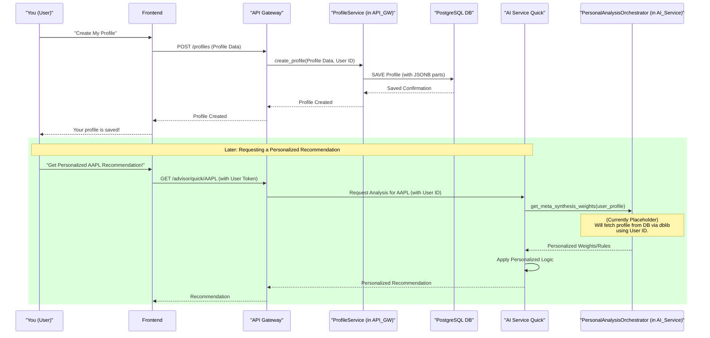

# Chapter 6: User Profiles & Personalization

In [Chapter 5: Rule Engine (Symbolic Expression Trees)](05_rule_engine__symbolic_expression_trees__.md), we learned how ITAPIA uses smart, transparent rules to make investment recommendations. These rules provide clear reasoning, but here's a thought: What if *your* investment goals are different from someone else's? What if you're very cautious, but ITAPIA's rules suggest something aggressive?

### The Problem: One-Size-Fits-All Advice Doesn't Fit All

Imagine ITAPIA is a skilled financial advisor. Its [Analysis Modules](04_analysis_modules_.md) provide all the facts, and its [Rule Engine](05_rule_engine__symbolic_expression_trees__.md) applies smart logic. But even the best advice needs to be tailored. Just like a personal tailor takes your measurements to create a perfectly fitting suit, ITAPIA needs to understand *your* unique investment style.

*   Are you okay with high risks for potentially big gains, or do you prefer slow and steady growth?
*   Are you investing for retirement decades away, or for a down payment next year?
*   How would you react if the market suddenly dropped 20%?

Generic investment advice isn't genuinely helpful because everyone's situation and preferences are different.

### The Solution: User Profiles & Personalization

This is where **User Profiles & Personalization** comes in. Think of this system as ITAPIA's **"personal tailor"**. It allows you to create a detailed digital profile outlining your unique investment philosophy. This profile then becomes a crucial guide for ITAPIA, enabling it to:

*   **Store Your Preferences:** Keep a record of your risk tolerance, investment goals, experience level, and other personal preferences.
*   **Tailor the Advice:** In the future, this information will dynamically adjust how ITAPIA's AI weighs different factors in its recommendations, ensuring the advice is not generic but genuinely aligned with *your* unique needs.

The core idea is to move from a "one-size-fits-all" approach to a **highly personalized investment experience.**

### What is a User Profile?

A "User Profile" in ITAPIA is a structured collection of data that describes your investment identity. It's built using `Pydantic` models (just like our `schemas` in [Chapter 1: Shared Library (itapia_common)](01_shared_library__itapia_common__.md)) to ensure all profile data is consistent and well-defined.

Here are the key parts of a user profile:

*   **Risk Tolerance (`RiskTolerancePart`):** How much risk are you comfortable with? (e.g., `conservative`, `aggressive`). How do you react to losses? (e.g., `panic_sell`, `buy_the_dip`).
*   **Investment Goals (`InvestGoalPart`):** What's your main objective? (e.g., `capital_growth`, `income_generation`). What's your investment timeframe? (e.g., `short_term`, `long_term`). What annual return do you expect?
*   **Knowledge & Experience (`KnowledgeExpPart`):** How much do you know about investing? How many years have you been investing?
*   **Capital & Income (`CapitalIncomePart`):** How much capital are you starting with? How much do you depend on investment income?
*   **Personal Preferences (`PersonalPreferPart`):** Do you prefer certain industries? Are there any sectors you want to avoid? Are you interested in ethical (ESG) investing?

These parts are organized within a main `ProfileBase` schema, which is extended to create what we call a `ProfileEntity` (the full profile stored in our database).

```python
# Simplified from backend/shared/itapia_common/schemas/entities/profiles.py

from pydantic import BaseModel, Field
from typing import Literal, Optional
from datetime import datetime

# A small piece of your profile: How you feel about risk
class RiskTolerancePart(BaseModel):
    risk_appetite: Literal["conservative", "moderate", "aggressive"]
    loss_reaction: Literal["hold_and_wait", "buy_the_dip"]

# Another piece: Your investment goals
class InvestGoalPart(BaseModel):
    primary_goal: Literal["capital_growth", "income_generation"]
    investment_horizon: Literal["mid_term", "long_term"]
    expected_annual_return_pct: int

# The full blueprint for a profile in our system
class ProfileEntity(BaseModel):
    profile_id: str
    user_id: str
    profile_name: str
    description: str
    risk_tolerance: RiskTolerancePart  # Our risk piece
    invest_goal: InvestGoalPart      # Our goal piece
    # ... other parts like KnowledgeExpPart, CapitalIncomePart ...
    created_at: datetime
    updated_at: datetime
```
This code defines the structure of a user's investment profile. Notice how smaller `BaseModel`s (like `RiskTolerancePart`) are nested inside the larger `ProfileEntity`. This helps keep the data organized and reusable.

### How it Works: Managing Your Profile

Let's trace how you, as a user, would create and manage your investment profile in ITAPIA.

#### 1. Creating a New Profile

When you first use ITAPIA, you might want to tell it about your investment style. This happens through the `API Gateway`, which handles all communication between you (the user interface) and ITAPIA's brain.

```python
# Simplified example of creating a profile via API Gateway

# This is what you would send to the API
from itapia_common.schemas.api.profiles import ProfileCreateRequest

profile_data = ProfileCreateRequest(
    profile_name="My Balanced Portfolio",
    description="A profile for moderate growth with some income.",
    risk_tolerance={
        "risk_appetite": "moderate",
        "loss_reaction": "hold_and_wait"
    },
    invest_goal={
        "primary_goal": "capital_growth",
        "investment_horizon": "mid_term",
        "expected_annual_return_pct": 10
    },
    # ... other parts of the profile
)

# In the background, your browser (Frontend) sends this data
# to the API Gateway's /profiles endpoint.
# The API Gateway then talks to its ProfileService to save it.

# Expected output from the API: a full ProfileResponse object
print("Profile created successfully! ITAPIA knows your preferences.")
```
When you send this data to the `API Gateway` (specifically the `POST /profiles` endpoint), it works like this:

1.  Your request arrives at the `API Gateway`.
2.  The `API Gateway` checks if you're logged in (`current_user_dep`).
3.  It then uses `get_profile_service()` to get a special "Profile Manager" (`ProfileService`).
4.  The `ProfileService` takes your `profile_data`, adds your `user_id`, and saves it to the `PostgreSQL` database.
5.  Finally, the `API Gateway` sends back a confirmation, including the new `profile_id`.

#### 2. Using Your Profile for Personalization (The Future)

Once your profile is saved, ITAPIA can use it to tailor its advice. In the current version of ITAPIA, the mechanism is set up, but the dynamic adjustment of AI behavior based on every profile detail is a future enhancement (marked as a "placeholder" in the code). However, the architecture is ready!

The component responsible for applying personalization is the `PersonalAnalysisOrchestrator` within the `AI Service Quick`. This "Orchestrator" will act like the "personal tailor" for the AI.

```python
# Simplified from backend/ai_service_quick/app/personal/orchestrator.py

from typing import List, Dict, Callable, Any
from itapia_common.rules.rule import Rule

class PersonalAnalysisOrchestrator:
    """
    Acts as the 'Personalization Expert' for ITAPIA.
    Provides configurations (weights, rule selectors) based on user profiles.
    """
    def __init__(self):
        # Default weights for now
        self._default_meta_weights = {"decision": 1.0, "risk": 0.15, "opportunity": 0.05}

    def get_meta_synthesis_weights(self, user_profile: Any = None) -> Dict[str, float]:
        """
        [PLACEHOLDER] Retrieves the weights for the final recommendation.
        In the future, 'user_profile' will dynamically change these weights.
        """
        if user_profile:
            # Example: If user_profile.risk_tolerance == "conservative",
            # reduce 'decision' weight and increase 'risk' weight.
            pass
        return self._default_meta_weights

    def get_rule_selector(self, user_profile: Any = None) -> Callable[[List[Rule]], List[Rule]]:
        """
        [PLACEHOLDER] Returns a function to select specific rules.
        In the future, 'user_profile' will filter or prioritize rules.
        """
        if user_profile:
            # Example: If user_profile.investment_horizon == "short_term",
            # only select rules relevant for short-term trading.
            pass
        return lambda rules: rules[:7] # Currently returns top 7 rules by default
```
**Explanation:**
*   The `PersonalAnalysisOrchestrator` has methods like `get_meta_synthesis_weights` and `get_rule_selector`.
*   These methods are designed to take a `user_profile` as input.
*   In the future, based on your profile (e.g., if you are risk-averse), `get_meta_synthesis_weights` could change the importance given to `risk` rules versus `decision` rules. Similarly, `get_rule_selector` could pick only certain rules from the [Rule Engine](05_rule_engine__symbolic_expression_trees__.md) that match your investment horizon.
*   Currently, they return default values, but the foundation for dynamic personalization is in place.

### Under the Hood: How Profiles are Managed and Used

Let's peek at the inner workings of user profiles.

#### Where are Profiles Stored?

User profiles are stored in our `PostgreSQL` database. We learned in [Chapter 3: Data Persistence & Caching](03_data_persistence___caching_.md) that PostgreSQL is our reliable, long-term archive.

Crucially, the complex parts of your profile (like `RiskTolerancePart` or `InvestGoalPart`) are stored using PostgreSQL's **`JSONB`** feature. This allows ITAPIA to save nested, flexible data structures directly within a single database column, making it easy to store and retrieve all the details of your profile without complex table designs.

#### Who Manages Profiles?

The `API Gateway` is solely responsible for managing user profiles (creating, reading, updating, deleting). This ensures that profile data is secure and that only authorized users (you!) can modify your own profiles. Other services, like `AI Service Quick`, cannot directly change profile data; they can only *read* it.

Let's see the main components involved:

1.  **`api-gateway/app/api/v1/endpoints/profiles.py` (The API Endpoint):**
    This file defines the web addresses (endpoints) that the frontend uses to talk to the profile system.

    ```python
    # Simplified from backend/api_gateway/app/api/v1/endpoints/profiles.py
    from fastapi import APIRouter, Depends, HTTPException, status
    from app.dependencies import get_profile_service, get_current_user_dep
    from itapia_common.schemas.api.profiles import ProfileCreateRequest, ProfileResponse
    from itapia_common.schemas.entities.users import UserEntity # Your user info
    from app.services.profiles import ProfileService

    router = APIRouter()

    @router.post("/profiles", response_model=ProfileResponse, status_code=status.HTTP_201_CREATED, tags=['User Profiles'])
    def create_user_profile(
        profile_in: ProfileCreateRequest,
        profile_service: ProfileService = Depends(get_profile_service), # Our Profile Manager
        current_user: UserEntity = Depends(get_current_user_dep) # Your user ID
    ):
        """Creates a new investment profile."""
        try:
            # profile_service handles the saving to DB
            created_profile = profile_service.create_profile(
                profile_in=profile_in, # The data you sent
                user_id=current_user.user_id # Your ID
            )
            return created_profile # Return the saved profile info
        except Exception as e:
            raise HTTPException(status_code=status.HTTP_500_INTERNAL_SERVER_ERROR, detail=str(e))

    # Other functions for get, update, delete would be here
    ```
    **Explanation:** This code snippet shows how a `POST` request to `/profiles` is handled. It takes `profile_in` (your profile data), gets your `user_id` (from `current_user`), and then passes it all to the `ProfileService` to handle the actual database saving.

2.  **`api-gateway/app/services/profiles.py` (`ProfileService`):**
    This class contains the actual business logic for managing profiles. It knows how to talk to the database.

    ```python
    # Simplified from backend/api_gateway/app/services/profiles.py
    import uuid
    import json
    from sqlalchemy.orm import Session
    from pydantic import BaseModel
    from app.crud import profiles as profile_crud # Talks directly to the database
    from itapia_common.schemas.entities.profiles import ProfileCreate, ProfileEntity

    class ProfileService:
        def __init__(self, db_session: Session):
            self.db = db_session # Our database connection

        def _convert_parts_to_json_string(self, data: BaseModel):
            """Helper to convert nested Pydantic objects into JSON strings for JSONB columns."""
            dump = data.model_dump(exclude_unset=True)
            for key, value in dump.items():
                if isinstance(value, dict): # If it's a nested Pydantic part (like RiskTolerancePart)
                    dump[key] = json.dumps(value) # Convert it to JSON string
            return dump

        def create_profile(self, *, profile_in: ProfileCreate, user_id: str) -> ProfileEntity:
            profile_id = uuid.uuid4().hex # Generate a unique ID for the profile

            # Convert parts like risk_tolerance into JSON strings for the DB
            profile_data_to_db = self._convert_parts_to_json_string(profile_in)
            profile_data_to_db["profile_id"] = profile_id
            profile_data_to_db["user_id"] = user_id

            created_row = profile_crud.create(self.db, profile_data=profile_data_to_db)
            return ProfileEntity.model_validate(created_row) # Convert DB row back to Pydantic object
    ```
    **Explanation:** The `ProfileService` is where the detailed work happens.
    *   `_convert_parts_to_json_string`: This is a crucial helper that takes the structured Pydantic profile data and converts the nested parts (like `risk_tolerance`) into flat JSON strings. This is necessary because `JSONB` columns in PostgreSQL expect JSON data.
    *   `create_profile`: This method generates a unique ID, prepares the data for the database using `_convert_parts_to_json_string`, and then calls `profile_crud.create` to save it. `profile_crud` is the lowest layer that directly talks SQL to the database.

#### Data Flow: Personalization in Action

Here's how User Profiles fit into the overall ITAPIA data flow when an AI recommendation is being generated:


**Explanation:**
1.  **Profile Creation (Top part of diagram):** You interact with the `Frontend` to create your profile. This sends data to the `API Gateway`, which uses the `ProfileService` to save it securely in `PostgreSQL`.
2.  **Personalized Recommendation (Bottom part of diagram):**
    *   Later, when you request a recommendation for AAPL, the `API Gateway` routes your request (along with your `user_id`) to the `AI Service Quick`.
    *   The `AI Service Quick` (specifically its `PersonalAnalysisOrchestrator`) will then ask for *your* specific profile details. (Currently, this part of the code is a "placeholder" and returns default values, but the architecture means it *can* fetch your real profile from the database using your `user_id`.)
    *   Once the `PersonalAnalysisOrchestrator` gets your profile (e.g., "conservative risk"), it will adjust how the AI weighs different factors or selects rules.
    *   This personalized logic then influences the final recommendation given back to you.

This shows how your user profile, once stored, becomes a key input for tailoring ITAPIA's advice to your unique investment style.

### Benefits of User Profiles & Personalization

Implementing User Profiles and Personalization brings significant advantages to ITAPIA:

| Feature                   | Benefit                                                                                                                                                                                                               |
| :------------------------ | :-------------------------------------------------------------------------------------------------------------------------------------------------------------------------------------------------------------------- |
| **Tailored Advice**       | Ensures that ITAPIA's recommendations are specifically adjusted to *your* risk tolerance, goals, and preferences, making the advice more relevant and actionable.                                                         |
| **Enhanced User Experience** | Users feel understood and valued, leading to a more engaging and trustworthy relationship with the system, as the advice truly reflects their unique needs.                                                              |
| **Future-Proofing for AI** | Lays the groundwork for advanced AI features. In the future, the "Evo-worker" (a part of ITAPIA's brain mentioned in [README.md](#roadmap)) can use your profile to automatically discover and optimize rules that work best for *you*, by knowing what "success" means to your specific goals. |
| **Increased Trust & Engagement** | When users see that the system understands and adapts to their individual needs, their trust in ITAPIA's advice grows, encouraging deeper engagement and learning.                                                  |

### Summary

In this chapter, we explored **User Profiles & Personalization**, which acts as ITAPIA's "personal tailor" for investment advice. We learned:

*   **Problem Solved**: Generic advice is not effective; personalization tailors recommendations to individual user needs.
*   **User Profiles**: Structured data (using `Pydantic` schemas) that captures your risk tolerance, investment goals, experience, and preferences.
*   **How it Works**: You create and manage your profile via the `API Gateway`, which stores it securely in `PostgreSQL` using `JSONB`. In the future, the `PersonalAnalysisOrchestrator` in `AI Service Quick` will use this profile to dynamically adjust how AI rules and weights are applied.
*   **Benefits**: Leads to highly tailored and relevant advice, improves user experience, and sets the stage for advanced, self-optimizing AI features.

Now that we've seen how ITAPIA can personalize its advice, the next crucial step is to understand how it *explains* that advice in a clear, easy-to-understand way. This leads us to [Chapter 7: Explainer Framework](07_explainer_framework_.md).

---

<sub><sup>Generated by [AI Codebase Knowledge Builder](https://github.com/The-Pocket/Tutorial-Codebase-Knowledge).</sup></sub> <sub><sup>**References**: [[1]](https://github.com/triet4p/itapia/blob/5d35c08e0ff059435cc497af3e4d25f0eb1eba5c/README.md), [[2]](https://github.com/triet4p/itapia/blob/5d35c08e0ff059435cc497af3e4d25f0eb1eba5c/backend/ai_service_quick/app/personal/orchestrator.py), [[3]](https://github.com/triet4p/itapia/blob/5d35c08e0ff059435cc497af3e4d25f0eb1eba5c/backend/api_gateway/app/api/v1/endpoints/profiles.py), [[4]](https://github.com/triet4p/itapia/blob/5d35c08e0ff059435cc497af3e4d25f0eb1eba5c/backend/api_gateway/app/services/profiles.py), [[5]](https://github.com/triet4p/itapia/blob/5d35c08e0ff059435cc497af3e4d25f0eb1eba5c/backend/shared/itapia_common/schemas/entities/profiles.py), [[6]](https://github.com/triet4p/itapia/blob/5d35c08e0ff059435cc497af3e4d25f0eb1eba5c/doc/public/itapia-mvp-v2.0.md)</sup></sub>