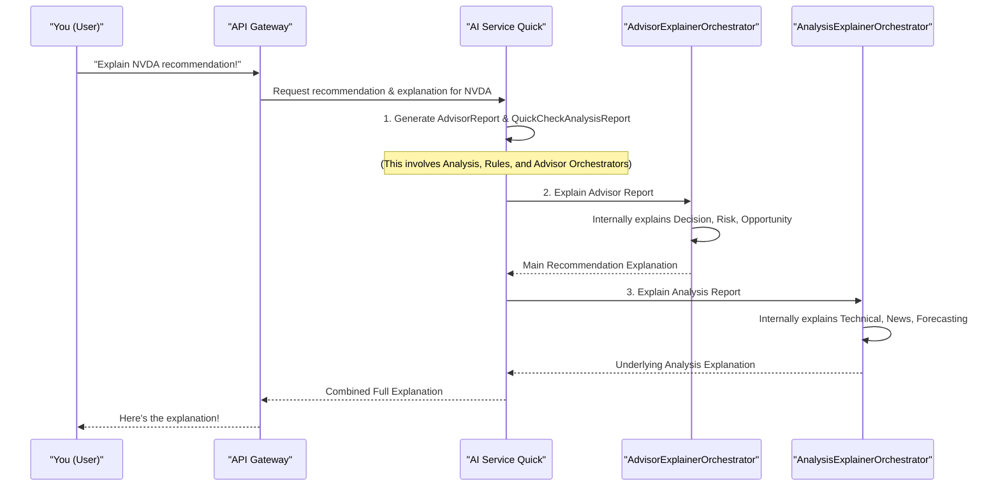

# Chapter 7: Explainer Framework

In [Chapter 6: User Profiles & Personalization](06_user_profiles___personalization_.md), we learned how ITAPIA can tailor investment advice to your unique style. Now, imagine ITAPIA gives you a recommendation, like "Buy Apple stock." That's great, but how much trust would you put in it if you didn't know *why*? What if it told you to buy, but you wanted to know the specific reasons, the data points that supported it, or the logic it followed?

### The Problem: The "Why" Behind the "What"

Many advanced AI systems are like "black boxes." They take in data and spit out an answer, but they don't tell you how they got there. This is a big problem in finance, where trust and understanding are paramount. If you don't understand the reasoning, it's hard to trust the advice, especially when real money is involved. You can't learn from a black box, and you can't challenge its decisions.

This is the problem the **Explainer Framework** solves. Think of this framework as ITAPIA's **"transparent translator"** or its **"storyteller."** Its job is to take all the complex analysis reports (from [Chapter 4: Analysis Modules](04_analysis_modules_.md)) and the intricate logic from the [Rule Engine (Symbolic Expression Trees)](05_rule_engine__symbolic_expression_trees__.md) and convert them into simple, human-readable text.

When you get a recommendation, the Explainer doesn't just tell you *what* to do; it explains *why* that recommendation was made, detailing the supporting data and the specific rules that were triggered. This builds trust, helps you learn, and empowers you by showing you the reasoning directly.

### How to Get an Explanation: A Simple Use Case

Let's say you've asked ITAPIA for a "Quick Check" on a stock, like **NVDA**. You'll get a recommendation. Now, you want the explanation.

**How you'd ask (conceptually via API):**

```
GET /api/v1/advisor/quick/NVDA/explain
```

**Desired Output (a simplified example):**

```
Advisor Recommendation for NVDA:

=> Main Recommendation: HOLD WITH POSITIVE OUTLOOK

Decision Breakdown: The final decision score is 0.18, leading to a recommendation of 'Hold with positive outlook'. This was primarily driven by signals from: 'Strong Uptrend Confirmation', 'Momentum Reversal Detection'.

Analysis Context:
- Risk Assessment: The final risk score is 0.62, leading to a recommendation of 'Moderate, balanced risk/reward'. This was primarily driven by signals from: 'High Volatility Detection'.
- Opportunity Scan: The final opportunity score is 0.73, leading to a recommendation of 'Interesting, add to watchlist'. This was primarily driven by signals from: 'High Growth Potential'.

Underlying Technical Analysis:
The daily analysis shows a strong upward trend, with RSI at 72.5 (overbought). Intraday patterns indicate consolidation.

Underlying News Analysis:
Overall sentiment for NVIDIA is positive based on recent news, especially regarding new chip announcements. Key entities mentioned include 'NVIDIA', 'Jensen Huang'.

Underlying Forecasting:
The 5-day price forecast has a 65% probability of moving upwards, driven by strong earnings and market sentiment.
```
Notice how the output goes beyond just the recommendation. It breaks down the decision, risk, and opportunity, and then provides context from the underlying technical, news, and forecasting analyses. This is the power of the Explainer Framework!

### The Explainer Framework's Structure: A Team of Storytellers

The Explainer Framework is organized like a team of specialized storytellers, each responsible for translating a specific part of ITAPIA's brain. They work together to create a comprehensive narrative.

1.  **`AdvisorExplainerOrchestrator`**: The "Chief Storyteller" for the final recommendation. It combines explanations about the main decision, risk, and opportunity.
2.  **`AnalysisExplainerOrchestrator`**: The "Evidence Storyteller." It explains *why* the underlying data looks the way it does, summarizing insights from the Technical, News, and Forecasting Modules.
3.  **`RuleExplainerOrchestrator`**: The "Logic Translator." This is the most detailed storyteller; it takes a complex [Symbolic Expression Tree](05_rule_engine__symbolic_expression_trees__.md) and translates its exact logic into a human-readable sentence.

### How Explanations are Generated: A Step-by-Step Flow

When you ask ITAPIA for a recommendation *with* an explanation, here's how these "storytellers" work together:


**Explanation:**
1.  You (the `User`) ask the `API Gateway` for an explanation.
2.  The `API Gateway` sends this request to the `AI Service Quick`.
3.  `AI Service Quick` first does its main job: it generates the `AdvisorReport` (the final recommendation with scores and triggered rules) and the `QuickCheckAnalysisReport` (the detailed evidence from Technical, News, and Forecasting). This involves the orchestrators we learned about in previous chapters.
4.  Once the reports are ready, `AI Service Quick` then calls its "Chief Storyteller," the `AdvisorExplainerOrchestrator`, to generate the high-level explanation about the decision, risk, and opportunity.
5.  At the same time, `AI Service Quick` calls the "Evidence Storyteller," the `AnalysisExplainerOrchestrator`, to summarize the underlying technical, news, and forecasting insights.
6.  Finally, `AI Service Quick` combines these two parts into one comprehensive explanation and sends it back to you.

Now, let's look closer at how each of these explainer components does its job.

### Under the Hood: The Explainer Framework's Inner Workings

The Explainer Framework is built with modularity in mind. Each part focuses on explaining its specific domain.

#### 1. The `AdvisorExplainerOrchestrator`: The Main Storyteller

This orchestrator is responsible for generating the top-level explanation for the `AdvisorReport`. It tells you the final recommendation and briefly mentions the most influential rules that led to it.

**File:** `backend/ai_service_quick/app/advisor/explainer/orchestrator.py`

```python
# Simplified from backend/ai_service_quick/app/advisor/explainer/orchestrator.py
from typing import List
from itapia_common.schemas.entities.advisor import AdvisorReportSchema, FinalRecommendation, TriggeredRuleInfo

class _FinalRecommendationExplainer:
    # ... (helper methods for formatting purpose and rules) ...

    def explain(self, report: FinalRecommendation) -> str:
        if not report.triggered_rules:
            return "No specific signals were triggered, resulting in a neutral stance."

        purpose_text = "decision" # Simplified: in real code, it infers from report
        explanation = f"The final {purpose_text} score is {report.final_score:.2f}, leading to a recommendation of '{report.final_recommend.upper()}'."

        top_rules_str = self._format_top_rules_str(report.triggered_rules) # Formats top rules
        explanation += f" This was primarily driven by signals from: {top_rules_str}."
        return explanation

class AdvisorExplainerOrchestrator:
    def __init__(self):
        self.rec_explainer = _FinalRecommendationExplainer() # Our lower-level explainer

    def explain_report(self, report: AdvisorReportSchema) -> str:
        # Calls the sub-explainer for each part: Decision, Risk, Opportunity
        decision_explanation = self.rec_explainer.explain(report.final_decision)
        risk_explanation = self.rec_explainer.explain(report.final_risk)
        opportunity_explanation = self.rec_explainer.explain(report.final_opportunity)

        header = f"Advisor Recommendation for {report.ticker}:"
        main_rec = f"=> Main Recommendation: {report.final_decision.final_recommend.upper()}"
        full_decision = f"Decision Breakdown: {decision_explanation}"
        context = f"\nAnalysis Context:\n- Risk Assessment: {risk_explanation}\n- Opportunity Scan: {opportunity_explanation}"

        return "\n\n".join([header, main_rec, full_decision, context])
```
**Explanation:**
*   The `AdvisorExplainerOrchestrator` uses a smaller helper, `_FinalRecommendationExplainer`, to generate explanations for the "Decision," "Risk," and "Opportunity" parts of the `AdvisorReport`.
*   The `explain_report` method then combines these individual explanations into a single, cohesive narrative for the entire `AdvisorReport`. This creates the top section of the explanation.

#### 2. The `AnalysisExplainerOrchestrator`: The Evidence Storyteller

This orchestrator is responsible for summarizing the detailed findings from the [Analysis Modules](04_analysis_modules_.md) (Technical, News, Forecasting). It provides the factual basis for the advisor's recommendation.

**File:** `backend/ai_service_quick/app/analysis/explainer/orchestrator.py`

```python
# Simplified from backend/ai_service_quick/app/analysis/explainer/orchestrator.py
from itapia_common.schemas.entities.analysis import QuickCheckAnalysisReport
# Import specific explainers for Technical, News, Forecasting
from .technical import TechnicalAnalysisExplainer
from .news import NewsAnalysisExplainer
from .forecasting import ForecastingExplainer

class AnalysisExplainerOrchestrator:
    def __init__(self):
        # Initialize specialized explainers for each analysis type
        self.tech_explainer = TechnicalAnalysisExplainer()
        self.news_explainer = NewsAnalysisExplainer()
        self.forecasting_explainer = ForecastingExplainer()

    def explain(self, report: QuickCheckAnalysisReport, report_type: str = 'all') -> str:
        explanation_parts = []

        # If a technical report exists, ask its explainer to summarize it
        if report_type in ['technical', 'all'] and report.technical_report:
            tech_summary = self.tech_explainer.explain(report.technical_report)
            explanation_parts.append(f"Underlying Technical Analysis:\n{tech_summary}")

        # If a news report exists, ask its explainer to summarize it
        if report_type in ['news', 'all'] and report.news_report:
            news_summary = self.news_explainer.explain(report.news_report)
            explanation_parts.append(f"Underlying News Analysis:\n{news_summary}")
            
        # If a forecasting report exists, ask its explainer to summarize it
        if report_type in ['forecasting', 'all'] and report.forecasting_report:
            forecasting_summary = self.forecasting_explainer.explain(report.forecasting_report)
            explanation_parts.append(f"Underlying Forecasting:\n{forecasting_summary}")

        return "\n\n".join(explanation_parts) # Combine all summaries
```
**Explanation:**
*   The `AnalysisExplainerOrchestrator` is a "manager" that holds instances of `TechnicalAnalysisExplainer`, `NewsAnalysisExplainer`, and `ForecastingExplainer`.
*   Its `explain` method iterates through the `QuickCheckAnalysisReport`. For each section (technical, news, forecasting) that has data, it calls the *corresponding specialized explainer* to get a summary.
*   These individual summaries are then combined to form the "Analysis Context" section of the final explanation. (The individual `TechnicalAnalysisExplainer`, `NewsAnalysisExplainer`, and `ForecastingExplainer` would contain the specific logic to simplify complex numerical/textual reports into natural language, but we don't show their code here to keep it simple.)

#### 3. The `RuleExplainerOrchestrator`: The Logic Translator

This is arguably the most powerful part of the Explainer Framework because it directly translates the mathematical and logical structures of the [Rule Engine's Symbolic Expression Trees](05_rule_engine__symbolic_expression_trees__.md) into human language. It turns the "why" from abstract code into clear sentences.

**File:** `backend/ai_service_quick/app/rules/explainer/orchestrator.py`

```python
# Simplified from backend/ai_service_quick/app/rules/explainer/orchestrator.py
from itapia_common.rules.nodes import _TreeNode, ConstantNode, VarNode, OperatorNode
from itapia_common.rules.rule import Rule
from itapia_common.rules import names as nms # Shortcut for Node Names

class RuleExplainerOrchestrator:
    # Mapping of operator names to human-readable phrases (e.g., OPR_GT maps to 'is greater than')
    INFIX_OPR_MAPPING = {
        nms.OPR_GT: 'is greater than',
        nms.OPR_LT: 'is less than',
        # ... other operators ...
    }
    
    def explain_node(self, node: _TreeNode) -> str:
        """
        Recursively translates a single node (part of a rule tree) into text.
        """
        if isinstance(node, ConstantNode):
            # Explains a fixed number, like "the threshold 'RSI_OVERBOUGHT' (value: 70.0)"
            return f"the threshold '{node.node_name}' (value: {node.value})"

        if isinstance(node, VarNode):
            # Explains a variable from the report, like "the daily RSI (14-period)"
            # This uses the 'description' property of the VarNode (see Chapter 2)
            return node.description

        if isinstance(node, OperatorNode):
            # Recursively explain children first, then apply operator logic
            child_explanations = [self.explain_node(child) for child in node.children]
            op_name = node.node_name.upper()

            if op_name in self.INFIX_OPR_MAPPING:
                # For "A op B" like "RSI is greater than 70"
                return f"({child_explanations[0]} {self.INFIX_OPR_MAPPING[op_name]} {child_explanations[1]})"
            
            if op_name == nms.OPR_AND:
                return "(" + " AND ".join(child_explanations) + ")"
            
            if op_name == nms.OPR_IF_THEN_ELSE:
                # For "IF Condition THEN Result1 ELSE Result2"
                return f"IF {child_explanations[0]} THEN {child_explanations[1]} ELSE {child_explanations[2]}"

            # Fallback for other operators
            return f"{op_name}({', '.join(child_explanations)})"

        return "Unknown Node"

    def explain_rule(self, rule: Rule) -> str:
        """
        Explains an entire Rule object by translating its root logic tree.
        """
        if not hasattr(rule, 'root') or not isinstance(rule.root, _TreeNode):
            raise TypeError("Input must be a valid Rule object with a root node.")
            
        logic_explanation = self.explain_node(rule.root) # Starts the recursive explanation
        
        return f"Rule '{rule.name}': This rule calculates a final score based on the following logic: {logic_explanation}."
```
**Explanation:**
*   The `RuleExplainerOrchestrator` uses a recursive function, `explain_node`, to traverse the entire [Symbolic Expression Tree](05_rule_engine__symbolic_expression_trees__.md) (which is built from `ConstantNode`, `VarNode`, and `OperatorNode` objects).
*   For each type of node, it applies a specific translation:
    *   `ConstantNode`s become their value or named threshold (e.g., "70.0").
    *   `VarNode`s use their pre-defined descriptions (e.g., "the daily RSI (14-period)"), linking directly to the [Semantic Type System (STGP)](02_semantic_type_system__stgp__.md) for clarity.
    *   `OperatorNode`s combine the explanations of their "children" with a human-readable phrase (e.g., "is greater than" for `OPR_GT`, or "IF... THEN... ELSE..." for `OPR_IF_THEN_ELSE`).
*   The `explain_rule` method wraps this logic in a sentence that explains the entire rule, like: "Rule 'RSI Overbought Signal': This rule calculates a final score based on the following logic: (the daily RSI (14-period) is greater than the threshold 'RSI_OVERBOUGHT' (value: 70.0))."

This component is fundamental to ITAPIA's transparency, allowing users to inspect the exact logic behind every decision-making rule.

### Benefits of the Explainer Framework

The Explainer Framework is more than just a nice-to-have feature; it's central to ITAPIA's mission:

| Feature                   | Benefit                                                                 |
| :------------------------ | :---------------------------------------------------------------------- |
| **Trust & Transparency**  | Converts "black box" AI into a "glass box," allowing users to understand and trust the recommendations. |
| **User Education**        | Helps users learn by seeing the reasoning directly, bridging the gap between raw data and investment decisions. |
| **Debuggability**         | If a recommendation seems off, the explanation provides clear insight into which data points or rules might be causing it, making debugging much easier. |
| **Validation & Audit**    | Provides a clear audit trail for every recommendation, which is critical for financial applications and regulatory compliance (XAI). |
| **Enhanced Confidence**   | Users feel more confident acting on advice when they grasp the underlying logic and supporting evidence. |

### Summary

In this chapter, we explored the **Explainer Framework**, ITAPIA's commitment to Explainable AI (XAI). We learned:

*   **Problem Solved**: It translates complex AI analysis and rule logic into simple, human-readable explanations, addressing the "black box" problem.
*   **Key Components**: It works as a team: the `AdvisorExplainerOrchestrator` for the overall recommendation, the `AnalysisExplainerOrchestrator` for the underlying evidence, and the `RuleExplainerOrchestrator` for the detailed logic of individual rules.
*   **How it Works**: These explainers work together to generate a comprehensive narrative that details *why* a recommendation was made, linking it back to supporting data and triggered rules.
*   **Benefits**: Leads to greater trust, user education, easier debugging, and compliance.

With a clear understanding of the Explainer Framework, we've seen how ITAPIA communicates its intelligence. The final piece of the puzzle is how all these powerful components are brought together to function seamlessly as a single, robust system. This leads us to [Chapter 8: Orchestrator Pattern](08_orchestrator_pattern_.md).

---

<sub><sup>Generated by [AI Codebase Knowledge Builder](https://github.com/The-Pocket/Tutorial-Codebase-Knowledge).</sup></sub> <sub><sup>**References**: [[1]](https://github.com/triet4p/itapia/blob/5d35c08e0ff059435cc497af3e4d25f0eb1eba5c/README.md), [[2]](https://github.com/triet4p/itapia/blob/5d35c08e0ff059435cc497af3e4d25f0eb1eba5c/backend/ai_service_quick/app/advisor/explainer/orchestrator.py), [[3]](https://github.com/triet4p/itapia/blob/5d35c08e0ff059435cc497af3e4d25f0eb1eba5c/backend/ai_service_quick/app/analysis/explainer/orchestrator.py), [[4]](https://github.com/triet4p/itapia/blob/5d35c08e0ff059435cc497af3e4d25f0eb1eba5c/backend/ai_service_quick/app/rules/explainer/orchestrator.py), [[5]](https://github.com/triet4p/itapia/blob/5d35c08e0ff059435cc497af3e4d25f0eb1eba5c/doc/public/itapia-mvp-v2.0.md)</sup></sub>