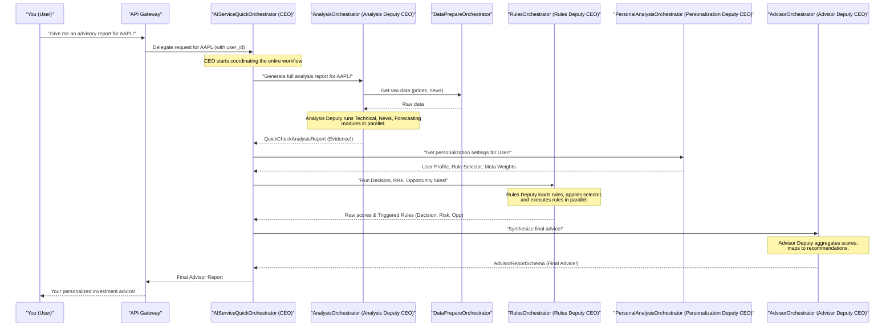

# Chapter 8: Orchestrator Pattern

In [Chapter 7: Explainer Framework](07_explainer_framework_.md), we saw how ITAPIA can clearly explain its recommendations, making its "brain" transparent. But with so many intelligent parts – data fetching, analysis, rule execution, personalization, and explanation – how do all these pieces work together smoothly without chaos? Who tells each part when to do its job and what information to pass along?

### The Problem: Managing a Symphony of Services

Imagine a large, complex company with many specialized departments: a Research Department that gathers data, an Analytics Department that crunches numbers, a Legal Department that checks rules, and a Public Relations Department that explains everything. If there's no CEO or clear management structure, each department might do its own thing, work at different speeds, or even produce conflicting information. The company would be a mess!

ITAPIA faces a similar challenge. We have:
*   [Analysis Modules](04_analysis_modules_.md) (Technical, News, Forecasting) generating insights.
*   The [Rule Engine](05_rule_engine__symbolic_expression_trees__.md) processing these insights into scores.
*   [User Profiles & Personalization](06_user_profiles___personalization_.md) influencing the advice.
*   The [Explainer Framework](07_explainer_framework_.md) turning complex data into human-readable text.
*   [Data Persistence & Caching](03_data_persistence___caching_.md) providing the raw materials.

Without a central "manager" or "conductor," these brilliant components might struggle to work together as a cohesive whole, making the system slow, inefficient, or difficult to understand.

### The Solution: The Orchestrator Pattern

This is where the **Orchestrator Pattern** comes in. Think of the Orchestrator Pattern in ITAPIA as the **company's CEO and its executive team.**

*   **Top-level "CEO" Orchestrators**: These are responsible for the overall flow of major, complex tasks (like generating an entire investment advisory report). They don't do the detailed work themselves; they delegate!
*   **Specialized "Deputy CEO" Orchestrators**: These report to the "CEO" and are responsible for specific large domains (e.g., all analysis tasks, all rule execution tasks, all advice aggregation tasks). They, in turn, delegate to their own "department heads."
*   **"Department Heads" / Individual Modules**: These are the actual workers (like individual analysis engines, rule nodes, or specific explainer components) that perform the detailed, specialized operations.

This hierarchical structure ensures:
*   **Clear Responsibilities**: Everyone knows their role.
*   **Efficient Flow**: Tasks are delegated and executed in the correct order, often in parallel.
*   **Modularity**: Parts can be updated or replaced without affecting the entire system.
*   **Scalability**: Different "departments" can operate independently, making the system easier to expand.

### Use Case: Generating a Comprehensive Investment Advisory Report

Let's revisit our core use case: you ask ITAPIA for a complete investment advisory report for a stock like **AAPL**. This involves many steps, from gathering data to making a recommendation and explaining it. The Orchestrator Pattern is designed to manage this entire process seamlessly.

### The Orchestrator Hierarchy in ITAPIA

ITAPIA uses a clear, hierarchical structure of orchestrators, primarily within the `backend/ai_service_quick/app` directory.

Here's a simplified look at the main orchestrators:

#### 1. `AIServiceQuickOrchestrator`: The "CEO"

*   **Location:** `backend/ai_service_quick/app/orchestrator.py`
*   **Role:** This is the highest-level orchestrator. It acts like the CEO of a company. Its job is to receive top-level requests (like "Give me a full advisor report for AAPL!") and then delegate these big tasks to its "Deputy CEOs" (the other orchestrators). It knows *what* needs to be done and *who* should do it, but it doesn't do the detailed work itself.

```python
# Simplified from backend/ai_service_quick/app/orchestrator.py

import asyncio
from itapia_common.schemas.enums import SemanticType
from .analysis import AnalysisOrchestrator # Our "Analysis Deputy CEO"
from .advisor import AdvisorOrchestrator   # Our "Advisor Deputy CEO"
from .rules import RulesOrchestrator       # Our "Rules Deputy CEO"
from .personal import PersonalAnalysisOrchestrator # Our "Personalization Deputy CEO"

class AIServiceQuickOrchestrator:
    def __init__(self, analysis_orchestrator: AnalysisOrchestrator,
                 advisor_orchestrator: AdvisorOrchestrator,
                 rule_orchestrator: RulesOrchestrator,
                 personal_orchestrator: PersonalAnalysisOrchestrator):
        # The CEO gets its Deputy CEOs
        self.analysis = analysis_orchestrator
        self.advisor = advisor_orchestrator
        self.rules = rule_orchestrator
        self.personal = personal_orchestrator
        print("CEO Orchestrator initialized with its Deputies.")

    async def get_full_advisor_report(self, ticker: str, user_id: str):
        print(f"CEO -> Initiating full ADVISOR workflow for '{ticker}'...")

        # 1. Delegate to Analysis Deputy CEO to get the analysis report
        analysis_report = await self.analysis.get_full_analysis_report(ticker)
        print("CEO <- Analysis Deputy: Got analysis report.")

        # 2. Delegate to Personalization Deputy CEO for user-specific settings
        user_profile = self.personal.get_user_profile(user_id)
        rule_selector = self.personal.get_rule_selector(user_profile)
        meta_weights = self.personal.get_meta_synthesis_weights(user_profile)
        print("CEO <- Personalization Deputy: Got personalization settings.")

        # 3. Delegate to Rules Deputy CEO to run rules in parallel
        decision_task = self.rules.run_for_purpose(analysis_report, SemanticType.DECISION_SIGNAL, rule_selector)
        risk_task = self.rules.run_for_purpose(analysis_report, SemanticType.RISK_LEVEL, rule_selector)
        opp_task = self.rules.run_for_purpose(analysis_report, SemanticType.OPPORTUNITY_RATING, rule_selector)
        decision_results, risk_results, opp_results = await asyncio.gather(decision_task, risk_task, opp_task)
        print("CEO <- Rules Deputy: Got rule execution results.")

        # 4. Delegate to Advisor Deputy CEO for final advice
        advisor_report = await self.advisor.get_advisor_report(
            analysis_report, decision_results, risk_results, opp_results, meta_weights
        )
        print("CEO <- Advisor Deputy: Got final advisor report.")

        return advisor_report
```
**Explanation:** The `AIServiceQuickOrchestrator`'s `get_full_advisor_report` method shows how it orchestrates the entire workflow. It makes calls to its "Deputy CEOs" (`self.analysis`, `self.personal`, `self.rules`, `self.advisor`) and waits for them to return their results, then passes those results to the next step. Notice the use of `asyncio.gather` to run the rule execution tasks in parallel, making the process faster!

#### 2. `AnalysisOrchestrator`: The "Analysis Deputy CEO"

*   **Location:** `backend/ai_service_quick/app/analysis/orchestrator.py`
*   **Role:** This orchestrator is responsible for coordinating all aspects of data analysis. It acts like a "Deputy CEO" in charge of the entire Research & Development division. It delegates to specific "department heads" for technical analysis, news analysis, and forecasting.

```python
# Simplified from backend/ai_service_quick/app/analysis/orchestrator.py

import asyncio
import pandas as pd
from .data_prepare.orchestrator import DataPrepareOrchestrator # The "Data Fetching Department"
from .technical.orchestrator import TechnicalOrchestrator     # The "Technical Analysis Department"
from .forecasting.orchestrator import ForecastingOrchestrator # The "Forecasting Department"
from .news.orchestrator import NewsOrchestrator             # The "News Analysis Department"
from itapia_common.schemas.entities.analysis import QuickCheckAnalysisReport

class AnalysisOrchestrator:
    def __init__(self, data_preparer: DataPrepareOrchestrator,
                 tech_analyzer: TechnicalOrchestrator,
                 forecaster: ForecastingOrchestrator,
                 news_analyzer: NewsOrchestrator):
        # The Analysis Deputy CEO gets its Department Heads
        self.data_preparer = data_preparer
        self.tech_analyzer = tech_analyzer
        self.forecaster = forecaster
        self.news_analyzer = news_analyzer

    async def get_full_analysis_report(self, ticker: str) -> QuickCheckAnalysisReport:
        print(f"Analysis Deputy -> Initiating full analysis for '{ticker}'...")

        # 1. Get raw data from the Data Preparer (from Chapter 3)
        daily_df = self.data_preparer.get_daily_ohlcv_for_ticker(ticker)
        intraday_df = self.data_preparer.get_intraday_ohlcv_for_ticker(ticker)
        news_texts = self.data_preparer.get_all_news_text_for_ticker(ticker)
        print("Analysis Deputy <- Data Preparer: Got raw data.")

        # 2. Delegate to each department to run analysis in parallel
        # We need a dummy loop and executor for simplified async
        loop = asyncio.get_running_loop()
        technical_task = loop.run_in_executor(
            None, self.tech_analyzer.get_full_analysis, daily_df, intraday_df, 'medium', 'all'
        )
        forecasting_task = self.forecaster.generate_report(pd.DataFrame(), ticker, 'TECH') # Simplified input
        news_task = self.news_analyzer.generate_report(ticker, news_texts)

        results = await asyncio.gather(technical_task, forecasting_task, news_task, return_exceptions=True)
        technical_report, forecasting_report, news_report = results
        print("Analysis Deputy <- Departments: Got all analysis reports.")

        # 3. Combine reports into a single QuickCheckAnalysisReport
        return QuickCheckAnalysisReport(
            ticker=ticker,
            technical_report=technical_report,
            forecasting_report=forecasting_report,
            news_report=news_report
        )
```
**Explanation:** The `AnalysisOrchestrator` first gets the raw data. Then, using `asyncio.gather`, it launches the `technical_analyzer`, `forecaster`, and `news_analyzer` (its "department heads") to work *simultaneously*. Once all analysis is complete, it collects their individual reports and combines them into one `QuickCheckAnalysisReport` (the "evidence" report for the Rule Engine). This parallel execution significantly speeds up the analysis.

#### 3. `RulesOrchestrator`: The "Rules Deputy CEO"

*   **Location:** `backend/ai_service_quick/app/rules/orchestrator.py`
*   **Role:** This orchestrator acts like a "Deputy CEO" in charge of the entire Legal & Compliance division, responsible for running all the intelligent rules. It works with the [Rule Engine (Symbolic Expression Trees)](05_rule_engine__symbolic_expression_trees__.md) and the `RuleService` (part of [Data Persistence & Caching](03_data_persistence___caching_.md)) to load and execute rules based on the analysis report.

```python
# Simplified from backend/ai_service_quick/app/rules/orchestrator.py

from typing import List, Callable
from itapia_common.rules.rule import Rule
from itapia_common.schemas.enums import SemanticType
from itapia_common.dblib.services.rules import RuleService # Our "Rule Librarian"
from itapia_common.schemas.entities.analysis import QuickCheckAnalysisReport

class RulesOrchestrator:
    def __init__(self, rule_service: RuleService):
        # The Rules Deputy CEO gets its Rule Librarian
        self.rule_service = rule_service

    async def run_for_purpose(
        self,
        report: QuickCheckAnalysisReport,
        purpose: SemanticType, # e.g., SemanticType.DECISION_SIGNAL
        rule_selector: Callable[[List[Rule]], List[Rule]] # From Personalization
    ):
        print(f"Rules Deputy -> Running rules for purpose: {purpose.name}...")

        # 1. Load active rules from the database (via RuleService)
        all_rules_schemas = self.rule_service.get_active_rules_by_purpose(purpose)
        all_rules = [Rule.from_entity(rs) for rs in all_rules_schemas]
        print(f"Rules Deputy <- Rule Librarian: Loaded {len(all_rules)} rules.")

        # 2. Select rules based on personalization (if any)
        selected_rules = rule_selector(all_rules) # Applies the personal rule selector
        print(f"Rules Deputy -> Selected {len(selected_rules)} rules.")

        scores = []
        triggered_rules_info = []
        # 3. Execute each selected rule using the analysis report as input
        for rule in selected_rules:
            score = rule.execute(report) # Rule.execute() comes from Chapter 5
            scores.append(score)
            triggered_rules_info.append({"rule_id": rule.rule_id, "name": rule.name, "score": score})
        print("Rules Deputy: Rules executed.")
        return scores, triggered_rules_info
```
**Explanation:** The `RulesOrchestrator` first fetches the active rule definitions from the database using its `rule_service`. It then applies a `rule_selector` (which can be customized based on [User Profiles & Personalization](06_user_profiles___personalization_.md)) to pick the most relevant rules. Finally, it iterates through these selected rules, executing each one with the `QuickCheckAnalysisReport` to get its score.

#### 4. `AdvisorOrchestrator`: The "Advisor Deputy CEO"

*   **Location:** `backend/ai_service_quick/app/advisor/orchestrator.py`
*   **Role:** This orchestrator acts like a "Deputy CEO" in charge of providing the final, actionable advice. It doesn't do new analysis or run rules directly. Instead, it aggregates the scores from the `RulesOrchestrator` and maps them to human-readable recommendations, then works with the [Explainer Framework](07_explainer_framework_.md) to generate the explanation.

```python
# Simplified from backend/ai_service_quick/app/advisor/orchestrator.py

from typing import List, Tuple, Dict
from itapia_common.schemas.enums import SemanticType
from itapia_common.schemas.entities.advisor import AdvisorReportSchema, FinalRecommendation
from itapia_common.schemas.entities.analysis import QuickCheckAnalysisReport
from .aggeration import AggregationOrchestrator # Our "Aggregation Department"
from .explainer import AdvisorExplainerOrchestrator # Our "Explanation Department"

class AdvisorOrchestrator:
    def __init__(self, agg_orc: AggregationOrchestrator,
                 explainer: AdvisorExplainerOrchestrator):
        # The Advisor Deputy CEO gets its Aggregation and Explainer Departments
        self.agg_orc = agg_orc
        self.explainer = explainer

    async def get_advisor_report(self, analysis_report: QuickCheckAnalysisReport,
                                 decision_results: Tuple[List[float], List],
                                 risk_results: Tuple[List[float], List],
                                 opportunity_results: Tuple[List[float], List],
                                 meta_weights: Dict[str, float]) -> AdvisorReportSchema:
        print(f"Advisor Deputy -> Generating advice for {analysis_report.ticker}...")

        # 1. Aggregate raw scores (e.g., average decision scores, pick highest risk score)
        decision_scores, triggered_d = decision_results
        risk_scores, triggered_r = risk_results
        opportunity_scores, triggered_o = opportunity_results

        agg_scores = self.agg_orc.aggregate_raw_scores(decision_scores, risk_scores, opportunity_scores)
        print("Advisor Deputy <- Aggregation: Aggregated raw scores.")

        # 2. Synthesize final decision using meta-weights (from Personalization)
        final_scores = self.agg_orc.synthesize_final_decision(agg_scores, meta_weights)
        print("Advisor Deputy <- Aggregation: Synthesized final scores.")

        # 3. Map final scores to human-readable labels (e.g., 0.8 -> "Strong Buy")
        mapped_labels = self.agg_orc.map_final_scores(final_scores)
        print("Advisor Deputy <- Aggregation: Mapped scores to labels.")

        # 4. Build the final AdvisorReportSchema
        return AdvisorReportSchema(
            final_decision=FinalRecommendation(final_score=final_scores[SemanticType.DECISION_SIGNAL],
                                               final_recommend=mapped_labels[SemanticType.DECISION_SIGNAL][1]),
            # ... similar for risk and opportunity ...
            ticker=analysis_report.ticker
        )
```
**Explanation:** The `AdvisorOrchestrator` takes the raw scores and triggered rules from the `RulesOrchestrator`. It then uses its `AggregationOrchestrator` to perform mathematical aggregation and map these scores to meaningful labels (like "Strong Buy" or "High Risk"). Finally, it assembles all this information into the comprehensive `AdvisorReportSchema`. This report is what eventually gets sent back to you.

### How it All Comes Together: The Full Workflow

Let's visualize the entire process for getting a comprehensive advisory report, highlighting the role of each orchestrator:


**Explanation:**
1.  **You** initiate a request through the `API Gateway`.
2.  The `API Gateway` passes this high-level request to the **CEO** (`AIServiceQuickOrchestrator`).
3.  The **CEO** first delegates to the **Analysis Deputy** (`AnalysisOrchestrator`) to get all the underlying analysis (`QuickCheckAnalysisReport`). The Analysis Deputy further delegates to its data preparation, technical, news, and forecasting "departments."
4.  Once the analysis is complete, the **CEO** consults the **Personalization Deputy** (`PersonalAnalysisOrchestrator`) to get any user-specific settings.
5.  With the analysis report and personalization settings, the **CEO** then delegates to the **Rules Deputy** (`RulesOrchestrator`) to execute all the relevant decision, risk, and opportunity rules.
6.  Finally, the **CEO** delegates to the **Advisor Deputy** (`AdvisorOrchestrator`) to take all the rule scores, aggregate them, and convert them into a final, human-readable `AdvisorReportSchema`.
7.  This comprehensive `AdvisorReportSchema` is then returned to you via the `API Gateway`.

This entire process, from start to finish, is smoothly managed by this hierarchy of orchestrators, ensuring that each part of ITAPIA's intelligence contributes effectively to the final output.

### Benefits of the Orchestrator Pattern

The Orchestrator Pattern is fundamental to ITAPIA's robust and scalable design.

| Feature               | Benefit                                                                                               |
| :-------------------- | :---------------------------------------------------------------------------------------------------- |
| **Clear Responsibility** | Each orchestrator has a well-defined role (e.g., Analysis handles all analysis, Rules handles all rules). |
| **Modularity**        | Components can be developed, tested, and updated independently, leading to more stable code.            |
| **Efficient Flow**    | Tasks can be delegated and run in parallel (e.g., `asyncio.gather`), significantly speeding up processing. |
| **Scalability**       | Different orchestrators (and the services they manage) can be scaled independently if one becomes a bottleneck. |
| **Maintainability**   | The clear structure makes it easier for developers to understand the system and fix issues.           |
| **Composability**     | Orchestrators can be reused for different workflows. For instance, `AnalysisOrchestrator` can provide a report on its own, not just as part of the full advisory. |

### Summary

In this chapter, we explored the **Orchestrator Pattern**, which serves as ITAPIA's "management structure." We learned:

*   **Problem Solved**: Orchestrators bring order to a complex system with many specialized parts, ensuring efficient and coordinated execution.
*   **Hierarchical Structure**: ITAPIA uses a "CEO" (`AIServiceQuickOrchestrator`) that delegates to "Deputy CEOs" (`AnalysisOrchestrator`, `RulesOrchestrator`, `AdvisorOrchestrator`, `PersonalAnalysisOrchestrator`), who in turn manage their specific "departments" or modules.
*   **Key Responsibilities**: Each orchestrator has a clear, specialized role, leading to a highly organized and manageable system.
*   **Workflow Management**: Orchestrators manage the entire process, including parallel execution of tasks, to efficiently generate a comprehensive investment advisory report.
*   **Benefits**: Clear responsibilities, modularity, efficiency, scalability, and maintainability are key advantages of this design.

This Orchestrator Pattern is the final piece of the puzzle, bringing together all the powerful concepts we've explored in previous chapters – from [Shared Libraries](01_shared_library__itapia_common__.md) and [Semantic Types](02_semantic_type_system__stgp__.md) to [Data Persistence](03_data_persistence___caching_.md), [Analysis Modules](04_analysis_modules_.md), the [Rule Engine](05_rule_engine__symbolic_expression_trees__.md), [User Profiles](06_user_profiles___personalization_.md), and the [Explainer Framework](07_explainer_framework_.md) – into a single, cohesive, and robust Intelligent & Transparent AI-Powered Personal Investment Assistant.

---

<sub><sup>Generated by [AI Codebase Knowledge Builder](https://github.com/The-Pocket/Tutorial-Codebase-Knowledge).</sup></sub> <sub><sup>**References**: [[1]](https://github.com/triet4p/itapia/blob/5d35c08e0ff059435cc497af3e4d25f0eb1eba5c/README.md), [[2]](https://github.com/triet4p/itapia/blob/5d35c08e0ff059435cc497af3e4d25f0eb1eba5c/backend/ai_service_quick/app/advisor/orchestrator.py), [[3]](https://github.com/triet4p/itapia/blob/5d35c08e0ff059435cc497af3e4d25f0eb1eba5c/backend/ai_service_quick/app/analysis/orchestrator.py), [[4]](https://github.com/triet4p/itapia/blob/5d35c08e0ff059435cc497af3e4d25f0eb1eba5c/backend/ai_service_quick/app/orchestrator.py), [[5]](https://github.com/triet4p/itapia/blob/5d35c08e0ff059435cc497af3e4d25f0eb1eba5c/backend/ai_service_quick/app/personal/orchestrator.py), [[6]](https://github.com/triet4p/itapia/blob/5d35c08e0ff059435cc497af3e4d25f0eb1eba5c/backend/ai_service_quick/app/rules/orchestrator.py), [[7]](https://github.com/triet4p/itapia/blob/5d35c08e0ff059435cc497af3e4d25f0eb1eba5c/doc/public/itapia-mvp-v2.0.md)</sup></sub>