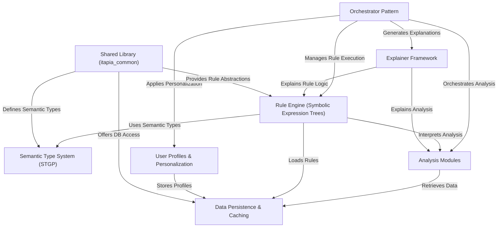

# Tutorial: itapia

ITAPIA is an **Intelligent & Transparent AI-Powered Personal Investment Assistant** designed to provide *explainable investment recommendations*. It combines *machine learning insights* from various analysis modules with a transparent *Rule Engine* to help users understand the "why" behind every decision, fostering trust and empowering them to become more confident investors with personalized advice.

## Visual Overview

## Chapters

1. [Shared Library (itapia_common)
](01_shared_library__itapia_common__.md)
2. [Semantic Type System (STGP)
](02_semantic_type_system__stgp__.md)
3. [Data Persistence & Caching
](03_data_persistence___caching_.md)
4. [Analysis Modules
](04_analysis_modules_.md)
5. [Rule Engine (Symbolic Expression Trees)
](05_rule_engine__symbolic_expression_trees__.md)
6. [User Profiles & Personalization
](06_user_profiles___personalization_.md)
7. [Explainer Framework
](07_explainer_framework_.md)
8. [Orchestrator Pattern
](08_orchestrator_pattern_.md)

---

Generated by [AI Codebase Knowledge Builder](https://github.com/The-Pocket/Tutorial-Codebase-Knowledge).