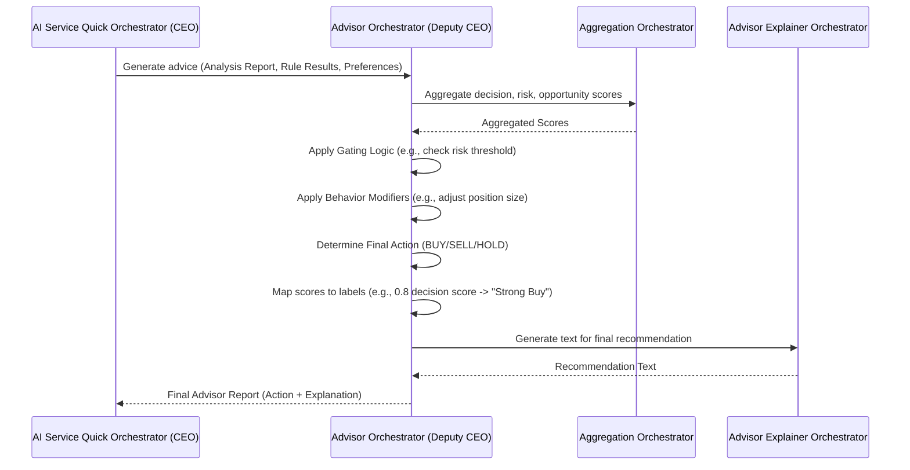

# Chapter 3: Advisor Orchestrator (Deputy CEO)

Welcome back, future AI architect! In [Chapter 1: AI Service Quick Orchestrator (CEO)](01_ai_service_quick_orchestrator__ceo__.md), we met our main manager, the CEO. Then, in [Chapter 2: Personal Analysis Orchestrator (Deputy CEO)](02_personal_analysis_orchestrator__deputy_ceo__.md), we learned how our system understands *your* unique investment style.

Now, it's time to meet the component that brings all that information together to give you concrete, actionable advice: the **Advisor Orchestrator**! We like to call it the **Deputy CEO of Advice** or your **Chief Investment Strategist**.

## The Problem: Turning Data into Actionable Advice

Imagine you've done tons of market research. You know:
*   The stock's price trends (technical analysis).
*   What experts predict for its future (forecasting).
*   The latest news and sentiment (news analysis).
*   And, thanks to the Personal Analysis Orchestrator, you know *your* specific preferences and risk tolerance.

But how do you turn all these pieces of information – often conflicting or complicated – into a simple answer like, "Should I *Buy*, *Sell*, or *Hold* Apple (AAPL) stock? And if I buy, how much, and what's my safety net?"

This is the challenging job of our **Advisor Orchestrator**. It doesn't just list facts; it makes the final call!

## Meet the Advisor Orchestrator: Your Chief Investment Strategist

Think of the **Advisor Orchestrator** like the Chief Investment Strategist at a top-tier financial firm. This person doesn't do all the raw data collection (that's our Analysis Orchestrator) or figure out *your* personal style (that's our Personal Analysis Orchestrator). Instead, their expertise lies in:

1.  **Synthesizing Information:** Taking all the market analysis and personalized rule results.
2.  **Aggregating Scores:** Combining scores from different rules to get an overall picture (e.g., if five rules say "buy" and two say "sell," what's the combined signal?).
3.  **Applying Smart Logic (Gating):** Using common-sense "safety checks." For example, if the aggregated score says "BUY," but the risk level is *extremely* high, the strategist might override the "BUY" with a "HOLD."
4.  **Applying Behavior Modifiers:** Adjusting the advice based on your explicit preferences, like reducing the suggested position size if you're very cautious.
5.  **Formulating a Concrete Recommendation:** Translating all this into a clear, actionable instruction: "BUY," "SELL," or "HOLD," along with details like suggested position size, stop-loss, and take-profit levels.

It's the ultimate decision-maker that translates complex data into simple, personalized advice.

## How the CEO Uses the Advisor Orchestrator

As we saw in [Chapter 1: AI Service Quick Orchestrator (CEO)](01_ai_service_quick_orchestrator__ceo__.md), the main CEO orchestrator calls the `get_full_advisor_report` method when a user wants a complete investment recommendation.

Let's revisit the core part of that API call:

```python
# app/api/v1/endpoints/quick_advisor.py (Simplified)

from app.dependencies import get_ceo_orchestrator
from fastapi import APIRouter, Depends

router = APIRouter()

@router.post("/advisor/{ticker}/full")
async def get_full_advisor_report(
    quantitive_config: # ... your preferences ...
    ticker: str,
    orchestrator: AIServiceQuickOrchestrator = Depends(get_ceo_orchestrator),
):
    """
    Get full advisor report with investment recommendations.
    """
    report = await orchestrator.get_full_advisor_report(
        ticker=ticker,
        quantitive_config=quantitive_config, # Your personalized settings
        limit=10,
    )
    return report # The final advice!
```

**What's happening here?**
The `orchestrator.get_full_advisor_report(...)` line is where the CEO orchestrator takes charge. After it gathers all the market analysis (from Analysis Orchestrator) and filtered rule results (from Rules and Personal Analysis Orchestrators), it hands all that information to the Advisor Orchestrator. The output is a full `AdvisorReportSchema`, which includes the final "BUY," "SELL," or "HOLD" decision and all its details.

## Under the Hood: The Advisor's Decision-Making Process

When the CEO calls the Advisor Orchestrator's `get_advisor_report` method, here's a simplified look at what happens:



As you can see, the Advisor Orchestrator works with its own specialized components, like the `AggregationOrchestrator` for combining scores and the `AdvisorExplainerOrchestrator` for generating human-friendly text.

## The Code: Advisor Orchestrator

Let's look at how the **Advisor Orchestrator** is set up and how it makes its decisions in the code.

### 1. Initialization: Appointing Department Heads

Like our other orchestrators, the `AdvisorOrchestrator` is created once when the application starts up, in `app/dependencies.py`. It receives its own "department heads":

```python
# app/dependencies.py (Simplified)

from .advisor import AdvisorOrchestrator
from .advisor.aggeration import AggregationOrchestrator
from .advisor.explainer import AdvisorExplainerOrchestrator
from itapia_common.rules.action import MEDIUM_SWING_IDEAL_MAPPER # A default setting

# ... inside create_dependencies() ...

aggeration_orc = AggregationOrchestrator() # Component for combining scores
advisor_explainer_orc = AdvisorExplainerOrchestrator() # Component for explanations

advisor_orc = AdvisorOrchestrator(
    agg_orc=aggeration_orc,
    explainer=advisor_explainer_orc,
    default_action_mapper=MEDIUM_SWING_IDEAL_MAPPER,
)

# ... later, the CEO gets this advisor_orc ...
_ceo_orchestrator = AIServiceQuickOrchestrator(
    # ... other deputies ...
    advisor_orchestrator=advisor_orc,
)
```

**Explanation:**
The `AdvisorOrchestrator` is set up with:
*   `aggeration_orc`: Its assistant for cleverly combining multiple scores into one.
*   `advisor_explainer_orc`: Its assistant for turning technical reports into easy-to-understand language.
*   `default_action_mapper`: A predefined rule that helps translate a numerical score (like 0.7 for "decision") into a concrete action (like "BUY").

### 2. The Core Logic: `get_advisor_report`

The most important method is `get_advisor_report` in `app/advisor/orchestrator.py`. This is where the magic of decision-making happens.

```python
# app/advisor/orchestrator.py (Simplified)

class AdvisorOrchestrator:
    # ... __init__ method as shown above ...

    async def get_advisor_report(
        self,
        analysis_report: QuickCheckAnalysisReport,
        decision_results: Tuple[List[float], List[TriggeredRuleInfo]],
        risk_results: Tuple[List[float], List[TriggeredRuleInfo]],
        opportunity_results: Tuple[List[float], List[TriggeredRuleInfo]],
        behavior_modifiers: Optional[BehaviorModifiers] = None,
        action_mapper: Optional[_BaseActionMapper] = None,
    ) -> AdvisorReportSchema:
        logger.info(f"Advisor -> Generating advice for {analysis_report.ticker}...")

        # 1. UNPACK RAW SCORES from the rule execution results
        (decision_scores, triggered_d) = decision_results
        (risk_scores, triggered_r) = risk_results
        (opportunity_scores, triggered_o) = opportunity_results

        # 2. AGGREGATION: Combine all these individual rule scores
        agg_scores = self.agg_orc.aggregate_raw_scores(
            decision_scores, risk_scores, opportunity_scores
        )

        # 3. INITIAL ACTION: Map the aggregated decision score to a base action (e.g., BUY/HOLD/SELL)
        base_action = action_mapper.map_action(agg_scores.raw_decision_score)

        # 4. GATING LOGIC: Apply safety checks and adjustments
        gated_action = self._apply_gating_logic(base_action, agg_scores)

        # 5. BEHAVIOR MODIFIERS: Apply user's personal preferences
        final_action = self._apply_behavior_modifiers(gated_action, behavior_modifiers)

        # ... (Remaining steps for generating final report details) ...
        return AdvisorReportSchema(
            # ... all the final recommendations ...
            final_action=final_action, # THE FINAL CALL!
            # ...
        )
```

**Explanation:**
1.  **Unpack Raw Scores:** The method first takes the results from the [Rules Orchestrator](04_rules_orchestrator__deputy_ceo__.md), which are lists of scores (e.g., `[0.7, 0.9, 0.6]` for "buy" signals) and details about which rules triggered.
2.  **Aggregation:** It then asks its `agg_orc` (Aggregation Orchestrator) to combine these raw scores. For example, it might average decision scores but pick the *highest* risk score to be cautious.
    *   **Mini-Dive: AggregationOrchestrator**
        ```python
        # app/advisor/aggeration.py (Simplified)

        class AggregationOrchestrator:
            def aggregate_raw_scores(
                self,
                decision_scores: List[float],
                risk_scores: List[float],
                opportunity_scores: List[float],
            ) -> AggregatedScoreInfo:
                # Average for decision signals
                agg_decision = self.aggregator.average(decision_scores)
                # Take highest risk score (most cautious)
                agg_risk = self.aggregator.get_highest_score(risk_scores)
                # Take lowest opportunity score (most conservative)
                agg_opportunity = self.aggregator.get_lowest_score(opportunity_scores)

                return AggregatedScoreInfo(
                    raw_decision_score=agg_decision,
                    raw_risk_score=agg_risk,
                    raw_opportunity_score=agg_opportunity,
                )
        ```
        This shows how the `AggregationOrchestrator` uses different strategies (average, highest, lowest) to combine scores for different purposes.
3.  **Initial Action:** A `_BaseActionMapper` (like `MEDIUM_SWING_IDEAL_MAPPER`) takes the `raw_decision_score` and converts it into a basic `Action` object, like `Action(action_type="BUY", position_size_pct=0.1)`.
4.  **Gating Logic:** This is a crucial "safety net." Even if the scores say "BUY," if the risk is too high, this logic can override that.
    *   **Mini-Dive: `_apply_gating_logic`**
        ```python
        # app/advisor/orchestrator.py (Simplified)

        def _apply_gating_logic(
            self, base_action: Action, agg_scores: AggregatedScoreInfo
        ) -> Action:
            action = base_action
            if agg_scores.raw_risk_score >= 0.9:  # Very high risk
                if action.action_type == "BUY":
                    logger.info("RISK GATE: High risk. Overriding BUY to HOLD.")
                    return Action(action_type="HOLD") # Safety first!
            elif agg_scores.raw_risk_score >= 0.8: # High risk, but not extreme
                if action.action_type == "BUY":
                    logger.info("RISK GATE: High risk. Reducing position size by 50%.")
                    action.position_size_pct *= 0.5 # Reduce risk
            # ... (Opportunity gates could increase size if risk is low and opportunity is high) ...
            return action
        ```
        This code shows a simple example: if the risk score is very high (e.g., 0.9 or above), any "BUY" signal is immediately changed to "HOLD." If the risk is high (0.8 or above), the position size for a "BUY" might be reduced. This ensures the advice is always mindful of potential downsides.
5.  **Behavior Modifiers:** This step fine-tunes the recommendation based on *your* personal `BehaviorModifiers` (which came from the [Personal Analysis Orchestrator](02_personal_analysis_orchestrator__deputy_ceo__.md)).
    *   **Mini-Dive: `_apply_behavior_modifiers`**
        ```python
        # app/advisor/orchestrator.py (Simplified)

        def _apply_behavior_modifiers(
            self, base_action: Action, modifiers: Optional[BehaviorModifiers]
        ) -> Action:
            if not modifiers or base_action.action_type == "HOLD":
                return base_action # No changes for HOLD or no modifiers

            new_size = base_action.position_size_pct * modifiers.position_sizing_factor
            new_sl = base_action.sl_pct * modifiers.risk_tolerance_factor
            new_tp = base_action.tp_pct * modifiers.risk_tolerance_factor

            # Ensure values stay within reasonable bounds (e.g., size between 0 and 100%)
            final_size = np.clip(new_size, 0.0, 1.0)
            final_sl = np.clip(new_sl, 0.01, 0.5)
            final_tp = np.clip(new_tp, 0.02, 1.0)

            return Action(
                position_size_pct=round(final_size, 3),
                sl_pct=round(final_sl, 3),
                tp_pct=round(final_tp, 3),
                action_type=base_action.action_type,
                duration_days=base_action.duration_days,
            )
        ```
        If your `position_sizing_factor` is 0.8 (meaning you prefer smaller positions), this step reduces the suggested `position_size_pct` accordingly. Similarly, your `risk_tolerance_factor` might adjust the suggested `sl_pct` (stop-loss percentage) and `tp_pct` (take-profit percentage).
6.  **Final Recommendation Text:** Lastly, the Advisor Orchestrator creates a human-readable summary of the final decision.
    *   **Mini-Dive: `_create_final_recommendation_text`**
        ```python
        # app/advisor/orchestrator.py (Simplified)

        def _create_final_recommendation_text(
            self, final_action: Action, triggered_rules: List[TriggeredRuleInfo]
        ) -> str:
            if final_action.action_type == "HOLD":
                return "Recommendation: HOLD. No clear trading signal..."

            action_text = "BUY" if final_action.action_type == "BUY" else "SELL"

            return (
                f"Recommendation: {action_text}. "
                f"Suggested Position Size: {final_action.position_size_pct:.0%}. "
                f"Stop-Loss: ~{final_action.sl_pct:.1%}, "
                f"Take-Profit: ~{final_action.tp_pct:.1%}. "
                f"Triggered by {len(triggered_rules)} rules."
            )
        ```
        This method simply takes the final `Action` and the rules that contributed to it and formats them into a clear sentence for the user.

This step-by-step process ensures that the advice you receive is not only based on solid data but also filtered through logical checks and tailored to your personal preferences, making it truly valuable.

## Conclusion

In this chapter, we've explored the **Advisor Orchestrator (Deputy CEO)**, the brain behind turning complex data into concrete, actionable investment recommendations. We learned how it aggregates scores, applies crucial "gating logic" for safety, adjusts advice based on your behavior modifiers, and finally, formulates a clear "BUY," "SELL," or "HOLD" recommendation. It's the ultimate strategist, ensuring you get smart, personalized advice.

Next up, we'll dive into the **Rules Orchestrator**, another vital Deputy CEO that manages and executes the various trading and investment rules that feed into this whole decision-making process. Get ready for [Rules Orchestrator (Deputy CEO)](04_rules_orchestrator__deputy_ceo__.md)!

---

Generated by [AI Codebase Knowledge Builder](https://github.com/The-Pocket/Tutorial-Codebase-Knowledge)