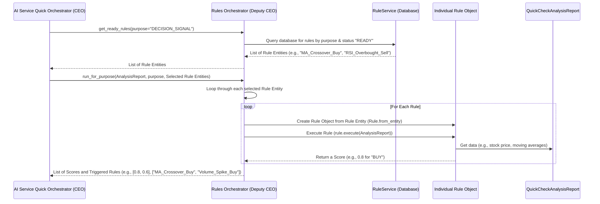

# Chapter 4: Rules Orchestrator (Deputy CEO)

Welcome back, future AI architect! In [Chapter 1: AI Service Quick Orchestrator (CEO)](01_ai_service_quick_orchestrator__ceo__.md), we met our system's main manager. Then, in [Chapter 2: Personal Analysis Orchestrator (Deputy CEO)](02_personal_analysis_orchestrator__deputy_ceo__.md), we learned how the system tailors advice to your unique investment style. Most recently, in [Chapter 3: Advisor Orchestrator (Deputy CEO)](03_advisor_orchestrator__deputy_ceo__.md), we saw how all this information comes together to give you concrete "BUY," "SELL," or "HOLD" recommendations.

But where do those "rules" that influence buying and selling come from? How does the system automatically check if a stock meets certain conditions for a trade? That's exactly what we'll explore today with the **Rules Orchestrator**! We like to call it the **Deputy CEO of Trading Strategy** or simply the **"Rules Master."**

## The Problem: Automating Trading Logic

Imagine you're an investor, and you have a favorite trading strategy. It might sound something like this:

*   "**BUY** stock if its price goes *above* the average price of the last 50 days (a 'moving average crossover') AND the overall market sentiment is positive."
*   "**SELL** stock if its price falls *below* its average price of the last 200 days AND company news is negative."
*   "**HOLD** if neither of the above conditions is met."

These are called **trading rules**. Manually checking these rules for hundreds of stocks every day would be impossible! You need a system that can:

1.  **Store** many different trading rules.
2.  **Fetch** the right rules for a given situation.
3.  **Execute** these rules against the latest market data (like prices, news, and technical indicators).
4.  **Provide a score** or signal (e.g., "0.8 for BUY," "0.9 for HIGH RISK").

This is the exact problem our **Rules Orchestrator** solves. It's the component that knows all the different trading strategies and applies them consistently.

## Meet the Rules Orchestrator: Your Trading Strategy Department

Think of the **Rules Orchestrator** as the "Head of Trading Strategy" at our AI company. This department has a vast library of predefined trading rules, much like a playbook of different moves in a game.

Its main responsibilities are:

*   **Rule Library Manager:** It connects to the database to store and retrieve all the predefined trading rules. These rules aren't just simple `if/then` statements; they can be quite complex, involving multiple market indicators.
*   **Rule Execution Engine:** Once it has a rule, it can "run" that rule against the latest market analysis data (provided by the [Analysis Orchestrator](05_analysis_orchestrator__deputy_ceo__.md)). For example, it will check if "Apple's price is above its 50-day moving average" using the actual data for Apple.
*   **Personalization Link:** It works hand-in-hand with the [Personal Analysis Orchestrator (Deputy CEO)](02_personal_analysis_orchestrator__deputy_ceo__.md) to make sure only the rules that fit *your* personal investment style are actually considered and executed. No point in running a "high-risk" rule if you're a "safety-first" investor!

The Rules Orchestrator is crucial for applying consistent, data-driven logic to identify potential trading signals, measure risks, and spot opportunities, all according to established strategies.

## How the CEO Uses the Rules Orchestrator

As we learned in [Chapter 1: AI Service Quick Orchestrator (CEO)](01_ai_service_quick_orchestrator__ceo__.md), the main CEO orchestrator coordinates many tasks when you ask for a full investment report. The Rules Orchestrator plays a vital role in two key steps:

1.  **Getting all rules:** The CEO asks the Rules Orchestrator to provide all available rules related to decisions, risks, and opportunities.
2.  **Executing personalized rules:** After the [Personal Analysis Orchestrator](02_personal_analysis_orchestrator__deputy_ceo__.md) filters these rules to match your style, the CEO sends these *personalized* rules back to the Rules Orchestrator to actually run them against the market data.

Let's look at a simplified version of how the CEO orchestrator calls the Rules Orchestrator in `app/orchestrator.py`:

```python
# app/orchestrator.py (Simplified)

class AIServiceQuickOrchestrator:
    # ... __init__ and other methods ...

    async def get_full_advisor_report(
        self,
        ticker: str,
        quantitive_config: QuantitivePreferencesConfig, # Your preferences
        limit: int = 10,
    ) -> AdvisorReportSchema:
        logger.info(f"CEO -> Initiating full ADVISOR workflow for '{ticker}'...")

        # 1. Ask Analysis Deputy CEO for market analysis
        analysis_report = await self.analysis.get_full_analysis_report(
            ticker, "medium", "all"
        )

        # 2. Ask Rules Deputy CEO for all rules (decision, risk, opportunity)
        decision_all_rules = await self.rules.get_ready_rules(purpose=SemanticType.DECISION_SIGNAL)
        risk_all_rules = await self.rules.get_ready_rules(purpose=SemanticType.RISK_LEVEL)
        oppor_all_rules = await self.rules.get_ready_rules(purpose=SemanticType.OPPORTUNITY_RATING)

        # 3. Ask Personal Deputy CEO to filter these rules based on your preferences
        decision_selected_rules = self.personal.filter_rules(
            decision_all_rules, quantitive_config=quantitive_config, limit=limit
        )
        risk_selected_rules = self.personal.filter_rules( # ... and for risk rules ...
            risk_all_rules, quantitive_config=quantitive_config, limit=limit
        )
        # ... and for opportunity rules ...

        # 4. Ask Rules Deputy CEO to run the *personalized* rules in parallel
        decision_task = self.rules.run_for_purpose(analysis_report, SemanticType.DECISION_SIGNAL, decision_selected_rules)
        risk_task = self.rules.run_for_purpose(analysis_report, SemanticType.RISK_LEVEL, risk_selected_rules)
        opp_task = self.rules.run_for_purpose(analysis_report, SemanticType.OPPORTUNITY_RATING, oppor_selected_rules)
        decision_results, risk_results, opp_results = await asyncio.gather(
            decision_task, risk_task, opp_task
        )

        # 5. Give everything to the Advisor Deputy CEO for final advice
        advisor_report = await self.advisor.get_advisor_report(
            analysis_report,
            decision_results, # These are the results from running your personalized rules!
            risk_results,
            opp_results,
            behavior_modifiers=quantitive_config.modifiers,
            # ... other parameters ...
        )

        return advisor_report
```

**What's happening here?**

*   The CEO first gets the `analysis_report` (all the market data) from the [Analysis Orchestrator](05_analysis_orchestrator__deputy_ceo__.md).
*   Then, it calls `self.rules.get_ready_rules` three times to get all rules related to `DECISION_SIGNAL` (buy/sell), `RISK_LEVEL`, and `OPPORTUNITY_RATING`.
*   These raw rules are sent to `self.personal.filter_rules` (the [Personal Analysis Orchestrator](02_personal_analysis_orchestrator__deputy_ceo__.md)) to get `_selected_rules` that match your profile.
*   Finally, the CEO calls `self.rules.run_for_purpose` three times, passing the `analysis_report` and your `_selected_rules`. This tells the Rules Orchestrator: "Here's the data, here are *your* rules, now tell me what scores they generate!"
*   The results (`decision_results`, `risk_results`, `opp_results`) are then passed to the [Advisor Orchestrator](03_advisor_orchestrator__deputy_ceo__.md) to form the final advice.

## Under the Hood: How the Rules Orchestrator Works Its Magic

Let's zoom in on what happens inside the **Rules Orchestrator** when it's asked to fetch or run rules.

### The Rules Orchestrator's Plan

When the CEO asks the Rules Orchestrator to `get_ready_rules` or `run_for_purpose`, here's a simplified view of its internal process:



As you can see, the Rules Orchestrator delegates to a `RuleService` to get the actual rule definitions from the database and then creates `Rule` objects to run the logic.

## The Code: Rules Orchestrator

Let's look at how the `RulesOrchestrator` is structured and what its core methods do.

### 1. Initialization: Appointing Department Heads

Just like other orchestrators, the `RulesOrchestrator` is created once when the application starts, in `app/dependencies.py`. It receives its own "assistants":

```python
# app/dependencies.py (Simplified)

# ... other imports ...
from itapia_common.dblib.services import RuleService
from .rules import RulesOrchestrator
from .rules.explainer import RuleExplainerOrchestrator

# ... inside create_dependencies() ...

rule_service = RuleService(rdbms_session=db) # Manages rules in the database
rule_explainer = RuleExplainerOrchestrator() # Helps explain rules in plain English

rule_orc = RulesOrchestrator(rule_service, explainer=rule_explainer)

# ... later, the CEO gets this rule_orc ...
_ceo_orchestrator = AIServiceQuickOrchestrator(
    # ... other deputies ...
    rule_orchestrator=rule_orc,
)
```

**Explanation:**
*   The `RulesOrchestrator` is initialized with a `rule_service` (which handles talking to the database to get rule definitions) and a `rule_explainer` (which can translate complex rule logic into simple language). This is called **Dependency Injection**.

### 2. Getting the Rules: `get_ready_rules`

The first step the CEO asks for is a list of rules. This is handled by `get_ready_rules` in `app/rules/orchestrator.py`:

```python
# app/rules/orchestrator.py (Simplified)

class RulesOrchestrator:
    def __init__(self, rule_service: RuleService, explainer: RuleExplainerOrchestrator):
        self.rule_service = rule_service
        self.explainer = explainer

    async def get_ready_rules(self, purpose: SemanticType) -> List[RuleEntity]:
        """Get all ready rules for a specific purpose."""
        if purpose != SemanticType.ANY:
            rule_entities = self.rule_service.get_rules_by_purpose(
                purpose, RuleStatus.READY # Only get rules that are "READY"
            )
        else: # If purpose is ANY, get all ready rules regardless of purpose
            rule_entities = self.rule_service.get_all_rules(RuleStatus.READY)

        if rule_entities is None:
            raise NoDataError(f"No rules is actived!")
        return rule_entities
```

**Explanation:**
*   This method simply asks the `self.rule_service` (our database manager for rules) to fetch rules.
*   It filters by `purpose` (e.g., `DECISION_SIGNAL`, `RISK_LEVEL`) and `RuleStatus.READY` (meaning they've been tested and are active).
*   It returns a `List[RuleEntity]`, which are the raw definitions of the rules.

You can even access these rules directly through an API endpoint to see what's available:

```python
# app/api/v1/endpoints/rules.py (Simplified)

from app.dependencies import get_ceo_orchestrator
from fastapi import APIRouter, Depends
from itapia_common.schemas.entities.rules import SemanticType, RuleResponse

router = APIRouter()

@router.get("/rules", response_model=list[RuleResponse], summary="Get list of ready rules")
async def get_ready_rules(
    purpose: SemanticType = SemanticType.ANY, # Filter by type of rule
    orchestrator: AIServiceQuickOrchestrator = Depends(get_ceo_orchestrator),
):
    """Get list of ready rules."""
    report = await orchestrator.get_ready_rules(purpose=purpose)
    return [
        RuleResponse( # Converts the internal RuleEntity to a public-facing RuleResponse
            rule_id=rule.rule_id,
            name=rule.name,
            purpose=rule.purpose,
            # ... other fields ...
        )
        for rule in report
    ]
```

**What happens when you call this API?**
If you call `/rules?purpose=DECISION_SIGNAL`, it would return a list of rules like:
```json
[
  {
    "rule_id": "ma_crossover_buy_signal_01",
    "name": "Moving Average Crossover Buy Signal",
    "purpose": "DECISION_SIGNAL",
    // ... other rule details ...
  },
  {
    "rule_id": "rsi_oversold_buy_signal_02",
    "name": "RSI Oversold Buy Signal",
    "purpose": "DECISION_SIGNAL",
    // ... other rule details ...
  }
]
```
This shows you the available strategies the system can apply.

### 3. Running the Rules: `run_for_purpose`

This is the core method where the rules are actually put into action. It takes the `analysis_report` (all the market data for a stock) and the `rule_entities` (the personalized rules from the CEO) and executes them:

```python
# app/rules/orchestrator.py (Simplified)

class RulesOrchestrator:
    # ... __init__ and get_ready_rules ...

    async def run_for_purpose(
        self,
        report: QuickCheckAnalysisReport, # The market data (prices, news, tech indicators)
        purpose: SemanticType,
        rule_entities: List[RuleEntity], # The rules to run
    ) -> Tuple[List[float], List[TriggeredRuleInfo]]:
        """Retrieve, filter, and execute common rules for a specific purpose."""

        # Convert raw rule definitions (entities) into executable Rule objects
        all_rules = [Rule.from_entity(rs) for rs in rule_entities]

        scores: List[float] = [] # To store the results (e.g., 0.8 for BUY)
        triggered_rules: List[TriggeredRuleInfo] = [] # To store which rules triggered

        for rule in all_rules:
            # THIS IS THE CRUCIAL STEP: The rule object executes itself against the report!
            score = rule.execute(report)
            scores.append(score)

            # If a rule "triggers" (i.e., its score is not 0), we record it
            if not math.isclose(score, 0.0): # Only add if the rule actually gave a signal
                triggered_rules.append(
                    TriggeredRuleInfo(
                        rule_id=rule.rule_id,
                        name=rule.name,
                        score=score,
                        purpose=purpose.name,
                    )
                )
        return scores, triggered_rules
```

**Explanation:**
*   `run_for_purpose` receives the `QuickCheckAnalysisReport` (which has all the market data for a specific stock) and the `List[RuleEntity]` (your selected rules).
*   `[Rule.from_entity(rs) for rs in rule_entities]` This line is important! It takes the static rule definitions from the database (`RuleEntity`) and turns them into active, runnable `Rule` objects.
*   The `for rule in all_rules:` loop goes through each selected rule.
*   `score = rule.execute(report)`: This is where the magic happens! Each `Rule` object has its own logic (e.g., "Is MA 50 > MA 200?"). It uses the `report` to get the necessary data (like current price, moving averages, etc.) and calculates a score. A score of `0.0` usually means the rule didn't trigger, while a score closer to `1.0` means a strong signal.
*   The scores and information about which rules actually triggered are collected and returned to the CEO.

This step-by-step process ensures that the vast library of trading knowledge is effectively applied to real-time market data, providing the foundational signals that the [Advisor Orchestrator](03_advisor_orchestrator__deputy_ceo__.md) uses to give you personalized recommendations.

## Conclusion

In this chapter, we've explored the **Rules Orchestrator (Deputy CEO)**, the "Head of Trading Strategy" that manages, fetches, and executes a library of predefined trading rules. We learned how it takes market analysis data and applies complex trading logic to generate scores and identify signals. This ensures that our AI system can consistently apply established strategies, which are then filtered for your personal preferences by the [Personal Analysis Orchestrator](02_personal_analysis_orchestrator__deputy_ceo__.md) and finally used by the [Advisor Orchestrator](03_advisor_orchestrator__deputy_ceo__.md) to craft actionable investment advice.

Next, we'll dive into another crucial Deputy CEO: the **Analysis Orchestrator**. This is the component responsible for gathering and processing all the raw market data, creating the detailed `QuickCheckAnalysisReport` that the Rules Orchestrator depends on! Get ready for [Analysis Orchestrator (Deputy CEO)](05_analysis_orchestrator__deputy_ceo__.md)!

---

Generated by [AI Codebase Knowledge Builder](https://github.com/The-Pocket/Tutorial-Codebase-Knowledge)