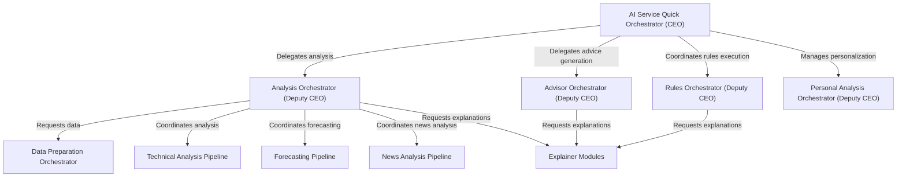

# Tutorial: ai_service_quick

The `ai_service_quick` project functions as a **comprehensive financial intelligence platform**. It efficiently generates *detailed market analysis reports* by combining technical, forecasting, and news data, then leverages *personalized trading rules* and user preferences to deliver **actionable investment recommendations** and clear explanations.

**Source Repository:** [None](None)

## Chapters

1. [AI Service Quick Orchestrator (CEO)
](01_ai_service_quick_orchestrator__ceo__.md)
2. [Personal Analysis Orchestrator (Deputy CEO)
](02_personal_analysis_orchestrator__deputy_ceo__.md)
3. [Advisor Orchestrator (Deputy CEO)
](03_advisor_orchestrator__deputy_ceo__.md)
4. [Rules Orchestrator (Deputy CEO)
](04_rules_orchestrator__deputy_ceo__.md)
5. [Analysis Orchestrator (Deputy CEO)
](05_analysis_orchestrator__deputy_ceo__.md)
6. [Explainer Modules
](06_explainer_modules_.md)
7. [Data Preparation Orchestrator
](07_data_preparation_orchestrator_.md)
8. [Technical Analysis Pipeline
](08_technical_analysis_pipeline_.md)
9. [Forecasting Pipeline
](09_forecasting_pipeline_.md)
10. [News Analysis Pipeline
](10_news_analysis_pipeline_.md)

---

Generated by [AI Codebase Knowledge Builder](https://github.com/The-Pocket/Tutorial-Codebase-Knowledge)