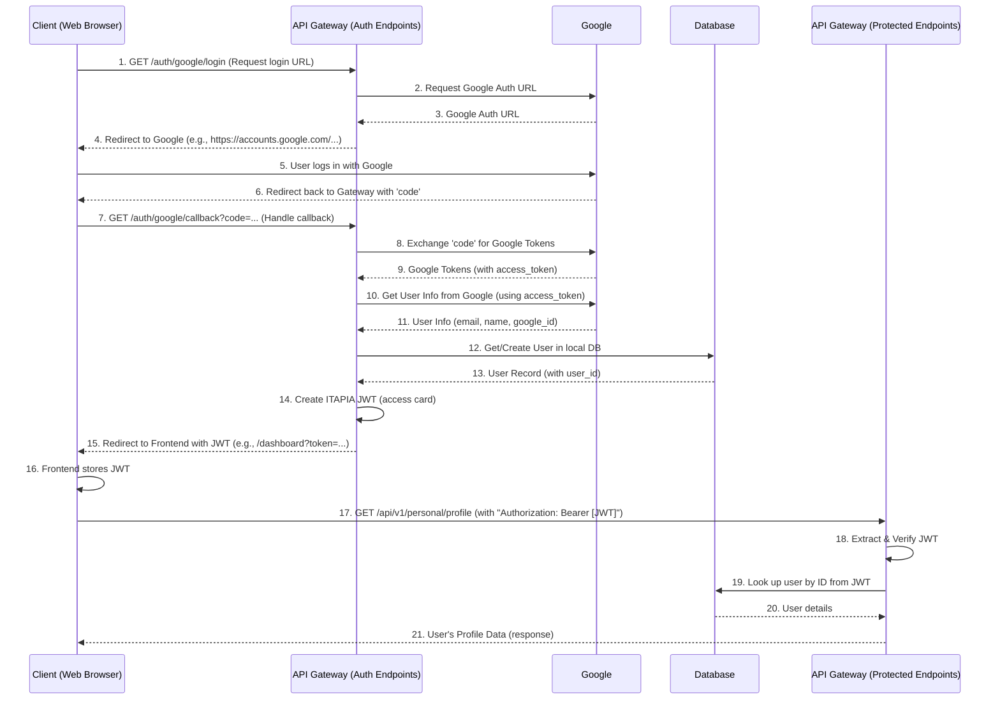

# Chapter 3: Authentication & Authorization

Welcome back! In our last chapter, [API Endpoints](02_api_endpoints_.md), we learned how our API Gateway routes specific requests to the right "doors" or "counters" to perform different tasks. You can now ask for a market analysis report, or perhaps some user information.

But imagine you walk up to a bank counter and ask for someone else's account balance. Or you try to change someone else's profile details! That wouldn't be allowed, right?

This is where **Authentication & Authorization** come in. It's the security system of our API Gateway, making sure only the right people can access the right information and perform the right actions.

### The Bouncer at the Club Entrance: What Problem Do We Solve?

Think of our API Gateway as an exclusive club.
*   You can look at the sign outside (public API endpoints), but you can't get in without proving who you are.
*   Even inside, some areas are restricted (e.g., the VIP lounge, which only certain members can access).

**Authentication** is like showing your ID to the bouncer at the club entrance. It's about proving *who you are*.
**Authorization** is what happens *after* the bouncer verifies your ID. It's about deciding *what you are allowed to do* inside the club, based on your membership level or status.

In our `api_gateway` project, this system handles two main things:
1.  **Authentication:** How users prove their identity (e.g., "I am John Doe"). We'll use **Google Login** for this, which is a common and secure way for users to sign in.
2.  **Authorization:** Once we know who you are, what are you allowed to do? (e.g., "John Doe is allowed to view his own profile, but not change someone else's"). This is managed using secure "access cards" called **JWT tokens**.

Our central use case for this chapter: **How does a user log in to our system, get an "access card," and then use that card to access their own private profile information?**

### Getting Your Access Card: The Authentication Flow (Google Login)

Let's trace how a user proves their identity and gets their "access card" (JWT token) using Google Login.

#### Step 1: Requesting to Log in

When a user wants to log in, our frontend application will send them to an endpoint in our Gateway, like `/auth/google/login`. This endpoint's job is to prepare the Google login page for the user.

Here's the simplified endpoint code:

```python
# app/api/v1/endpoints/auth.py

from fastapi import APIRouter
from app.services.auth.security import get_authorized_url # Our helper function

router = APIRouter()

@router.get(
    "/auth/google/login",
    tags=["Auth"],
    summary="Get Google OAuth authorization URL",
)
def google_login():
    """
    1. User clicks 'Login with Google' on frontend.
    2. Frontend asks our Gateway for Google's login URL.
    3. Gateway prepares and returns Google's login URL.
    """
    url = get_authorized_url() # This function builds the special Google URL
    return {"authorization_url": url}
```

This `google_login` endpoint doesn't actually log the user in. Instead, it generates a special URL from Google. Our frontend then redirects the user to *that Google URL*.

The `get_authorized_url` function, found in `app/services/auth/security.py`, is responsible for creating this URL:

```python
# app/services/auth/security.py

from urllib.parse import urlencode
from app.core.config import GOOGLE_AUTH_URL, GOOGLE_CLIENT_ID, BACKEND_CALLBACK_URL # ... and scopes

def get_authorized_url():
    # ... (error handling for missing GOOGLE_CLIENT_ID) ...

    params = {
        "response_type": "code",
        "client_id": GOOGLE_CLIENT_ID, # Our unique ID from Google
        "redirect_uri": BACKEND_CALLBACK_URL, # Where Google sends the user back
        "scope": " ".join(GOOGLE_OAUTH_SCOPES), # What info we want from Google
        # ... other parameters ...
    }
    authorization_url = f"{GOOGLE_AUTH_URL}?{urlencode(params)}"
    return authorization_url
```

This code builds a URL that looks something like: `https://accounts.google.com/o/oauth2/v2/auth?client_id=...&redirect_uri=...&scope=...`. When a user visits this URL, they are taken to Google's familiar login page.

#### Step 2: Google Confirms Identity & Redirects Back

After the user successfully logs in with Google (entering their username and password on Google's site), Google confirms their identity and redirects them *back to our API Gateway*. But not just anywhere! It redirects them to a specific "callback" endpoint we told it about: `/auth/google/callback`. Google also sends along a special `code`.

```python
# app/api/v1/endpoints/auth.py

import app.services.auth.google as google # For Google-specific interactions
from app.services.auth.security import create_access_token # To make our JWT
from app.dependencies import get_users_service # To manage users in our DB
from app.core.config import FRONTEND_CALLBACK_URL # Where we send the user next

# ... (router definition) ...

@router.get(
    "/auth/google/callback",
    summary="Handle Google OAuth callback and generate JWT token",
)
async def google_callback(code: str, user_service = Depends(get_users_service)):
    """
    1. Google sends user back here with a 'code'.
    2. We use the 'code' to get user info from Google.
    3. We find/create the user in our database.
    4. We create our own secure "access card" (JWT token).
    5. We redirect the user to the frontend with the access card.
    """
    # 1. Exchange the code for Google's tokens
    google_tokens = await google.get_google_tokens(code=code)
    # 2. Use Google's access token to get user info (name, email, etc.)
    user_info = await google.get_google_user_info(access_token=google_tokens["access_token"])

    # 3. Find or create the user in our own database
    user_in_db = user_service.get_or_create(user_info)

    # 4. Create our own secure "access card" (JWT token) for the user
    access_token = create_access_token(subject=user_in_db.user_id)

    # 5. Redirect the user back to the frontend, passing the JWT token
    frontend_callback_url = f"{FRONTEND_CALLBACK_URL}?token={access_token}"
    return RedirectResponse(url=frontend_callback_url)
```

Let's break down the key parts of this `google_callback` function:

*   **`google.get_google_tokens(code=code)`**: This function (from `app/services/auth/google.py`) takes the `code` from Google and exchanges it for Google's own access token. This is like exchanging a temporary visitor pass for a proper entry badge at Google's reception.
*   **`google.get_google_user_info(...)`**: With Google's access token, we ask Google for basic user information like their email, name, and a unique Google ID.
*   **`user_service.get_or_create(user_info)`**: Now that we have Google's verified user info, we check if this user already exists in *our* system's database. If they do, we retrieve their record; if not, we create a new user entry. This is managed by the [User and Profile Management Services](04_user_and_profile_management_services_.md).
*   **`create_access_token(subject=user_in_db.user_id)`**: This is the crucial step! We create our own "access card" – a **JWT (JSON Web Token)**. This token contains a small amount of information (like the user's ID in our system) and is digitally signed by our Gateway. This signature makes it tamper-proof. The `JWT_SECRET_KEY` (from [Configuration Management](06_configuration_management_.md)) is used for this signing.
*   **`RedirectResponse(url=f"{FRONTEND_CALLBACK_URL}?token={access_token}")`**: Finally, we redirect the user's browser back to our frontend application, passing the newly created JWT token in the URL. The frontend then stores this token.

Now the user has their "access card"!

### Using Your Access Card: The Authorization Flow

Once the frontend has the JWT token, it will include it with every *protected* request the user makes. This is like showing your access card every time you try to enter a restricted area of the club.

#### Step 1: Making a Protected Request

Let's say a user wants to view their own profile. They might make a request like `GET /api/v1/personal/profile`. The important thing is that the frontend will now add an `Authorization` header to this request:

`Authorization: Bearer <YOUR_JWT_TOKEN_HERE>`

#### Step 2: Verifying the Access Card at the Gateway

Any endpoint that needs to be protected will declare a dependency on our authentication system. This is done using FastAPI's `Depends` feature.

```python
# app/api/v1/endpoints/profiles.py (Example of a protected endpoint)

from fastapi import APIRouter, Depends
from app.dependencies import get_current_user_dep # Our authentication dependency
from itapia_common.schemas.entities.users import UserEntity # To type hint the user object

router = APIRouter()

@router.get("/personal/profile", tags=["Profile"], summary="Get current user's profile")
async def get_my_profile(
    current_user: UserEntity = Depends(get_current_user_dep) # THIS LINE PROTECTS THE ENDPOINT
):
    """
    Get the profile information for the currently authenticated user.
    """
    # If we reach here, the user is authenticated and authorized!
    print(f"User {current_user.email} is requesting their profile.")
    return {"user_id": current_user.user_id, "email": current_user.email, "message": "Your profile data!"}
```

The magic happens with `current_user: UserEntity = Depends(get_current_user_dep)`. This tells FastAPI: "Before you run this `get_my_profile` function, first execute `get_current_user_dep`."

Let's look at `get_current_user_dep` in `app/dependencies.py`:

```python
# app/dependencies.py

from fastapi import Depends
from fastapi.security import OAuth2PasswordBearer # Tool to extract token
from itapia_common.schemas.entities.users import UserEntity
from .services.auth._service import get_current_user # Our core auth logic
from .services.users import UserService # To get user info from DB

# This object tells FastAPI where to find our login (token) endpoint for documentation
oauth2_scheme = OAuth2PasswordBearer(tokenUrl="token")

def get_current_user_dep(
    user_service: UserService = Depends(get_users_service), # Get our User Service
    token: str = Depends(oauth2_scheme), # Extract the token from the request
) -> UserEntity:
    """
    This function is a dependency that:
    1. Extracts the JWT token from the incoming request.
    2. Calls our 'get_current_user' service to verify the token and find the user.
    3. Returns the UserEntity if successful, or raises an error if not.
    """
    return get_current_user(user_service, token)
```

Here:
*   `oauth2_scheme = OAuth2PasswordBearer(tokenUrl="token")` is a FastAPI tool that automatically looks for the `Authorization: Bearer <token>` header and extracts the token string.
*   `token: str = Depends(oauth2_scheme)` means that the `token` variable will receive the extracted JWT string.
*   `get_current_user(user_service, token)`: This is where our core logic for verifying the token and retrieving the user lives.

Finally, let's look at `get_current_user` in `app/services/auth/_service.py`:

```python
# app/services/auth/_service.py

from app.services.users import UserService
from itapia_common.schemas.entities.users import UserEntity
from .security import verify_access_token # To decode/verify the JWT

def get_current_user(
    user_service: UserService,
    token: str,
) -> UserEntity:
    """
    1. Verifies the JWT token.
    2. Extracts the user ID from the token.
    3. Retrieves the user's full information from the database.
    """
    payload = verify_access_token(token) # Check if the token is valid and signed by us
    user_id = payload.get("sub") # The 'sub' field usually contains the subject (user ID)

    if user_id is None:
        raise AuthError("Invalid token payload") # Token was invalid or missing user ID

    user = user_service.get_user_by_id(user_id) # Get user from DB (from Chapter 4)
    return user
```

This function is the heart of authorization:
*   **`verify_access_token(token)`**: This (from `app/services/auth/security.py`) checks if the JWT is valid (not expired, and signed with *our* secret key). If it's invalid, it immediately raises an error, stopping the request.
*   **`user_id = payload.get("sub")`**: If the token is valid, we extract the user's ID from its payload.
*   **`user_service.get_user_by_id(user_id)`**: We then use this ID to fetch the complete user information from our database. This is a secure step, as we don't store sensitive user data directly in the JWT; we only store enough information to look up the user in our trusted database.

If all these steps pass, the `get_current_user_dep` dependency successfully returns a `UserEntity` object. This `UserEntity` is then passed to our `get_my_profile` endpoint as `current_user`, and the endpoint can now confidently know *who* is making the request and proceed to fetch *their* profile data.

### The Full Journey: From Login to Protected Data

Let's visualize the entire process:



This diagram shows that authentication (Steps 1-15) and authorization (Steps 17-21) are distinct but linked processes. The JWT token is the bridge between them.

### Configuration Management: The Security Settings

Many important settings for our authentication and authorization, like `GOOGLE_CLIENT_ID`, `JWT_SECRET_KEY`, `BACKEND_CALLBACK_URL`, etc., are loaded from environment variables using [Configuration Management](06_configuration_management_.md). This keeps sensitive information out of our code and allows easy changes without redeploying the application.

```python
# app/core/config.py (Snippet)

# Google OAuth
GOOGLE_CLIENT_ID = os.getenv("GOOGLE_CLIENT_ID")
GOOGLE_CLIENT_SECRET = os.getenv("GOOGLE_CLIENT_SECRET")
# ... other Google URLs and scopes ...

# JWT Settings
JWT_SECRET_KEY = os.getenv("JWT_SECRET_KEY")
JWT_ALGORITHM = os.getenv("JWT_ALGORITHM", "HS256")
ACCESS_TOKEN_EXPIRE_MINUTES = int(os.getenv("ACCESS_TOKEN_EXPIRE_MINUTES", "30"))

# Redirect URIs
BACKEND_CALLBACK_URL = os.getenv("BACKEND_CALLBACK_URL")
FRONTEND_CALLBACK_URL = os.getenv("FRONTEND_CALLBACK_URL")
```

It's crucial that `JWT_SECRET_KEY` is kept secret and never shared, as it's used to sign and verify all our access tokens!

### Conclusion

In this chapter, we explored the critical concepts of **Authentication & Authorization** in our `api_gateway`. We learned:

*   **Authentication** is how users prove their identity, often through external providers like Google Login.
*   **Authorization** is what users are allowed to do once their identity is confirmed.
*   **JWT tokens** act as secure "access cards," generated by our Gateway after successful authentication and used to authorize subsequent requests.
*   Endpoints are protected using FastAPI's `Depends` system, which ensures a valid JWT is present and identifies the user before processing sensitive requests.

This security layer is fundamental to any robust API Gateway, ensuring that only legitimate and authorized users can interact with our system's functionalities.

Now that we understand how users log in and access protected resources, let's dive into how we manage those users and their profiles within our system.

[Next Chapter: User and Profile Management Services](04_user_and_profile_management_services_.md)

---

Generated by [AI Codebase Knowledge Builder](https://github.com/The-Pocket/Tutorial-Codebase-Knowledge)