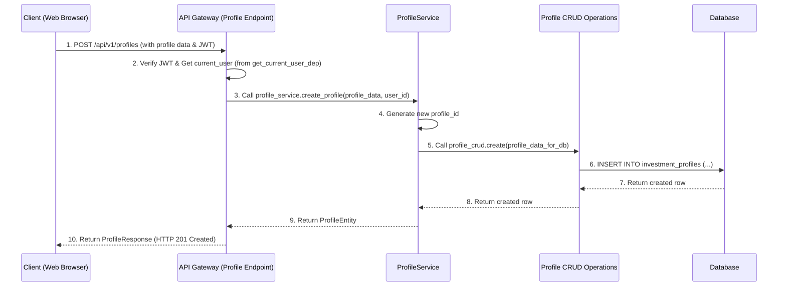

# Chapter 4: User and Profile Management Services

Welcome back! In our last chapter, [Authentication & Authorization](03_authentication___authorization_.md), we learned how users prove their identity (authenticate) and what actions they're allowed to perform (authorize). Once a user successfully logs in, they get their special "access card" (JWT token), which lets them access protected parts of our system.

Now, imagine our API Gateway is a very sophisticated bank. A customer (user) comes in, shows their ID (authentication), and gets access to their account. But what's *in* that account? What's their current balance? What are their savings goals? Where do we store all this personalized information?

This is where **User and Profile Management Services** come in!

### The Bank's Customer Records Department: What Problem Do We Solve?

These services are like the dedicated administrative department or the customer records office of our system. Their job is to manage all the personal data related to users and their specific needs. Without them, our system would know *who* a user is, but not *what* their preferences, settings, or personalized investment profiles are.

Our central use case for this chapter: **How does a logged-in user create, view, update, and delete their personal investment profiles within our system?**

### Key Concepts: Users and Their Profiles

1.  **Users:** As we saw in Chapter 3, a user is an individual who interacts with our system. When they log in via Google, we create an entry for them in our database. This entry contains basic information like their unique `user_id`, `email`, `full_name`, and `google_id`.
    *   Think of the `user_id` as their unique customer ID at the bank.

2.  **Investment Profiles:** This is where things get personal! An investment profile is a collection of specific financial preferences, goals, and risk tolerances that *belong to a user*. A user might have multiple profiles (e.g., "Retirement Savings," "Aggressive Growth Fund," "Education Fund").
    *   Think of these as different types of accounts a customer has at the bank (checking, savings, mutual fund). Each account has its own details.

These services ensure that user data is:
*   **Created:** When a new user logs in, or they want a new profile.
*   **Retrieved:** When a user wants to see their existing data.
*   **Updated:** When a user changes their mind or circumstances.
*   **Deleted:** When a user no longer needs a profile or leaves the system.

### Interacting with User and Profile Data: Our API Endpoints

Our API Gateway provides specific "doors" (endpoints) for clients (like a web app) to manage user and profile data. These are defined in files like `app/api/v1/endpoints/profiles.py` and handled by the `ProfileService`.

Crucially, **all these endpoints are protected** by our authentication system. This means only a *logged-in and authorized user* can access or modify *their own* profiles. Remember the `current_user: UserEntity = Depends(get_current_user_dep)` from [Chapter 3: Authentication & Authorization](03_authentication___authorization_.md)? It's essential here.

Let's look at some examples:

#### 1. Creating a Profile (`POST /profiles`)

A user wants to set up a new investment profile, perhaps for "Aggressive Growth."

```python
# app/api/v1/endpoints/profiles.py (Simplified)

from fastapi import APIRouter, Depends, status
from app.dependencies import get_current_user_dep, get_profile_service
from itapia_common.schemas.api.profiles import ProfileCreateRequest, ProfileResponse
from itapia_common.schemas.entities.profiles import ProfileCreate
from itapia_common.schemas.entities.users import UserEntity
from app.services.profiles import ProfileService

router = APIRouter()

@router.post(
    "/profiles",
    response_model=ProfileResponse,
    status_code=status.HTTP_201_CREATED,
    tags=["User Profiles"],
    summary="Create a new investment profile for the current user",
)
def create_user_profile(
    profile_in: ProfileCreateRequest, # Data for the new profile
    profile_service: ProfileService = Depends(get_profile_service), # Our service 'clerk'
    current_user: UserEntity = Depends(get_current_user_dep), # Ensures user is logged in
):
    """
    Handles creating a new investment profile.
    Only the logged-in user can create a profile for themselves.
    """
    # 1. The service creates the profile in the database
    created_profile = profile_service.create_profile(
        profile_in=ProfileCreate.model_validate(profile_in.model_dump()),
        user_id=current_user.user_id, # Link profile to the authenticated user
    )
    # 2. Return the newly created profile data
    return created_profile # (Simplified return for tutorial)
```

**Explanation:**
*   `@router.post("/profiles")`: This defines an endpoint that handles `POST` requests to `/api/v1/profiles` (remember the `/api/v1` prefix from [Chapter 1: FastAPI Gateway Application](01_fastapi_gateway_application_.md)).
*   `profile_in: ProfileCreateRequest`: This is the data sent by the client (e.g., profile name, risk tolerance) in the request body.
*   `profile_service = Depends(get_profile_service)`: This is how we get access to our `ProfileService`, which contains the business logic.
*   `current_user = Depends(get_current_user_dep)`: This is the crucial authentication step. If the user isn't logged in, or their token is invalid, this will raise an error *before* our function even runs. If successful, `current_user` will contain the `UserEntity` of the person making the request.
*   `profile_service.create_profile(...)`: We call a method on our `ProfileService` to actually do the work. We pass the incoming data and, most importantly, the `user_id` from `current_user` to ensure the profile is linked to the correct person.

#### 2. Getting All Profiles (`GET /profiles`)

A user wants to see a list of all their investment profiles.

```python
# app/api/v1/endpoints/profiles.py (Simplified)

# ... (imports) ...

@router.get(
    "/profiles",
    response_model=List[ProfileResponse],
    tags=["User Profiles"],
    summary="Get all investment profiles for the current user",
)
def get_user_profiles(
    profile_service: ProfileService = Depends(get_profile_service),
    current_user: UserEntity = Depends(get_current_user_dep),
):
    """
    Handles retrieving all investment profiles belonging to the logged-in user.
    """
    # 1. The service fetches all profiles for the current user
    profiles = profile_service.get_profiles_by_user(user_id=current_user.user_id)
    # 2. Return the list of profiles
    return profiles # (Simplified return for tutorial)
```

**Explanation:**
*   `@router.get("/profiles")`: Handles `GET` requests to `/api/v1/profiles`.
*   Again, `current_user` ensures only the authenticated user's profiles are fetched.
*   `profile_service.get_profiles_by_user(...)`: Calls the service method to retrieve profiles, using the `user_id` from the authenticated user.

#### 3. Getting a Specific Profile (`GET /profiles/{profile_id}`)

A user wants to see the details of a specific profile, identified by its `profile_id`.

```python
# app/api/v1/endpoints/profiles.py (Simplified)

# ... (imports) ...

@router.get(
    "/profiles/{profile_id}", # {profile_id} is a path parameter
    response_model=ProfileResponse,
    tags=["User Profiles"],
    summary="Get details of a specific investment profile",
)
def get_user_profile_details(
    profile_id: str, # The ID from the URL path
    profile_service: ProfileService = Depends(get_profile_service),
    current_user: UserEntity = Depends(get_current_user_dep),
):
    """
    Retrieves details for a specific profile, ensuring it belongs to the current user.
    """
    # 1. The service fetches the profile by ID, also checking ownership
    profile = profile_service.get_profile_by_id(
        profile_id=profile_id, user_id=current_user.user_id
    )
    # 2. Return the profile details
    return profile # (Simplified return for tutorial)
```

**Explanation:**
*   `profile_id: str`: This variable captures the ID from the URL (e.g., if the URL is `/profiles/abc-123`, `profile_id` will be "abc-123").
*   `profile_service.get_profile_by_id(...)`: This method *also* takes the `user_id` to make sure the requesting user *owns* the profile they are trying to access. This prevents one user from seeing another's private data!

Similar endpoints exist for `PUT` (updating a profile) and `DELETE` (removing a profile), following the same pattern of using `current_user.user_id` to ensure proper authorization.

### What Happens Under the Hood? (Internal Implementation)

Let's trace the journey of a request to create a new profile:



1.  **Client Request:** The web browser sends a `POST` request to `/api/v1/profiles` with the new profile's data and the user's JWT token in the `Authorization` header.
2.  **API Gateway Endpoint (`profiles.py`):** The `create_user_profile` function in `profiles.py` is invoked.
    *   First, `get_current_user_dep` (from [Authentication & Authorization](03_authentication___authorization_.md)) verifies the JWT and identifies the `current_user`. If this fails, the request stops here.
3.  **Profile Service (`app/services/profiles.py`):** The endpoint calls `profile_service.create_profile()`, passing the `profile_in` data and the `current_user.user_id`.
    *   The `ProfileService` (our "clerk") is responsible for applying business logic, like generating a unique `profile_id`. It also ensures the `profile_in` data is correctly structured.
4.  **Profile CRUD Operations (`app/crud/profiles.py`):** The `ProfileService` then calls `profile_crud.create()`. This module is specifically designed to interact directly with the database.
    *   `CRUD` stands for Create, Read, Update, Delete. These functions are very focused on performing basic database operations.
5.  **Database:** The `profile_crud.create()` function executes a raw SQL `INSERT` statement to add the new profile record into the `investment_profiles` table.
6.  **Response Back:** The database returns the newly created row. This data flows back through `profile_crud`, then `ProfileService`, and finally to the `profiles.py` endpoint, which sends it as a `ProfileResponse` to the client.

#### Getting the `ProfileService` and `UserService`

You've seen `profile_service = Depends(get_profile_service)` and `user_service = Depends(get_users_service)`. These functions are defined in `app/dependencies.py` and are crucial for providing instances of our service classes. They are part of a pattern called [Dependency Injection](07_dependency_injection_.md).

```python
# app/dependencies.py (Simplified)

from fastapi import Depends
from sqlalchemy.orm import Session
from itapia_common.dblib.session import get_rdbms_session # Provides a DB connection

from .services.profiles import ProfileService
from .services.users import UserService

# This function provides an instance of our UserService
def get_users_service(
    rdbms_session: Session = Depends(get_rdbms_session), # Get a database session
) -> UserService:
    return UserService(rdbms_session)

# This function provides an instance of our ProfileService
def get_profile_service(rdbms_session: Session = Depends(get_rdbms_session)):
    return ProfileService(rdbms_session)
```

**Explanation:**
*   `Depends(get_rdbms_session)`: Before `get_users_service` or `get_profile_service` runs, FastAPI will first call `get_rdbms_session` to get an active database session. This session is then passed to our service constructors (`UserService(rdbms_session)` and `ProfileService(rdbms_session)`). This allows our services to talk to the database.

#### The `ProfileService` (The Clerk)

The `ProfileService` in `app/services/profiles.py` contains the actual business logic for managing profiles. It acts as the "clerk" that knows *how* to handle profile-related tasks.

```python
# app/services/profiles.py (Simplified)

import uuid
from typing import Any, Dict
from sqlalchemy.orm import Session

from app.core.exceptions import AuthError, DBError, NoDataError
from app.crud import profiles as profile_crud # Our database manager
from itapia_common.schemas.entities.profiles import ProfileCreate, ProfileEntity

class ProfileService:
    def __init__(self, db_session: Session):
        self.db = db_session # Our database connection

    def create_profile(
        self, *, profile_in: ProfileCreate, user_id: str
    ) -> ProfileEntity:
        # 1. Generate a unique ID for the new profile
        profile_id = uuid.uuid4().hex

        # 2. Prepare data for the database (e.g., convert complex Pydantic parts to JSON)
        # We simplify this for the tutorial, but in real code, _convert_parts_to_json_string is used.
        profile_data_to_db = profile_in.model_dump()
        profile_data_to_db["profile_id"] = profile_id
        profile_data_to_db["user_id"] = user_id

        # 3. Call the CRUD layer to insert into the database
        created_row = profile_crud.create(self.db, profile_data=profile_data_to_db)

        if created_row is None:
            raise DBError("Failed to create profile in database.")

        # 4. Convert the database row back into a Python object (ProfileEntity)
        return ProfileEntity.model_validate(created_row)

    # ... other methods like get_profile_by_id, update_profile, remove_profile ...

    def get_profile_by_id(self, *, profile_id: str, user_id: str) -> ProfileEntity:
        row = profile_crud.get_by_id(self.db, profile_id=profile_id)
        entity = ProfileEntity.model_validate(row) if row else None

        if entity is None:
            raise NoDataError(f"Not found profile with id {profile_id}")
        # IMPORTANT: Verify the user owns the profile!
        if user_id != entity.user_id:
            raise AuthError(
                f"Profile with id {profile_id} can not accessed by user {user_id}"
            )
        return entity
```

**Explanation:**
*   `__init__(self, db_session)`: The service gets its database session here.
*   `create_profile`: This method orchestrates the creation. It assigns an ID, prepares data, and calls the `profile_crud` module.
*   `get_profile_by_id`: This method retrieves a profile. It includes a critical check (`if user_id != entity.user_id`) to ensure the *authenticated user* is the *owner* of the profile they are trying to access. This is part of our **authorization** logic.

#### The `Profile CRUD` Operations (The Database Manager)

The `app/crud/profiles.py` module contains simple functions that directly interact with the database. These are like the "database managers" who know the exact SQL commands to execute. They don't contain complex business logic; they just handle raw data operations.

```python
# app/crud/profiles.py (Simplified)

from typing import Any, Dict
from sqlalchemy import text # For writing raw SQL
from sqlalchemy.orm import Session

def create(db: Session, *, profile_data: Dict[str, Any]):
    """Create a new investment profile directly in the database."""
    query = text(
        """
        INSERT INTO investment_profiles (
            profile_id, user_id, profile_name, description, updated_at
        )
        VALUES (
            :profile_id, :user_id, :profile_name, :description, NOW()
        )
        RETURNING *
    """
    )
    result = db.execute(query, profile_data) # Execute the SQL query
    created_row = result.mappings().first()
    db.commit() # Save changes to the database
    return created_row

def get_by_id(db: Session, *, profile_id: str):
    """Get a specific profile from the database by its ID."""
    query = text("SELECT * FROM investment_profiles WHERE profile_id = :profile_id")
    result = db.execute(query, {"profile_id": profile_id})
    return result.mappings().first()

# ... other functions like update, remove, get_multi_by_user ...
```

**Explanation:**
*   `text(...)`: Allows us to write raw SQL queries, which are then executed against the database using the `db.execute()` method.
*   `db.commit()`: This is essential! It saves all the changes made in that database session. Without it, your `INSERT`, `UPDATE`, or `DELETE` commands wouldn't actually be stored.

#### The `UserService` (for User Records)

Just like `ProfileService`, there's also a `UserService` (`app/services/users.py`) that manages the core user records. This service is especially important during the login process, where it's used to either find an existing user or create a new one after Google has authenticated them.

```python
# app/services/users.py (Simplified)

import uuid
from sqlalchemy.orm import Session
from app.crud.users import create, get_by_google_id, get_by_id # User CRUD
from itapia_common.schemas.entities.users import UserCreate, UserEntity

class UserService:
    def __init__(self, rdbms_session: Session):
        self.rdbms_session = rdbms_session

    def get_or_create(self, user: UserCreate) -> UserEntity:
        """Get a user by Google ID, or create a new user if not found."""
        row = get_by_google_id(self.rdbms_session, user.google_id)
        if row:
            return UserEntity(**row) # User found!
        else:
            return self.create_user(user) # User not found, so create it!

    def get_user_by_id(self, user_id: str) -> UserEntity:
        """Get a user by their unique user ID."""
        row = get_by_id(self.rdbms_session, user_id)
        if row:
            return UserEntity(**row)
        raise NoDataError(f"Not found user with id {user_id}")

    # ... other methods ...
```

**Explanation:**
*   `get_or_create`: This is a very handy method used during Google login. It tries to find a user based on their `google_id`. If found, it returns the existing user. If not, it calls `create_user` to make a new entry for them.
*   `get_user_by_id`: This method is used by our authentication system (in `get_current_user` from [Chapter 3](03_authentication___authorization_.md)) to retrieve the full user object after a JWT token has been verified.

### Conclusion

In this chapter, we've explored the "User and Profile Management Services," which are the dedicated "customer records department" of our `api_gateway`. We learned:

*   These services handle the **creation, retrieval, updating, and deletion** (CRUD) of user accounts and their personalized investment profiles.
*   **API Endpoints** in `app/api/v1/endpoints/profiles.py` allow clients to interact with this data.
*   All profile-related endpoints are **protected**, ensuring only authenticated users can manage their *own* profiles.
*   The **`ProfileService`** (in `app/services/profiles.py`) contains the business logic, interacting with the **`Profile CRUD`** module (in `app/crud/profiles.py`) for direct database operations.
*   The **`UserService`** (in `app/services/users.py`) manages the core user records, particularly for login.

This structured approach ensures that user and profile data is managed securely, efficiently, and with proper authorization checks at every step.

Next, we'll shift our focus to how our Gateway interacts with external AI services to provide intelligent features to our users.

[Next Chapter: AI Service Clients](05_ai_service_clients_.md)

---

Generated by [AI Codebase Knowledge Builder](https://github.com/The-Pocket/Tutorial-Codebase-Knowledge)