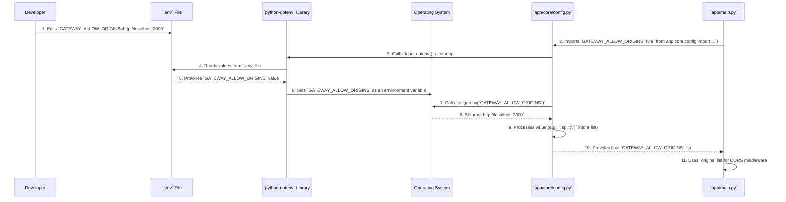

# Chapter 6: Configuration Management

Welcome back! In our last chapter, [AI Service Clients](05_ai_service_clients_.md), we explored how our API Gateway uses special "liaisons" (AI Service Clients) to communicate with external AI microservices. These clients know *how* to talk to the AI services, but they also need to know *where* those services are located – their addresses, like a phone number or a street address.

Imagine you're building a robot. You want to tell it what color light to turn on, which Wi-Fi network to connect to, or what its name is. You wouldn't re-engineer the robot's brain every time you want to change its name or Wi-Fi password, would you? Instead, you'd use a control panel or a settings menu.

### The Application's Control Panel: What Problem Do We Solve?

Our `api_gateway` application is similar. It has many "settings" or "switches" that determine how it behaves:

*   **Where are other services located?** (e.g., the address of the "AI Quick Analysis" service).
*   **What are the security keys?** (e.g., the secret key used to sign user access tokens).
*   **Which websites are allowed to talk to our Gateway?** (remember `GATEWAY_ALLOW_ORIGINS` from [Chapter 1: FastAPI Gateway Application](01_fastapi_gateway_application_.md)?).
*   **How long should a user's login token be valid?**

If we "hardcode" these settings directly into our Python files, changing any setting would mean:
1.  Editing the code.
2.  Building a new version of our application.
3.  Deploying that new version.

This process is slow, can introduce errors, and is bad for security (e.g., you don't want secret keys accidentally committed to a public code repository!).

**Configuration Management** is the solution! It's like having a central "control panel" or "settings menu" for our application. It collects all these vital settings and environment variables in one place, allowing us to easily adjust them *without changing the underlying code*. This makes our Gateway flexible, adaptable to different environments (development, testing, production), and more secure.

**Our central use case for this chapter:** How do we tell our `api_gateway` the exact web address of the "AI Quick Analysis" service and what our secret key for user logins is, without hardcoding these values into our main application logic?

### Key Concepts: The Settings Toolbox

1.  **Environment Variables:** These are like sticky notes or labels that our computer's operating system (or a Docker container) attaches to our running application. Each sticky note has a name (e.g., `AI_QUICK_HOST`) and a value (e.g., `localhost`). Our application can then "read" these sticky notes.
2.  **`.env` file:** For development, we typically use a special text file named `.env` in the root of our project. It's a convenient place to list all our environment variables in a human-readable format (e.g., `VARIABLE_NAME=value`).
3.  **`python-dotenv` library:** A helpful Python library that reads our `.env` file when our application starts up and makes those variables available as standard environment variables.
4.  **`os.getenv()`:** This is a standard Python function. It allows our code to ask the operating system, "Hey, what's the value of the environment variable named `AI_QUICK_HOST`?" It can also provide a "default" value if that variable isn't found.
5.  **`app/core/config.py`:** This is our dedicated "settings manager" file within the `api_gateway`. It's the *only* file in our application that directly reads from environment variables. All other parts of the application import their needed settings from here.

### How to Use It: Setting Up Our Gateway's "Dials"

Let's revisit how our AI Service Clients find their target and how our authentication system generates secure tokens.

#### 1. Defining the Settings in `.env`

First, in your project's root folder, you'd have a `.env` file that looks something like this:

```ini
# .env file in the root of your project
# --- AI Service Addresses ---
AI_QUICK_HOST=localhost
AI_QUICK_PORT=8001
AI_QUICK_V1_BASE_ROUTE=/api/v1

# --- Security Settings ---
JWT_SECRET_KEY=your_super_secret_key_that_is_long_and_random_PLEASE_CHANGE_ME
# ... more settings ...
```

**Explanation:**
*   Each line defines an environment variable. `AI_QUICK_HOST` will have the value `localhost`, `JWT_SECRET_KEY` will have `your_super_secret_key...`, and so on.
*   **Important:** This `.env` file usually should *not* be committed to version control (like Git), especially if it contains sensitive information like `JWT_SECRET_KEY`. For production, these variables are typically set directly on the server or in Docker/Kubernetes configurations.

#### 2. Loading and Centralizing Settings (`app/core/config.py`)

Our `app/core/config.py` file is the central hub. It reads from the `.env` file and processes the variables into ready-to-use Python constants.

```python
# app/core/config.py
import os
from pathlib import Path
from dotenv import load_dotenv # Import the library to load .env files

# --- 1. Find and load the .env file ---
# This line looks for a .env file two directories up from config.py
env_path = Path(__file__).parent.parent.parent.parent / ".env"
load_dotenv(dotenv_path=env_path) # Load variables from that .env file!

# --- 2. Define and process our application settings ---
# API Configuration (from Chapter 1)
GATEWAY_ALLOW_ORIGINS = os.getenv("GATEWAY_ALLOW_ORIGINS", "").split(",")

# Client Configuration (for AI services from Chapter 5)
AI_SERVICE_QUICK_HOST = os.getenv("AI_QUICK_HOST", "localhost")
AI_SERVICE_QUICK_PORT = os.getenv("AI_QUICK_PORT", 8000)
AI_SERVICE_QUICK_V1_BASE_ROUTE = os.getenv("AI_QUICK_V1_BASE_ROUTE", "/api/v1")
# We combine these into a full URL for easy use:
AI_SERVICE_QUICK_BASE_URL = (
    f"http://{AI_SERVICE_QUICK_HOST}:{AI_SERVICE_QUICK_PORT}{AI_SERVICE_QUICK_V1_BASE_ROUTE}"
)

# JWT Settings (for Authentication from Chapter 3)
JWT_SECRET_KEY = os.getenv("JWT_SECRET_KEY") # No default here, it MUST be set!
JWT_ALGORITHM = os.getenv("JWT_ALGORITHM", "HS256")
# ... other settings like Google Client IDs, callback URLs, etc. ...
```

**Explanation:**
*   `load_dotenv(...)`: This is the first thing that happens. It tells the `python-dotenv` library to read our `.env` file and populate the system's environment variables.
*   `os.getenv("VARIABLE_NAME", "default_value")`: This function retrieves the value of an environment variable. If `AI_QUICK_HOST` is set in `.env`, it gets that value. If not, it uses `"localhost"` as a fallback. For `JWT_SECRET_KEY`, we don't provide a default because it's so critical that it *must* be explicitly set.
*   `AI_SERVICE_QUICK_BASE_URL`: Notice how we combine `AI_QUICK_HOST`, `AI_QUICK_PORT`, and `AI_QUICK_V1_BASE_ROUTE` to form a complete URL. This makes it easier to manage parts of the address separately.
*   `.split(',')`: For `GATEWAY_ALLOW_ORIGINS`, we expect a comma-separated string (e.g., `"http://localhost:3000,http://frontend.com"`) and convert it into a Python list of strings.

#### 3. Using the Settings in Other Modules

Once `app/core/config.py` has loaded and processed the settings, other parts of our application simply import them. They don't need to know *how* the setting was loaded, only its name.

**Example 1: AI Service Client (from [Chapter 5: AI Service Clients](05_ai_service_clients_.md))**

```python
# app/clients/ai_quick_analysis.py (Simplified)
import httpx
from app.core.config import AI_SERVICE_QUICK_BASE_URL # Import the configured URL!
# ...

# The AI service client uses the URL from our config
ai_quick_analysis_client = httpx.AsyncClient(
    base_url=AI_SERVICE_QUICK_BASE_URL, timeout=30.0
)

async def get_full_quick_analysis(ticker: str):
    # ... uses ai_quick_analysis_client to send request ...
    print(f"Calling AI service at {ai_quick_analysis_client.base_url}")
    # ...
```

**Explanation:** The `ai_quick_analysis` client simply imports `AI_SERVICE_QUICK_BASE_URL` and uses it. If the AI service's address changes, we only update the `.env` file (and potentially `config.py` if the structure changes), not this client code.

**Example 2: Authentication Security (from [Chapter 3: Authentication & Authorization](03_authentication___authorization_.md))**

```python
# app/services/auth/security.py (Simplified)
from datetime import datetime, timedelta, timezone
from jose import jwt # For creating/verifying JWTs
from app.core.config import (
    JWT_SECRET_KEY, # Import our secret key
    JWT_ALGORITHM,
    ACCESS_TOKEN_EXPIRE_MINUTES,
)
# ...

def create_access_token(subject: str) -> str:
    # ... calculate expiration time ...
    to_encode = {"exp": expire, "sub": str(subject)}
    # Use the imported secret key and algorithm to sign the token
    encoded_jwt = jwt.encode(to_encode, JWT_SECRET_KEY, algorithm=JWT_ALGORITHM)
    return encoded_jwt

def verify_access_token(token: str) -> dict:
    # ...
    # Use the imported secret key and algorithm to verify the token
    payload = jwt.decode(token, JWT_SECRET_KEY, algorithms=[JWT_ALGORITHM])
    return payload
```

**Explanation:** Our security module imports `JWT_SECRET_KEY` and `JWT_ALGORITHM` directly from `app/core/config.py`. It uses these to securely sign and verify JSON Web Tokens (JWTs). By keeping the secret key in `.env` (and thus `config.py`), it's not hardcoded in the `security.py` file, making it much safer.

### What Happens Under the Hood? The Flow of Configuration

Let's visualize how a configuration value, like `GATEWAY_ALLOW_ORIGINS`, travels from your `.env` file to its use in `app/main.py`:



**Step-by-step breakdown:**

1.  **Developer Edits `.env`:** As a developer, you put `GATEWAY_ALLOW_ORIGINS=http://localhost:3000` in your `.env` file.
2.  **`app/main.py` Needs Config:** When `app/main.py` starts, it needs the `GATEWAY_ALLOW_ORIGINS` for its CORS middleware (from [Chapter 1](01_fastapi_gateway_application_.md)). It imports this from `app/core/config.py`.
3.  **`config.py` Loads `.env`:** Inside `app/core/config.py`, the `load_dotenv()` function is called right at the top.
4.  **`python-dotenv` Reads File:** The `python-dotenv` library finds and reads your `.env` file.
5.  **Values Extracted:** It extracts `GATEWAY_ALLOW_ORIGINS=http://localhost:3000`.
6.  **Environment Variables Set:** `python-dotenv` then "exports" this as a real environment variable for the process running your application.
7.  **`config.py` Asks OS:** `app/core/config.py` then uses the standard Python `os.getenv("GATEWAY_ALLOW_ORIGINS")` to get the value.
8.  **OS Returns Value:** The operating system returns the value `http://localhost:3000`.
9.  **`config.py` Processes:** `config.py` then takes this string and processes it (e.g., using `.split(',')` to turn it into a Python list `["http://localhost:3000"]`).
10. **`config.py` Provides to App:** Finally, `app/core/config.py` provides this ready-to-use list to `app/main.py`.
11. **`app/main.py` Uses Setting:** `app/main.py` then uses this list to configure its `CORSMiddleware`.

### The Importance of Configuration Management

*   **Security:** Keeps sensitive credentials (like `JWT_SECRET_KEY`, database passwords, API keys) out of your codebase. This is vital to prevent accidental leaks.
*   **Flexibility:** Allows the same application code to run in different environments (development, testing, production, staging) by simply changing the environment variables or the `.env` file. You don't rebuild the app; you just change its settings.
*   **Maintainability:** All configuration is centralized, making it easy to find and update.
*   **Consistency:** Ensures that all parts of the application use the same, correct settings.

For production deployments, you typically won't use a `.env` file directly. Instead, platforms like Docker Compose, Kubernetes, or cloud services provide ways to inject environment variables securely into your running containers or applications.

### Conclusion

In this chapter, we've unlocked the power of **Configuration Management**. We learned that it's like the central "control panel" or "settings menu" for our `api_gateway`. By using environment variables, a `.env` file, and a dedicated `app/core/config.py` module, we can:

*   Store crucial settings (like external service URLs, API keys, and security secrets).
*   Change these settings easily without modifying the application's code.
*   Enhance the security and flexibility of our Gateway across different environments.

This abstraction is fundamental to building robust and adaptable applications. Now that we understand how our Gateway gets its essential settings, let's explore how it efficiently provides these settings and other necessary "tools" to different parts of our application using a powerful concept called **Dependency Injection**.

[Next Chapter: Dependency Injection](07_dependency_injection_.md)

---

Generated by [AI Codebase Knowledge Builder](https://github.com/The-Pocket/Tutorial-Codebase-Knowledge)