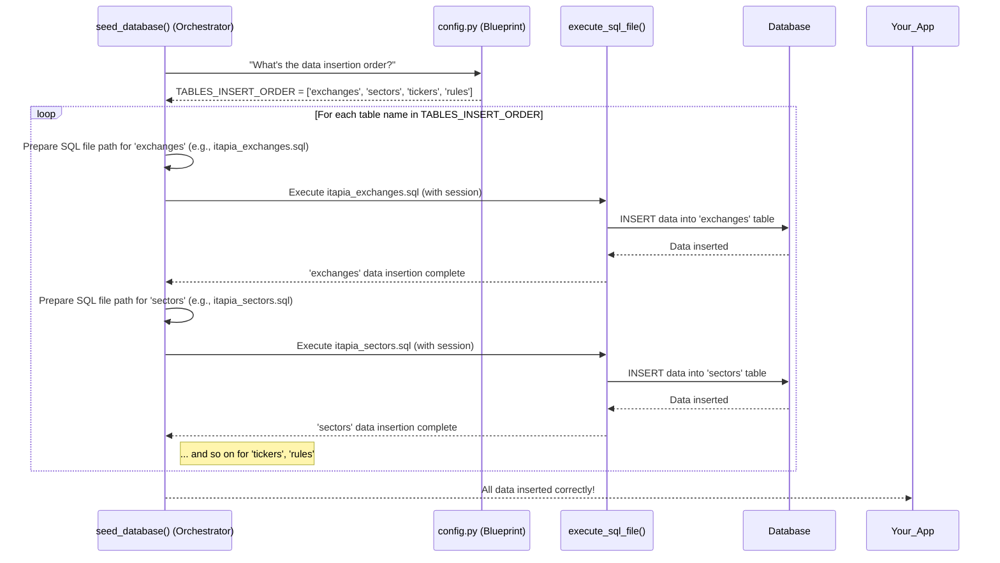

# Chapter 3: Data Insertion Blueprint

In [Chapter 1: Database Interaction Layer](01_database_interaction_layer_.md), we learned how `data_seeds` talks to the database, acting like a skilled librarian. In [Chapter 2: Database Seeding Orchestrator](02_database_seeding_orchestrator_.md), we discovered how a "project manager" orchestrates the building of our database "house" – first creating the structure (tables via DDL) and then preparing to "furnish" it with initial data.

Now, imagine you're decorating that new house. You wouldn't just bring in all the furniture at once and dump it randomly, right? You'd have a plan! You'd decide which room gets what, and in what order you place items. For example, you'd probably put down the carpet *before* you place the heavy sofa, and set up the bed frame *before* you put the mattress on it.

This planning is exactly what the **Data Insertion Blueprint** does for our database!

## What is a Data Insertion Blueprint?

The Data Insertion Blueprint is like the **detailed interior design plan** for your database. It's not just about *what* data to put in (that's in the SQL files themselves), but crucially, *in what exact order* to add that data to different tables. This plan is essential to prevent messy errors and ensure everything fits together perfectly.

Remember those "foreign key constraints" we talked about in the previous chapter? They are the "rules" of our database house. For example, a `Ticker` (like "AAPL") *must* belong to a `Sector` (like "Technology"). This means you cannot put the "AAPL" Ticker "furniture" into the database "room" until the "Technology" Sector "furniture" is already there.

The Data Insertion Blueprint ensures these rules are always followed!

## Why is a Blueprint (Order) So Important?

Let's use our `exchanges`, `sectors`, and `tickers` example again:

*   **Exchanges:** Where stocks are traded (e.g., NASDAQ).
*   **Sectors:** Categories for companies (e.g., Technology, Finance).
*   **Tickers:** The short names for individual stocks (e.g., AAPL for Apple).

A Ticker (AAPL) is associated with a Sector (Technology) and an Exchange (NASDAQ). If we tried to insert "AAPL" into the `tickers` table *before* "Technology" existed in the `sectors` table, the database would complain and refuse the insertion. It would say, "Hey! You're trying to link to something that doesn't exist yet!" This is an **integrity error**.

The Data Insertion Blueprint solves this by providing a clear, step-by-step sequence for adding data.

## The Core of the Blueprint: `TABLES_INSERT_ORDER`

In `data_seeds`, our Data Insertion Blueprint is elegantly defined by a simple Python list called `TABLES_INSERT_ORDER`. This list lives in `scripts\config.py` and it explicitly states the exact order in which data for different tables should be inserted.

Let's look at its contents:

```python
# scripts\config.py (simplified)
from typing import List

# This list IS our Data Insertion Blueprint!
TABLES_INSERT_ORDER: List[str] = [
    'exchanges', # 1. Insert exchanges data first
    'sectors',   # 2. Then insert sectors data
    'tickers',   # 3. Then insert tickers data (which links to exchanges/sectors)
    'rules',     # 4. Finally insert rules data (which links to tickers)
]
```
This small list is incredibly powerful! It directly tells the [Database Seeding Orchestrator](02_database_seeding_orchestrator_.md) the correct sequence, ensuring that `exchanges` data is inserted before `tickers` data, and `sectors` data is inserted before `tickers` data, and so on.

## How the Orchestrator Uses the Blueprint

As we saw in the previous chapter, the `seed_database()` function (our Orchestrator) uses this `TABLES_INSERT_ORDER` list to manage the data insertion phase.

After creating all the empty tables using the `ddl.sql` file, the Orchestrator then loops through each table name in `TABLES_INSERT_ORDER` and executes the corresponding SQL file to insert data for that table.

```python
# scripts\seed_database.py (simplified snippet)
# ... (imports and setup) ...
from config import TABLES_INSERT_ORDER # Our Blueprint!

def seed_database():
    # ... (get rdbms_session, execute DDL)
    # ...
        print("Inserting data in specified order...")
        # The Orchestrator uses the Blueprint here:
        for table_name in TABLES_INSERT_ORDER:
            # Construct the path to the SQL file for this table (e.g., 'itapia_exchanges.sql')
            file_name = f'itapia_{table_name}.sql' # We'll assume '.sql' for now
            file_path = os.path.join(data_dir, file_name)

            # Execute the insert file for the current table
            execute_sql_file(rdbms_session, file_path)
        print("Database seeding completed successfully!")
    # ... (error handling and session close) ...
```
In this snippet, the `for table_name in TABLES_INSERT_ORDER:` line is where the Data Insertion Blueprint comes to life. It ensures that `itapia_exchanges.sql` is run first, then `itapia_sectors.sql`, then `itapia_tickers.sql`, and finally `itapia_rules.sql`, always respecting the necessary order.

## Behind the Scenes: The Blueprint in Action

Let's visualize how our Data Insertion Blueprint guides the Seeding Orchestrator:


As you can see, the `TABLES_INSERT_ORDER` list is the guiding instruction set. It dictates the sequence, allowing the [Database Seeding Orchestrator](02_database_seeding_orchestrator_.md) to systematically furnish the database, table by table, in a way that avoids any data integrity conflicts.

## Conclusion

The **Data Insertion Blueprint**, represented by the `TABLES_INSERT_ORDER` list, is a simple yet vital part of `data_seeds`. It provides the clear, ordered instructions for filling your database tables with initial data, ensuring that all relationships between different pieces of data are respected. Without this blueprint, our database seeding would be chaotic and prone to errors.

Now that we understand how the data is planned and inserted, let's look at a specific type of data that often has complex rules: rule sets themselves!

[Chapter 4: Rule Set Initializer](04_rule_set_initializer_.md)

---

Generated by [AI Codebase Knowledge Builder](https://github.com/The-Pocket/Tutorial-Codebase-Knowledge)