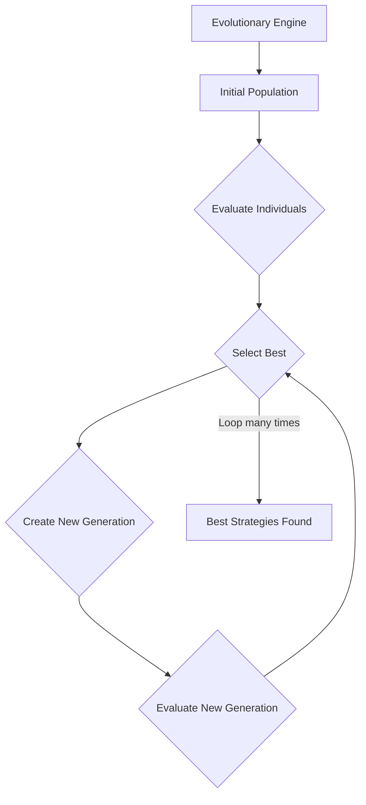
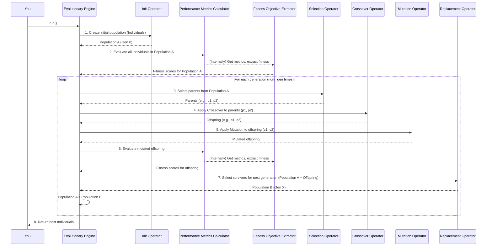

# Chapter 3: Evolutionary Engine

Welcome back! In [Chapter 1: Rule Tree Structure](01_rule_tree_structure_.md), we learned how individual trading strategies are built as flexible "Rule Trees." Then, in [Chapter 2: Individual & Population](02_individual___population_.md), we saw how these rule trees are wrapped into "Individuals" and collected into a "Population" – a diverse group of strategies.

### The Problem: How Do Strategies Get Better?

Now we have a whole collection of trading strategies (our Population). Some are okay, some are not so good, and we're hoping a few might be great. But how do we *improve* them? How do we go from a bunch of random or semi-random strategies to truly optimized ones that consistently perform well?

Manually testing and refining hundreds or thousands of strategies would be impossible. We need an automated way to:

1.  **Generate new strategies** based on existing good ones.
2.  **Evaluate their performance** efficiently.
3.  **Select the best strategies** to carry forward.
4.  **Repeat this process** over and over, continually improving the population.

This is exactly the problem the **Evolutionary Engine** solves!

### The Solution: The Evolutionary Engine

Think of the **Evolutionary Engine** as the **central orchestrator** of the entire optimization process. It's like the conductor leading a large orchestra: it doesn't play the instruments itself, but it tells each musician (specialized component) what to do and when, guiding the whole performance towards a beautiful symphony (better trading strategies!).

Its main job is to manage the entire lifecycle of evolution:
*   **Creating** an initial diverse pool of strategies.
*   **Evaluating** how well each strategy performs.
*   **Selecting** the most promising strategies.
*   **"Breeding"** new strategies from the best ones using genetic operations.
*   **Repeating** this process over many "generations" to continuously refine the strategies.

This engine brings together all the pieces we'll learn about in upcoming chapters—like [Genetic Operators](04_genetic_operators_.md), [Performance Metrics Calculator](05_performance_metrics_calculator_.md), and [Fitness Objective Extractor](06_fitness_objective_extractor_.md)—and makes them work in harmony.


*Above: The Evolutionary Engine orchestrates a continuous cycle of evaluation, selection, and generation.*

### How to Use the Evolutionary Engine

In `evo_worker`, you primarily interact with an `Evolutionary Engine` to kick off and manage the optimization process. Let's look at how you might set up and run a simple evolutionary run using one of its implementations, like `NSGA2EvoEngine`.

First, you'd create an instance of an engine and then "equip" it with the various tools it needs.

```python
from app.algorithms.engine.nsga2 import NSGA2EvoEngine
# We'll learn about these components later!
from app.backtest.evaluator import Evaluator
from app.algorithms.objective import SingleObjectiveExtractor
from app.algorithms.operators.construct import InitOperator
from app.algorithms.operators.crossover import UniformCrossover
from app.algorithms.operators.mutation import SubtreeMutation
from app.algorithms.operators.selection import TournamentSelection
from app.algorithms.operators.replacement import RankAndCrowdingReplacement
from app.algorithms.comparator import DominateComparator

# 1. Create the Engine
# You give it a unique ID for the run
evo_engine = NSGA2EvoEngine(
    run_id="my_first_evo_run",
    pop_size=100,  # Number of strategies in each generation
    num_gen=10     # Number of generations to evolve
)

# 2. Set up its essential tools (Evaluator, Objective Extractor)
# These components are responsible for judging the strategies
evo_engine.set_evaluator(Evaluator()) # Evaluates strategy performance
evo_engine.set_obj_extractor(SingleObjectiveExtractor()) # Turns performance into a fitness score
```
*Explanation:* We create an `NSGA2EvoEngine` (a type of Evolutionary Engine) and tell it how many strategies to keep (`pop_size`) and how many cycles of evolution to run (`num_gen`). Crucially, we then provide it with an `Evaluator` (to run backtests and get detailed performance info) and an `ObjectiveExtractor` (to condense that info into a single "fitness" score). We'll dive into these in detail in [Performance Metrics Calculator](05_performance_metrics_calculator_.md) and [Fitness Objective Extractor](06_fitness_objective_extractor_.md).

Next, we add the "genetic" tools that help evolve the strategies:

```python
# ... (evo_engine created and evaluator/extractor set from above)

# 3. Set up the genetic operators
# These operators create the initial strategies, and breed new ones
evo_engine.set_init_opr(InitOperator()) # How to create the *first* strategies
evo_engine.add_crossover_opr(UniformCrossover()) # How strategies "breed" (combine parts)
evo_engine.add_mutation_opr(SubtreeMutation()) # How strategies "mutate" (random changes)

# 4. Set up selection and replacement methods
# These determine which strategies survive and which get replaced
evo_engine.set_selection_opr(TournamentSelection()) # How to pick "parents"
evo_engine.set_replacement_opr(RankAndCrowdingReplacement()) # How to pick "survivors"
evo_engine.set_dominate_comparator(DominateComparator()) # How to compare multi-objective strategies
```
*Explanation:* Here we're giving the engine its "breeding tools." The `InitOperator` helps create the very first population. `Crossover` and `Mutation` are the core "genetic operators" that create new strategies from existing ones (covered in [Genetic Operators](04_genetic_operators_.md)). `Selection` and `Replacement` operators determine which individuals get to "breed" and which ones survive into the next generation. These are essential for guiding the evolution.

Finally, you tell the engine to `run`!

```python
# ... (all setup complete)

print("Starting the evolutionary process...")
# 5. Run the evolutionary process!
final_best_strategies = evo_engine.run()

print(f"Evolution complete! Found {len(final_best_strategies)} best strategies.")
# Output:
# Starting the evolutionary process...
# Initializing population (Generation 0)...
# Calculating fitness for initial population of 100 individuals...
# Classifing into fronts ...
# --- Starting Generation 1/10 ---
# ... (many more log messages for each generation)
# Evolution complete! Found X best strategies.
```
*Explanation:* Calling `evo_engine.run()` kicks off the entire multi-generational process. The engine will manage everything, from creating the first population to repeatedly applying genetic operators, evaluating performance, and selecting survivors. When it finishes, it returns a list of the best strategies it found, often called the "Pareto front" in multi-objective optimization (which you'll learn about in [Multi-Objective Dominance](08_multi_objective_dominance_.md)).

### Under the Hood: The Engine's Orchestration

Let's visualize the high-level steps the Evolutionary Engine takes when you call its `run()` method.


*Above: A simplified sequence of how the Evolutionary Engine orchestrates an evolutionary run.*

This diagram shows how the Engine acts as the central control, delegating specific tasks to different operators and components at each step of the evolutionary cycle.

#### Diving Deeper into the Code

The core logic for the Evolutionary Engine is found in `app/algorithms/engine/`. There's a `BaseEvoEngine` that provides common functionalities, and then specialized engines like `NSGA2EvoEngine` and `MOEADEvoEngine` that implement specific evolutionary algorithms.

Let's look at a simplified `BaseEvoEngine` to understand how it sets up the stage:

```python
# File: app/algorithms/engine/_base.py (simplified)
import random
from typing import List, Optional, Self, Type

from app.backtest.evaluator import Evaluator
from itapia_common.rules.rule import Rule
from ..objective import ObjectiveExtractor
from ..operators.construct import InitOperator
from ..pop import Individual, Population

class BaseEvoEngine:
    def __init__(self, run_id: str, seeding_rules: Optional[List[Rule]] = None):
        self.run_id = run_id
        self.evaluator: Evaluator = None # Tool to evaluate strategies
        self.obj_extractor: ObjectiveExtractor = None # Tool to get fitness score
        self.init_opr: InitOperator = None # Tool to create initial strategies
        self.seeding_rules = seeding_rules # Optional: pre-defined strategies
        self.pop: Population = None # The current collection of strategies

        self._random = random.Random(42) # A random number generator

    def set_evaluator(self, evaluator: Evaluator) -> Self:
        self.evaluator = evaluator
        return self

    # Similar 'set' methods for obj_extractor and init_opr...

    def _init_pop(self, pop_size: int) -> None:
        """Initialize the population with individuals."""
        # Get the type of Individual the InitOperator is designed for
        ind_cls: Type[Individual] = self.init_opr.ind_cls 
        self.pop = Population(ind_cls=ind_cls, max_population_size=pop_size)

        # Add any pre-defined "seeding rules"
        if self.seeding_rules:
            self.pop.extend_pop(
                [ind_cls.from_rule(rule) for rule in self.seeding_rules]
            )

        # Fill the rest of the population using the InitOperator
        for _ in range(pop_size - len(self.pop.population)):
            self.pop.add_ind(self.init_opr()) # Call the init_opr to create a new individual
```
*Explanation:* The `BaseEvoEngine` constructor sets up the basic attributes like the `run_id` and places to store the `evaluator`, `obj_extractor`, and `init_opr`. The `_init_pop` method is crucial: it creates the very first `Population` by potentially adding `seeding_rules` (if provided) and then filling up the rest of the desired population size by repeatedly calling the `init_opr` to create new [Individuals](02_individual___population_.md).

Now, let's look at a simplified version of the `run` method from `NSGA2EvoEngine` to see the generation loop:

```python
# File: app/algorithms/engine/nsga2.py (simplified)
# ... (imports and NSGA2EvoEngine class definition)

class NSGA2EvoEngine(BaseEvoEngine):
    # ... (init method and other setup methods)

    def run(self, **kwargs) -> List[Individual]:
        pop_size = self.pop_size
        num_gen = self.num_gen
        
        # 1. Initialize the very first population (Generation 0)
        print("Initializing population (Generation 0)...")
        self._init_pop(pop_size)

        # 2. Calculate fitness for all individuals in the initial population
        print("Calculating fitness for initial population...")
        self.pop.cal_fitness(self.evaluator, self.obj_extractor)

        # 3. Classify the initial population (specific to NSGA-II)
        self._classify_pop() # This sets up for multi-objective comparison

        # 4. The main evolutionary loop (Generations 1 to num_gen)
        for gen in range(1, num_gen + 1):
            print(f"--- Starting Generation {gen}/{num_gen} ---")
            self._run_each_gen(pop_size, self.pc, self.pm) # Run one generation
            print(f"Generation {gen} complete.")

            # (Optional) Update adaptive scores for operators periodically
            if gen % self.update_score_period == 0:
                self.crossover_adap.update_score()
                self.mutation_adap.update_score()
        
        # 5. Return the best strategies found (e.g., the Pareto front)
        return self.pareto_front 
    
    def _run_each_gen(self, pop_size: int, pc: float, pm: float) -> None:
        """Run one generation of the NSGA-II algorithm."""
        
        # 1. Generate offspring from the current population
        offs = self._gen_offs_each_epoch(self.pop.population, pc, pm)
        
        # (Offspring's fitness is calculated internally in _gen_offs_each_epoch)

        # 2. Select the individuals that will survive into the next generation
        new_pop_individuals = self.replacement_opr(
            population=self.pop.population,
            offspring_population=offs.population,
            target_size=pop_size,
        )
        self.pop.reassign(new_pop_individuals) # Update the main population

        # 3. Classify the new population (again, specific to NSGA-II)
        self._classify_pop()
```
*Explanation:*
*   The `run` method orchestrates the entire process. It first calls `_init_pop` to create the starting generation, then calculates fitness for all of them.
*   The `for gen in range(...)` loop is the heart of the evolution. In each `gen`, it calls `_run_each_gen`.
*   The `_run_each_gen` method represents a single cycle of evolution: it creates new `offs`pring (new strategies) from the current `pop`ulation, then uses a `replacement_opr` to combine the old population and the new offspring and select the best ones to form the *next* generation's population.
*   The complex details of `_gen_offs_each_epoch`, `_classify_pop`, `crossover_adap`, `mutation_adap` are handled by other specialized components, which you'll explore in later chapters like [Genetic Operators](04_genetic_operators_.md), [Adaptive Operator Manager](07_adaptive_operator_manager_.md), and [Multi-Objective Dominance](08_multi_objective_dominance_.md). The engine's job is to stitch them all together.

### Conclusion

You've now met the "Evolutionary Engine," the central brain of `evo_worker`. It's the conductor that orchestrates the entire process of generating, evaluating, and improving trading strategies over many generations. You've seen how to set it up with its necessary tools—evaluators, objective extractors, and genetic operators—and how it manages the continuous cycle of selection and breeding to find progressively better strategies.

With the Engine's role clear, we can now look closer at the specific tools it uses to "breed" new strategies. Next, we'll dive into the fascinating world of [Genetic Operators](04_genetic_operators_.md), which are the actual mechanisms for creating variation and new combinations!

---

Generated by [AI Codebase Knowledge Builder](https://github.com/The-Pocket/Tutorial-Codebase-Knowledge)