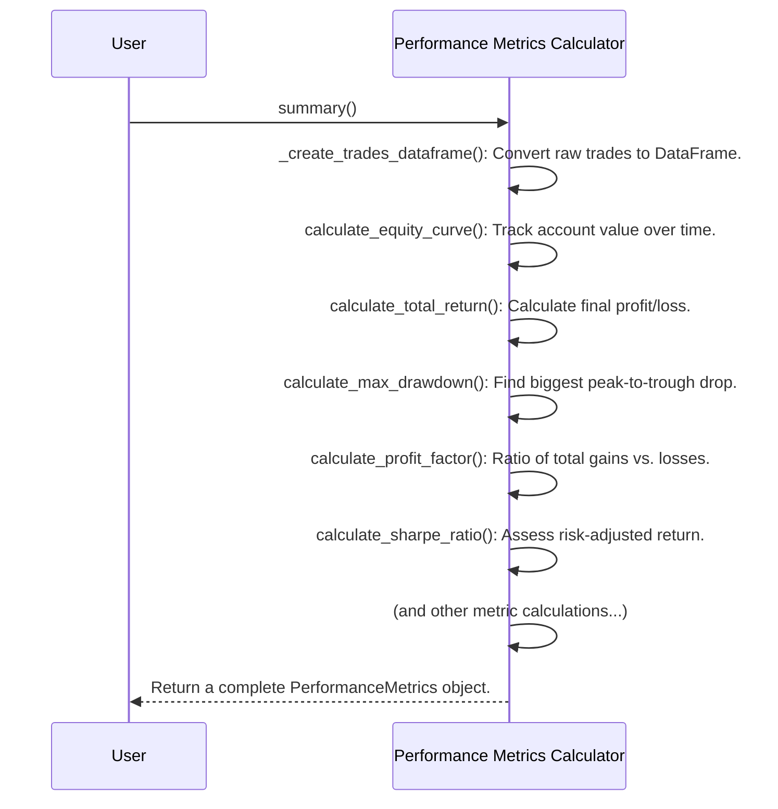

# Chapter 5: Performance Metrics Calculator

Welcome back! In [Chapter 4: Genetic Operators](04_genetic_operators_.md), we learned about the powerful tools the [Evolutionary Engine](03_evolutionary_engine_.md) uses to create and modify trading strategies. We saw how `Initialization`, `Selection`, `Crossover`, and `Mutation` operators help generate new and improved [Rule Tree Structure](01_rule_tree_structure_.md)s, which are then wrapped into [Individuals](02_individual___population_.md).

### The Problem: How Do We Know if a Strategy is Any Good?

Now that we can generate countless new trading strategies, a critical question arises: **How do we actually *measure* their performance?** If we have a strategy that says "Buy if RSI < 30," how do we know if following this rule would have made money in the past? Was it risky? Was it consistent?

We need a way to answer these questions with hard numbers. Simply saying "it makes profit" isn't enough; we need to know *how much* profit, *how risky* that profit was, and *how stable* it might be. We need a detailed financial report card for each strategy.

### The Solution: The Performance Metrics Calculator

This is where the **Performance Metrics Calculator** comes in! This component is like a highly skilled financial analyst for your trading strategies. After a strategy has been "tested" (simulated on historical data, a process called backtesting), the `PerformanceMetricsCalculator` takes all the individual trades that would have occurred and crunches the numbers.

Its job is to calculate a comprehensive set of financial performance and risk indicators. These metrics include essential data points like:

*   **Total Return**: How much profit (or loss) the strategy generated overall.
*   **Maximum Drawdown**: The biggest drop from a peak in your account value – a key measure of risk.
*   **Win Rate**: The percentage of trades that were profitable.
*   **Profit Factor**: A ratio comparing total profits to total losses; higher is better.
*   **Sharpe Ratio**: A risk-adjusted return measure, telling you how much return you got for the risk you took.

It compiles all this into a detailed "report card," giving us a clear picture of how well a strategy performed under simulated market conditions.

```mermaid
graph TD
    A[Trading Strategy (Rule Tree)] --> B[Backtesting Simulation]
    B --> C[List of Trades (Trade Log)]
    C --> D[Performance Metrics Calculator]
    D --> E[Detailed Performance Report (e.g., Total Return, Max Drawdown, Sharpe Ratio)]
```
*Above: The Performance Metrics Calculator turns a list of trades into a comprehensive report.*

### How to Use the Performance Metrics Calculator

In `evo_worker`, the `PerformanceMetricsCalculator` takes the raw results of a backtest (a list of `Trade` objects) and your `initial_capital`, then calculates all the important metrics.

Let's imagine you've just run a simulation for a strategy and it generated a list of `Trade` objects.

```python
from app.performances.metrics import PerformanceMetricsCalculator
# from app.backtest.trade import Trade # The actual Trade object
import datetime

# --- Step 1: Simulate some trades (dummy data for demonstration) ---
# In a real scenario, these would come from the backtesting module
class DummyTrade:
    def __init__(self, profit_pct, position_size_pct, exit_date, duration_days):
        self.profit_pct = profit_pct
        self.position_size_pct = position_size_pct
        self.exit_date = exit_date
        self.duration_days = duration_days

dummy_trade_log = [
    DummyTrade(0.05, 0.1, datetime.date(2023, 1, 15), 10),  # 5% profit on 10% capital
    DummyTrade(-0.02, 0.1, datetime.date(2023, 1, 20), 5),   # 2% loss on 10% capital
    DummyTrade(0.08, 0.2, datetime.date(2023, 2, 10), 15),  # 8% profit on 20% capital
]
initial_capital = 100000.0

# --- Step 2: Create the Performance Metrics Calculator ---
metrics_calculator = PerformanceMetricsCalculator(
    trade_log=dummy_trade_log,
    initial_capital=initial_capital
)

# --- Step 3: Get the summary report ---
performance_report = metrics_calculator.summary()

print(f"Total Return: {performance_report.total_return_pct:.2%}")
print(f"Max Drawdown: {performance_report.max_drawdown_pct:.2%}")
print(f"Profit Factor: {performance_report.profit_factor:.2f}")

# Example Output (actual values depend on dummy data):
# Total Return: 1.07%
# Max Drawdown: 0.20%
# Profit Factor: 1.20
```
*Explanation:*
1.  We create a `dummy_trade_log` (in a real `evo_worker` run, these `Trade` objects would be generated by a backtesting `Evaluator` component).
2.  We initialize the `PerformanceMetricsCalculator` by giving it this list of trades and the `initial_capital`.
3.  We call the `summary()` method, which performs all the calculations and returns a `PerformanceMetrics` object. This object holds all the calculated metrics in an organized way.

This `PerformanceMetrics` object is then used by the [Fitness Objective Extractor](06_fitness_objective_extractor_.md) to determine the overall "fitness" score of the strategy.

### Under the Hood: How it Calculates the Report Card

Let's look at the simplified sequence of actions the `PerformanceMetricsCalculator` takes when you ask it for a `summary()`.


*Above: The `Performance Metrics Calculator` orchestrates multiple calculations to build a full report.*

### Diving Deeper into the Code

The `PerformanceMetricsCalculator` is found in `app/performances/metrics.py`. Let's look at some simplified parts of its implementation.

#### The `__init__` Method

The constructor sets up the calculator with the trade data and initial settings.

```python
# File: app/performances/metrics.py (simplified)
from typing import List
import pandas as pd
from app.backtest.trade import Trade # The Trade object

class PerformanceMetricsCalculator:
    def __init__(
        self,
        trade_log: List[Trade],
        initial_capital: float = 100000.0,
        risk_free_rate_annual: float = 0.02,
    ):
        self.trade_log = trade_log
        # Convert trade log to DataFrame for easier calculations
        self.trades_df = self._create_trades_dataframe() # Internal helper method

        self.initial_capital = initial_capital
        # ... (other initializations like risk-free rate) ...
```
*Explanation:* The `__init__` method stores the `trade_log` and `initial_capital`. It immediately calls `_create_trades_dataframe()` to prepare the trade data into a format (a Pandas DataFrame) that's easy to work with for calculations.

#### Creating the Trades DataFrame

This helper method transforms the list of `Trade` objects into a `pandas.DataFrame`, which is a powerful table-like structure for data analysis in Python.

```python
# File: app/performances/metrics.py (simplified)
# ... (imports) ...

class PerformanceMetricsCalculator:
    # ... (init method) ...

    def _create_trades_dataframe(self) -> pd.DataFrame:
        if not self.trade_log:
            return pd.DataFrame() # Return empty if no trades

        df = pd.DataFrame(self.trade_log) # Converts list of Trade objects to DataFrame
        # Add profit_pct and duration_days from Trade objects for convenience
        df["profit_pct"] = [trade.profit_pct for trade in self.trade_log]
        df["duration_days"] = [trade.duration_days for trade in self.trade_log]
        
        df["exit_date"] = pd.to_datetime(df["exit_date"]) # Ensure date is proper type
        df.set_index("exit_date", inplace=True) # Set exit_date as the index
        df.sort_index(inplace=True) # Sort by date
        return df
```
*Explanation:* This method takes the `trade_log`, converts it into a DataFrame, adds columns for `profit_pct` and `duration_days` from each `Trade` object, and then ensures the data is sorted by `exit_date` for time-series analysis.

#### Calculating the Equity Curve

The equity curve is fundamental; it shows how your capital grows (or shrinks) over time with each trade.

```python
# File: app/performances/metrics.py (simplified)
# ... (imports) ...

class PerformanceMetricsCalculator:
    # ... (init & _create_trades_dataframe) ...

    def calculate_equity_curve(self) -> pd.Series:
        if self.trades_df.empty:
            return pd.Series([self.initial_capital]) # Just initial capital if no trades

        # Calculate the actual return percentage based on position size
        self.trades_df["return_pct"] = (
            self.trades_df["profit_pct"] * self.trades_df["position_size_pct"]
        )
        # Calculate growth factor for each trade (e.g., 1.05 for 5% profit)
        self.trades_df["growth_factor"] = 1 + self.trades_df["return_pct"]

        # Cumulative product of growth factors gives total capital growth
        self.trades_df["equity"] = (
            self.initial_capital * self.trades_df["growth_factor"].cumprod()
        )
        # Create a series including initial capital and then equity after each trade
        # ... (some DataFrame manipulation to get final equity curve) ...
        self._equity_curve = pd.concat([
            pd.Series(self.initial_capital, index=[self.trades_df.index.min() - pd.Timedelta(days=1)]),
            self.trades_df["equity"]
        ])
        return self._equity_curve
```
*Explanation:* This function is key. It calculates the actual percentage return of each trade *relative to the total capital involved in that trade*, then combines these to get the `growth_factor` for each trade. The `cumprod()` (cumulative product) function then cleverly calculates the compounding effect, showing how your `initial_capital` changes after each successive trade, forming the `equity_curve`.

#### Calculating a Specific Metric: Total Return

Once the equity curve is known, many metrics become simple calculations.

```python
# File: app/performances/metrics.py (simplified)
# ... (imports) ...

class PerformanceMetricsCalculator:
    # ... (other methods) ...

    def calculate_total_return(self) -> float:
        if self.trades_df.empty:
            return 0.0

        equity_curve = self.calculate_equity_curve() # Uses the method above
        final_equity = equity_curve.iloc[-1] # Last value in the curve
        return (final_equity - self.initial_capital) / self.initial_capital
```
*Explanation:* This method simply takes the final value from the `equity_curve` and compares it to the `initial_capital` to determine the total percentage return.

#### The `summary()` Method

This is the public-facing method that ties everything together, calling all the individual calculation methods and organizing their results into a `PerformanceMetrics` object.

```python
# File: app/performances/metrics.py (simplified)
from itapia_common.schemas.entities.performance import PerformanceMetrics # The final report object

class PerformanceMetricsCalculator:
    # ... (all calculation methods) ...

    def summary(self) -> PerformanceMetrics:
        if self.trades_df.empty:
            return PerformanceMetrics() # Return empty report if no trades

        return PerformanceMetrics(
            num_trades=len(self.trade_log),
            total_return_pct=self.calculate_total_return(),
            max_drawdown_pct=self.calculate_max_drawdown(),
            win_rate_pct=self.calculate_win_rate(),
            profit_factor=self.calculate_profit_factor(),
            sharpe_ratio=self.calculate_sharpe_ratio(),
            sortino_ratio=self.calculate_sortino_ratio(),
            annual_return_stability=self.calculate_annual_return_stability(),
            cagr=self.calculate_cagr(),
        )
```
*Explanation:* The `summary()` method acts as a wrapper. It calls each `calculate_` method (like `calculate_total_return`, `calculate_max_drawdown`, etc.) and collects all the results. It then populates a `PerformanceMetrics` object, which is a structured data container designed to hold all these different metrics, making them easy to access.

### Conclusion

You've now learned about the "Performance Metrics Calculator," the component in `evo_worker` that acts as your strategy's financial analyst. It takes the detailed trade history from a backtest and generates a comprehensive report card, providing crucial insights into a strategy's profitability, risk, and consistency. Understanding these metrics is essential for judging how good a strategy truly is.

But even with a detailed report, we still need a way to boil all these numbers down into a single, simple "score" that the [Evolutionary Engine](03_evolutionary_engine_.md) can use to compare strategies. That's the job of our next component!

Next, we'll explore the [Fitness Objective Extractor](06_fitness_objective_extractor_.md), which turns this detailed report into a comparable fitness score!

---

Generated by [AI Codebase Knowledge Builder](https://github.com/The-Pocket/Tutorial-Codebase-Knowledge)