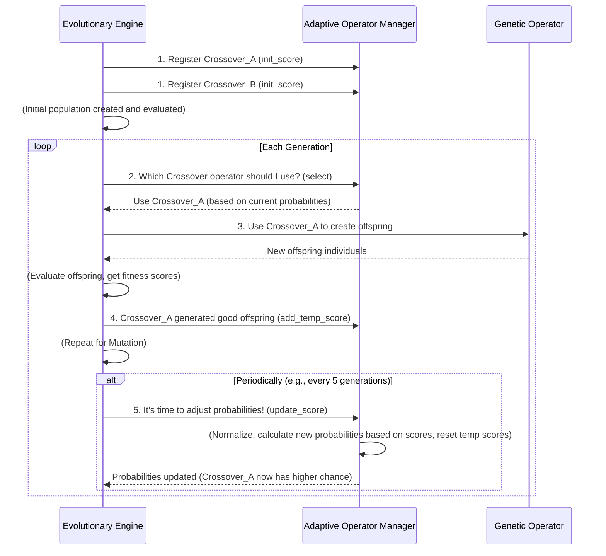

# Chapter 7: Adaptive Operator Manager

Welcome back! In [Chapter 6: Fitness Objective Extractor](06_fitness_objective_extractor_.md), we learned how to accurately measure and score the performance of our trading strategies (our [Individuals](02_individual___population_.md)). Now we know which strategies are "good" and which aren't.

### The Problem: Not All Tools Are Equally Effective All the Time

The [Evolutionary Engine](03_evolutionary_engine_.md) uses various [Genetic Operators](04_genetic_operators_.md), like different types of Crossover and Mutation, to create new and improved strategies. Imagine you have several different "drills" your sports team can practice:
*   Drill A: Improves passing accuracy.
*   Drill B: Improves shooting power.
*   Drill C: Improves defensive positioning.

At the beginning of the season, all drills might be useful. But as the team progresses, some drills might become more effective than others. If the team is already great at passing, focusing heavily on Drill A might not yield the biggest improvements anymore. You'd want to focus on drills that actually make the team *better* right now.

In `evo_worker`, we face a similar situation:
*   We have multiple **Crossover operators** (e.g., swapping entire subtrees, or mixing nodes uniformly).
*   We have multiple **Mutation operators** (e.g., replacing a subtree, or changing a single node).

Not all these operators will be equally successful at producing high-fitness [Individuals](02_individual___population_.md) throughout the entire evolutionary run. Some might be great for creating initial diversity, while others excel at fine-tuning existing good strategies. If we keep using a less effective operator as much as a highly effective one, we're wasting valuable "evolutionary effort."

How can `evo_worker` intelligently figure out which [Genetic Operators](04_genetic_operators_.md) are currently working best and use them more often?

### The Solution: The Adaptive Operator Manager

This is where the **Adaptive Operator Manager** comes in! Think of it as the **"smart coach"** of our evolutionary process. This manager constantly watches which [Genetic Operators](04_genetic_operators_.md) are producing the most successful offspring (new strategies with high fitness). Based on this feedback, it then **adapts their usage probabilities** over time.

Here’s how it works at a high level:

1.  **Tracks Success**: Whenever a [Genetic Operator](04_genetic_operators_.md) is used and creates new [Individuals](02_individual___population_.md), the manager gets feedback on how good those new individuals are (their [fitness](06_fitness_objective_extractor_.md)).
2.  **Assigns Scores**: Operators that generate better-performing strategies receive higher "scores" or "rewards."
3.  **Adjusts Probabilities**: Over time, operators with consistently high scores are given a higher chance of being selected for future operations. Less successful ones get a lower chance.
4.  **Optimizes Efficiency**: By focusing on the "winning" strategies for generating new rules, the evolutionary process becomes more efficient, converging on good solutions faster.

```mermaid
graph TD
    A[Evolutionary Engine] --> B{Choose Operator?};
    B -- Adaptive Operator Manager --> C[Crossover Type A (80% chance)]
    B -- Adaptive Operator Manager --> D[Crossover Type B (20% chance)]
    C --> E[Generate Offspring with Type A]
    D --> F[Generate Offspring with Type B]
    E -- Offspring has High Fitness --> G[Adaptive Manager: Increase Score for Type A]
    F -- Offspring has Low Fitness --> H[Adaptive Manager: Decrease Score for Type B]
    G --> B
    H --> B
```
*Above: The Adaptive Operator Manager dynamically adjusts the chances of different operators being used based on their performance.*

### How to Use the Adaptive Operator Manager

You don't directly interact with the `Adaptive Operator Manager` yourself. Instead, the [Evolutionary Engine](03_evolutionary_engine_.md) is configured to use it automatically. When you add multiple [Genetic Operators](04_genetic_operators_.md) to the engine, the engine creates an internal `AdaptiveScoreManager` for each type (Crossover and Mutation) and registers the operators with it.

Let's see how the [Evolutionary Engine](03_evolutionary_engine_.md) sets this up and implicitly uses it:

```python
from app.algorithms.engine.nsga2 import NSGA2EvoEngine
from app.algorithms.operators.crossover import UniformCrossover, SubtreeCrossoverOperator
from app.algorithms.operators.mutation import SubtreeMutation, PointMutation

# 1. Create the Engine
evo_engine = NSGA2EvoEngine(
    run_id="my_adaptive_run",
    pop_size=100,
    num_gen=10
)

# 2. Add MULTIPLE Crossover Operators
# The engine will register these with an internal AdaptiveScoreManager for crossover.
evo_engine.add_crossover_opr(UniformCrossover(), initial_prob=0.5)
evo_engine.add_crossover_opr(SubtreeCrossoverOperator(), initial_prob=0.5)

# 3. Add MULTIPLE Mutation Operators
# The engine will register these with an internal AdaptiveScoreManager for mutation.
evo_engine.add_mutation_opr(SubtreeMutation(), initial_prob=0.5)
evo_engine.add_mutation_opr(PointMutation(), initial_prob=0.5)

# (Other setup, like evaluator, objective extractor, selection, replacement)
# ...

# 4. Run the evolutionary process
print("Starting adaptive evolutionary process...")
final_best_strategies = evo_engine.run()

print("Evolution complete. Operators adapted their usage probabilities.")
# Output:
# Starting adaptive evolutionary process...
# Initializing population (Generation 0)...
# ...
# --- Starting Generation 1/10 ---
# ... (During run, operators are chosen adaptively and their scores updated)
# Evolution complete. Operators adapted their usage probabilities.
```
*Explanation:*
*   When you call `evo_engine.add_crossover_opr` or `add_mutation_opr` *multiple times* with different operator instances, the `Evolutionary Engine` recognizes that it needs to adapt their usage.
*   It then internally creates (or uses existing) `AdaptiveScoreManager` instances—one for all crossover operators, and one for all mutation operators.
*   The `initial_prob` argument tells the `AdaptiveScoreManager` what probability to start with for each operator.
*   During the `evo_engine.run()` loop, the engine will periodically tell these `AdaptiveScoreManager` instances to `update_score()` (re-evaluate and adjust probabilities) and `select()` which specific operator to use for the next generation.

### Under the Hood: The Manager's Learning Cycle

Let's visualize the simplified sequence of how the `Adaptive Operator Manager` learns and adapts within the [Evolutionary Engine](03_evolutionary_engine_.md).


*Above: The Adaptive Operator Manager is periodically updated and queried by the Evolutionary Engine.*

This diagram shows that the `Evolutionary Engine` is the primary orchestrator. It registers operators, asks the `Adaptive Operator Manager` to select which operator to use, then informs the manager about the success of that operator, and finally, periodically tells the manager to `update_score` to re-balance the probabilities.

### Diving Deeper into the Code

The `AdaptiveScoreManager` class is found in `app/algorithms/adap.py`. Let's look at its core functionalities.

#### Initialization and Registration (`__init__` and `init_score`)

When the `Evolutionary Engine` is set up with adaptive operators, it creates an `AdaptiveScoreManager` and registers each [Genetic Operator](04_genetic_operators_.md) with it.

```python
# File: app/algorithms/adap.py (simplified)
import random
from typing import Dict
# Assume SingletonNameable is a base class for operators providing a unique name

class AdaptiveScoreManager:
    def __init__(self, lr: float):
        self._score_storage: Dict[str, float] = {}       # Stores current probabilities
        self._score_temp_storage: Dict[str, float] = {}  # Stores rewards in current period
        self._random = random.Random(42)                  # For selection
        self.lr = lr                                      # Learning rate

    def init_score(self, obj, score: float) -> None:
        """Initialize score for an object (e.g., a Crossover operator)."""
        self._score_storage[obj.singleton_name] = score # Store initial probability
        self._score_temp_storage[obj.singleton_name] = 0.0 # Reset temp reward
```
*Explanation:*
*   The `__init__` method sets up two dictionaries: `_score_storage` to hold the current usage probabilities for each operator (indexed by their unique `singleton_name`), and `_score_temp_storage` to accumulate temporary "rewards" for operators during an evaluation period. The `lr` (learning rate) controls how quickly the manager adapts.
*   `init_score` is called for each [Genetic Operator](04_genetic_operators_.md) to set its starting probability and prepare its temporary reward slot.

#### Rewarding Operators (`add_temp_score`)

After an operator creates offspring and the offspring's [fitness](06_fitness_objective_extractor_.md) is evaluated, the [Evolutionary Engine](03_evolutionary_engine_.md) tells the `AdaptiveScoreManager` about the operator's success.

```python
# File: app/algorithms/adap.py (simplified)

class AdaptiveScoreManager:
    # ... (init and init_score) ...

    def add_temp_score(self, obj, additional_score: float) -> None:
        """Add temporary score (reward) to an object."""
        self._score_temp_storage[obj.singleton_name] += additional_score
```
*Explanation:* When an operator (represented by `obj`) is used and produces good results, `add_temp_score` increases its accumulated reward in `_score_temp_storage`. This `additional_score` would typically be derived from the fitness of the generated offspring.

#### Updating Probabilities (`update_score`)

Periodically, the `Evolutionary Engine` triggers the `update_score` method to adjust the probabilities based on the accumulated rewards. This is the core "learning" step.

```python
# File: app/algorithms/adap.py (simplified)

class AdaptiveScoreManager:
    # ... (other methods) ...

    def normalize_storage(self) -> None:
        """Normalize stored probabilities to sum to 1.0."""
        total_scores = max(1, sum(self._score_storage.values()))
        for k in self._score_storage.keys():
            self._score_storage[k] /= total_scores

    def normalize_temp_storage(self) -> None:
        """Normalize temporary rewards to sum to 1.0 (if non-zero)."""
        total_temp_scores = max(1, sum(self._score_temp_storage.values()))
        for k in self._score_temp_storage.keys():
            self._score_temp_storage[k] /= total_temp_scores

    def update_score(self) -> None:
        """Update probabilities using learning rate and temporary scores."""
        self.normalize_storage()       # Ensure current probabilities sum to 1
        self.normalize_temp_storage()  # Ensure temporary rewards sum to 1

        for k in self._score_storage.keys():
            new_reward_pct = self._score_temp_storage.get(k, 0.0) # Normalized temporary reward
            old_probability = self._score_storage[k]              # Current probability
            
            # Weighted average: (1-lr) * old_prob + lr * new_reward_pct
            self._score_storage[k] = (1 - self.lr) * old_probability + self.lr * new_reward_pct
            self._score_temp_storage[k] = 0.0 # Reset temporary rewards for next period
```
*Explanation:*
*   First, `normalize_storage` and `normalize_temp_storage` ensure that all probabilities and temporary rewards are scaled to sum to 1.0. This is crucial for proportional selection later.
*   Then, for each operator, it calculates a `new_probability` using a weighted average. The `lr` (learning rate) determines how much influence the `new_reward_pct` (the operator's recent success) has on its `old_probability`. A higher `lr` means faster adaptation.
*   Finally, the `_score_temp_storage` is reset to zero, ready to collect rewards for the next evaluation period.

#### Selecting an Operator (`select`)

When the `Evolutionary Engine` needs to choose a [Genetic Operator](04_genetic_operators_.md), it asks the `AdaptiveScoreManager` to `select` one based on the current probabilities.

```python
# File: app/algorithms/adap.py (simplified)

class AdaptiveScoreManager:
    # ... (other methods) ...

    def select(self) -> str:
        """Select an object based on current probabilities (roulette wheel selection)."""
        self.normalize_storage() # Just to be safe, ensure sums to 1 before selection
        keys = []
        weights = []
        for k, s in self._score_storage.items():
            weights.append(s)
            keys.append(k)

        # random.choices picks an item from 'keys' based on 'weights'
        return self._random.choices(keys, weights=weights)[0]
```
*Explanation:*
*   This method uses a common technique called "roulette wheel selection." It gathers all operator names (`keys`) and their corresponding `weights` (the current probabilities from `_score_storage`).
*   `self._random.choices()` then picks one operator from `keys` where the chance of picking an operator is directly proportional to its `weight`. So, operators with higher probabilities (weights) are more likely to be selected.

### Conclusion

You've now understood the "Adaptive Operator Manager," the intelligent "smart coach" in `evo_worker` that enhances the efficiency of the evolutionary process. It constantly monitors the success of different [Genetic Operators](04_genetic_operator.md) (like Crossover and Mutation) and dynamically adjusts their usage probabilities. This ensures that the system focuses its efforts on the strategies that have proven most effective, leading to faster and better optimization of trading rules.

With our operators now capable of adapting, we're ready to explore how `evo_worker` handles more complex optimization goals than just a single fitness score.

Next, we'll dive into the advanced topic of [Multi-Objective Dominance](08_multi_objective_dominance_.md), which allows us to optimize strategies for several conflicting goals simultaneously!

---

Generated by [AI Codebase Knowledge Builder](https://github.com/The-Pocket/Tutorial-Codebase-Knowledge)