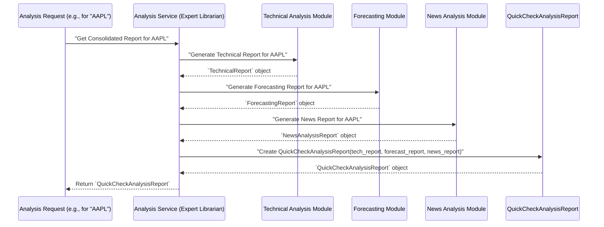

# Chapter 4: Consolidated Analysis Reports

Welcome back! In our previous chapters, we've built a strong foundation:
*   In [Chapter 1: Data Schemas (Pydantic Models)](01_data_schemas__pydantic_models__.md), we learned how to create "blueprints" for our data, ensuring everything is structured and reliable.
*   In [Chapter 2: Database Connection & Session Management](02_database_connection___session_management_.md), we explored how `itapia` efficiently connects to its databases and provides isolated "workspaces" (sessions).
*   In [Chapter 3: Data Access Layer (CRUD & Services)](03_data_access_layer__crud___services__.md), we discovered how to actually save and retrieve our structured data from the databases using "Librarians" (CRUD) and "Expert Librarians" (Services).

Now, imagine we have all these individual pieces of information – a technical analysis report, a machine learning forecast, and a news sentiment analysis – for a specific stock. Each one gives us a valuable insight, but what if we need to see the *entire picture* at once to make a quick, informed decision?

## The Problem: Getting a Complete Stock "Report Card"

Let's say a financial advisor in `itapia` wants to evaluate a stock. They need to know:
*   What are the current technical indicators (like price trends, support/resistance levels)?
*   What does our machine learning model predict for its future movement?
*   What's the overall sentiment from recent news about this company?

Getting these insights means looking at three different reports. Jumping between them takes time and makes it harder to connect the dots. We need a way to combine all this scattered, but related, information into *one single, easy-to-digest document*.

How can we create a comprehensive summary that brings together all relevant analyses for a stock into a unified view, ready for quick evaluation?

## The Solution: Consolidated Analysis Reports (The "Stock Dossier")

This is exactly what **Consolidated Analysis Reports** are for!

Think of a Consolidated Analysis Report as a **detailed dossier** or a **"stock report card"**. It's a single, structured document that gathers *all* the important financial data and analysis for a specific stock at a given moment in time. Instead of looking at separate technical reports, forecasting reports, and news reports, you get everything neatly organized in one place.

In `itapia`, our main consolidated report is called the `QuickCheckAnalysisReport`. Its job is to combine:
1.  **Technical Analysis:** Insights from price movements and indicators.
2.  **Machine Learning Forecasting:** Predictions about future stock behavior.
3.  **News Sentiment Analysis:** The emotional tone and key entities from recent news.

Once this `QuickCheckAnalysisReport` is generated, it becomes the essential input for our **[Rule Engine](05_rule_logic_tree__nodes__.md)**, which uses this holistic view to make smart evaluations and recommendations.

## Key Concepts: The Master Blueprint and its Sections

Our `QuickCheckAnalysisReport` is a [Pydantic Model](01_data_schemas__pydantic_models__.md), acting as the master blueprint. It doesn't *contain* raw stock prices or individual news articles. Instead, it contains *other analysis reports* as its fields, making it a powerful example of **nested data schemas**.

Let's look at its simplified blueprint:

```python
# From itapia_common/schemas/entities/analysis/_full.py (simplified)
from pydantic import BaseModel, Field

# We'll import these sub-reports later
from .forecasting import ForecastingReport
from .news import NewsAnalysisReport
from .technical import TechnicalReport

class QuickCheckAnalysisReport(BaseModel):
    """
    Complete quick check analysis report combining technical, forecasting,
    and news analysis for a ticker.
    """
    ticker: str = Field(..., description="Symbol of ticker")
    generated_at_utc: str = Field(
        ..., description="ISO format string of generated time"
    )
    generated_timestamp: int = Field(
        ..., description="Timestamp value of generated time"
    )
    technical_report: TechnicalReport = Field(..., description="Technical Report")
    forecasting_report: ForecastingReport = Field(..., description="Forecasting report")
    news_report: NewsAnalysisReport = Field(..., description="News report")
```
**Explanation:**
*   `QuickCheckAnalysisReport` is a `BaseModel`, meaning it's a Pydantic blueprint.
*   It has basic fields like `ticker` (the stock symbol) and timestamps.
*   The crucial part is how it uses `TechnicalReport`, `ForecastingReport`, and `NewsAnalysisReport` as its fields. These are themselves Pydantic Models, creating a nested structure. This is like a physical report having dedicated sections for different types of analysis.

Now, let's briefly look at simplified versions of what these individual "sections" (sub-reports) might contain. Remember, these are also [Pydantic Models](01_data_schemas__pydantic_models__.md)!

### 1. Technical Analysis Report

This report consolidates all technical insights, often splitting into daily and intraday views.

```python
# From itapia_common/schemas/entities/analysis/technical/_full.py (simplified)
from typing import Literal, Optional
from pydantic import BaseModel, Field
from .daily import DailyAnalysisReport # Another nested report
from .intraday import IntradayAnalysisReport # Another nested report

class TechnicalReport(BaseModel):
    """
    Complete technical analysis report combining daily and intraday analysis.
    """
    report_type: Literal["daily", "intraday", "all"] = Field(
        default="all", description="Which analysis type was chosen"
    )
    daily_report: Optional[DailyAnalysisReport] = Field(
        ..., description="Daily Analysis Report"
    )
    intraday_report: Optional[IntradayAnalysisReport] = Field(
        ..., description="Intraday Analysis Report"
    )
```
**Explanation:**
*   Even `TechnicalReport` itself is consolidated! It can contain both `DailyAnalysisReport` and `IntradayAnalysisReport`. This shows how you can build layers of consolidation.
*   `Optional` means these fields might not always be present, depending on whether we need daily, intraday, or both.

### 2. Machine Learning Forecasting Report

This report summarizes predictions from our machine learning models.

```python
# From itapia_common/schemas/entities/analysis/forecasting.py (simplified)
from typing import List
from pydantic import BaseModel, Field

class SingleTaskForecastReport(BaseModel):
    """Forecast report for a single task."""
    task_name: str = Field(..., description="Identifier of task")
    prediction: List[float] = Field(
        ..., description="Model forecast results (in percent form)."
    )
    # ... other fields like 'units' and 'evidence' for advanced details ...

class ForecastingReport(BaseModel):
    """Complete forecasting report for a ticker."""
    ticker: str = Field(..., description="Ticker symbol for forecasting")
    sector: str = Field(..., description="Sector of ticker")
    forecasts: List[SingleTaskForecastReport] = Field(
        ..., description="List of forecasting each single task"
    )
```
**Explanation:**
*   `ForecastingReport` includes the stock `ticker` and its `sector`.
*   It contains a list of `SingleTaskForecastReport` objects, as our system might run multiple forecasting models (tasks) for different horizons or problems.

### 3. News Sentiment Analysis Report

This report provides a summary of recent news sentiment and key entities identified.

```python
# From itapia_common/schemas/entities/analysis/news.py (simplified)
from typing import List, Literal
from pydantic import BaseModel, Field

class SentimentAnalysisReport(BaseModel):
    """Sentiment analysis results."""
    label: Literal["negative", "neutral", "positive"] = Field(
        ..., description="Label of sentiment"
    )
    score: int | float = Field(..., description="Score of sentiment")

class NewsAnalysisReport(BaseModel):
    """Complete news analysis report for a ticker."""
    ticker: str
    # 'reports' would be a list of SingleNewsAnalysisReport (not shown for brevity)
    # 'summary' would contain aggregate counts (e.g., num_positive_sentiment)
    summary: dict # Simplified for this example, would be a Pydantic model
```
**Explanation:**
*   `NewsAnalysisReport` focuses on the `ticker` and provides a `summary` of the sentiment across multiple news articles. It would typically contain a list of individual news analysis reports (each with its sentiment, entities, etc.), but we've simplified it here to just show the `summary` for brevity.

## How Consolidated Reports Are Used

The `QuickCheckAnalysisReport` is the central "hub" for evaluation. When a request comes in to evaluate a stock, our system will:

1.  **Gather Raw Data:** Fetch latest prices, news articles, etc., using our [Data Access Layer (CRUD & Services)](03_data_access_layer__crud___services__.md).
2.  **Generate Individual Reports:** Process this raw data to create `TechnicalReport`, `ForecastingReport`, and `NewsAnalysisReport` objects. (The complex logic for *generating* these is outside this chapter's scope, but imagine specialized modules creating them.)
3.  **Consolidate:** Combine these individual report objects into a single `QuickCheckAnalysisReport`.
4.  **Pass to Rule Engine:** This consolidated report is then fed into the [Rule Logic Tree (Nodes)](05_rule_logic_tree__nodes__.md) to make decisions.

Let's imagine we have already generated the individual reports. Here's how you'd create a `QuickCheckAnalysisReport`:

```python
# Imagine these are already generated and validated Pydantic models
# (Their actual generation involves complex calculations and ML models!)

from datetime import datetime, timezone
from itapia_common.schemas.entities.analysis._full import QuickCheckAnalysisReport
from itapia_common.schemas.entities.analysis.technical._full import TechnicalReport
from itapia_common.schemas.entities.analysis.forecasting import ForecastingReport
from itapia_common.schemas.entities.analysis.news import NewsAnalysisReport

# --- Dummy Data for Demonstration ---
# In a real system, these would be fetched/generated by our services.

# 1. Dummy Technical Report
dummy_tech_report = TechnicalReport(
    report_type="all",
    daily_report={"key_indicators": {}, "trend_report": {"midterm_report": {"ma_direction": "uptrend", "ma_status": "positive", "adx_direction": "uptrend", "evidence": {}}, "longterm_report": {"ma_direction": "uptrend", "ma_status": "positive", "evidence": {}}, "overall_strength": {"strength": "strong", "value": 0.8}, "primary_focus": "mid-term"}, "sr_report": {"supports": [], "resistances": []}, "pattern_report": {"top_patterns": []}},
    intraday_report={"current_status_report": {"vwap_status": "above", "open_status": "above", "rsi_status": "neutral", "evidence": {}}, "momentum_report": {"macd_crossover": "bull", "volume_status": "normal", "opening_range_status": "inside", "evidence": {}}, "key_levels": {"day_high": 105.0, "day_low": 98.0, "open_price": 100.0}}
)

# 2. Dummy Forecasting Report
dummy_forecast_report = ForecastingReport(
    ticker="AAPL",
    sector="Technology",
    forecasts=[
        {
            "task_name": "10-Day-Prediction",
            "task_metadata": {"problem_id": "ndays-distribution", "targets": ["close_10d"], "units": "price", "horizon": 10},
            "prediction": [0.03], # 3% increase
            "units": "percent",
            "evidence": []
        }
    ]
)

# 3. Dummy News Report
dummy_news_report = NewsAnalysisReport(
    ticker="AAPL",
    reports=[], # Can be empty for brevity in example
    summary={
        "num_positive_sentiment": 5,
        "num_negative_sentiment": 1,
        "num_high_impact": 2,
        "num_moderate_impact": 3,
        "num_low_impact": 1,
        "avg_of_positive_keyword_found": 3.2,
        "avg_of_negative_keyword_found": 0.5,
        "avg_of_ner_found": 1.8,
    }
)
# --- End Dummy Data ---

# Current UTC time for the report
now_utc = datetime.now(timezone.utc)
generated_at = now_utc.isoformat(timespec='seconds')
generated_timestamp = int(now_utc.timestamp())

# Now, create the consolidated report!
print("Creating a QuickCheckAnalysisReport...")
consolidated_report = QuickCheckAnalysisReport(
    ticker="AAPL",
    generated_at_utc=generated_at,
    generated_timestamp=generated_timestamp,
    technical_report=dummy_tech_report,
    forecasting_report=dummy_forecast_report,
    news_report=dummy_news_report
)

print("\n--- Consolidated Report (Simplified View) ---")
print(f"Ticker: {consolidated_report.ticker}")
print(f"Generated At: {consolidated_report.generated_at_utc}")
print(f"Technical Trend (Mid-Term): {consolidated_report.technical_report.daily_report.trend_report.midterm_report.ma_direction}")
print(f"Forecast (10-Day): {consolidated_report.forecasting_report.forecasts[0].prediction[0]*100:.1f}%")
print(f"News Positive Sentiment Count: {consolidated_report.news_report.summary['num_positive_sentiment']}")
print("\nReport created successfully and validated by Pydantic!")
```

**Output:**
```
Creating a QuickCheckAnalysisReport...

--- Consolidated Report (Simplified View) ---
Ticker: AAPL
Generated At: 2023-10-27T10:30:00+00:00 (actual time will vary)
Technical Trend (Mid-Term): uptrend
Forecast (10-Day): 3.0%
News Positive Sentiment Count: 5

Report created successfully and validated by Pydantic!
```
As you can see, `consolidated_report` now holds all the complex data from its sub-reports. Accessing specific insights is straightforward by navigating the nested structure (e.g., `consolidated_report.technical_report.daily_report.trend_report.midterm_report.ma_direction`).

## Under the Hood: The Data Consolidation Flow

Here's a simplified view of how a `QuickCheckAnalysisReport` might be assembled:



In this flow:
1.  An **Analysis Request** comes in for a specific ticker (e.g., AAPL).
2.  An **Analysis Service** (part of our [Data Access Layer (CRUD & Services)](03_data_access_layer__crud___services__.md)) orchestrates the process.
3.  This service calls out to different specialized modules (or other services) to **generate individual reports**: one for technical analysis, one for forecasting, and one for news sentiment. These modules would fetch necessary raw data (prices, news articles) using our [DAL (CRUD & Services)](03_data_access_layer__crud___services__.md) and process them.
4.  Once all individual reports (which are themselves [Pydantic Models](01_data_schemas__pydantic_models__.md)) are ready, the `AnalysisService` uses them to instantiate a `QuickCheckAnalysisReport`.
5.  The final `QuickCheckAnalysisReport` object, containing all nested analysis, is returned.

This consolidated report then travels to the **[Rule Engine](05_rule_logic_tree__nodes__.md)**, which uses its comprehensive data to make smart decisions.

## Benefits of Consolidated Analysis Reports

1.  **Holistic View:** Provides a single, all-encompassing snapshot of a stock's current state, saving time and reducing cognitive load for evaluators.
2.  **Standardized Input:** Offers a consistent and predictable data structure for downstream processes, especially our [Rule Engine](05_rule_logic_tree__nodes__.md).
3.  **Efficiency:** Reduces the need for multiple data fetches or complex joins by other parts of the system; everything is pre-packaged.
4.  **Data Integrity:** Because the consolidated report is itself a [Pydantic Model](01_data_schemas__pydantic_models__.md), it automatically validates that all its internal sub-reports conform to their respective blueprints, catching errors early.
5.  **Modularity:** Different teams or services can be responsible for generating their specific sub-reports, which are then easily combined into the master report.

## Conclusion

In this chapter, we've explored the concept of **Consolidated Analysis Reports**, specifically the `QuickCheckAnalysisReport` in `itapia`. We learned how this powerful [Pydantic Model](01_data_schemas__pydantic_models__.md) acts as a "stock report card," bringing together diverse analysis types like technical indicators, machine learning forecasts, and news sentiment into one coherent and structured document. This consolidation provides a holistic view, ready to be acted upon.

Now that we have our complete `QuickCheckAnalysisReport` – a perfectly organized dossier of a stock's health – the next crucial step is to understand how our system uses this information to make intelligent decisions. In the next chapter, we'll dive into the **Rule Logic Tree**, which is where these reports get evaluated against our investment strategies.

[Next Chapter: Rule Logic Tree (Nodes)](05_rule_logic_tree__nodes__.md)

---

Generated by [AI Codebase Knowledge Builder](https://github.com/The-Pocket/Tutorial-Codebase-Knowledge)