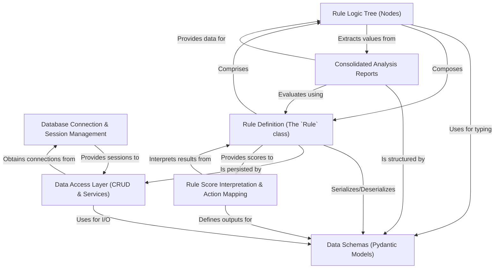

# Tutorial: shared

This project, `shared`, is the *central nervous system* for a financial analysis application. It meticulously **structures all financial data**, fetches it efficiently from **databases**, and then applies a powerful *rule engine*. This engine uses customizable **logic trees** to evaluate detailed *analysis reports*, ultimately translating complex insights into clear numerical scores and **actionable trading advice**.

**Source Repository:** [None](None)

## Chapters

1. [Data Schemas (Pydantic Models)
](01_data_schemas__pydantic_models__.md)
2. [Database Connection & Session Management
](02_database_connection___session_management_.md)
3. [Data Access Layer (CRUD & Services)
](03_data_access_layer__crud___services__.md)
4. [Consolidated Analysis Reports
](04_consolidated_analysis_reports_.md)
5. [Rule Logic Tree (Nodes)
](05_rule_logic_tree__nodes__.md)
6. [Rule Definition (The `Rule` class)
](06_rule_definition__the__rule__class__.md)
7. [Rule Score Interpretation & Action Mapping
](07_rule_score_interpretation___action_mapping_.md)

---

Generated by [AI Codebase Knowledge Builder](https://github.com/The-Pocket/Tutorial-Codebase-Knowledge)