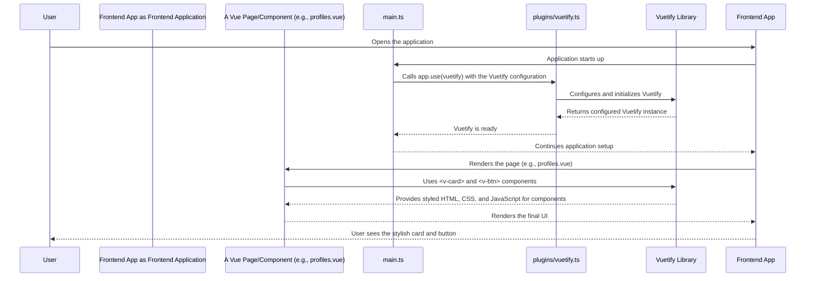

# Chapter 2: UI Framework (Vuetify)

Welcome back! In [Chapter 1: Routing & Navigation](01_routing___navigation_.md), we learned how our application acts like a city with roads (routes) guiding users to different neighborhoods (pages). Now that we know *how* users get to a page, let's talk about *what they see* when they arrive. How do we make those pages look good, modern, and consistent?

### What Problem Does a UI Framework Solve?

Imagine you're building a house. You *could* design and craft every single brick, window, and door from scratch. Or, you could go to a hardware store and pick out pre-made windows, doors, and building blocks that fit together perfectly and look good.

In web development, a **UI Framework** like Vuetify is our hardware store! It provides a rich collection of pre-designed, ready-to-use "building blocks" called **components**. These components are like fancy, functional LEGO bricks: buttons, forms, navigation bars, pop-up windows, and more.

Without a UI framework, we would have to spend a lot of time designing and coding the appearance of every single button, text input, and section of our app. This takes a lot of effort, makes it hard to keep things consistent, and often results in a less polished look.

Our project uses **Vuetify** as its visual toolkit. Its main job is to ensure our entire application has a consistent, modern, and aesthetically pleasing look and feel, all while speeding up development.

#### Central Use Case: Building a Stylish Information Card

Let's say we want to display important information, like a user's investment profile summary, on a page. We want it to look neat, organized, and fit in with the rest of the application's style. Vuetify helps us do this quickly with a `v-card` component. Instead of writing lots of CSS to make a box with shadows and rounded corners, we just use a single Vuetify component!

### Key Concepts of Vuetify

Let's break down the main ideas behind Vuetify:

1.  **A Visual Toolkit:** Vuetify is a library of visual components. Think of it as a giant box of UI elements that you can simply plug into your Vue application. Each element is styled and behaves predictably.

2.  **Material Design:** Vuetify follows **Google's Material Design** guidelines. This is a design language that Google developed for its own apps. It emphasizes clean layouts, smooth animations, and consistent interactions. By following Material Design, Vuetify components ensure our application looks modern and familiar to users.

3.  **Pre-designed Components:** The core of Vuetify is its set of ready-to-use components. Instead of building a button from scratch, you use a `<v-btn>`. Instead of styling a complex navigation bar, you use `<v-navigation-drawer>`. This drastically reduces the amount of code you need to write for styling and common interactions.

4.  **Integration with Vue:** Vuetify components are built specifically for Vue.js. This means they integrate seamlessly with Vue's reactivity system and component structure. You use them just like any other Vue component, but they come with beautiful default styling and built-in functionalities.

5.  **Layouts and Structure:** As mentioned in [Chapter 1: Routing & Navigation](01_routing___navigation_.md), our project uses `vite-plugin-vue-layouts-next` to apply common structures (like headers and footers) to our pages. Vuetify components are often used *within* these layouts to build the header, footer, sidebars, and the main content area itself, ensuring that even the overarching structure of our app is consistent and beautiful.

### How We Use Vuetify to Build Pages

Using Vuetify components is very straightforward. You simply add them to your Vue template using special `v-` prefixes.

Let's revisit our `src/pages/profiles.vue` example from the previous chapter. Imagine we want to display some profile information within a nice-looking card.

#### Creating a Stylish Card Component

We can use Vuetify's `v-card` component to easily create a section with a clean design.

```vue
<!-- src/pages/profiles.vue -->
<template>
  <v-container>
    <h1>Your Investment Profiles</h1>
    
    <!-- This is our Vuetify card component! -->
    <v-card class="mt-4" elevation="4">
      <v-card-title>
        <h3>My First Profile</h3>
      </v-card-title>
      <v-card-text>
        <p>This card displays summary information about one of your investment profiles.</p>
        <p>Current Value: $10,000</p>
      </v-card-text>
      <v-card-actions>
        <v-btn color="primary">View Details</v-btn>
      </v-card-actions>
    </v-card>

    <p class="mt-4">This is where your other profiles will be listed.</p>
  </v-container>
</template>

<script setup lang="ts">
// Your page-specific logic will go here
</script>
```
In this snippet:
*   `<v-container>` is a Vuetify component that helps center and limit the width of content, making it responsive.
*   `<v-card>` creates a styled card element. We've added `class="mt-4"` (margin-top 4, a spacing utility) and `elevation="4"` (a shadow effect) to it.
*   `<v-card-title>`, `<v-card-text>`, and `<v-card-actions>` are special components that Vuetify provides to structure the content *inside* a card, making titles, body text, and action buttons look consistent.
*   `<v-btn color="primary">` creates a styled button. `color="primary"` tells Vuetify to use our application's main accent color for this button.

You don't need to import `v-card`, `v-btn`, or any other `v-` components explicitly in your `<script setup>` block. Our project uses a clever tool called `unplugin-vue-components` (mentioned in the `README.md`), which *automatically imports* these components when you use them in your template! This makes component usage super simple.

### How it All Comes Together: The Vuetify Setup

How does our project know what `v-card` or `v-btn` means? It's all set up when our application first starts.

Let's visualize the journey of a `v-card` component from code to screen:



In short:
1.  When our application starts, `src/main.ts` is the first file to run.
2.  It uses a special setup in `src/plugins/vuetify.ts` to configure and activate Vuetify.
3.  Once Vuetify is active, any `v-` components used in our Vue templates (like in `profiles.vue`) are recognized and rendered beautifully.

#### The Core Setup: `src/main.ts`

The `src/main.ts` file is where our Vue application begins. It's responsible for bringing together all the different parts of our frontend, including Vuetify.

```typescript
// src/main.ts (simplified excerpt)
// ... other imports ...

// Vuetify import
import vuetify from './plugins/vuetify'; // Import our Vuetify configuration

// Create the main Vue application instance
const app = createApp(App);

// Register core plugins
app.use(createPinia()); // For state management (see Chapter 6)
app.use(router);      // For routing (see Chapter 1)
app.use(vuetify);     // <--- Here we tell Vue to use Vuetify!

// ... other setup and app.mount('#app'); ...
```
The key line here is `app.use(vuetify);`. This line tells our Vue application to "activate" Vuetify, making all its components and styling available throughout our entire project.

#### Configuring Vuetify: `src/plugins/vuetify.ts`

The `vuetify` object that `main.ts` imports comes from `src/plugins/vuetify.ts`. This file is dedicated to setting up Vuetify with our specific project needs.

```typescript
// src/plugins/vuetify.ts (simplified excerpt)

// Import the Material Design Icons font (for icons like 'mdi-home')
import '@mdi/font/css/materialdesignicons.css';
// Import Vuetify's core styles
import 'vuetify/styles';

// Import the function to create a Vuetify instance
import { createVuetify } from 'vuetify';

/**
 * Creates and configures the Vuetify instance.
 */
export default createVuetify({
  theme: {
    // We're using a 'system' default theme, meaning it adapts to user's light/dark mode preference
    defaultTheme: 'system', 
  },
  // ... other configurations like custom components or defaults could go here
});
```
Here's what's important:
*   `import '@mdi/font/css/materialdesignicons.css';`: This line brings in a popular icon set (Material Design Icons) that works great with Vuetify. This is why you can use icons like `<v-icon>mdi-home</v-icon>` in your templates.
*   `import 'vuetify/styles';`: This line is crucial! It imports all of Vuetify's core CSS styles, which makes our `v-card` and `v-btn` components look good without us writing any custom CSS.
*   `createVuetify({ ... });`: This function initializes Vuetify. Inside, we can configure global settings, like our application's default theme (`defaultTheme: 'system'`) which tells Vuetify to use either light or dark mode based on your operating system's settings.

The `README.md` in our project further confirms that our project is "Optimized Front-End Stack: Leverage the latest Vue 3 and Vuetify 3 for a modern, reactive UI development experience." This scaffolding sets up Vuetify to be ready out-of-the-box.

### Conclusion

In this chapter, we explored **UI Framework (Vuetify)**, which provides the visual building blocks for our application. We learned that Vuetify gives us pre-designed components, following Material Design, to create a consistent and modern look with minimal effort. We saw how easily we can use components like `v-card` in our pages and understood how Vuetify is initialized in `src/main.ts` and configured in `src/plugins/vuetify.ts` to make all this possible.

Now that we know how to structure our application's navigation and make its pages look good, it's time to dive into the core engine that powers all of it: Vue itself!

[Next Chapter: Vue Application Core](03_vue_application_core_.md)

---

Generated by [AI Codebase Knowledge Builder](https://github.com/The-Pocket/Tutorial-Codebase-Knowledge)