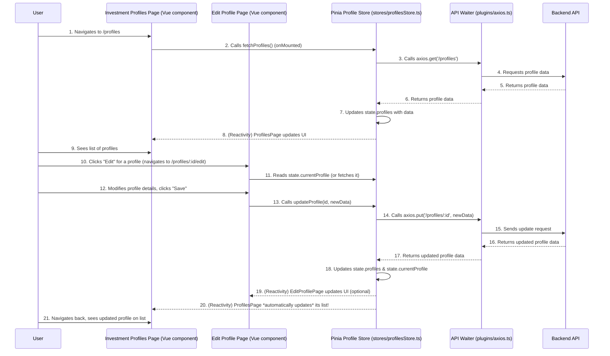

# Chapter 6: State Management (Pinia Stores)

Welcome back! In [Chapter 5: API Communication (Axios & OpenAPI Types)](05_api_communication__axios___openapi_types__.md), we learned how our frontend "talks" to the backend server to send and receive data. We now know how to get information, but what happens when many different parts of our application need to *share* that same information, or *react* when it changes? This is where **State Management** with **Pinia Stores** comes in!

### What Problem Does State Management Solve?

Imagine our application is a bustling office building. Many different departments (our Vue components) need access to crucial company information (our application's data), like "Current Employee List" or "Project Deadlines."

What if every department kept its *own copy* of this information?
*   If HR updates the "Employee List," how do all other departments immediately know? They'd be working with outdated information!
*   If the Sales team updates a "Project Deadline," how does Marketing know to adjust their campaigns?
*   This would lead to confusion, inconsistencies, and a lot of manual re-checking.

This is the problem **State Management** solves! Instead of every component managing its own data, we create **Pinia Stores** which are like dedicated "Information Desks" for different parts of our application. These stores hold shared pieces of information (like user details, profiles, or analysis results) that many components might need.

When data changes in one of these stores, all components that are "listening" to it automatically update, ensuring consistency across the entire application. This prevents confusion and makes complex data flows much simpler to manage.

#### Central Use Case: Sharing and Updating Investment Profiles

Let's say you're on the "Investment Profiles" page (from [Chapter 1: Routing & Navigation](01_routing___navigation_.md)). This page displays a list of your profiles. You then navigate to a specific profile's "Edit" page. If you make changes and save them, you'd expect to see those changes immediately reflected back on the main "Investment Profiles" list page *without refreshing the browser*.

How do we ensure that both the main list page and the edit page are always showing the same, up-to-date profile data, even though they are different components? A Pinia store for profiles is the perfect solution!

### Key Concepts of Pinia Stores

Pinia is the recommended state management library for Vue.js. It's simple, lightweight, and incredibly powerful. Let's break down its main ideas:

1.  **A "Store" (The Information Desk):** A Pinia Store is a centralized place to hold specific pieces of information (state) and the logic to interact with that information. We create separate stores for different parts of our app, like `authStore` for user login, `profilesStore` for investment profiles, or `analysisStore` for market analysis.

2.  **State (The Information Itself):** This is the actual data stored in the Pinia store. It's reactive, meaning if `state.profiles` (a list of profiles) changes in the store, any component displaying `state.profiles` will automatically update its display.
    *   **Analogy:** The actual folders, documents, and data sheets on the Information Desk.

3.  **Getters (Pre-computed Information):** These are like "computed properties" for your store's state. They allow you to derive new data from the state without modifying it directly. For example, a `defaultProfile` getter could easily find the user's default profile from the list of all profiles.
    *   **Analogy:** A special section on the Information Desk that always has the "Top 5 Urgent Projects" calculated and ready to view.

4.  **Actions (The Desk Agent's Tasks):** These are functions where you put all your business logic, like fetching data from an API (using Axios, as seen in [Chapter 5: API Communication (Axios & OpenAPI Types)](05_api_communication__axios___openapi_types__.md)), updating the state, or performing complex calculations. Actions are the *only* way to modify the state directly in a structured way.
    *   **Analogy:** The specific tasks the agent at the Information Desk performs: "Fetch Latest Sales Report," "Update Customer Contact Info," "Print Employee Directory."

5.  **Reactivity:** Pinia works seamlessly with Vue's reactivity system. This means if you change a piece of `state` inside a Pinia store, any Vue component that is "using" that piece of state will automatically re-render and show the new value. This is the magic that keeps your UI updated!

### How We Use Pinia Stores to Manage Investment Profiles

Let's use our central use case: managing investment profiles. We'll create a `profilesStore` to handle all profile-related data and actions.

#### Creating and Using a Profile Store

First, we define our store using Pinia's `defineStore` function. This typically happens in `src/stores/profilesStore.ts`.

```typescript
// src/stores/profilesStore.ts (simplified example)
import { defineStore } from 'pinia';
import axios from '@/plugins/axios'; // Our API waiter from Chapter 5
import type { components } from '@/types/api'; // Our API recipe book from Chapter 5

// Define the type for an individual profile using our OpenAPI types
type Profile = components['schemas']['ProfileResponse'];
type ProfileUpdate = components['schemas']['ProfileUpdateRequest']; // For updating

interface ProfileState {
  profiles: Profile[]; // The list of all profiles
  currentProfile: Profile | null; // The profile currently being viewed/edited
  isLoadingList: boolean;
  error: string | null;
}

export const useProfileStore = defineStore('profile', {
  // 1. STATE: The actual data this store will hold
  state: (): ProfileState => ({
    profiles: [],
    currentProfile: null,
    isLoadingList: false,
    error: null,
  }),

  // 2. GETTERS: Derived information from the state
  getters: {
    // Example: A getter to easily find the default profile
    defaultProfile: (state): Profile | undefined => {
      return state.profiles.find(p => p.is_default);
    },
  },

  // 3. ACTIONS: Functions to perform tasks and modify the state
  actions: {
    // Action to fetch all profiles from the backend
    async fetchProfiles() {
      this.isLoadingList = true;
      this.error = null;
      try {
        const response = await axios.get('/profiles');
        this.profiles = response.data; // Update the state
      } catch (e: any) {
        this.error = e.response?.data?.detail || "Failed to fetch profiles.";
      } finally {
        this.isLoadingList = false;
      }
    },

    // Action to update an existing profile
    async updateProfile(profileId: string, profileData: ProfileUpdate): Promise<boolean> {
      this.error = null;
      try {
        const response = await axios.put(`/profiles/${profileId}`, profileData);
        
        // Update the profile in our local `profiles` list
        const index = this.profiles.findIndex(p => p.profile_id === profileId);
        if (index !== -1) {
          this.profiles[index] = response.data; // Replace with updated data
        }

        // If this is the profile currently being viewed, update that too
        if (this.currentProfile?.profile_id === profileId) {
          this.currentProfile = response.data;
        }
        return true;
      } catch (e: any) {
        this.error = e.response?.data?.detail || "Failed to update profile.";
        return false;
      }
    },
    
    // ... other actions like fetchProfileDetails, createProfile, deleteProfile ...
  },
});
```
*   `defineStore('profile', { ... })`: This creates our Pinia store and gives it a unique ID `'profile'`.
*   `state: () => ({ ... })`: This defines the initial data (our "information") in the store. We have an empty `profiles` array and `currentProfile` is initially `null`.
*   `getters: { ... }`: The `defaultProfile` getter shows how we can easily derive information from `state.profiles`.
*   `actions: { ... }`:
    *   `fetchProfiles()`: This action makes an API call using `axios.get('/profiles')` to get the list of profiles. Crucially, it then updates `this.profiles = response.data;`. Because `profiles` is part of our reactive state, any component using `profiles` will automatically update.
    *   `updateProfile()`: This action sends changes to the backend using `axios.put()`. After a successful update, it *also updates the `profiles` array and `currentProfile` in the store's state*. This ensures that the single source of truth is always correct and all listening components will reflect the change.

#### Using the Store in a Vue Component

Now, let's see how a Vue component (like our main "Investment Profiles" page) would use this store:

```vue
<!-- src/pages/profiles.vue (simplified example) -->
<template>
  <v-container>
    <h1>Your Investment Profiles</h1>

    <div v-if="profileStore.isLoadingList">Loading profiles...</div>
    <div v-else-if="profileStore.error">{{ profileStore.error }}</div>
    <div v-else>
      <v-card v-for="profile in profileStore.profiles" :key="profile.profile_id" class="mt-4">
        <v-card-title>{{ profile.profile_name }}</v-card-title>
        <v-card-text>
          <p>{{ profile.description }}</p>
          <p>Risk Tolerance: {{ profile.risk_tolerance }}</p>
        </v-card-text>
        <v-card-actions>
          <!-- When clicked, this routes to the edit page for this profile -->
          <v-btn color="primary" :to="`/profiles/${profile.profile_id}/edit`">Edit</v-btn>
        </v-card-actions>
      </v-card>

      <p v-if="profileStore.profiles.length === 0" class="mt-4">No profiles found. Create one!</p>
    </div>
  </v-container>
</template>

<script setup lang="ts">
import { useProfileStore } from '@/stores/profilesStore'; // Import our profile information desk
import { onMounted } from 'vue'; // A Vue lifecycle hook (from Chapter 3)

const profileStore = useProfileStore(); // Get access to our profile information desk

onMounted(() => {
  // When this component loads, ask the store to fetch profiles
  profileStore.fetchProfiles();
});
</script>
```
*   `import { useProfileStore } from '@/stores/profilesStore';`: We import our store.
*   `const profileStore = useProfileStore();`: This line gives our component access to the Pinia store instance.
*   `profileStore.profiles`: In the template, we directly use `profileStore.profiles` to display the list. Because this data is reactive, if `profileStore.profiles` changes (e.g., after an update), the UI automatically updates.
*   `profileStore.fetchProfiles();`: When the component is first loaded (`onMounted`), we call the `fetchProfiles` action from the store to get the data.

This setup ensures that all profile-related data is managed in one central place (`profilesStore`). Any component needing this data simply asks the store, and any component making changes tells the store to update, which then reliably propagates those changes across the application.

### How it All Comes Together: The Pinia Workflow

Let's trace how data flows through a Pinia store using our Investment Profiles example.


In this sequence:
1.  The `ProfilesPage` needs data, so it asks the `ProfileStore`.
2.  The `ProfileStore` fetches the data from the `Backend` via `Axios`.
3.  The `ProfileStore` updates its internal `state.profiles`.
4.  Because `ProfilesPage` is "listening" to `state.profiles`, it automatically updates its display.
5.  Later, `EditProfilePage` modifies a profile and tells `ProfileStore` to `updateProfile`.
6.  `ProfileStore` sends the update to the `Backend` and, after success, updates its `state.profiles` (and `state.currentProfile`).
7.  The crucial step: *Both* `EditProfilePage` and `ProfilesPage` (and any other component using this data!) automatically re-render with the latest information from the store.

#### Deep Dive into the Code

Let's look at the actual files that orchestrate this process in our project.

1.  **Pinia Initialization (`src/main.ts`)**
    Just like Vue Router and Vuetify, Pinia needs to be "plugged in" when our application starts up (as seen in [Chapter 3: Vue Application Core](03_vue_application_core_.md)).

    ```typescript
    // src/main.ts (simplified excerpt)
    import App from './App.vue';
    import { createApp } from 'vue';

    import { createPinia } from 'pinia'; // Pinia's main function
    import router from './router';
    import vuetify from './plugins/vuetify';

    const app = createApp(App);

    // This line registers Pinia as a plugin for our Vue application
    app.use(createPinia()); // <--- Here we tell Vue to use Pinia!
    app.use(router);
    app.use(vuetify);

    // Note: useAuthStore().initializeAuth() is called *after* createPinia()
    // because authStore itself is a Pinia store.

    app.mount('#app');
    ```
    The `app.use(createPinia());` line is essential. It initializes Pinia and makes `defineStore` and all Pinia stores available throughout our entire application. The actual `createPinia()` function is typically imported from `src/stores/index.ts` in our project, which simply re-exports it.

2.  **Auto-Imported Functions (`src/auto-imports.d.ts`)**
    You might have noticed we didn't explicitly `import { defineStore } from 'pinia';` in every store file. Our project uses `unplugin-auto-import` to automatically make common functions available.

    ```typescript
    // src\auto-imports.d.ts (excerpt - DO NOT MODIFY MANUALLY)
    declare global {
      // ... many other auto-imports ...
      const defineStore: typeof import('pinia')['defineStore']
      // ...
      const storeToRefs: typeof import('pinia')['storeToRefs']
      // ...
    }
    ```
    This generated file tells TypeScript that `defineStore` and `storeToRefs` (another useful Pinia utility to keep reactivity when destructuring state) are globally available, improving our development experience.

3.  **Store Organization (`src/stores/README.md`)**
    Our project structure has a dedicated `src/stores` folder. The `README.md` within this folder confirms its purpose:

    ```markdown
    # Store

    Pinia stores are used to store reactive state and expose actions to mutate it.

    Full documentation for this feature can be found in the Official [Pinia](https://pinia.esm.dev/) repository.
    ```
    This is where all our application's "Information Desks" are located, each in its own file (e.g., `authStore.ts`, `profilesStore.ts`, `advisorStore.ts`).

4.  **Examples of Other Stores (`src/stores/advisorStore.ts`, `src/stores/analysisStore.ts`, `src/stores/notificationStore.ts`)**
    Our project uses multiple Pinia stores to manage different domains of data:
    *   **`src/stores/advisorStore.ts`**: Manages the state for AI-generated investment recommendations, user-editable configurations, and the final advisory report. It handles a multi-step process with its own loading states and errors.
    *   **`src/stores/analysisStore.ts`**: Focuses on market analysis reports and explanations, fetching them from the backend.
    *   **`src/stores/notificationStore.ts`**: A generic store for displaying application-wide notifications or "toast" messages to the user. This is a great example of a store that doesn't necessarily interact with the backend but manages UI-specific global state.

These additional store files demonstrate how Pinia helps organize different types of data and logic into cohesive, manageable units, improving the overall structure and maintainability of our application.

### Conclusion

In this chapter, we've explored **State Management (Pinia Stores)**, learning that they act as centralized "Information Desks" for our application's shared data. We understood how **State** holds the reactive data, **Getters** derive new information, and **Actions** encapsulate the logic for fetching, updating, and modifying that data. We saw how a `profilesStore` enables our "Investment Profiles" page and "Edit Profile" page to seamlessly share and react to changes in profile data, ensuring consistency throughout the app. Finally, we looked at how Pinia is initialized in `src/main.ts` and how different stores manage distinct parts of our application's state.

With a solid grasp of how to manage data efficiently across our application, we're ready to dive into one of our core features: managing the specific details of a user's investment profiles.

[Next Chapter: Investment Profiles](07_investment_profiles_.md)

---

Generated by [AI Codebase Knowledge Builder](https://github.com/The-Pocket/Tutorial-Codebase-Knowledge)