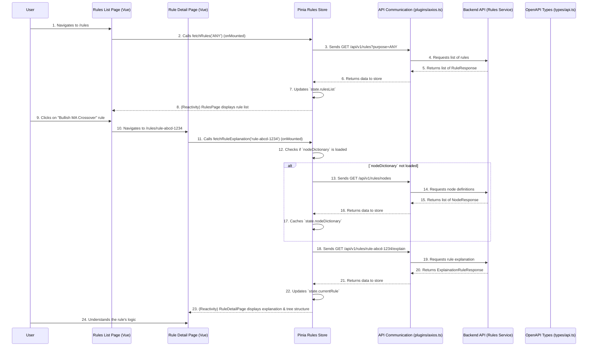

# Chapter 10: Trading Rules & Nodes

Welcome back! In [Chapter 9: AI Market Analysis](09_ai_market_analysis_.md), we learned how our application can act as a super-smart research assistant, providing comprehensive market insights for any stock. We saw how the AI can give you a clear picture of technical trends, forecasts, and news sentiment. But all that powerful AI analysis needs specific instructions to turn into actionable recommendations.

### What Problem Do Trading Rules & Nodes Solve?

Imagine you're trying to explain to someone *exactly* why you decided to buy a particular stock. You might say, "Well, the stock price just broke above its 50-day moving average, *and* the trading volume was high, *and* the company announced positive earnings." These are all specific conditions that, when combined, lead to a decision.

The **Trading Rules & Nodes** system in our application is like the language we use to define these exact conditions and logic for our AI. It solves two big problems:
1.  **Defining the AI's Decision Logic:** It provides the fundamental "building blocks" (Nodes) and the way to combine them into "instructions" (Rules) that the AI follows to make investment decisions. Instead of a mysterious "black box," our AI follows clear, structured logic.
2.  **Transparency and Understanding:** When the AI gives you a recommendation (like "BUY Apple"), you shouldn't just take its word for it. This system allows you to understand *why* that recommendation was made by showing you which rules were triggered and providing a plain-language explanation for them.

Think of **Nodes** as individual LEGO bricks, each representing a simple piece of information or an action (like "Stock Price," "Greater Than," "Volume," "50-day Moving Average"). **Rules** are like carefully designed LEGO models or instruction manuals, built by connecting these nodes together to form complex logical statements (e.g., "IF (Stock Price > 50-day Moving Average) AND (Volume is High) THEN Recommend BUY").

Without this system, our AI's decisions would be opaque, and customizing its behavior or understanding its rationale would be impossible.

#### Central Use Case: Understanding an AI-Triggered Trading Rule

Let's say the [AI Investment Advisor](08_ai_investment_advisor_.md) recommended a "BUY" for a stock, and in its report, it mentioned that a specific rule, "Bullish MA Crossover," was a key factor. You want to know exactly what "Bullish MA Crossover" means. You'd go to our "Rules" section, find this rule, and ask for its explanation. The system would then show you the logical structure of the rule and explain in plain English what conditions it checks.

### Key Concepts of Trading Rules & Nodes

Let's break down these foundational elements:

1.  **Nodes (The Building Blocks):**
    *   These are the smallest, individual pieces of logic or data that make up a rule.
    *   Examples:
        *   **Variable Node:** Represents a piece of dynamic data, like "Stock Price" or "50-day Moving Average."
        *   **Constant Node:** Represents a fixed value, like the number `100` or the boolean `TRUE`.
        *   **Operator Node:** Represents a logical operation, like "Greater Than (`>`)," "AND," or "Add (`+`)."
    *   Each node has a "type" (e.g., numerical, boolean) to ensure they can be connected correctly, just like certain LEGO bricks only fit with others.

2.  **Rules (The Instruction Manuals/Tree Structures):**
    *   A rule is a complete logical statement built by connecting nodes together in a tree-like structure. The output of one node becomes the input for another.
    *   Example Rule (simplified):
        ```
        IF (Stock Price > 50-day Moving Average)
        AND (RSI < 70)
        THEN (Decision: BUY)
        ```
    *   This structure allows for complex logic to be defined in a clear, hierarchical way.
    *   Each rule also has a `purpose` (e.g., `DECISION_SIGNAL`, `RISK_LEVEL`) which indicates what kind of output it provides.

3.  **Transparency and Explanations:**
    *   A key feature is the ability to fetch a natural language explanation for any rule. This explanation describes what the rule does and why it's important, making the AI's logic understandable.
    *   It helps users build trust in the AI and learn about investment strategies.

4.  **The Rules Store (The Rulebook Library):**
    *   All the available rules and node definitions are managed in a dedicated [Pinia Store](06_state_management__pinia_stores__.md) called `rulesStore` (`src/stores/rulesStore.ts`). This store handles fetching lists of rules, the "dictionary" of all possible node types, and detailed explanations for individual rules.

### How to Use Trading Rules & Nodes (Solving the Use Case)

Our application has a dedicated section for viewing and understanding these rules. This typically involves pages like `/rules` (to see a list of rules) and `/rules/[rule_id]` (to see a detailed explanation of a specific rule).

#### 1. Listing Available Rules

A user might first visit the `/rules` page to see all the available trading rules the AI uses.

```vue
<!-- src/pages/rules/index.vue (simplified) -->
<template>
  <v-container>
    <h1>Trading Rules Library</h1>
    <p>Explore the logical building blocks of our AI's investment decisions.</p>

    <v-select
      label="Filter by Purpose"
      :items="semanticTypeOptions"
      v-model="selectedPurpose"
      class="mt-4"
    ></v-select>

    <v-card v-if="rulesStore.isLoadingList" class="mt-4 pa-4">
      <v-progress-circular indeterminate color="primary"></v-progress-circular>
      <p class="ml-2">Loading trading rules...</p>
    </v-card>

    <v-alert v-else-if="rulesStore.error" type="error" class="mt-4">{{ rulesStore.error }}</v-alert>

    <v-list v-else>
      <v-list-item
        v-for="rule in rulesStore.rulesList"
        :key="rule.rule_id"
        :to="`/rules/${rule.rule_id}`"
        link
      >
        <v-list-item-title>{{ rule.name }} (Purpose: {{ rule.purpose }})</v-list-item-title>
        <v-list-item-subtitle>Status: {{ rule.rule_status }}</v-list-item-subtitle>
      </v-list-item>
      <v-list-item v-if="rulesStore.rulesList.length === 0">
        <v-list-item-title>No rules found for this purpose.</v-list-item-title>
      </v-list-item>
    </v-list>
  </v-container>
</template>

<script setup lang="ts">
import { ref, onMounted, watch } from 'vue';
import { useRulesStore } from '@/stores/rulesStore'; // Our rules library desk
import { SEMANTIC_TYPE_OPTIONS } from '@/constants/api'; // Options for filtering

const rulesStore = useRulesStore();
const selectedPurpose = ref('ANY'); // Default filter to show all types
const semanticTypeOptions = ['ANY', ...SEMANTIC_TYPE_OPTIONS]; // 'ANY' plus specific types

onMounted(() => {
  rulesStore.fetchRules(selectedPurpose.value); // Fetch rules when page loads
});

// Watch for changes in the filter and re-fetch rules
watch(selectedPurpose, (newPurpose) => {
  rulesStore.fetchRules(newPurpose);
});
</script>
```
In this example:
*   The `useRulesStore()` gives us access to our `rulesStore`.
*   `rulesStore.fetchRules(selectedPurpose.value)` is called on `onMounted` and whenever the `selectedPurpose` filter changes. This fetches a list of `RuleResponse` objects from the backend.
*   The `v-list` then displays each rule's `name`, `purpose`, and `rule_status` from `rulesStore.rulesList`.
*   Clicking on a rule (`:to="/rules/${rule.rule_id}"`) navigates to a detail page.

#### 2. Viewing a Specific Rule's Explanation

When a user clicks on a rule in the list, they are taken to a detailed page like `/rules/some-rule-id`. This page focuses on showing the rule's full logical structure and a plain-language explanation.

```vue
<!-- src/pages/rules/[rule_id].vue (simplified) -->
<template>
  <v-container>
    <div v-if="rulesStore.isLoadingDetails" class="mt-4 pa-4">
      <v-progress-circular indeterminate color="primary"></v-progress-circular>
      <p class="ml-2">Loading rule explanation...</p>
    </div>

    <v-alert v-else-if="rulesStore.error" type="error" class="mt-4">{{ rulesStore.error }}</v-alert>

    <div v-else-if="rulesStore.currentRule">
      <h1>Rule: {{ rulesStore.currentRule.name }}</h1>
      <p><strong>ID:</strong> {{ rulesStore.currentRule.rule_id }}</p>
      <p><strong>Purpose:</strong> {{ rulesStore.currentRule.purpose }}</p>
      <p><strong>Status:</strong> {{ rulesStore.currentRule.rule_status }}</p>

      <v-card class="mt-4 pa-4">
        <v-card-title>Explanation</v-card-title>
        <v-card-text>
          <p>{{ rulesStore.currentRule.explain }}</p>
        </v-card-text>
      </v-card>

      <v-card class="mt-4 pa-4">
        <v-card-title>Logical Structure (Nodes)</v-card-title>
        <v-card-text>
          <!-- Recursively display the rule's tree structure -->
          <RuleNodeDisplay :node="rulesStore.currentRule.root" :node-dict="rulesStore.nodeDictionary" />
        </v-card-text>
      </v-card>
    </div>
  </v-container>
</template>

<script setup lang="ts">
import { onMounted } from 'vue';
import { useRoute } from 'vue-router/auto'; // For getting rule_id from URL (Chapter 1)
import { useRulesStore } from '@/stores/rulesStore'; // Our rules library desk
import RuleNodeDisplay from '@/components/RuleNodeDisplay.vue'; // A component to show the tree

const route = useRoute('/rules/[rule_id]'); // Get the dynamic part of the URL
const rulesStore = useRulesStore();

onMounted(() => {
  const ruleId = route.params.rule_id as string;
  if (ruleId) {
    rulesStore.fetchRuleExplanation(ruleId); // Fetch the detailed rule and its explanation
  }
});
</script>
```
*   `useRoute('/rules/[rule_id]')` (from [Chapter 1: Routing & Navigation](01_routing___navigation_.md)) is used to extract the `rule_id` from the URL.
*   `rulesStore.fetchRuleExplanation(ruleId)` is called on `onMounted` to get the specific rule's details.
*   `rulesStore.currentRule.explain` displays the crucial plain-language explanation.
*   The `RuleNodeDisplay` component (which would handle the visual rendering of the `rulesStore.currentRule.root` tree structure using `rulesStore.nodeDictionary`) helps visualize how the different nodes are connected to form the rule. (The `RuleNodeDisplay` component itself would be complex, so we abstract it here).

### Internal Implementation: How it Works Behind the Scenes

The "Trading Rules & Nodes" feature is driven by the `rulesStore` communicating with the backend API to fetch rule definitions, a dictionary of all possible nodes, and detailed explanations.

#### The Rules Workflow



#### Deep Dive into the Code

Let's look at the actual files that make this process happen.

1.  **The `rulesStore` (`src/stores/rulesStore.ts`)**
    This Pinia store manages all rule and node-related data.

    ```typescript
    // src/stores/rulesStore.ts (simplified excerpt)
    import { defineStore } from 'pinia';
    import axios from '@/plugins/axios'; // Our API waiter from Chapter 5
    import type { components } from '@/types/api'; // Our API recipe book from Chapter 5

    type RuleResponse = components['schemas']['RuleResponse'];
    type RuleExplanation = components['schemas']['ExplainationRuleResponse'];
    type NodeSpec = components['schemas']['NodeResponse'];
    type SemanticType = components['schemas']['SemanticType']; // e.g., 'DECISION_SIGNAL', 'NUMERICAL'

    interface State {
      rulesList: RuleResponse[]; // List of available rules
      nodeDictionary: NodeSpec[]; // Cached list of all possible nodes
      currentRule: RuleExplanation | null; // The currently viewed rule with its explanation
      isLoadingList: boolean;
      isLoadingDetails: boolean;
      error: string | null;
    }

    export const useRulesStore = defineStore('rules', {
      state: (): State => ({
        rulesList: [],
        nodeDictionary: [], // Initially empty, fetched once and cached
        currentRule: null,
        isLoadingList: false,
        isLoadingDetails: false,
        error: null,
      }),
      actions: {
        async fetchRules(purpose: SemanticType = 'ANY') {
          this.isLoadingList = true;
          try {
            const response = await axios.get('/rules', { params: { purpose } });
            this.rulesList = response.data; // Update the list of rules
          } catch (e: any) { /* ... error handling ... */ } finally { this.isLoadingList = false; }
        },
        
        async fetchNodeDictionary() {
          if (this.nodeDictionary.length > 0) return; // Only fetch if not already cached

          try {
            const response = await axios.get('/rules/nodes');
            this.nodeDictionary = response.data; // Cache the node dictionary
          } catch (e: any) { /* ... error handling ... */ }
        },
        
        async fetchRuleExplanation(ruleId: string) {
          this.isLoadingDetails = true;
          this.currentRule = null;
          try {
            // First, make sure we have the dictionary of all possible nodes
            await this.fetchNodeDictionary();
            
            // Then fetch the specific rule explanation
            const response = await axios.get(`/rules/${ruleId}/explain`);
            this.currentRule = response.data; // Store the detailed rule with explanation
          } catch (e: any) { /* ... error handling ... */ } finally { this.isLoadingDetails = false; }
        }
      }
    });
    ```
    *   `state`: Holds the `rulesList`, a `nodeDictionary` (which is a list of all possible types of nodes our AI can use, like 'stock price' or 'greater than'), and the `currentRule` (which includes the `explain` text).
    *   `fetchRules()`: This action contacts the backend (`/rules`) to get a list of available rules, optionally filtered by `purpose`.
    *   `fetchNodeDictionary()`: This is a smart action. It only makes an API call to `/rules/nodes` *once* to get a list of all node types and their properties. It then stores this in `nodeDictionary` for later use, avoiding unnecessary API calls. This dictionary is crucial for understanding the `root` tree structure of a rule.
    *   `fetchRuleExplanation()`: This action fetches a specific rule by its `ruleId` from `/rules/{ruleId}/explain`. It also makes sure `fetchNodeDictionary()` has been called so that all node definitions are available when rendering the rule's complex tree structure. The response includes the `explain` field which contains the plain-language description.

2.  **API Type Definitions (`src/types/api.ts`)**
    The structure of rules, nodes, and their explanations are strictly defined here, thanks to [OpenAPI Types](05_api_communication__axios___openapi_types__.md).

    ```typescript
    // src/types/api.ts (excerpt - DO NOT MODIFY MANUALLY)
    export interface components {
        schemas: {
            /**
             * RuleResponse
             * @description Schema for data OUTPUT after successfully creating a Rule.
             */
            RuleResponse: {
                rule_id: string;
                name: string;
                purpose: components["schemas"]["SemanticType"];
                rule_status: components["schemas"]["RuleStatus"];
                created_at_ts: number;
                root: components["schemas"]["NodeEntity"]; // This is the tree structure!
                metrics?: components["schemas"]["PerformanceMetrics"] | null;
            };
            /**
             * ExplainationRuleResponse
             * @description Rule response with explanation.
             */
            ExplainationRuleResponse: {
                rule_id: string;
                name: string;
                purpose: components["schemas"]["SemanticType"];
                rule_status: components["schemas"]["RuleStatus"];
                created_at_ts: number;
                root: components["schemas"]["NodeEntity"];
                metrics?: components["schemas"]["PerformanceMetrics"] | null;
                /** Explain */
                explain: string; // The plain language explanation!
            };
            /**
             * NodeEntity
             * @description Node entity in a rule tree.
             */
            NodeEntity: {
                /** Node Name */
                node_name: string;
                /** Children */
                children?: components["schemas"]["NodeEntity"][] | null; // Recursive structure
            };
            /**
             * NodeResponse
             * @description Response schema for node specification entities.
             */
            NodeResponse: {
                /** Node Name */
                node_name: string;
                /** Description */
                description: string;
                node_type: components["schemas"]["NodeType"]; // e.g., 'constant', 'variable', 'operator'
                return_type: components["schemas"]["SemanticType"]; // e.g., 'NUMERICAL', 'BOOLEAN'
                args_type?: components["schemas"]["SemanticType"][] | null;
            };
            /**
             * SemanticType
             * @description Defines semantic types for values in rule trees.
             * @enum {string}
             */
            SemanticType: "NUMERICAL" | "BOOLEAN" | "PRICE" | "DECISION_SIGNAL" | "ANY";
            /**
             * NodeType
             * @description Type of node in a rule tree.
             * @enum {string}
             */
            NodeType: "constant" | "variable" | "operator" | "any";
            // ... other schemas ...
        };
        operations: {
            get_ai_ready_rules_api_v1_rules_get: {
                responses: { 200: { content: { "application/json": components["schemas"]["RuleResponse"][]; }; }; };
            };
            get_ai_nodes_api_v1_rules_nodes_get: {
                responses: { 200: { content: { "application/json": components["schemas"]["NodeResponse"][]; }; }; };
            };
            get_ai_single_rule_explain_api_v1_rules__rule_id__explain_get: {
                responses: { 200: { content: { "application/json": components["schemas"]["ExplainationRuleResponse"]; }; }; };
            };
            // ... other operations ...
        };
    }
    ```
    *   `RuleResponse` and `ExplainationRuleResponse`: These define what a rule looks like. `ExplainationRuleResponse` adds the `explain` field which is the natural language explanation string. Both include a `root` property, which is a `NodeEntity`, allowing rules to be defined as nested (tree-like) structures.
    *   `NodeEntity`: This is the recursive type that allows a rule's structure to be built. Each `NodeEntity` has a `node_name` (e.g., `greater_than`, `stock_price_close`) and can have `children` which are more `NodeEntity`s.
    *   `NodeResponse`: This defines what each *type* of node is (its `node_name`, `description`, `node_type`, and `return_type`). This is what `nodeDictionary` in our `rulesStore` stores. This dictionary helps us understand what each `node_name` in a `NodeEntity` actually *means*.
    *   `SemanticType` and `NodeType`: These are enums that ensure we use consistent categories for data types and node roles.

3.  **API Constants (`src/constants/api.ts`)**
    This file uses the types from `src/types/api.ts` to provide frontend-friendly constant lists, ensuring consistency.

    ```typescript
    // src/constants/api.ts (simplified excerpt)
    import type { components } from '@/types/api';

    type SemanticType = components['schemas']['SemanticType'];
    type NodeType = components['schemas']['NodeType'];

    export const SEMANTIC_TYPE_OPTIONS: SemanticType[] = [
      'ANY', 'DECISION_SIGNAL', 'RISK_LEVEL', 'NUMERICAL', 'BOOLEAN', // ... etc.
    ];

    export const NODE_TYPE_OPTIONS: NodeType[] = [
      'constant', 'variable', 'operator', 'any'
    ];
    ```
    These arrays are derived directly from the OpenAPI types, so if the backend adds a new `SemanticType` or `NodeType`, TypeScript will alert us if we forget to update these lists after running `npm run sync:api-types`. This is a powerful feature for maintaining synchronization between frontend and backend.

4.  **Routing (`src/typed-router.d.ts`)**
    As learned in [Chapter 1: Routing & Navigation](01_routing___navigation_.md), our routing system automatically creates dynamic paths.

    ```typescript
    // src\typed-router.d.ts (excerpt - DO NOT MODIFY THIS FILE)
    declare module 'vue-router/auto-routes' {
      export interface RouteNamedMap {
        '/rules/': RouteRecordInfo<'/rules/', '/rules', /* ... */>,
        '/rules/[rule_id]': RouteRecordInfo<'/rules/[rule_id]', '/rules/:rule_id', { rule_id: ParamValue<true> }, { rule_id: ParamValue<false> }>,
        // ...
      }
    }
    ```
    These entries ensure that `/rules` maps to our list page (`src/pages/rules/index.vue`), and dynamic routes like `/rules/some-id` map to a detail page (`src/pages/rules/[rule_id].vue`), allowing us to easily get the `rule_id` from `route.params.rule_id`.

### Conclusion

In this chapter, we've explored **Trading Rules & Nodes**, which are the fundamental building blocks for our AI's decision-making logic. We learned that **Nodes** are individual logical components (like a stock price or an operator), and **Rules** are tree-like structures built from these nodes that represent specific trading strategies. This system provides crucial **transparency** by allowing us to fetch plain-language explanations for why the AI makes certain recommendations. The entire process is managed by the `rulesStore` ([Pinia Store](06_state_management__pinia_stores__.md)), which uses [Axios](05_api_communication__axios___openapi_types__.md) to communicate with the backend and relies on robust [OpenAPI Types](05_api_communication__axios___openapi_types__.md) for data consistency.

With a deep understanding of how our AI constructs and explains its decisions, our final foundational chapter will bring everything together by looking at how our project automates common development tasks to make our lives as developers much easier.

[Next Chapter: Automated Imports & Components](11_automated_imports___components_.md)

---

Generated by [AI Codebase Knowledge Builder](https://github.com/The-Pocket/Tutorial-Codebase-Knowledge)