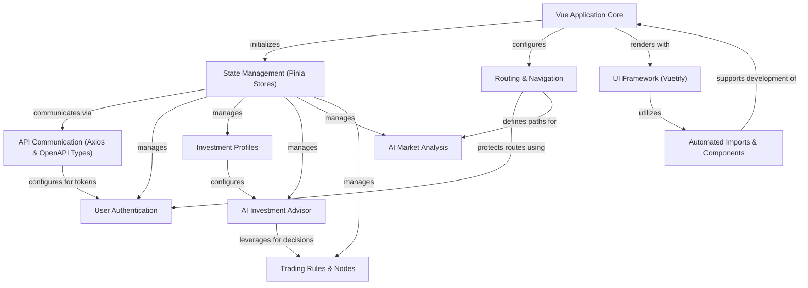

# Tutorial: frontend

This project is a sophisticated frontend application built with **Vue 3** and **Vuetify**,
designed as an *AI-powered investment platform*. It enables users to create and manage
personalized **investment profiles**, receive tailored **AI investment advice** for specific
stocks, access comprehensive **AI market analysis** reports, and understand the underlying
**trading rules** and logic. The application ensures a secure experience with **user authentication**
and provides a seamless, intuitive user interface for navigation and interaction.

**Source Repository:** [None](None)

## Chapters

1. [Routing & Navigation
](01_routing___navigation_.md)
2. [UI Framework (Vuetify)
](02_ui_framework__vuetify__.md)
3. [Vue Application Core
](03_vue_application_core_.md)
4. [User Authentication
](04_user_authentication_.md)
5. [API Communication (Axios & OpenAPI Types)
](05_api_communication__axios___openapi_types__.md)
6. [State Management (Pinia Stores)
](06_state_management__pinia_stores__.md)
7. [Investment Profiles
](07_investment_profiles_.md)
8. [AI Investment Advisor
](08_ai_investment_advisor_.md)
9. [AI Market Analysis
](09_ai_market_analysis_.md)
10. [Trading Rules & Nodes
](10_trading_rules___nodes_.md)
11. [Automated Imports & Components
](11_automated_imports___components_.md)

---

Generated by [AI Codebase Knowledge Builder](https://github.com/The-Pocket/Tutorial-Codebase-Knowledge)