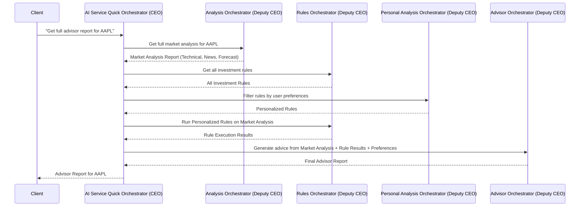

# Chapter 1: AI Service Quick Orchestrator (CEO)

Welcome to the AI Service Quick project! In this first chapter, we're going to meet the most important part of our system: the **AI Service Quick Orchestrator**, which we affectionately call the **CEO**!

## What's the Problem and Why Do We Need a CEO?

Imagine you want to get a complete investment recommendation for a stock, like "Should I buy Apple (AAPL) stock right now?" This isn't a simple question. To answer it well, you'd need to:

1.  **Analyze the market:** Look at charts, predict future prices, and read the latest news about Apple.
2.  **Understand your personal style:** Are you a risky investor or do you prefer safe bets? Do you care more about short-term gains or long-term growth?
3.  **Apply expert rules:** What do experienced investors or predefined strategies say about this situation given your style?
4.  **Put it all together:** Combine all this information into a clear recommendation.

Doing all these steps manually is a lot of work! This is where our **AI Service Quick Orchestrator (CEO)** comes in. It's designed to be the "main manager" that handles these complex requests for you, bringing together all the different parts of the AI system.

## Meet the CEO: Your Central Manager

Think of the **AI Service Quick Orchestrator (CEO)** like the CEO of a company. A company CEO doesn't do *every* job themselves. Instead, they tell different department heads (like the Head of Sales, Head of Marketing, or Head of Finance) what needs to be done, and then they bring all the results together for the big picture.

Our AI Service Quick CEO works exactly the same way. It's the central hub for handling end-user requests, especially those that need many steps and different types of AI analysis.

### The CEO's Job: Coordinating Deputy CEOs

The CEO orchestrator's main job is to coordinate other, specialized orchestrators. We call these other orchestrators **"Deputy CEOs"** because they manage specific areas, just like department heads.

Here are the main Deputy CEOs that the CEO works with:

*   **[Analysis Orchestrator (Deputy CEO)](05_analysis_orchestrator__deputy_ceo__.md):** This Deputy CEO is responsible for all the heavy lifting in market analysis, like technical indicators, forecasting, and news analysis.
*   **[Advisor Orchestrator (Deputy CEO)](03_advisor_orchestrator__deputy_ceo__.md):** This Deputy CEO takes all the analysis and rule results to generate concrete investment advice and recommendations.
*   **[Rules Orchestrator (Deputy CEO)](04_rules_orchestrator__deputy_ceo__.md):** This Deputy CEO manages and executes predefined trading and investment rules.
*   **[Personal Analysis Orchestrator (Deputy CEO)](02_personal_analysis_orchestrator__deputy_ceo__.md):** This Deputy CEO handles understanding your personal preferences and using them to tailor the advice.

The CEO orchestrator brings these Deputy CEOs together to perform complex tasks, like generating that full investment advisor report we talked about.

## How to Use the CEO: Getting a Full Advisor Report

Let's look at how a user might interact with the system to get a full advisor report. When you ask for a report, your request goes through an API endpoint. This endpoint then asks the CEO orchestrator to do the work.

Here's a simplified look at an API endpoint that uses our CEO:

```python
# app/api/v1/endpoints/quick_advisor.py

from app.dependencies import get_ceo_orchestrator
from fastapi import APIRouter, Depends

router = APIRouter()

@router.post("/advisor/{ticker}/full")
async def get_full_advisor_report(
    # ... other inputs like your preferences ...
    ticker: str,
    orchestrator: AIServiceQuickOrchestrator = Depends(get_ceo_orchestrator),
):
    """
    Get full advisor report with investment recommendations.
    """
    # The API endpoint asks the CEO orchestrator to do the main task
    report = await orchestrator.get_full_advisor_report(
        ticker=ticker,
        quantitive_config=YOUR_PREFERENCES_HERE, # Your personalized settings
        limit=10,
    )
    return report # Returns the final advice!
```

**What's happening here?**

1.  `@router.post("/advisor/{ticker}/full")` is a web address (an API endpoint) that an application would call. You'd tell it which `ticker` (like "AAPL") you're interested in.
2.  `orchestrator: AIServiceQuickOrchestrator = Depends(get_ceo_orchestrator)` is a special instruction for FastAPI. It means: "Hey FastAPI, please give me the one and only instance of our CEO orchestrator so I can use it."
3.  `await orchestrator.get_full_advisor_report(...)` This is the crucial line! The API endpoint is telling the CEO orchestrator to start the process of creating a full advisor report. It passes in the stock `ticker` and your `quantitive_config` (your personal investment preferences).

The output would be a detailed report with recommendations, like "Based on market analysis and your risk tolerance, we recommend a 'Hold' for AAPL, with a medium-term outlook."

## Under the Hood: How the CEO Coordinates

Now, let's peek behind the curtain and see how the CEO orchestrator actually produces that advisor report.

### The CEO's Plan for an Advisor Report

When you ask the CEO for a `full_advisor_report`, it executes a multi-step plan, delegating tasks to its Deputy CEOs:

1.  **Get Market Insights:** The CEO first asks the **[Analysis Orchestrator (Deputy CEO)](05_analysis_orchestrator__deputy_ceo__.md)** to perform a complete market analysis for the given stock. This includes technical analysis, forecasting, and news.
2.  **Fetch & Filter Rules:** While the analysis is happening, the CEO asks the **[Rules Orchestrator (Deputy CEO)](04_rules_orchestrator__deputy_ceo__.md)** to get all relevant investment rules. Then, it sends these rules to the **[Personal Analysis Orchestrator (Deputy CEO)](02_personal_analysis_orchestrator__deputy_ceo__.md)** to select only the rules that match your personal investment style.
3.  **Execute Selected Rules:** The CEO then gives these filtered, personalized rules back to the **[Rules Orchestrator (Deputy CEO)](04_rules_orchestrator__deputy_ceo__.md)** to run them against the market analysis data from step 1.
4.  **Generate Final Advice:** Finally, with the market analysis (from step 1) and the rule results (from step 3) in hand, the CEO sends all this information to the **[Advisor Orchestrator (Deputy CEO)](03_advisor_orchestrator__deputy_ceo__.md)**. The Advisor Deputy CEO then uses its expertise to combine everything and create the final, personalized investment recommendation.

Here's a simple diagram showing this flow:



### The CEO's Code: A Look Inside

Let's look at the actual code in `app/orchestrator.py` that makes this happen.

First, how is the CEO orchestrator created? It happens only once when the application starts up, in a file called `app/dependencies.py`.

```python
# app/dependencies.py (Simplified)

from .orchestrator import AIServiceQuickOrchestrator
from .analysis import AnalysisOrchestrator
from .advisor import AdvisorOrchestrator
from .rules import RulesOrchestrator
from .personal import PersonalAnalysisOrchestrator

# ... other imports and initializations ...

def create_dependencies() -> None:
    global _ceo_orchestrator

    # 1. Initialize "department head" level orchestrators (covered in later chapters)
    data_prepare_orc = DataPrepareOrchestrator(...) # From 07_data_preparation_orchestrator_.md
    technical_orc = TechnicalOrchestrator() # From 08_technical_analysis_pipeline_.md
    # ... many more low-level parts ...

    # 2. Initialize "deputy CEO" level orchestrators
    analysis_orc = AnalysisOrchestrator(
        data_preparer=data_prepare_orc, tech_analyzer=technical_orc, # ...
    )
    advisor_orc = AdvisorOrchestrator(agg_orc=AggregationOrchestrator(), explainer=AdvisorExplainerOrchestrator())
    rule_orc = RulesOrchestrator(RuleService(...), explainer=RuleExplainerOrchestrator())
    personal_orc = PersonalAnalysisOrchestrator(
        quantitive_analyzer=QuantitivePreferencesAnalyzer(), # ...
    )

    # 3. Initialize "CEO" and assign to global variable
    _ceo_orchestrator = AIServiceQuickOrchestrator(
        analysis_orchestrator=analysis_orc,
        advisor_orchestrator=advisor_orc,
        rule_orchestrator=rule_orc,
        personal_orchestrator=personal_orc,
    )

# This function provides the CEO instance to other parts of the application
def get_ceo_orchestrator() -> AIServiceQuickOrchestrator:
    if _ceo_orchestrator is None:
        raise RuntimeError("AIServiceQuickOrchestrator has not been initialized.")
    return _ceo_orchestrator
```

**Explanation:**

*   The `create_dependencies()` function is called only once when the AI Service Quick application starts. You can see this in `app/main.py` where it's part of the `lifespan` event.
*   Inside `create_dependencies()`, we first create all the smaller, specialized components, then the Deputy CEOs (like `analysis_orc`, `advisor_orc`, `rule_orc`, `personal_orc`).
*   Finally, the `AIServiceQuickOrchestrator` (our CEO) is created, and it receives all these Deputy CEOs. This is like appointing department heads to the company's CEO.
*   The `get_ceo_orchestrator()` function is then used by API endpoints (like the one we saw earlier) to easily get this single, ready-to-use CEO orchestrator.

Now, let's look at the core of the `get_full_advisor_report` method in `app/orchestrator.py`:

```python
# app/orchestrator.py (Simplified)

class AIServiceQuickOrchestrator:
    def __init__(
        self,
        analysis_orchestrator: AnalysisOrchestrator,
        advisor_orchestrator: AdvisorOrchestrator,
        rule_orchestrator: RulesOrchestrator,
        personal_orchestrator: PersonalAnalysisOrchestrator,
    ):
        # The CEO stores references to its Deputy CEOs
        self.analysis = analysis_orchestrator
        self.advisor = advisor_orchestrator
        self.rules = rule_orchestrator
        self.personal = personal_orchestrator
        # ... other setup ...

    async def get_full_advisor_report(
        self,
        ticker: str,
        quantitive_config: QuantitivePreferencesConfig, # User's preferences
        limit: int = 10,
    ) -> AdvisorReportSchema:
        logger.info(f"CEO -> Initiating full ADVISOR workflow for '{ticker}'...")

        # 1. Ask Analysis Deputy CEO for market analysis
        analysis_report = await self.analysis.get_full_analysis_report(
            ticker, "medium", "all"
        )

        # 2. Ask Rules Deputy CEO for all rules, then Personal Deputy CEO to filter them
        decision_all_rules = await self.rules.get_ready_rules(purpose=SemanticType.DECISION_SIGNAL)
        decision_selected_rules = self.personal.filter_rules(
            decision_all_rules, quantitive_config=quantitive_config, limit=limit
        )
        # ... similar steps for risk and opportunity rules ...

        # 3. Ask Rules Deputy CEO to run the *personalized* rules in parallel
        decision_task = self.rules.run_for_purpose(analysis_report, ..., decision_selected_rules)
        risk_task = self.rules.run_for_purpose(analysis_report, ..., risk_selected_rules)
        opp_task = self.rules.run_for_purpose(analysis_report, ..., oppor_selected_rules)
        decision_results, risk_results, opp_results = await asyncio.gather(
            decision_task, risk_task, opp_task
        )

        # 4. Ask Advisor Deputy CEO to combine everything and give final advice
        advisor_report = await self.advisor.get_advisor_report(
            analysis_report,
            decision_results,
            risk_results,
            opp_results,
            behavior_modifiers=quantitive_config.modifiers,
            # ... other parameters ...
        )

        return advisor_report
```

**Explanation:**

*   The `__init__` method sets up the CEO by receiving all the Deputy CEO instances it will manage. This is called **Dependency Injection**, meaning the CEO "depends" on these other components and they are "injected" (provided) to it.
*   The `get_full_advisor_report` method then clearly shows how the CEO orchestrates the work:
    *   It uses `self.analysis` to get the market report.
    *   It uses `self.rules` and `self.personal` to get and filter the rules.
    *   It uses `self.rules` again to run the rules.
    *   Finally, it uses `self.advisor` to generate the final report.
*   Notice the `await` keyword and `asyncio.gather`. This means some of these operations happen at the same time (concurrently), making the whole process faster! The CEO is good at managing parallel tasks.

This entire process demonstrates the CEO's role: it doesn't do the detailed work itself, but it knows *who* to ask for *what* and *when*, and then it brings all the pieces together into a complete, useful answer for the user.

## Conclusion

In this chapter, we've introduced the **AI Service Quick Orchestrator (CEO)** as the main manager of our entire AI system. We learned that it coordinates specialized "Deputy CEO" orchestrators to handle complex requests, like generating a full, personalized investment advisor report. We saw how it uses its Deputy CEOs for analysis, rule management, personalization, and final advice generation.

Next, we'll dive into one of these Deputy CEOs to understand how it helps personalize the recommendations. Get ready to meet the [Personal Analysis Orchestrator (Deputy CEO)](02_personal_analysis_orchestrator__deputy_ceo__.md)!

---

Generated by [AI Codebase Knowledge Builder](https://github.com/The-Pocket/Tutorial-Codebase-Knowledge)