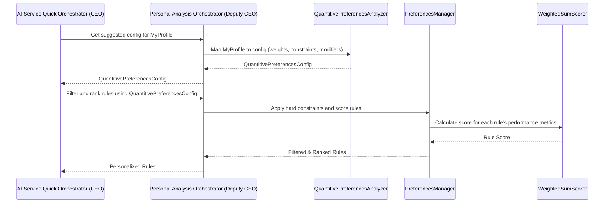

# Chapter 2: Personal Analysis Orchestrator (Deputy CEO)

Welcome back! In [Chapter 1: AI Service Quick Orchestrator (CEO)](01_ai_service_quick_orchestrator__ceo__.md), we met the big boss, our CEO orchestrator, which coordinates everything. We learned that the CEO relies on several specialized "Deputy CEOs" to get things done.

Today, we're diving into one of the most exciting Deputy CEOs: the **Personal Analysis Orchestrator**! We like to call it the **Deputy CEO of Personalization** because its superpower is making sure the advice *you* get is perfectly tailored to *your* unique investing style.

## Why Do We Need a Personalization Deputy CEO?

Imagine asking for investment advice. If everyone got the exact same recommendation, that wouldn't be very helpful, would it?

*   A **beginner investor** who wants "safe growth" shouldn't get the same advice as an **experienced trader** looking for "high-risk, high-reward opportunities."
*   Someone who "panics and sells" when the market drops needs different guidance than someone who likes to "buy the dip."
*   Your personal financial goals – saving for retirement versus speculating on quick gains – should dramatically change the recommendations you receive.

This is the problem our **Personal Analysis Orchestrator** solves. It's like having a personal financial advisor who really understands *you* before giving any advice. It makes sure the AI system speaks *your* language and aligns with *your* financial personality.

## Meet the Personal Analysis Orchestrator: Your Personalization Specialist

Think of the **Personal Analysis Orchestrator** as the head of the "Personalization Department" in our AI company. Its main job is to:

1.  **Understand You:** Take your general investment profile (your goals, how much risk you're okay with, your experience level).
2.  **Translate Your Style:** Turn that personal information into specific numbers and rules that the AI system can understand. For example, if you're "risk-averse," it translates that into a preference for rules that prioritize stability over huge profits.
3.  **Tailor Recommendations:** Use these personalized settings to filter and rank trading strategies and rules, ensuring only the most suitable ones are considered for your advice.

Let's see how this works!

## How to Get Your Personalized Settings

The CEO orchestrator (our main manager) often asks the Personal Analysis Orchestrator for help. One key way is to get a "suggested configuration" based on your user profile. This configuration is a set of quantitative (numerical) preferences.

### Getting a Suggested Configuration

You, as a user, would typically provide your investment profile through an API. This profile contains information like your investment goals, risk tolerance, and investment experience.

Here's how an API endpoint might ask the CEO, which then asks our Personal Analysis Orchestrator, to suggest a personalized configuration:

```python
# app/api/v1/endpoints/personal.py (Simplified)

from app.dependencies import get_ceo_orchestrator
from fastapi import APIRouter, Depends
from itapia_common.schemas.entities.profiles import ProfileEntity

router = APIRouter()

@router.post("/personal/suggested_config")
async def get_suggest_config(
    profile: ProfileRequest, # Your investment profile
    orchestrator: AIServiceQuickOrchestrator = Depends(get_ceo_orchestrator),
):
    """
    Get suggested quantitative preferences configuration based on user profile.
    """
    # The API endpoint asks the CEO orchestrator to get the config
    config = orchestrator.get_suggest_config(
        ProfileEntity(**profile.model_dump()) # Your profile converted
    )
    return config # Returns your tailored preferences!
```

**What's happening here?**

1.  When you call `/personal/suggested_config`, you send your `profile` (e.g., "My goal is capital preservation," "My risk appetite is moderate").
2.  The API hands this request to the main `AIServiceQuickOrchestrator` (the CEO).
3.  The CEO then calls its `get_suggest_config` method, which in turn delegates to the `PersonalAnalysisOrchestrator`.
4.  The output `config` will be a `QuantitivePreferencesConfig`, a special data structure that contains numbers and settings representing your personal investment style.

This `config` is then used by the CEO to filter and rank rules, as we briefly saw in the previous chapter, making sure the final investment advice is truly *yours*.

## Under the Hood: How Personalization Works

Let's peek behind the curtain to understand how the Personal Analysis Orchestrator does its job.

### The Personalization Deputy CEO's Plan

When the CEO asks the Personal Analysis Orchestrator to `get_suggest_config` or `filter_rules`, here's a simplified view of its internal process:



As you can see, the **Personal Analysis Orchestrator** itself doesn't do all the detailed calculations. Instead, it delegates to even more specialized components:

*   **`QuantitivePreferencesAnalyzer`:** This is the brains that translates your human-readable profile (like "aggressive investor") into numbers (like "give more weight to CAGR" or "allow a higher maximum drawdown").
*   **`PreferencesManager`:** This component takes a list of all possible trading rules and uses your personalized settings to `filter` out unsuitable rules (e.g., rules that exceed your maximum acceptable loss) and then `rank` the remaining ones based on what you prioritize.
*   **`WeightedSumScorer`:** This is the tool that actually calculates a "personal score" for each rule, based on how well its historical performance metrics align with your personalized weights.

### The Code: Personal Analysis Orchestrator

Let's look at the `PersonalAnalysisOrchestrator` in `app/personal/orchestrator.py`.

First, how it's set up in `app/dependencies.py` (which we saw in the CEO chapter):

```python
# app/dependencies.py (Simplified)

# ... other imports ...
from .personal.quantitive import QuantitivePreferencesAnalyzer
from .personal.preferences import PreferencesManager
from .personal.scorer import WeightedSumScorer

# ... inside create_dependencies() ...

personal_orc = PersonalAnalysisOrchestrator(
    quantitive_analyzer=QuantitivePreferencesAnalyzer(),
    preferences_manager=PreferencesManager(),
    scorer=WeightedSumScorer(),
)

# ... later, the CEO gets this personal_orc ...
_ceo_orchestrator = AIServiceQuickOrchestrator(
    # ... other deputies ...
    personal_orchestrator=personal_orc,
)
```

**Explanation:** Just like the CEO, the `PersonalAnalysisOrchestrator` is initialized once with its own "department heads" (`QuantitivePreferencesAnalyzer`, `PreferencesManager`, `Scorer`) and then passed to the CEO.

Now, let's look at its core methods in `app/personal/orchestrator.py`:

```python
# app/personal/orchestrator.py (Simplified)

class PersonalAnalysisOrchestrator:
    def __init__(
        self,
        quantitive_analyzer: QuantitivePreferencesAnalyzer,
        preferences_manager: PreferencesManager,
        scorer: Scorer,
    ):
        self.quantitive_analyzer = quantitive_analyzer
        self.preferences_manager = preferences_manager
        self.scorer = scorer
        # ... other setup ...

    def get_suggest_config(self, profile: ProfileEntity) -> QuantitivePreferencesConfig:
        """Get suggested quantitative preferences config based on user profile."""
        # It asks the analyzer to do the actual mapping
        return self.quantitive_analyzer.get_suggested_config(profile)

    def filter_rules(
        self,
        rules: List[RuleEntity],
        quantitive_config: QuantitivePreferencesConfig,
        limit: int = 10,
    ):
        """Filter and rank rules based on quantitative preferences."""
        # It asks the preferences manager to do the filtering and scoring
        return self.preferences_manager.filter_rules(
            rules, scorer=self.scorer, quantitive_config=quantitive_config, limit=limit
        )
```

**Explanation:**

*   The `__init__` method simply saves the specialized components it will use.
*   `get_suggest_config`: When asked for a config, it delegates to `self.quantitive_analyzer`. This component does the heavy lifting of translating your profile into a numerical `QuantitivePreferencesConfig`.
*   `filter_rules`: When asked to filter, it delegates to `self.preferences_manager`, passing along the `rules`, your `quantitive_config`, and the `scorer` it should use. This is exactly what the CEO does in its `get_full_advisor_report` method!

### The Code: Quantitive Preferences Analyzer

Let's briefly look at how your profile turns into numbers in `app/personal/quantitive.py`:

```python
# app/personal/quantitive.py (Simplified)

class QuantitivePreferencesAnalyzer:
    BASE_WEIGHTS: PerformanceFilterWeights = PerformanceFilterWeights(
        cagr=0.25, sortino_ratio=0.25, max_drawdown_pct=0.25, # ...
    )

    def get_suggested_config(
        self, profile: ProfileEntity
    ) -> QuantitivePreferencesConfig:
        return QuantitivePreferencesConfig(
            weights=self._map_profile_to_weights(profile),
            constraints=self._map_profile_to_constraints(profile),
            modifiers=self._map_profile_to_modifiers(profile),
        )

    def _map_profile_to_weights(
        self, profile: ProfileEntity
    ) -> PerformanceFilterWeights:
        weights = self.BASE_WEIGHTS.model_copy(deep=True)

        if profile.invest_goal.primary_goal == "capital_preservation":
            weights.max_drawdown_pct += 0.30 # Safety is key
            weights.cagr -= 0.35 # Less focus on high growth
        elif profile.invest_goal.primary_goal == "speculation":
            weights.cagr += 0.35 # High growth focus
            weights.max_drawdown_pct -= 0.30 # More risk accepted
        # ... more logic for other profile aspects ...
        return weights # (after normalization)
```

**Explanation:**

*   `BASE_WEIGHTS` provides a starting point, like a "default" investor.
*   `get_suggested_config` orchestrates the creation of all parts of the `QuantitivePreferencesConfig` (weights, constraints, modifiers) by calling helper methods.
*   `_map_profile_to_weights` shows how your `profile` (e.g., `primary_goal`) directly influences the `weights` given to different performance metrics (like `cagr` for growth or `max_drawdown_pct` for safety). This ensures the AI values what *you* value.

### The Code: Preferences Manager and Scorer

Finally, let's see how these preferences are used to `filter_rules` in `app/personal/preferences.py`:

```python
# app/personal/preferences.py (Simplified)

class PreferencesManager:
    def _check_constraint(
        self, rule_ent: RuleEntity, constraints: PerformanceHardConstraints
    ) -> bool:
        """Check if a rule meets the hard constraints."""
        # Example: if user says Max Drawdown can't be > 20%, check rule.metrics.max_drawdown_pct
        if constraints.max_drawdown_pct[1] is not None and \
           rule_ent.metrics.max_drawdown_pct > constraints.max_drawdown_pct[1]:
            return False
        return True # Rule passed this constraint

    def filter_rules(
        self,
        rules: List[RuleEntity],
        scorer: Scorer,
        quantitive_config: QuantitivePreferencesConfig,
        limit: int = 10,
    ) -> List[RuleEntity]:
        # 1. Apply Hard Constraints first (e.g., "max 20% loss")
        eligible_rules = [r for r in rules if self._check_constraint(r, quantitive_config.constraints)]

        # 2. Score remaining rules using your personalized weights
        scored_rules = []
        for rule_ent in eligible_rules:
            personal_score = scorer.score(rule_ent.metrics, quantitive_config)
            scored_rules.append((rule_ent, personal_score))

        # 3. Rank them and select the top ones
        scored_rules.sort(key=lambda x: x[1], reverse=True)
        return [rule for rule, score in scored_rules[:limit]] # Simplified for example
```

**Explanation:**

*   `_check_constraint` is a helper that ensures a rule's performance (e.g., its `max_drawdown_pct`) doesn't violate any of your "hard limits" set in the `quantitive_config.constraints`. Rules that fail these are immediately removed.
*   The `filter_rules` method iterates through the `rules`:
    *   It first uses `_check_constraint` to get `eligible_rules`.
    *   Then, for each eligible rule, it calls the `scorer.score` method.
    *   Finally, it sorts the rules by their `personal_score` and returns the top `limit` rules.

The `scorer.score` method itself (from `app/personal/scorer.py`) takes the `PerformanceMetrics` of a rule and your `quantitive_config.weights`, normalizes the metrics, and calculates a weighted sum to produce that `personal_score`.

This entire flow ensures that only the rules that truly fit *your* specific investment preferences and constraints are passed on to the [Rules Orchestrator (Deputy CEO)](04_rules_orchestrator__deputy_ceo__.md) for execution and eventually contribute to *your* personalized advice.

## Conclusion

In this chapter, we explored the **Personal Analysis Orchestrator (Deputy CEO)**, our system's personalization specialist. We learned that it translates your general investment profile into precise quantitative preferences (weights and constraints), which are then used to filter and rank trading rules. This ensures that any advice generated by the AI Service Quick is not generic but is uniquely tailored to your financial goals, risk tolerance, and experience.

Next, we'll meet another important Deputy CEO: the [Advisor Orchestrator (Deputy CEO)](03_advisor_orchestrator__deputy_ceo__.md), which takes all this personalized analysis and turns it into concrete, actionable investment advice!

---

Generated by [AI Codebase Knowledge Builder](https://github.com/The-Pocket/Tutorial-Codebase-Knowledge)