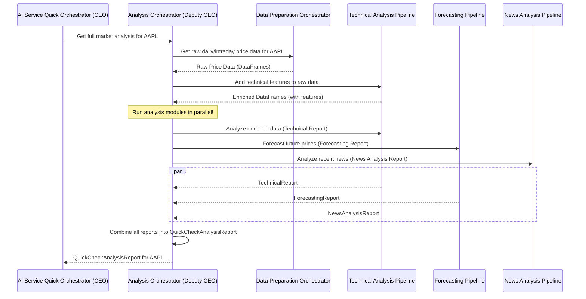

# Chapter 5: Analysis Orchestrator (Deputy CEO)

Welcome back, future AI architect! In our previous chapters, we've explored the management hierarchy of our AI system. We started with the main boss, the [AI Service Quick Orchestrator (CEO)](01_ai_service_quick_orchestrator__ceo__.md). Then, we met some of its specialized "Deputy CEOs": the [Personal Analysis Orchestrator (Deputy CEO)](02_personal_analysis_orchestrator__deputy_ceo__.md) for tailoring advice, the [Advisor Orchestrator (Deputy CEO)](03_advisor_orchestrator__deputy_ceo__.md) for giving actionable recommendations, and the [Rules Orchestrator (Deputy CEO)](04_rules_orchestrator__deputy_ceo__.md) for applying trading strategies.

Today, we're diving into another crucial Deputy CEO: the **Analysis Orchestrator**! We like to call it the **Deputy CEO of Research** or the **"Head of Market Intelligence."** This is the component that does all the heavy lifting to understand what's happening in the market for any given stock.

## The Problem: Getting a Complete Market Picture

Imagine you want to know everything about a specific stock, like "Apple (AAPL)." To truly understand its market situation, you can't just look at one thing. You'd need to:

1.  **Look at Charts & Patterns (Technical Analysis):** Is the price going up or down? Are there any patterns suggesting future moves?
2.  **Predict the Future (Forecasting):** What do models predict the price will be in the short term?
3.  **Read the News (News Analysis):** What are the latest headlines about Apple? Is the sentiment positive or negative?

Gathering all this information from different sources, processing it, and combining it into a single, easy-to-understand report is a lot of work! This is the problem our **Analysis Orchestrator** solves. It's designed to be the central hub for gathering and processing *all types* of market analysis data.

## Meet the Analysis Orchestrator: Your Head of Research

Think of the **Analysis Orchestrator** as the "Head of Research" department in our AI company. Its main responsibility is to collect and process all the raw market data, then coordinate its own specialized "sub-departments" to produce a comprehensive "Market Insights Report" for any stock.

Its main responsibilities are:

*   **Data Collection & Preparation:** It ensures that all the necessary raw data (like historical prices, company news, and market indicators) is collected and ready for analysis.
*   **Module Coordination:** It tells its "sub-departments" (like the Technical Analysis team, Forecasting team, and News Analysis team) to do their specific jobs.
*   **Report Assembly:** It gathers all the individual reports from these sub-departments and combines them into one unified, comprehensive market analysis report. This final report is called a `QuickCheckAnalysisReport`.

When the main [AI Service Quick Orchestrator (CEO)](01_ai_service_quick_orchestrator__ceo__.md) needs to understand the market situation for a stock (for example, to generate an investment recommendation), it delegates that big task to the **Analysis Orchestrator**.

## How the CEO Uses the Analysis Orchestrator

As we saw in [Chapter 1: AI Service Quick Orchestrator (CEO)](01_ai_service_quick_orchestrator__ceo__.md), the CEO orchestrator calls `get_full_advisor_report` to get a complete investment recommendation. A crucial first step in that process is getting the market analysis, which the CEO delegates to the Analysis Orchestrator.

Let's look at how an API endpoint can directly ask for a full analysis report, which is handled by the CEO and then passed to the Analysis Orchestrator:

```python
# app/api/v1/endpoints/quick_analysis.py (Simplified)

from app.dependencies import get_ceo_orchestrator
from fastapi import APIRouter, Depends

router = APIRouter()

@router.get("/analysis/{ticker}/full")
async def get_full_quick_analysis(
    ticker: str,
    orchestrator: AIServiceQuickOrchestrator = Depends(get_ceo_orchestrator),
    # ... other optional parameters ...
):
    """
    Get full market analysis report for a ticker.
    """
    # The API endpoint asks the CEO orchestrator for a full analysis
    report = await orchestrator.get_full_analysis_report(
        ticker, "medium", "all"
    )
    return report # Returns the comprehensive analysis report!
```

**What's happening here?**

1.  When you call `/analysis/{ticker}/full` (e.g., `/analysis/AAPL/full`), you're asking for a complete market analysis for the specified `ticker`.
2.  `orchestrator: AIServiceQuickOrchestrator = Depends(get_ceo_orchestrator)` ensures that our main CEO orchestrator is available.
3.  `await orchestrator.get_full_analysis_report(...)` This is the CEO telling its `Analysis Orchestrator` deputy: "Hey, get me a full market analysis report for this stock!"

The output `report` would be a large, detailed JSON document containing technical indicators, price forecasts, and news sentiment for Apple. This `QuickCheckAnalysisReport` is then used by other parts of the system, like the [Rules Orchestrator](04_rules_orchestrator__deputy_ceo__.md), to check if any trading rules are triggered.

## Under the Hood: How the Analysis Orchestrator Works Its Magic

When the CEO asks the Analysis Orchestrator for a `full_analysis_report`, it doesn't do all the work itself. Instead, it coordinates its own specialized "department heads" (which are other orchestrators or pipelines).

### The Analysis Orchestrator's Plan

Here's a simplified look at the steps the **Analysis Orchestrator** takes to generate a full market analysis report:



As you can see:

1.  The Analysis Orchestrator first gets the raw data from the [Data Preparation Orchestrator](07_data_preparation_orchestrator_.md).
2.  It then uses the [Technical Analysis Pipeline](08_technical_analysis_pipeline_.md) to "enrich" this raw data by adding common technical indicators (like moving averages). This enriched data is then used by all other modules.
3.  Crucially, it then dispatches the three main analysis tasks (Technical, Forecasting, News) to their respective specialized components, and these tasks are run **at the same time (in parallel)** using `asyncio.gather`. This makes the whole process much faster!
4.  Finally, it takes all the individual reports (Technical, Forecasting, News) and combines them into one big `QuickCheckAnalysisReport` to send back to the CEO.

## The Code: Analysis Orchestrator

Let's look at the actual code for the `AnalysisOrchestrator` to see how this coordination happens.

### 1. Initialization: Appointing Department Heads

Just like other orchestrators, the `AnalysisOrchestrator` is created only once when the application starts, in `app/dependencies.py`. It receives all of its "department heads" (other orchestrators or pipelines) it will need:

```python
# app/dependencies.py (Simplified)

# ... imports ...
from .analysis import AnalysisOrchestrator
from .analysis.data_prepare import DataPrepareOrchestrator
from .analysis.technical import TechnicalOrchestrator
from .analysis.forecasting import ForecastingOrchestrator
from .analysis.news import NewsOrchestrator

# ... inside create_dependencies() ...

# Initialize "department head" level orchestrators (covered in later chapters)
data_prepare_orc = DataPrepareOrchestrator(...) # From Chapter 7
technical_orc = TechnicalOrchestrator()       # From Chapter 8
forecasting_orc = ForecastingOrchestrator()   # From Chapter 9
news_orc = NewsOrchestrator()                 # From Chapter 10
# ... explainer, backtest_orchestrator ...

# Initialize the Analysis "Deputy CEO"
analysis_orc = AnalysisOrchestrator(
    data_preparer=data_prepare_orc,
    tech_analyzer=technical_orc,
    forecaster=forecasting_orc,
    news_analyzer=news_orc,
    # ... other dependencies like explainer, backtest_orchestrator ...
)

# ... later, the CEO gets this analysis_orc ...
_ceo_orchestrator = AIServiceQuickOrchestrator(
    analysis_orchestrator=analysis_orc,
    # ... other deputies ...
)
```

**Explanation:**
The `AnalysisOrchestrator` is initialized with references to all the specialized components it manages: `data_preparer`, `tech_analyzer`, `forecaster`, and `news_analyzer`. This is called **Dependency Injection**, meaning the `AnalysisOrchestrator` "depends" on these components, and they are provided to it.

### 2. The Core Logic: `get_full_analysis_report`

The most important method in `app/analysis/orchestrator.py` is `get_full_analysis_report`. This is where the overall orchestration happens.

```python
# app/analysis/orchestrator.py (Simplified)

class AnalysisOrchestrator:
    def __init__(
        self,
        data_preparer: DataPrepareOrchestrator,
        tech_analyzer: TechnicalOrchestrator,
        forecaster: ForecastingOrchestrator,
        news_analyzer: NewsOrchestrator,
        # ... other __init__ params ...
    ):
        self.data_preparer = data_preparer
        self.tech_analyzer = tech_analyzer
        self.forecaster = forecaster
        self.news_analyzer = news_analyzer
        # ...

    async def get_full_analysis_report(
        self,
        ticker: str,
        daily_analysis_type: Literal["short", "medium", "long"] = "medium",
        required_type: Literal["daily", "intraday", "all"] = "all",
    ) -> QuickCheckAnalysisReport:
        logger.info(
            f"--- Analysis Deputy CEO: Initiating full analysis for '{ticker}' ---"
        )

        # 1. FETCH RAW DATA
        logger.info("  -> DataPreparer: Fetching price data...")
        daily_df = self.data_preparer.get_daily_ohlcv_for_ticker(ticker)
        intraday_df = self.data_preparer.get_intraday_ohlcv_for_ticker(ticker)

        # 2. ENRICH DATA with initial technical features
        # This prepares the data for subsequent technical, forecasting, and rule analysis.
        enriched_daily_df = self.tech_analyzer.get_daily_features(daily_df)
        enriched_intraday_df = self.tech_analyzer.get_intraday_features(intraday_df)

        # 3. RUN ALL MODULES IN PARALLEL
        logger.info("  -> Dispatching all analysis modules to run in parallel...")

        # Each of these methods will delegate to its specific sub-orchestrator.
        # We put `_prepare_and_run_technical_analysis` in a separate executor
        # because it might be synchronous but still we want to avoid blocking.
        loop = asyncio.get_running_loop()
        technical_task = loop.run_in_executor(
            None,
            self._prepare_and_run_technical_analysis, # This calls tech_analyzer
            enriched_daily_df,
            enriched_intraday_df,
            daily_analysis_type,
            required_type,
        )

        forecasting_task = self._prepare_and_run_forecasting(ticker, enriched_daily_df) # Calls forecaster
        news_task = self._prepare_and_run_news_analysis(ticker) # Calls news_analyzer

        # `asyncio.gather` runs these three tasks concurrently and waits for all to finish.
        results = await asyncio.gather(
            technical_task,
            forecasting_task,
            news_task,
            return_exceptions=True, # Important for robust error handling
        )

        # 4. CONSOLIDATE RESULTS & ERROR CHECKING
        technical_report, forecasting_report, news_report = results
        # ... (Error checking for each report is simplified here) ...

        # 5. CREATE FINAL QUICKCHECK ANALYSIS REPORT
        final_report = QuickCheckAnalysisReport(
            ticker=ticker.upper(),
            # ... metadata like generated_at_utc ...
            technical_report=technical_report,
            forecasting_report=forecasting_report,
            news_report=news_report,
        )

        # Clean up NaN/inf values before returning (important for JSON output)
        cleaned_report_dict = clean_json_outliers(final_report.model_dump())
        return QuickCheckAnalysisReport.model_validate(cleaned_report_dict)

# Helper function to remove invalid JSON values
def clean_json_outliers(obj) -> dict:
    # ... (code to replace NaN, Inf with None) ...
    return obj
```

**Explanation:**

1.  **`__init__`**: The constructor sets up the `AnalysisOrchestrator` by storing references to its sub-orchestrators (Data Preparer, Technical Analyzer, Forecaster, News Analyzer).
2.  **Fetch Raw Data**: `self.data_preparer.get_daily_ohlcv_for_ticker(ticker)` asks the [Data Preparation Orchestrator](07_data_preparation_orchestrator_.md) to get the historical daily and intraday price data for the specified `ticker`.
3.  **Enrich Data**: `self.tech_analyzer.get_daily_features(daily_df)` calls the [Technical Analysis Pipeline](08_technical_analysis_pipeline_.md) to add common technical indicators (like moving averages, RSI) to the raw price data. This creates `enriched_daily_df` and `enriched_intraday_df`, which are now packed with useful features.
4.  **Run Modules in Parallel**:
    *   `technical_task`, `forecasting_task`, and `news_task` are created. Each of these tasks involves calling a method that, in turn, asks its respective sub-orchestrator (`self.tech_analyzer`, `self.forecaster`, `self.news_analyzer`) to do its specialized analysis.
    *   `await asyncio.gather(...)` is the key! It tells Python to run all these tasks **at the same time**. It waits until *all* of them have completed, making the entire process efficient.
5.  **Consolidate Results**: Once all the individual analysis tasks are done, their reports (`technical_report`, `forecasting_report`, `news_report`) are collected.
6.  **Create Final Report**: These individual reports are then packaged into a single `QuickCheckAnalysisReport` object. This combined report is what the `AnalysisOrchestrator` returns.
7.  **`clean_json_outliers`**: This helper function is important for ensuring the final report can be correctly converted to JSON format, as some numerical calculations (like division by zero) can produce "Not a Number" (NaN) or "Infinity" values, which JSON doesn't understand.

This detailed, parallelized process ensures that you get a comprehensive, up-to-date market analysis report efficiently, covering all key aspects of a stock's situation.

## Conclusion

In this chapter, we've explored the **Analysis Orchestrator (Deputy CEO)**, our system's "Head of Research." We learned how it's responsible for orchestrating the gathering and processing of all types of market analysis data – technical, forecasting, and news. It coordinates its specialized sub-components, runs them in parallel for speed, and then combines their results into a comprehensive `QuickCheckAnalysisReport`. This report forms the essential foundation for subsequent steps, like rule execution and final investment advice.

Next, we'll dive into the **Explainer Modules**. These components are responsible for translating all the complex technical and analytical information generated by our orchestrators into clear, human-readable explanations. Get ready for [Explainer Modules](06_explainer_modules_.md)!

---

Generated by [AI Codebase Knowledge Builder](https://github.com/The-Pocket/Tutorial-Codebase-Knowledge)