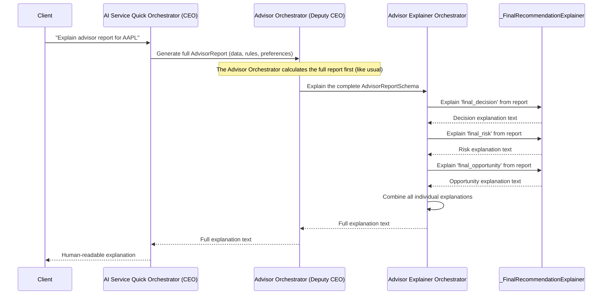

# Chapter 6: Explainer Modules

Welcome back, future AI architect! In our previous chapters, we've explored how our AI system works hard behind the scenes:
*   The [AI Service Quick Orchestrator (CEO)](01_ai_service_quick_orchestrator__ceo__.md) manages everything.
*   The [Personal Analysis Orchestrator (Deputy CEO)](02_personal_analysis_orchestrator__deputy_ceo__.md) tailors advice to you.
*   The [Advisor Orchestrator (Deputy CEO)](03_advisor_orchestrator__deputy_ceo__.md) gives concrete "BUY," "SELL," or "HOLD" recommendations.
*   The [Rules Orchestrator (Deputy CEO)](04_rules_orchestrator__deputy_ceo__.md) applies trading strategies.
*   And the [Analysis Orchestrator (Deputy CEO)](05_analysis_orchestrator__deputy_ceo__.md) gathers all the market data.

All this is fantastic for getting precise, data-driven answers. But what if you get a recommendation like "BUY Apple (AAPL) with a 10% position size" and you wonder, ***"Why? What's the reason behind this advice?"***

This is where our **Explainer Modules** come in!

## The Problem: Understanding "Why?"

Imagine you're getting complex investment advice. You see a recommendation, but you don't understand *why* the AI made that specific choice. It could be because:

*   The price forecast showed a strong upward trend.
*   Several technical indicators (like moving averages) gave "buy" signals.
*   Recent news sentiment for the company was overwhelmingly positive.
*   Specific trading rules you prefer were triggered.

Without an explanation, the AI's advice can feel like a "black box" – you trust it, but you don't understand it. This lack of transparency can make it hard to:

1.  **Trust the AI:** You want to know its reasoning, not just its conclusion.
2.  **Learn from the AI:** Understanding the "why" helps you become a better investor.
3.  **Take Action:** If you don't understand the reasoning, you might hesitate to follow the advice.

This is the exact problem our **Explainer Modules** solve. They are the **"Translators"** of the system, turning complex data, scores, and technical outputs into easy-to-understand natural language.

## Meet the Explainer Modules: Your AI's Personal Translator

Think of **Explainer Modules** as the language department of our AI company. When the AI system speaks in numbers, charts, and complex rule logic, these modules translate that technical "AI language" into plain English for you.

Their main job is to:

1.  **Translate Data:** Convert numerical scores (e.g., a "decision score of 0.8") into clear statements ("This indicates a strong bullish signal").
2.  **Articulate Reasoning:** Explain *why* certain conclusions were reached. For example, "The stock's trend is bullish due to the 50-day moving average crossing above the 200-day moving average."
3.  **Highlight Key Factors:** Point out the most important pieces of evidence, such as which specific rules were triggered, or what news events influenced the sentiment.
4.  **Increase Transparency:** Make the AI's recommendations understandable, so you can trust and act on them with confidence.

Whether it's explaining why a stock's trend is bullish, the reasoning behind a price forecast, or the logic of a trading rule, these components articulate the insights in a human-friendly format.

## How to Get an Explanation for an Advisor Report

To get a human-readable explanation of a full investment recommendation, you'd typically interact with an API endpoint. This endpoint asks the main [AI Service Quick Orchestrator (CEO)](01_ai_service_quick_orchestrator__ceo__.md) to do the work, which then involves the Explainer Modules.

Here's how an API endpoint might ask for a full advisor explanation:

```python
# app/api/v1/endpoints/quick_advisor.py (Simplified)

from app.dependencies import get_ceo_orchestrator
from fastapi import APIRouter, Depends

router = APIRouter()

@router.post("/advisor/{ticker}/explain")
async def get_full_advisor_explanation(
    ticker: str,
    quantitive_config: QuantitivePreferencesConfig, # Your preferences
    orchestrator: AIServiceQuickOrchestrator = Depends(get_ceo_orchestrator),
):
    """
    Get a human-readable explanation for a full advisor report.
    """
    explanation_text = await orchestrator.get_full_advisor_explaination_report(
        ticker=ticker,
        quantitive_config=quantitive_config,
    )
    return {"explanation": explanation_text}
```

**What's happening here?**

1.  When an application calls `/advisor/{ticker}/explain`, it's asking for a human-friendly explanation for a specific `ticker` (like "AAPL").
2.  The `orchestrator: AIServiceQuickOrchestrator = Depends(get_ceo_orchestrator)` line ensures our main CEO orchestrator is ready to handle the request.
3.  `await orchestrator.get_full_advisor_explaination_report(...)` is the crucial line! The API tells the CEO orchestrator: "Please generate a complete, explained advisor report for me."
4.  The output will be a `{"explanation": "..."}` where the `...` is a long string of text, describing the recommendation and its reasoning in detail.

This explanation helps bridge the gap between complex AI logic and a user's need for transparency.

## Under the Hood: How Explainer Modules Translate

When the CEO asks for a full advisor explanation, it triggers a chain of events involving various Explainer Modules.

### The Explanation Process: A Step-by-Step Walkthrough

Here's a simplified look at how the Explainer Modules work together to create a human-readable explanation:



As you can see:

1.  The **[AI Service Quick Orchestrator (CEO)](01_ai_service_quick_orchestrator__ceo__.md)** receives the request.
2.  It delegates to the **[Advisor Orchestrator (Deputy CEO)](03_advisor_orchestrator__deputy_ceo__.md)**. The Advisor Orchestrator first performs all its usual steps to generate the complete `AdvisorReportSchema` (including aggregating scores, applying gating logic, etc.).
3.  Once the `AdvisorReportSchema` is ready, the Advisor Orchestrator asks its specialized **`AdvisorExplainerOrchestrator`** to translate this report.
4.  The `AdvisorExplainerOrchestrator` itself uses smaller, focused explainers (like `_FinalRecommendationExplainer`) to break down and explain each part of the report (the main decision, the risk assessment, the opportunity scan).
5.  Finally, the `AdvisorExplainerOrchestrator` combines all these individual pieces into one coherent, full explanation, which is then passed back up the chain to the user.

Other parts of the system also have their own explainer modules. For example, the [Analysis Orchestrator (Deputy CEO)](05_analysis_orchestrator__deputy_ceo__.md) uses an `AnalysisExplainerOrchestrator` to explain technical charts or forecasts, and the [Rules Orchestrator (Deputy CEO)](04_rules_orchestrator__deputy_ceo__.md) uses a `RuleExplainerOrchestrator` to describe the logic of individual trading rules.

## The Code: Advisor Explainer Orchestrator

Let's look at how the **Advisor Explainer Orchestrator** and its sub-components are built.

### 1. Initialization: Appointing the Translators

Just like other orchestrators, the `AdvisorExplainerOrchestrator` is created once when the application starts up, in `app/dependencies.py`. It's then passed to the `AdvisorOrchestrator`.

```python
# app/dependencies.py (Simplified)

# ... other imports ...
from .advisor.explainer import AdvisorExplainerOrchestrator
from .rules.explainer import RuleExplainerOrchestrator # For explaining rule logic

# ... inside create_dependencies() ...

advisor_explainer_orc = AdvisorExplainerOrchestrator() # The main advisor translator
rule_explainer = RuleExplainerOrchestrator() # The rule logic translator

advisor_orc = AdvisorOrchestrator(
    agg_orc=AggregationOrchestrator(),
    explainer=advisor_explainer_orc, # The Advisor Orchestrator gets its explainer
    # ...
)
rule_orc = RulesOrchestrator(rule_service, explainer=rule_explainer) # Rule Orchestrator gets its explainer

# ... later, the CEO gets these orchestrators ...
```

**Explanation:**
Here, `AdvisorExplainerOrchestrator` and `RuleExplainerOrchestrator` are initialized. The `advisor_orc` (Advisor Orchestrator) is set up with `advisor_explainer_orc` so it knows which "translator" to use for its reports.

### 2. CEO Delegates to Advisor for Explanation

When you ask the CEO for a full explanation, it first gets all the necessary data and then tells the Advisor Orchestrator to generate the explanation.

```python
# app/orchestrator.py (Simplified)

class AIServiceQuickOrchestrator:
    # ... __init__ and other methods ...

    async def get_full_advisor_explaination_report(
        self,
        ticker: str,
        quantitive_config: QuantitivePreferencesConfig,
        limit: int = 10,
    ) -> str:
        logger.info(f"CEO -> Initiating full ADVISOR EXPLANATION for '{ticker}'...")

        # (Steps 1-3 are similar to getting a regular advisor report:
        #  get analysis, get & filter rules, run rules to get decision_results, risk_results, opp_results)

        # 4. Ask Advisor Deputy CEO to generate the full explanation
        return await self.advisor.get_full_explaination_report( # <--- CEO asks Advisor Orchestrator
            analysis_report,
            decision_results,
            risk_results,
            opp_results,
            behavior_modifiers=quantitive_config.modifiers,
        )
```

**Explanation:**
The `get_full_advisor_explaination_report` method in the CEO first gathers all the market analysis and rule execution results. Then, it calls `self.advisor.get_full_explaination_report` to actually produce the human-readable text.

### 3. Advisor Orchestrator Uses Its Explainer

The `AdvisorOrchestrator` first builds the full `AdvisorReportSchema` (which contains all the numerical scores, decisions, and triggered rules) and then passes it to its `explainer` to turn it into text.

```python
# app/advisor/orchestrator.py (Simplified)

class AdvisorOrchestrator:
    # ... __init__ ...

    async def get_full_explaination_report(
        self,
        analysis_report: QuickCheckAnalysisReport,
        decision_results: Tuple[List[float], List[TriggeredRuleInfo]],
        risk_results: Tuple[List[float], List[TriggeredRuleInfo]],
        opportunity_results: Tuple[List[float], List[TriggeredRuleInfo]],
        behavior_modifiers: Optional[BehaviorModifiers] = None,
    ) -> str:
        logger.info(f"Advisor -> Generating explanation for {analysis_report.ticker}...")

        # First, generate the complete AdvisorReportSchema object
        # This step uses the same logic as generating the regular advisor report
        advisor_report = await self.get_advisor_report(
            analysis_report,
            decision_results,
            risk_results,
            opp_results,
            behavior_modifiers=behavior_modifiers,
            action_mapper=self.default_action_mapper, # Reuse the default mapper
        )

        # Then, ask the dedicated explainer to translate the report into text
        return self.explainer.explain_report(advisor_report) # <--- Delegates to the AdvisorExplainerOrchestrator
```

**Explanation:**
The `AdvisorOrchestrator` first produces the structured `advisor_report` (which has all the decision, risk, and opportunity scores, triggered rules, etc.). Then, it calls `self.explainer.explain_report(advisor_report)`. This is where the actual text generation begins.

### 4. Advisor Explainer Orchestrator: Combining Explanations

The `AdvisorExplainerOrchestrator` acts as the main coordinator for generating the full advisor explanation. It uses smaller, specialized components (like `_FinalRecommendationExplainer`) to explain different parts of the report.

```python
# app/advisor/explainer/orchestrator.py (Simplified)

from typing import List
from itapia_common.schemas.entities.advisor import AdvisorReportSchema, FinalRecommendation, TriggeredRuleInfo

class _FinalRecommendationExplainer:
    """Explains a single part of the recommendation (decision, risk, or opportunity)."""
    def explain(self, report: FinalRecommendation) -> str:
        if not report.triggered_rules:
            return "No specific signals were triggered, resulting in a neutral stance."
        # Get names of top 2 rules for brevity in explanation
        top_rules_str = ", ".join([r.name for r in report.triggered_rules[:2]])
        return (
            f"The {report.purpose.lower()} recommendation is '{report.final_recommend.upper()}' "
            f"with a score of {report.final_score:.2f}. "
            f"This was influenced by rules like: {top_rules_str}."
        )

class AdvisorExplainerOrchestrator:
    """Generates natural language summaries for the entire AdvisorReportSchema."""
    def __init__(self):
        self.rec_explainer = _FinalRecommendationExplainer() # Uses a sub-explainer

    def explain_report(self, report: AdvisorReportSchema) -> str:
        if not isinstance(report, AdvisorReportSchema):
            return "Invalid advisor report format provided."

        # Ask the sub-explainer to explain each part of the report
        decision_explanation = self.rec_explainer.explain(report.final_decision)
        risk_explanation = self.rec_explainer.explain(report.final_risk)
        opportunity_explanation = self.rec_explainer.explain(report.final_opportunity)

        return (
            f"Advisor Recommendation for {report.ticker}:\n\n"
            f"**Main Action:** {report.final_action.action_type.upper()} "
            f"(Suggested Position Size: {report.final_action.position_size_pct:.0%})\n\n"
            f"**Decision Logic:** {decision_explanation}\n"
            f"**Risk Assessment:** {risk_explanation}\n"
            f"**Opportunity Scan:** {opportunity_explanation}\n"
        )
```

**Explanation:**
*   `_FinalRecommendationExplainer` is a smaller class that focuses on explaining a single "Final Recommendation" block (like the `final_decision` or `final_risk` part of the report). It takes the score and the names of triggered rules and crafts a simple sentence.
*   The `AdvisorExplainerOrchestrator` then combines these individual explanations. It takes the full `AdvisorReportSchema`, asks its `rec_explainer` to break down the "decision," "risk," and "opportunity" parts, and then stitches all these pieces together with a header and main action into one comprehensive `str` (text) explanation.

### 5. Rule Explainer Orchestrator: Explaining Rule Logic

Beyond explaining the overall advisor report, Explainer Modules can also explain the *internal logic* of individual rules. This is handled by the `RuleExplainerOrchestrator`. This is useful if you want to know exactly what a specific trading rule actually *does*.

```python
# app/rules/explainer/orchestrator.py (Simplified)

from itapia_common.rules.nodes import ConstantNode, OperatorNode, VarNode, _TreeNode
from itapia_common.rules.rule import Rule

class RuleExplainerOrchestrator:
    INFIX_OPR_MAPPING = {
        "OPR_GT": "is greater than",
        "OPR_AND": "AND",
        # ... more operators ...
    }

    def explain_node(self, node: _TreeNode) -> str:
        """Recursively explains parts of a rule's logic tree."""
        if isinstance(node, VarNode):
            return node.description # e.g., "current stock price"
        if isinstance(node, ConstantNode):
            return f"the value {node.value}"
        if isinstance(node, OperatorNode):
            child_explanations = [self.explain_node(child) for child in node.children]
            op_name = node.node_name.upper()
            if op_name in self.INFIX_OPR_MAPPING:
                return f"({child_explanations[0]} {self.INFIX_OPR_MAPPING[op_name]} {child_explanations[1]})"
            if op_name == "OPR_AND":
                return "(" + " AND ".join(child_explanations) + ")"
        return "Unknown part of rule logic"

    def explain_rule(self, rule: Rule) -> str:
        """High-level function to explain a complete Rule object."""
        if not hasattr(rule, "root") or not isinstance(rule.root, _TreeNode):
            return "Invalid rule object."
        logic_explanation = self.explain_node(rule.root)
        return f"Rule '{rule.name}' checks: {logic_explanation}."
```

**Explanation:**
*   The `explain_node` method walks through the internal structure of a rule, which is often represented as a "tree" of operations (like "current price" `is greater than` "50-day moving average" `AND` "RSI" `is less than` "30").
*   It translates each part of this tree (`VarNode`, `ConstantNode`, `OperatorNode`) into a human-friendly phrase.
*   The `explain_rule` method then combines these phrases to give you a full sentence describing what the rule actually evaluates. For example, it might say: "Rule 'RSI_Oversold_Buy' checks: (the Relative Strength Index (RSI) is less than the value 30)."

This powerful capability allows users to not only see the outcome but also understand the underlying reasoning, fostering trust and clarity.

## Conclusion

In this chapter, we've explored the **Explainer Modules**, the "Translators" of our AI system. We learned how they convert complex data, scores, and technical outputs into clear, human-readable explanations. By breaking down the reasoning behind investment recommendations and even the logic of individual trading rules, these modules significantly increase the transparency and trustworthiness of the AI Service Quick project. This ensures that users don't just get answers, but also understand *why* those answers were given.

Next, we'll dive into the very first step of our data pipeline: the **[Data Preparation Orchestrator](07_data_preparation_orchestrator_.md)**. This crucial component is responsible for gathering and cleaning all the raw market data that feeds into every analysis and decision in our system!

---

Generated by [AI Codebase Knowledge Builder](https://github.com/The-Pocket/Tutorial-Codebase-Knowledge)