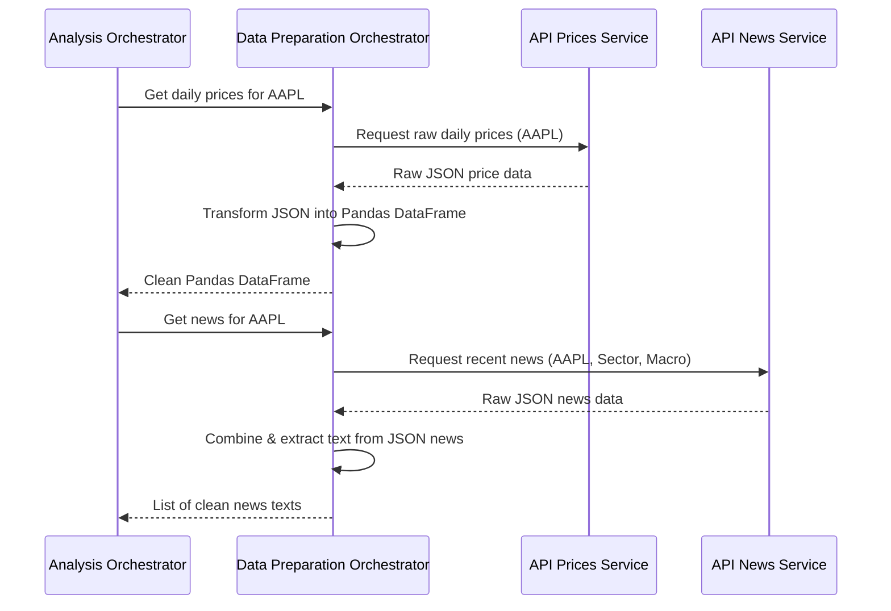

# Chapter 7: Data Preparation Orchestrator

Welcome back, future AI architect! In our previous chapter, [Chapter 6: Explainer Modules](06_explainer_modules_.md), we learned how our AI system communicates its decisions and reasoning in plain English. Before that, in [Chapter 5: Analysis Orchestrator (Deputy CEO)](05_analysis_orchestrator__deputy_ceo__.md), we saw how the "Head of Research" coordinates various analysis pipelines.

But hold on a minute! Before any of that sophisticated analysis, forecasting, or rule-checking can even begin, we need one essential ingredient: **the raw data!** Where do we get the historical stock prices and the latest news articles? Who cleans up this data and gets it into a format that our analysis modules can actually use?

That's the job of our **Data Preparation Orchestrator**! We like to call it the **"Data Logistics" team** or the **"Chief Data Officer."**

## The Problem: Raw Data is Messy (and Not Always There!)

Imagine you want to analyze Apple (AAPL) stock. To do this, you need:

1.  **Historical Price Data:** Daily opening, high, low, closing prices, and trading volume for the last few years, and even intraday (minute-by-minute) prices for short-term analysis.
2.  **News Articles:** The latest headlines and summaries about Apple, its sector, and the overall market.

This data isn't sitting neatly in our system. It lives in various external financial API services, and it comes in raw formats, often as complex JSON (JavaScript Object Notation) files. Before we can use it, this raw JSON data needs to be:

*   **Fetched:** Retrieved from the external services.
*   **Cleaned:** Checked for missing values or errors.
*   **Structured:** Organized into a format our AI modules understand, like a Pandas DataFrame (a common table-like structure in Python).

Trying to do this manually every time for every analysis would be a huge headache! This is the problem our **Data Preparation Orchestrator** solves. It's the essential first step for any market analysis.

## Meet the Data Preparation Orchestrator: Your Data Logistics Team

Think of the **Data Preparation Orchestrator** as the dedicated "Data Logistics" team in our AI company. Its sole focus is ensuring that all the raw financial information is collected, organized, and delivered clean and ready to every other analysis department.

Its main responsibilities are:

1.  **External API Gateway:** It knows how to talk to different external API services (like those providing stock prices or news).
2.  **Data Fetcher:** It retrieves historical price data (daily and intraday) and news articles from these external sources.
3.  **JSON-to-DataFrame Transformer:** It takes the raw JSON data received from APIs and expertly converts it into clean, structured Pandas DataFrames. A DataFrame is like a super-powered spreadsheet in Python, perfect for numerical analysis.
4.  **Data Provider:** It provides these ready-to-use DataFrames to other modules, such as the [Analysis Orchestrator (Deputy CEO)](05_analysis_orchestrator__deputy_ceo__.md), ensuring they always have the clean data they need.

In essence, it's the bridge between the raw, external world of financial data and the structured, analytical world of our AI system.

## How the Analysis Orchestrator Uses the Data Preparation Orchestrator

As we saw in [Chapter 5: Analysis Orchestrator (Deputy CEO)](05_analysis_orchestrator__deputy_ceo__.md), the `AnalysisOrchestrator` needs data before it can do its job. It delegates this crucial first step to the `DataPreparationOrchestrator`.

Let's look at a simplified code snippet from the `AnalysisOrchestrator` to see how it asks for data:

```python
# app/analysis/orchestrator.py (Simplified)

class AnalysisOrchestrator:
    # ... __init__ method where self.data_preparer is set ...

    async def get_full_analysis_report(
        self, ticker: str, # e.g., "AAPL"
        # ... other parameters ...
    ):
        logger.info(
            f"--- Analysis Deputy CEO: Initiating full analysis for '{ticker}' ---"
        )

        # 1. FETCH RAW DATA - This is where we call the Data Preparation Orchestrator!
        logger.info("  -> DataPreparer: Fetching price data...")
        daily_df = self.data_preparer.get_daily_ohlcv_for_ticker(ticker)
        intraday_df = self.data_preparer.get_intraday_ohlcv_for_ticker(ticker)

        # ... rest of the analysis logic ...
```

**What's happening here?**

1.  When the `AnalysisOrchestrator` (our Head of Research) needs to start a full analysis for a `ticker` (like "AAPL"), it knows it first needs the raw data.
2.  It then calls `self.data_preparer.get_daily_ohlcv_for_ticker(ticker)` and `self.data_preparer.get_intraday_ohlcv_for_ticker(ticker)`.
3.  These calls tell the `DataPrepareOrchestrator` (our Data Logistics team): "Please go get the daily and intraday Open-High-Low-Close-Volume (OHLCV) price data for 'AAPL' for me!"
4.  The `DataPrepareOrchestrator` then returns a `pd.DataFrame` (Pandas DataFrame) directly, which is clean and ready for analysis.

This demonstrates that the `DataPreparationOrchestrator` acts as the single, reliable source for all raw financial data, saving other modules from worrying about how to get or clean it.

## Under the Hood: How the Data Preparation Orchestrator Works

Let's peek behind the curtain and see what happens inside the **Data Preparation Orchestrator** when it receives a request for data.

### The Data Preparation Orchestrator's Plan

When the [Analysis Orchestrator (Deputy CEO)](05_analysis_orchestrator__deputy_ceo__.md) asks for price data, here's a simplified view of its internal process:



As you can see:

1.  The `Data Preparation Orchestrator` acts as a middleman. It doesn't fetch data directly but delegates to specialized **API Services** (like `API Prices Service` or `API News Service`). These services are the actual components that communicate with external financial APIs.
2.  Once it gets the raw JSON from these services, it then performs the crucial **transformation** step, converting that raw, unstructured JSON into the clean, structured Pandas DataFrames or lists of text that our AI system needs.

## The Code: Data Preparation Orchestrator

Let's look at the actual code in `app/analysis/data_prepare/orchestrator.py` that makes this happen.

### 1. Initialization: Connecting to External Services

Like other orchestrators, the `DataPrepareOrchestrator` is created only once when the application starts up, in `app/dependencies.py`. It receives references to the specific services it will use to fetch data:

```python
# app/dependencies.py (Simplified)

# ... other imports ...
from itapia_common.dblib.services import APIMetadataService, APIPricesService, APINewsService
from .analysis.data_prepare import DataPrepareOrchestrator

# ... inside create_dependencies() ...

# Initialize low-level services (these connect to external APIs and databases)
metadata_service = APIMetadataService(rdbms_session=db)
prices_service = APIPricesService(rdbms_session=db, redis_client=redis, metadata_service=metadata_service)
news_service = APINewsService(rdbms_session=db, metadata_service=metadata_service)

# Initialize the Data Preparation Orchestrator
data_prepare_orc = DataPrepareOrchestrator(
    metadata_service, prices_service, news_service
)

# ... later, the Analysis Orchestrator gets this data_prepare_orc ...
```

**Explanation:**

*   The `DataPrepareOrchestrator` is initialized with `metadata_service`, `prices_service`, and `news_service`. These are the "department heads" that handle the actual communication with external financial data providers and the internal database/cache.
*   This setup, where components receive what they need from the outside, is called **Dependency Injection**. It makes our system modular and easy to test.

### 2. Getting Price Data: `get_daily_ohlcv_for_ticker`

Here's how `DataPrepareOrchestrator` gets daily price data, found in `app/analysis/data_prepare/orchestrator.py`:

```python
# app/analysis/data_prepare/orchestrator.py (Simplified)

class DataPrepareOrchestrator:
    def __init__(
        self, metadata_service: APIMetadataService, prices_service: APIPricesService, news_service: APINewsService
    ):
        self.metadata_service = metadata_service
        self.prices_service = prices_service # This is the key!
        self.news_service = news_service

    def get_daily_ohlcv_for_ticker(self, ticker: str, limit: int = 2000) -> pd.DataFrame:
        """Get and transform daily OHLCV data for a ticker."""
        logger.info(f"Preparing daily OHLCV for ticker '{ticker}'...")

        # 1. Ask the Prices API Service to fetch raw data
        res = self.prices_service.get_daily_prices(ticker, limit=limit, skip=0)
        json_res = res.model_dump() # Convert the API response object to a raw dictionary

        if not json_res:
            logger.warn("Null response. Returning empty DataFrame.")
            return pd.DataFrame()

        # 2. Transform the raw JSON into a clean Pandas DataFrame
        try:
            df = transform_single_ticker_response(json_res)
            return df
        except KeyError as e:
            logger.err(f"Could not process response. Error: {e}. Returning empty DataFrame.")
            return pd.DataFrame()
```

**Explanation:**

*   `self.prices_service.get_daily_prices(ticker, limit=limit, skip=0)`: This line is where the `DataPrepareOrchestrator` asks its `prices_service` (its "price data specialist") to go fetch the daily prices for the `ticker`. The `prices_service` handles talking to the actual external price API and returns the data, often in a raw JSON-like format.
*   `json_res = res.model_dump()`: This converts the response from the API service into a standard Python dictionary (which represents JSON).
*   `df = transform_single_ticker_response(json_res)`: This is where the magic of transformation happens! It calls a helper function (`transform_single_ticker_response`) to convert the raw JSON data into a beautiful, structured Pandas DataFrame.

### 3. Transforming JSON to DataFrame: `transform_single_ticker_response`

This helper function, located in `app/analysis/data_prepare/data_transform.py`, is crucial for making the raw data usable:

```python
# app/analysis/data_prepare/data_transform.py (Simplified)

import pandas as pd
from typing import Any, Dict

def transform_single_ticker_response(json_res: Dict[str, Any]) -> pd.DataFrame:
    """Convert the JSON Response for a single ticker into pandas's DataFrame."""
    logger.info("Transforming single ticker response...")
    data_points = json_res.get("datas") # Extract the list of data points from JSON

    if not data_points:
        return pd.DataFrame() # Return empty if no data

    df = pd.DataFrame(data_points) # Convert list of dictionaries to DataFrame

    # Process timestamp and set it as the index
    df["datetime_utc"] = pd.to_datetime(df["timestamp"], unit="s", utc=True)
    df.set_index("datetime_utc", inplace=True)
    df.drop(columns=["timestamp"], inplace=True) # Remove original timestamp column
    df.sort_index(inplace=True) # Ensure data is sorted by date

    return df
```

**Explanation:**

*   `data_points = json_res.get("datas")`: The raw JSON from the API usually has a key like `"datas"` that contains a list of daily price entries. This line extracts that list.
*   `df = pd.DataFrame(data_points)`: This is a powerful Pandas command that takes a list of dictionaries (each dictionary representing a day's price data) and instantly converts it into a structured DataFrame with columns like `open`, `high`, `low`, `close`, `volume`.
*   `df["datetime_utc"] = pd.to_datetime(...)`: It converts the raw `timestamp` (often a number representing seconds since 1970) into a proper `datetime_utc` object, which is then set as the DataFrame's index. This makes it easy to work with time-series data.

The result is a clean Pandas DataFrame, perfectly ready for any technical analysis or forecasting!

### 4. Getting News Data: `get_all_news_text_for_ticker`

The `DataPrepareOrchestrator` also fetches and processes news. Here's a simplified view from `app/analysis/data_prepare/orchestrator.py`:

```python
# app/analysis/data_prepare/orchestrator.py (Simplified)

class DataPrepareOrchestrator:
    # ... __init__ and price fetching methods ...

    def _get_full_text_from_news(self, news):
        """Helper to combine news title and summary."""
        text: str = news.title
        if news.summary is not None:
            text += ". " + news.summary
        return text

    def get_all_news_text_for_ticker(self, ticker: str) -> List[str]:
        """Fetch and combine all news for a ticker (Relevant, Contextual, Macro)."""
        logger.info(f"Preparing combined news feed for ticker: {ticker}")
        all_news_text_with_time = []
        universal_news_hash = set() # To avoid duplicate news

        # 1. Fetch L1: Relevant news (directly about the ticker)
        relevant_news = self.news_service.get_relevant_news(ticker, limit=10) # Simplified limit
        for news in relevant_news.datas:
            all_news_text_with_time.append(
                (self._get_full_text_from_news(news), news.publish_ts)
            )

        # 2. Fetch L2: Contextual universal news (about the ticker's sector)
        sector = self.metadata_service.get_sector_code_of(ticker)
        contextual_news = self.news_service.get_universal_news(f"{sector}", limit=5)
        for news in contextual_news.datas:
            if news.title_hash not in universal_news_hash:
                universal_news_hash.add(news.title_hash)
                all_news_text_with_time.append(
                    (self._get_full_text_from_news(news), news.publish_ts)
                )

        # 3. Fetch L3: Macro universal news (about the broader economy/market)
        macro_terms = ["Federal Reserve policy", "US inflation report"] # Simplified terms
        for term in macro_terms:
            macro_news = self.news_service.get_universal_news(term, limit=5)
            for news in macro_news.datas:
                if news.title_hash not in universal_news_hash:
                    universal_news_hash.add(news.title_hash)
                    all_news_text_with_time.append(
                        (self._get_full_text_from_news(news), news.publish_ts)
                    )

        all_news_text_with_time.sort(key=lambda x: x[1], reverse=True) # Sort by time
        return [x[0] for x in all_news_text_with_time[:20]] # Return top 20 news texts
```

**Explanation:**

*   `_get_full_text_from_news`: A helper that takes a news object (from the API) and combines its `title` and `summary` into a single string.
*   The method then calls `self.news_service` multiple times:
    *   `get_relevant_news`: Fetches news specifically about the `ticker`.
    *   `get_universal_news(f"{sector}", ...)`: Fetches general news using the `sector` as a search term, providing *contextual* news.
    *   `get_universal_news(term, ...)`: Fetches news for `macro_terms` (like "inflation"), providing *macro-level* market sentiment.
*   It combines these different levels of news, removes duplicates using `universal_news_hash`, sorts them by publish date, and returns a `List[str]` of clean news texts. This rich, multi-layered news feed is then ready for our [News Analysis Pipeline](10_news_analysis_pipeline_.md) to process.

This process ensures that not only do we get accurate price data, but also a comprehensive view of relevant, contextual, and macro news, all neatly prepared for further analysis.

## Conclusion

In this chapter, we've explored the **Data Preparation Orchestrator**, our system's "Data Logistics" team. We learned that it's the crucial first step in any market analysis, responsible for fetching raw financial information (historical prices and news) from external APIs. It then transforms this raw, messy JSON data into clean, structured Pandas DataFrames and lists of texts that are immediately ready for other analysis modules to use. This orchestrator acts as the reliable bridge between external data sources and our internal AI system.

Next, we'll take this prepared data and dive into the first major analysis pipeline: the **Technical Analysis Pipeline**! Get ready to learn how we turn raw prices into powerful indicators of market trends. Head over to [Technical Analysis Pipeline](08_technical_analysis_pipeline_.md)!

---

Generated by [AI Codebase Knowledge Builder](https://github.com/The-Pocket/Tutorial-Codebase-Knowledge)