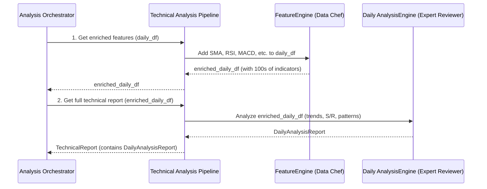

# Chapter 8: Technical Analysis Pipeline

Welcome back, future AI architect! In our last chapter, [Chapter 7: Data Preparation Orchestrator](07_data_preparation_orchestrator_.md), we learned how our system’s "Data Logistics" team meticulously collects and cleans all the raw financial data, preparing it for deeper insights. Now that we have this sparkling clean data – like historical stock prices and trading volumes – what do we do with it?

This is where our **Technical Analysis Pipeline** comes into play!

## The Problem: Making Sense of Price Charts

Imagine looking at a raw stock price chart. It’s just a bunch of lines and bars, right? How do you figure out if the price is likely to go up or down? How do you spot hidden patterns or understand the stock's momentum?

*   A simple price chart doesn't tell you if the stock is "overbought" or "oversold."
*   It doesn't immediately show you if the stock's short-term trend has just crossed above its long-term trend, which can be a strong "buy" signal.
*   You can't easily see if a "Hammer" candlestick pattern (a potential reversal signal) just formed.

Manually doing all this analysis, looking for hundreds of these subtle clues, would take a professional chart analyst hours for just one stock! This is the problem our **Technical Analysis Pipeline** solves. It's designed to be the system's dedicated "Chart Analyst," automatically sifting through mountains of price data to find these critical signals.

## Meet the Technical Analysis Pipeline: Your Automated Chart Analyst

Think of the **Technical Analysis Pipeline** as the system's expert "Chart Analyst." This specialist takes the raw price data (like the Open, High, Low, Close, Volume for each day or minute) and transforms it into a rich report about a stock's price action and momentum.

Its main job involves two crucial steps:

1.  **Feature Engineering (The Data Chef):** It takes the raw price ingredients and cooks them into hundreds of "technical indicators." These are like special recipes that transform prices into more meaningful numbers (e.g., a "Moving Average" smooths out prices, "RSI" measures speed and change of price movements, "MACD" reveals trend strength). This is done by the `FeatureEngine`.
2.  **Analysis Engine (The Expert Reviewer):** Once it has all these indicators, it then acts like an expert reviewer. It uses these indicators to identify trends (is the stock going up or down?), support and resistance levels (where prices might stop falling or rising), and famous chart patterns (like "Double Top" or "Head and Shoulders"). This is done by the `AnalysisEngine`.

The output is a structured `TechnicalReport` that clearly summarizes all these findings, making it easy for other parts of our AI system (like the [Rules Orchestrator](04_rules_orchestrator__deputy_ceo__.md)) to use.

## How the Analysis Orchestrator Uses the Technical Analysis Pipeline

As we saw in [Chapter 5: Analysis Orchestrator (Deputy CEO)](05_analysis_orchestrator__deputy_ceo__.md), the `AnalysisOrchestrator` (our "Head of Research") needs a complete market picture. It delegates the job of technical analysis to our `TechnicalOrchestrator` (which is the manager of the Technical Analysis Pipeline).

The `AnalysisOrchestrator` typically calls two main methods on the `TechnicalOrchestrator`:
1.  `get_daily_features` and `get_intraday_features`: To add technical indicators to the raw price data.
2.  `get_full_analysis`: To perform the actual in-depth analysis and generate the `TechnicalReport`.

Let's look at a simplified code snippet from the `AnalysisOrchestrator` to see how it uses the `TechnicalOrchestrator`:

```python
# app/analysis/orchestrator.py (Simplified)

class AnalysisOrchestrator:
    # ... __init__ method where self.tech_analyzer is set ...

    async def get_full_analysis_report(
        self, ticker: str, # e.g., "AAPL"
        # ... other parameters ...
    ):
        # 1. FETCH RAW DATA (from Data Preparation Orchestrator)
        daily_df = self.data_preparer.get_daily_ohlcv_for_ticker(ticker) # A Pandas DataFrame with Open, High, Low, Close, Volume
        intraday_df = self.data_preparer.get_intraday_ohlcv_for_ticker(ticker)

        # 2. ENRICH DATA with initial technical features (using TechnicalOrchestrator)
        # This adds indicators like SMA, RSI, MACD to the DataFrames
        enriched_daily_df = self.tech_analyzer.get_daily_features(daily_df) # <---
        enriched_intraday_df = self.tech_analyzer.get_intraday_features(intraday_df) # <---

        # 3. RUN ALL MODULES IN PARALLEL (including Technical Analysis itself)
        # This calls the TechnicalOrchestrator again for deeper analysis
        technical_task = loop.run_in_executor(
            None,
            self._prepare_and_run_technical_analysis, # This helper calls tech_analyzer.get_full_analysis
            enriched_daily_df,
            enriched_intraday_df,
            # ... other parameters ...
        )
        # ... other tasks like forecasting_task, news_task ...

        results = await asyncio.gather(technical_task, ...)
        technical_report, forecasting_report, news_report = results

        # ... then creates the final QuickCheckAnalysisReport ...
```

**What's happening here?**

1.  First, the `AnalysisOrchestrator` gets the raw `daily_df` and `intraday_df` (Pandas DataFrames) from the [Data Preparation Orchestrator](07_data_preparation_orchestrator_.md).
2.  Then, it passes these raw DataFrames to `self.tech_analyzer.get_daily_features()` and `get_intraday_features()`. These calls return new DataFrames, but now they are "enriched" with many technical indicator columns (like `SMA_50`, `RSI_14`, `MACD_12_26_9`).
3.  Finally, it dispatches a task that will call `self.tech_analyzer.get_full_analysis()` (via `_prepare_and_run_technical_analysis`) using these `enriched_daily_df` and `enriched_intraday_df`. This is where the *actual analysis* of trends, support/resistance, and patterns happens.
4.  The `TechnicalOrchestrator` then returns a `TechnicalReport` which becomes part of the overall `QuickCheckAnalysisReport`.

## Under the Hood: The Technical Analysis Workflow

When the `Analysis Orchestrator` asks for technical analysis, here's a simplified look at the steps inside the **Technical Analysis Pipeline** (managed by the `TechnicalOrchestrator`):



As you can see, the `TechnicalOrchestrator` orchestrates two main internal components:

1.  **`FeatureEngine`:** This component is responsible for adding all the technical indicator columns to the raw price data. Think of it as a "Data Chef" meticulously preparing hundreds of different numerical dishes (indicators) from the raw ingredients (prices).
2.  **`AnalysisEngine` (Daily & Intraday):** These components then take the data *with* all the added features and perform the actual analysis. They are like "Expert Reviewers" who look at these indicators and identify market trends, support/resistance levels, and chart patterns, compiling their findings into a structured report.

## The Code: Technical Analysis Pipeline

Let's look at the actual code for the `TechnicalOrchestrator` and its core components.

### 1. Initialization: Equipping the Pipeline

The `TechnicalOrchestrator` is initialized once when the application starts up, in `app/dependencies.py`. Notice it doesn't need many complex "department heads" itself, as its main job is to coordinate the `FeatureEngine` and `AnalysisEngine` (which are created directly when needed).

```python
# app/dependencies.py (Simplified)

# ... other imports ...
from .analysis.technical import TechnicalOrchestrator

# ... inside create_dependencies() ...

technical_orc = TechnicalOrchestrator() # <--- Our Technical Analysis Pipeline manager

# ... later, the Analysis Orchestrator gets this technical_orc ...
analysis_orc = AnalysisOrchestrator(
    # ... other dependencies ...
    tech_analyzer=technical_orc, # The Analysis Orchestrator gets our Technical Orchestrator
)
```

**Explanation:**
The `TechnicalOrchestrator` is created and then passed to the `AnalysisOrchestrator`, which will use it for all technical analysis tasks.

### 2. The `TechnicalOrchestrator`: Getting Features (The Data Chef)

The first thing the `AnalysisOrchestrator` asks for is to "enrich" the raw data with features. This is handled by `get_daily_features` (and similarly `get_intraday_features`) in `app/analysis/technical/orchestrator.py`:

```python
# app/analysis/technical/orchestrator.py (Simplified)

from .feature_engine import DailyFeatureEngine # Our "Data Chef"

class TechnicalOrchestrator:
    def get_daily_features(self, ohlcv_df: pd.DataFrame) -> pd.DataFrame:
        """Generate features for daily technical analysis."""
        logger.info("GENERATE DAILY FEATURES")
        try:
            # Create a DailyFeatureEngine instance with the raw data
            engine = DailyFeatureEngine(ohlcv_df) # <--- Init the Data Chef
            # Tell the chef to add ALL its standard recipes (features)
            return engine.add_all_features().get_features( # <--- Add features and return
                handle_na_method="forward_fill", reset_index=False
            )
        except (ValueError, TypeError) as e:
            logger.err(f"Daily Feature Engine: {e}. Returning empty DataFrame.")
            return pd.DataFrame()
```

**Explanation:**

*   `engine = DailyFeatureEngine(ohlcv_df)`: A new instance of `DailyFeatureEngine` (our "Data Chef" for daily data) is created, and it's given the raw `ohlcv_df`.
*   `engine.add_all_features()`: This tells the `FeatureEngine` to calculate and add *all* the predefined technical indicators (like SMA, RSI, MACD, Bollinger Bands, candlestick patterns) to the DataFrame. This method can also be chained with other `add_` methods.
*   `.get_features(...)`: Finally, this returns the DataFrame, now loaded with all the technical features, after handling any missing values.

### A Closer Look at `FeatureEngine` (The Data Chef's Recipes)

The `FeatureEngine` is the heart of creating technical indicators. It uses a powerful Python library called `pandas-ta` to quickly generate hundreds of indicators.

Here's a simplified look at how `_FeatureEngine` (the base class for `DailyFeatureEngine`) adds indicators:

```python
# app/analysis/technical/feature_engine.py (Simplified)

import pandas_ta as ta # This is the library that calculates indicators!

class _FeatureEngine:
    # ... __init__ and other methods ...

    # This method is used internally to add indicators
    def _add_generic_indicator(
        self, indicator_name: str, configs: Optional[List[Dict[str, Any]]] = None
    ):
        """Generic function to add any indicator from pandas-ta."""
        logger.debug(f"Adding indicator {indicator_name} to Frame ...")

        try:
            # Find the specific indicator function (e.g., 'sma', 'rsi')
            indicator_function = getattr(self.df.ta, indicator_name) # <--- Uses pandas-ta!
        except AttributeError:
            logger.err(f"Indicator '{indicator_name}' not found. Skipping.")
            return self

        for config in configs:
            # Call the indicator function with its parameters (e.g., length=14 for RSI)
            indicator_function(**config, append=True) # <--- Adds indicator as new columns

        return self

# DailyFeatureEngine inherits from _FeatureEngine and defines default indicator recipes
class DailyFeatureEngine(_FeatureEngine):
    DEFAULT_CONFIG: Dict[str, List[Dict[str, any]]] = {
        # Moving Averages
        "sma": [{"length": 20}, {"length": 50}, {"length": 200}],
        # RSI (Relative Strength Index)
        "rsi": [{"length": 14}],
        # MACD (Moving Average Convergence Divergence)
        "macd": [{"fast": 12, "slow": 26, "signal": 9}],
        # ... many more indicators ...
    }

    def add_all_features( # This method calls many other helper methods
        self, all_configs: Optional[Dict[str, List[Dict[str, any]]]] = None
    ):
        """Utility function to add all standard features."""
        logger.info("Daily Feature Engine: === Adding All Features ===")
        (
            self.add_trend_indicators(all_configs) # Adds SMAs, EMAs, MACD, ADX, PSAR
            .add_momentum_indicators(all_configs) # Adds RSI, Stochastics, CCI
            .add_volatility_indicators(all_configs) # Adds Bollinger Bands, ATR
            .add_volume_indicators(all_configs)
            .add_all_candlestick_patterns() # Adds specific candlestick patterns
            .add_interaction_features() # Adds custom combined features
        )
        return self
```

**Explanation:**

*   `import pandas_ta as ta`: This line imports the `pandas-ta` library, which is a collection of hundreds of pre-built technical indicator functions.
*   `getattr(self.df.ta, indicator_name)`: This is how `pandas-ta` is used. If `indicator_name` is "rsi", this line effectively becomes `self.df.ta.rsi`, which is a function that calculates the RSI for the DataFrame `self.df`.
*   `indicator_function(**config, append=True)`: This executes the indicator function. For example, if `indicator_name` is "rsi" and `config` is `{"length": 14}`, it calculates the 14-period RSI and adds it as a new column (e.g., `RSI_14`) to `self.df`.
*   `DailyFeatureEngine.DEFAULT_CONFIG`: This dictionary holds the default settings (like `length=20` for a 20-day Moving Average) for many indicators.
*   `add_all_features()`: This method chains together calls to many `add_` methods (like `add_trend_indicators`, `add_momentum_indicators`), each of which uses `_add_generic_indicator` to add a specific group of technical features. This efficiently loads the DataFrame with all the necessary technical data.

By the end of this step, our `ohlcv_df` DataFrame is no longer just raw prices; it's a treasure trove of hundreds of calculated technical indicators, ready for deeper analysis.

### 3. The `TechnicalOrchestrator`: Getting Analysis (The Expert Reviewer)

Once the data is enriched, the `TechnicalOrchestrator` then performs the actual analysis using specialized "Analysis Engines." This is done by the `get_full_analysis` method:

```python
# app/analysis/technical/orchestrator.py (Simplified)

from .analysis_engine.daily import DailyAnalysisEngine # Our "Expert Reviewer" for daily data
from .analysis_engine.intraday import IntradayAnalysisEngine # And for intraday data

class TechnicalOrchestrator:
    # ... get_daily_features and other methods ...

    def get_full_analysis(
        self,
        enriched_daily_df: pd.DataFrame, # The DataFrame with all the features
        enriched_intraday_df: pd.DataFrame,
        required_type: Literal["daily", "intraday", "all"] = "all",
        daily_analysis_type: Literal["short", "medium", "long"] = "medium",
    ) -> TechnicalReport:
        """Generate complete technical analysis report."""
        daily_report = None
        intraday_report = None

        if required_type == "daily" or required_type == "all":
            # Create a DailyAnalysisEngine and ask it for its report
            engine = DailyAnalysisEngine(enriched_daily_df, analysis_type=daily_analysis_type)
            daily_report = engine.get_analysis_report() # <--- Gets the daily analysis!

        if required_type == "intraday" or required_type == "all":
            # Create an IntradayAnalysisEngine and ask it for its report
            engine = IntradayAnalysisEngine(enriched_intraday_df)
            intraday_report = engine.get_analysis_report() # <--- Gets the intraday analysis!

        # Combine the daily and intraday reports into a single TechnicalReport
        return TechnicalReport(
            report_type=required_type,
            daily_report=daily_report,
            intraday_report=intraday_report,
        )
```

**Explanation:**

*   This method receives the `enriched_daily_df` and `enriched_intraday_df` (the DataFrames with all the technical features).
*   Based on what kind of analysis is `required_type` (daily, intraday, or all), it creates instances of `DailyAnalysisEngine` and/or `IntradayAnalysisEngine`.
*   `daily_report = engine.get_analysis_report()`: This is the critical call! It tells the `DailyAnalysisEngine` (our "Expert Reviewer" for daily data) to perform its analysis of trends, support/resistance, and patterns.
*   The results are then combined into a `TechnicalReport` schema, which is a structured object containing all the findings.

### A Closer Look at `DailyAnalysisEngine` (The Expert Reviewer's Process)

The `DailyAnalysisEngine` coordinates different specialized "sub-experts" to create its comprehensive report.

Here's a simplified view of `DailyAnalysisEngine.get_analysis_report()` in `app/analysis/technical/analysis_engine/daily/engine.py`:

```python
# app/analysis/technical/analysis_engine/daily/engine.py (Simplified)

from .trend_analyzer import DailyTrendAnalyzer # Sub-expert for trends
from .sr_identifier import DailySRIdentifier # Sub-expert for Support/Resistance
from .pattern_recognizer import DailyPatternRecognizer # Sub-expert for patterns

class DailyAnalysisEngine:
    def __init__(self, feature_df: pd.DataFrame, ...):
        # Initialize specialized sub-experts
        self.trend_analyzer = DailyTrendAnalyzer(self.df)
        self.sr_identifier = DailySRIdentifier(self.df, ...)
        self.pattern_recognizer = DailyPatternRecognizer(self.df, ...)

    def get_analysis_report(self) -> DailyAnalysisReport:
        """Generate a comprehensive technical analysis report by calling the experts."""
        logger.info("Generating Full Analysis Report ...")

        # Each sub-expert does its specific job
        logger.info("Trend Analyzer: Analyzing Trend ...")
        trend_report = self.trend_analyzer.analyze_trend() # <--- Ask the Trend Expert

        logger.info("Support Resistance Identifier: Identifying levels ...")
        sr_report = self.sr_identifier.identify_levels() # <--- Ask the S/R Expert

        logger.info("Pattern Recognizer: Finding patterns ...")
        patterns_report = self.pattern_recognizer.find_patterns() # <--- Ask the Pattern Expert

        # Compile all results into one report
        return DailyAnalysisReport(
            key_indicators=self._extract_key_indicators(),
            trend_report=trend_report,
            sr_report=sr_report,
            pattern_report=patterns_report,
        )
```

**Explanation:**

*   The `DailyAnalysisEngine` constructor sets up its specialized "sub-experts": `DailyTrendAnalyzer`, `DailySRIdentifier`, and `DailyPatternRecognizer`.
*   The `get_analysis_report` method then orchestrates these experts:
    *   It asks the `DailyTrendAnalyzer` to analyze trends (e.g., using Moving Averages and ADX).
    *   It asks the `DailySRIdentifier` to find support and resistance levels (e.g., using Pivot Points and Fibonacci retracements).
    *   It asks the `DailyPatternRecognizer` to identify chart and candlestick patterns.
*   Finally, it combines all these individual reports into a single `DailyAnalysisReport`.

Let's briefly look at just one of these "sub-experts" to understand how it works, for example, the `DailyTrendAnalyzer`.

```python
# app/analysis/technical/analysis_engine/daily/trend_analyzer.py (Simplified)

class DailyTrendAnalyzer:
    def __init__(self, feature_df: pd.DataFrame):
        self.df = feature_df
        self.latest_row = self.df.iloc[-1] # Look at the most recent data

    def _analyze_ma_trend(self, short_ma_col: str, long_ma_col: str) -> str:
        """Analyze trend based on moving average relationship."""
        # Check if the shorter-term MA is above the longer-term MA
        if self.latest_row[short_ma_col] > self.latest_row[long_ma_col]:
            return "uptrend"
        else:
            return "downtrend"

    def _get_mid_term_view(self) -> MidTermTrendReport:
        """Get mid-term trend analysis (20/50 moving averages)."""
        # Uses the features created by FeatureEngine: SMA_20 and SMA_50
        trend_direction = self._analyze_ma_trend("SMA_20", "SMA_50") # <---
        # ... also checks price against MA, and ADX for direction ...
        return MidTermTrendReport(
            ma_direction=trend_direction,
            # ... other details ...
        )

    def analyze_trend(self) -> TrendReport:
        """Perform comprehensive trend analysis and return a multidimensional dictionary."""
        long_term_analysis = self._get_long_term_view() # Uses SMA_50 and SMA_200
        mid_term_analysis = self._get_mid_term_view() # <--- Calls helper for mid-term trend
        adx_strength = self._get_adx_strength("ADX_14") # Uses ADX feature for strength

        return TrendReport(
            primary_focus="mid-term",
            midterm_report=mid_term_analysis,
            longterm_report=long_term_analysis,
            overall_strength=adx_strength,
        )
```

**Explanation:**

*   The `DailyTrendAnalyzer` looks at the `latest_row` of the `feature_df` (which contains all the indicators like `SMA_20`, `SMA_50`, `SMA_200`, `ADX_14`).
*   The `_analyze_ma_trend` method simply compares two Moving Averages. For example, if `SMA_20` is above `SMA_50`, it indicates an "uptrend."
*   `_get_mid_term_view` uses this helper to determine the mid-term trend.
*   The main `analyze_trend` method combines these short-term, medium-term, and long-term views (by comparing different MA pairs) and also assesses overall trend strength using the `ADX_14` indicator. It then compiles this into a `TrendReport`.

This systematic approach, from raw data to features to detailed analysis, allows our AI system to mimic the work of a professional chart analyst, but at lightning speed and scale!

## Conclusion

In this chapter, we've explored the **Technical Analysis Pipeline**, our system's dedicated "Chart Analyst." We learned how it takes raw price data and, through its `FeatureEngine`, transforms it into a wealth of technical indicators (like Moving Averages, RSI, MACD, and candlestick patterns). Then, its `AnalysisEngine` uses these indicators to identify trends, support/resistance levels, and chart patterns, compiling everything into a comprehensive `TechnicalReport`. This pipeline is essential for understanding a stock's price action and momentum, forming a key foundation for all investment recommendations.

Next, we'll take this enriched data and explore another powerful analysis pipeline: the **Forecasting Pipeline**! Get ready to learn how our system tries to predict future stock prices. Head over to [Forecasting Pipeline](09_forecasting_pipeline_.md)!

---

Generated by [AI Codebase Knowledge Builder](https://github.com/The-Pocket/Tutorial-Codebase-Knowledge)