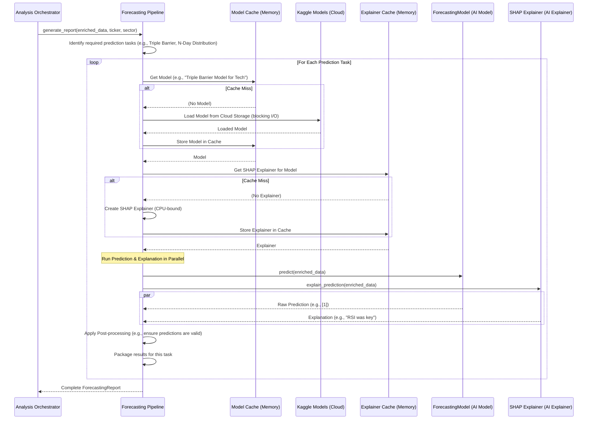

# Chapter 9: Forecasting Pipeline

Welcome back, future AI architect! In our last chapter, [Chapter 8: Technical Analysis Pipeline](08_technical_analysis_pipeline_.md), we learned how our system's "Chart Analyst" generates hundreds of technical indicators and reports on price trends. Now that we have all this historical data enriched with powerful insights, it's time to ask the big question: **What will the stock price do next?**

This is where our **Forecasting Pipeline** comes in!

## The Problem: Predicting the Future (or at Least Trying To!)

Imagine you're deciding whether to buy, sell, or hold a stock like Apple (AAPL). Knowing its past trends is useful, but what you really want to know is:
*   Will its price go up or down significantly in the next 10 days?
*   What's a likely range of prices for Apple stock a month from now?
*   And most importantly, ***why*** do we expect these movements?

Predicting stock prices is one of the hardest challenges in finance. Markets are complex, influenced by thousands of factors, and often unpredictable. You need more than just simple rules; you need sophisticated machine learning models that can learn from past data and identify subtle patterns.

This is the problem our **Forecasting Pipeline** solves. It's designed to be the "Prediction Engine" of our service, using advanced AI to forecast future price movements and, crucially, to explain *why* it made those forecasts.

## Meet the Forecasting Pipeline: Your AI's Crystal Ball

Think of the **Forecasting Pipeline** as the "Chief Fortune Teller" or "Crystal Ball" of our AI company. It doesn't actually *see* the future, but it uses powerful mathematical models and historical data to make educated guesses about what might happen to stock prices.

Its main responsibilities are:

1.  **Housing Forecasting Models:** It manages various specialized **Forecasting Models**. Each model is like a different expert, trained to answer a specific type of prediction question (e.g., one expert predicts if a stock will hit a profit target, another predicts a likely price range).
2.  **Making Predictions:** When asked, it feeds the latest market data into these models to get their predictions for the future.
3.  **Explaining Decisions (SHAP):** It helps you understand *why* a model made a certain prediction by showing which factors (like a specific technical indicator or recent news) were most important.
4.  **Refining Predictions (Post-processing):** Sometimes, raw model predictions might be a bit wild. This pipeline refines them to be more realistic and usable (e.g., ensuring a predicted "price range" makes sense).
5.  **Loading Models:** It efficiently loads the right forecasting model from a special storage area (like a "model library") when needed.

This pipeline is essential for giving our [Advisor Orchestrator (Deputy CEO)](03_advisor_orchestrator__deputy_ceo__.md) powerful insights into potential future market movements.

## How the Analysis Orchestrator Uses the Forecasting Pipeline

As we saw in [Chapter 5: Analysis Orchestrator (Deputy CEO)](05_analysis_orchestrator__deputy_ceo__.md), the `AnalysisOrchestrator` (our "Head of Research") needs a full market picture. It delegates the job of forecasting to our `ForecastingOrchestrator` (which manages the Forecasting Pipeline).

Let's look at a simplified code snippet from the `AnalysisOrchestrator` to see how it asks for a forecast:

```python
# app/analysis/orchestrator.py (Simplified)

class AnalysisOrchestrator:
    # ... __init__ method where self.forecaster is set ...

    async def get_full_analysis_report(
        self, ticker: str, # e.g., "AAPL"
        # ... other parameters ...
    ):
        # ... fetch raw data and enrich it with technical features ...
        enriched_daily_df = self.tech_analyzer.get_daily_features(daily_df)

        # RUN ALL MODULES IN PARALLEL (including Forecasting)
        forecasting_task = self._prepare_and_run_forecasting(ticker, enriched_daily_df) # <--- calls our Forecasting Pipeline

        results = await asyncio.gather( # runs tasks concurrently
            technical_task,
            forecasting_task, # Waits for the forecast to complete
            news_task,
            return_exceptions=True,
        )

        technical_report, forecasting_report, news_report = results
        # ... then creates the final QuickCheckAnalysisReport ...
```

**What's happening here?**

1.  The `AnalysisOrchestrator` first gets the `enriched_daily_df` (a Pandas DataFrame with historical prices and many technical indicators) from the [Technical Analysis Pipeline](08_technical_analysis_pipeline_.md). This is the data our models will use to make predictions.
2.  Then, it calls `self._prepare_and_run_forecasting(ticker, enriched_daily_df)`. This helper method (which we'll see next) takes the enriched data, the `ticker`, and other info, and then asks our `ForecastingOrchestrator` (our Crystal Ball) to generate its prediction report.
3.  The `await asyncio.gather(...)` line is crucial: it means the forecasting task runs *at the same time* as the technical analysis and news analysis, making the whole process much faster!
4.  The `ForecastingOrchestrator` then returns a `ForecastingReport`, which becomes a part of the overall `QuickCheckAnalysisReport`.

## Under the Hood: The Forecasting Workflow

When the `Analysis Orchestrator` asks for a forecast, here's a simplified look at the steps inside the **Forecasting Pipeline** (managed by the `ForecastingOrchestrator`):



As you can see, the `ForecastingOrchestrator` is a sophisticated manager:
1.  It identifies all the different prediction "tasks" it needs to run for a given stock (e.g., "will it go up?" and "what's the price range?").
2.  For each task, it efficiently gets the right **Forecasting Model** from a **cache**. If the model isn't in memory, it downloads it from an external "Model Library" (like Kaggle Models).
3.  It also gets a special **SHAP Explainer** (which helps explain the model's prediction) for that model, also using a cache.
4.  Once it has the model and its explainer, it cleverly runs the actual **prediction** and the **explanation generation** *at the same time* (in parallel) to save time.
5.  Finally, it applies any **post-processing** to refine the predictions and then combines all the individual task results into a single `ForecastingReport`.

This entire process happens very quickly, providing the `Analysis Orchestrator` with fast and insightful predictions.

## The Code: Forecasting Pipeline

Let's look at the actual code for the `ForecastingOrchestrator` and its core components.

### 1. Initialization: Equipping the Prediction Engine

The `ForecastingOrchestrator` is initialized once when the application starts up, in `app/dependencies.py`.

```python
# app/dependencies.py (Simplified)

# ... other imports ...
from .analysis.forecasting import ForecastingOrchestrator

# ... inside create_dependencies() ...

forecasting_orc = ForecastingOrchestrator() # <--- Our Forecasting Pipeline manager

# ... later, the Analysis Orchestrator gets this forecasting_orc ...
analysis_orc = AnalysisOrchestrator(
    # ... other dependencies ...
    forecaster=forecasting_orc, # The Analysis Orchestrator gets our Forecasting Orchestrator
)
```

**Explanation:**
The `ForecastingOrchestrator` is created and then passed to the `AnalysisOrchestrator`, which will use it for all forecasting tasks. It doesn't need to load models here; it loads them on demand.

### 2. The `ForecastingOrchestrator`: Generating the Report (`generate_report`)

The main method the `AnalysisOrchestrator` calls is `generate_report` in `app/analysis/forecasting/orchestrator.py`. This is where it coordinates all the forecasting tasks.

```python
# app/analysis/forecasting/orchestrator.py (Simplified)

class ForecastingOrchestrator:
    def __init__(self):
        self.model_cache = AsyncInMemoryCache() # Stores models in memory for speed
        self.explainer_cache = AsyncInMemoryCache() # Stores explainers in memory

    async def generate_report(
        self, latest_enriched_data: pd.DataFrame, ticker: str, sector: str
    ) -> ForecastingReport:
        logger.info(
            f"--- Generating ASYNC Forecast Report for Ticker: {ticker} ---"
        )

        tasks_to_run_config = self._get_tasks_config() # Defines which prediction tasks to run

        # Create a list of "jobs" (coroutines) to run in parallel
        coroutines_to_run = [
            self._process_single_task( # Calls a helper to process one prediction task
                model_template, task_template, problem_id, sector, latest_enriched_data
            )
            for model_template, task_template, problem_id in tasks_to_run_config
        ]

        # Use asyncio.gather to run all prediction tasks concurrently
        task_reports_list = await asyncio.gather(*coroutines_to_run) # <--- KEY!

        # Combine all individual task reports into one final report
        final_report = ForecastingReport(
            ticker=ticker.upper(),
            sector=sector,
            forecasts=task_reports_list,
        )

        return final_report
```

**Explanation:**

*   The `__init__` method sets up `model_cache` and `explainer_cache` (fast, in-memory storage).
*   `tasks_to_run_config = self._get_tasks_config()`: This private method (shown later) defines which specific prediction questions (tasks) our pipeline will answer. For example, "Triple Barrier Classification" and "N-Day Price Distribution."
*   `coroutines_to_run = [...]`: For each defined task, it creates a `_process_single_task` job.
*   `await asyncio.gather(*coroutines_to_run)`: This is the magic! It takes all the individual prediction jobs and tells Python to run them *all at the same time*. It waits until every job is finished. This is why our forecasting is so fast.
*   The results from each `_process_single_task` (a `SingleTaskForecastReport`) are collected into `task_reports_list` and then packaged into the final `ForecastingReport`.

### 3. Processing a Single Task: `_process_single_task`

This helper method, also in `app/analysis/forecasting/orchestrator.py`, handles the full lifecycle for one prediction problem (e.g., getting the model, making a prediction, and explaining it).

```python
# app/analysis/forecasting/orchestrator.py (Simplified)

class ForecastingOrchestrator:
    # ... __init__ and generate_report ...

    async def _process_single_task(
        self,
        model_template: ForecastingModel,
        task_template: AvailableTaskTemplate,
        problem_id: str,
        sector_code: str,
        latest_enriched_data: pd.DataFrame,
    ) -> SingleTaskForecastReport:

        task_id = cfg.TASK_ID_SECTOR_TEMPLATE.format( # Unique ID for this specific task
            problem=problem_id, sector=sector_code
        )

        # 1. Get the correct Forecasting Model (from cache or cloud)
        model_wrapper = await self._get_or_load_model( # <--- Uses model cache & Kaggle
            model_template, task_template, task_id
        )

        # 2. Get the correct SHAP Explainer (from cache or create new)
        explainer = await self._get_or_create_explainer(model_wrapper) # <--- Uses explainer cache

        task = model_wrapper.task
        X_instance = latest_enriched_data[task.selected_features] # Select only features the model was trained on

        loop = asyncio.get_running_loop()

        # 3. Run prediction and explanation in parallel (CPU-bound tasks)
        predict_func = partial(model_wrapper.predict, X_instance) # Prepare prediction function
        explain_func = partial(explainer.explain_prediction, X_instance) # Prepare explanation function

        prediction_array, explanations = await asyncio.gather( # <--- Parallel execution again!
            loop.run_in_executor(None, predict_func), # Runs blocking predict in a separate thread
            loop.run_in_executor(None, explain_func), # Runs blocking explain in a separate thread
        )

        # 4. Package results
        task_report = SingleTaskForecastReport(
            task_name=task.task_id,
            task_metadata=task.get_metadata_for_plain(),
            prediction=prediction_array.flatten().tolist(), # Convert prediction to list
            units=task.target_units,
            evidence=explanations, # The SHAP explanations!
        )
        return task_report
```

**Explanation:**

*   `task_id = ...`: Each model is specialized. For example, a "Triple Barrier" model for the "Technology" sector will have a specific `task_id`.
*   `model_wrapper = await self._get_or_load_model(...)`: This is a crucial asynchronous call. It first checks the `model_cache`. If the model isn't there, it loads it from a central "Model Library" (like Kaggle Models).
*   `explainer = await self._get_or_create_explainer(model_wrapper)`: Similarly, it gets or creates a `SHAPExplainer` for this specific model, using its `explainer_cache`.
*   `X_instance = latest_enriched_data[task.selected_features]`: The model was trained on specific technical features. This line selects *only* those features from our `latest_enriched_data`.
*   `await asyncio.gather(loop.run_in_executor(None, predict_func), ...)`: This again runs tasks in parallel. Both `model_wrapper.predict()` (which uses the AI model to guess the future) and `explainer.explain_prediction()` (which figures out *why* that guess was made) are CPU-intensive operations. `loop.run_in_executor(None, ...)` tells Python: "Run this potentially blocking task in a separate thread, so the main program doesn't freeze!"
*   The `prediction_array` (the forecast itself) and `explanations` (the SHAP values) are then bundled into a `SingleTaskForecastReport`.

### 4. Getting or Loading the Model: `_get_or_load_model`

This method, in `app/analysis/forecasting/orchestrator.py`, intelligently loads models, prioritizing speed.

```python
# app/analysis/forecasting/orchestrator.py (Simplified)

class ForecastingOrchestrator:
    # ... other methods ...

    async def _get_or_load_model(
        self,
        model_template: ForecastingModel,
        task_template: AvailableTaskTemplate,
        task_id: str,
    ) -> ForecastingModel:
        model_slug = model_template.get_model_slug(task_id=task_id) # Unique name for model in cache

        async def model_factory():
            logger.info(f"CACHE MISS: Loading model for task '{task_id}' from Kaggle Hub...")
            loop = asyncio.get_running_loop()
            await loop.run_in_executor( # <--- Runs blocking load in a separate thread
                None,
                model_template.load_model_from_kaggle, # The actual blocking download/load function
                cfg.KAGGLE_USERNAME,
                task_template,
                task_id,
            )
            return model_template

        # Try to get from cache, if not found, use model_factory to load and then cache it
        return await self.model_cache.get_or_set_with_lock(model_slug, model_factory)
```

**Explanation:**

*   `model_slug`: A unique identifier for the specific model (e.g., "lgbm_model-triple_barrier-tech").
*   `async def model_factory(): ...`: This defines *how* to get the model if it's not in the cache.
*   `await loop.run_in_executor(None, model_template.load_model_from_kaggle, ...)`: This is where the actual model download and loading happens. Since downloading and loading a model from disk can take time (it's a "blocking" operation), we run it in a separate thread using `run_in_executor`. This prevents our entire AI service from freezing while waiting for a model to load.
*   `await self.model_cache.get_or_set_with_lock(model_slug, model_factory)`: This is a smart caching mechanism. It first checks if the `model_slug` exists in our in-memory `model_cache`. If yes, it returns it instantly. If not, it runs our `model_factory` (which loads from Kaggle), and then stores the result in the cache for next time.

### 5. The `ForecastingModel` (Simplified)

The `ForecastingModel` class (in `app/analysis/forecasting/model.py`) is a wrapper around the actual machine learning model (like a LightGBM model from Scikit-learn). It handles loading/saving and making predictions.

```python
# app/analysis/forecasting/model.py (Simplified)

class ForecastingModel(ABC):
    def __init__(self, name: str, framework: str, kernel_model_template=None, ...):
        self.name = name
        self.kernel_model = None # This will hold the actual trained ML model
        self.task: ForecastingTask = None # The specific prediction task it solves
        # ... other setup ...

    def load_model_from_kaggle( # <--- Called by _get_or_load_model
        self, kaggle_username: str, task_template: AvailableTaskTemplate, task_id: str, ...
    ):
        """Downloads the model from Kaggle Hub and loads it."""
        # ... logic to download model files from Kaggle Hub ...
        with open(main_model_path, "rb") as f:
            self.kernel_model = pickle.load(f) # <--- Loads the actual trained ML model!
        # ... also loads task metadata ...

    def predict(self, X: pd.DataFrame, snapshot_id: str | None = None) -> np.ndarray:
        """Makes a prediction using the loaded kernel model."""
        model_to_use = self.kernel_model # Use the main trained model
        prediction = self.predict_kernel_model(model_to_use, X) # Calls the actual ML model's predict method
        # ... applies post-processors if any ...
        return prediction

    @abstractmethod
    def predict_kernel_model(self, kernel_model, X: pd.DataFrame) -> np.ndarray:
        """Abstract method for subclasses to implement actual prediction logic."""
        # E.g., for ScikitLearn model: return kernel_model.predict(X)
```

**Explanation:**

*   `self.kernel_model`: This property will hold the actual trained machine learning model object (e.g., a `LightGBMClassifier` from the Scikit-learn library).
*   `load_model_from_kaggle`: This method, when called, talks to Kaggle Hub (a cloud platform for sharing models) to download the saved model files. It then uses `pickle.load(f)` to bring the trained model back into memory.
*   `predict(self, X)`: This is the method that actually takes new data (`X`) and asks the `self.kernel_model` (our loaded AI expert) to make a prediction.

### 6. Getting or Creating the Explainer: `_get_or_create_explainer`

This method, in `app/analysis/forecasting/orchestrator.py`, ensures we have a `SHAPExplainer` to understand the model's decisions.

```python
# app/analysis/forecasting/orchestrator.py (Simplified)

class ForecastingOrchestrator:
    # ... other methods ...

    async def _get_or_create_explainer(
        self, model_wrapper: ForecastingModel, snapshot_id: str | None = None
    ) -> SHAPExplainer:
        explainer_key = model_wrapper.task.task_id # Key for the explainer in cache

        async def explainer_factory():
            logger.info("CACHE MISS for Explainer: Creating new SHAP Explainer...")
            loop = asyncio.get_running_loop()
            return await loop.run_in_executor( # <--- Runs blocking creation in a separate thread
                None, self._create_explainer_sync, model_wrapper, snapshot_id
            )

        return await self.explainer_cache.get_or_set_with_lock(
            explainer_key, explainer_factory
        )

    def _create_explainer_sync( # This function is run in the executor
        self, model_wrapper: ForecastingModel, snapshot_id: str | None = None
    ) -> SHAPExplainer:
        """Synchronously creates the correct SHAP Explainer based on the task type."""
        if model_wrapper.task.task_type == "clf": # If it's a classification task (e.g., up/down/sideways)
            explainer = TreeSHAPExplainer(model_wrapper, snapshot_id)
        else: # If it's a regression task (e.g., price distribution)
            explainer = MultiOutputTreeSHAPExplainer(model_wrapper, snapshot_id)
        return explainer
```

**Explanation:**

*   `explainer_key`: A unique key for the explainer, usually based on the task ID.
*   `async def explainer_factory(): ...`: Defines how to create the explainer. Creating an explainer can be a CPU-intensive process, so `run_in_executor` is used here too.
*   `_create_explainer_sync`: This is the function that actually creates the explainer. It checks the `model_wrapper.task.task_type`.
    *   If the task is `clf` (classification, like "up/down/timeout"), it creates a `TreeSHAPExplainer`.
    *   If the task is `reg` (regression, like "predict price range"), it creates a `MultiOutputTreeSHAPExplainer`.
*   `SHAPExplainer`: This is a library that helps explain "black box" machine learning models. It tells you which input features (like RSI, MACD, or a specific candlestick pattern) contributed most to the model's prediction and in what direction (positive or negative impact). This is crucial for transparency!

### 7. Post-Processing Predictions (Optional but Important)

Sometimes, the raw numerical output from an AI model needs a bit of polishing to make it more sensible in the real world. This is where **Post-processors** (defined in `app/analysis/forecasting/post_processing.py`) come in.

For example, for a "N-Day Distribution" task (where we predict things like mean, standard deviation, min, max, 25th percentile, 75th percentile of future price changes), a `NDaysDistributionPostProcessor` makes sure the numbers are logical:

```python
# app/analysis/forecasting/post_processing.py (Simplified)

class NDaysDistributionPostProcessor(PostProcessor):
    """Ensures that distribution prediction is reasonable.
    For example, `std` (standard deviation) should be >= 0, or `q25` (25th percentile)
    should be <= `mean` (average) which should be <= `q75` (75th percentile).
    """
    def __init__(self, task: NDaysDistributionTask):
        self.task = task

    def apply(self, raw_predict: np.ndarray) -> np.ndarray:
        raw_df = pd.DataFrame(raw_predict, columns=self.task.targets)

        # Ensure standard deviation is not negative
        raw_df["std"] = raw_df["std"].clip(lower=0)

        # Ensure min <= max
        min_greater_max = raw_df["min"] > raw_df["max"]
        if min_greater_max.any():
            mid = (raw_df.loc[min_greater_max, "min"] + raw_df.loc[min_greater_max, "max"]) / 2
            raw_df.loc[min_greater_max, "min"] = mid
            raw_df.loc[min_greater_max, "max"] = mid

        # Ensure q25 <= mean <= q75 and that all are within [min, max]
        raw_df["mean"] = raw_df["mean"].clip(raw_df["min"], raw_df["max"])
        raw_df["q25"] = raw_df["q25"].clip(raw_df["min"], raw_df["max"])
        raw_df["q75"] = raw_df["q75"].clip(raw_df["min"], raw_df["max"])

        # Ensure q25 <= q75
        q25_greater_q75 = raw_df["q25"] > raw_df["q75"]
        if q25_greater_q75.any():
            mid_q = (raw_df.loc[q25_greater_q75, "q25"] + raw_df.loc[q25_greater_q75, "q75"]) / 2
            raw_df.loc[q25_greater_q75, "q25"] = mid_q
            raw_df.loc[q25_greater_q75, "q75"] = mid_q

        return raw_df.to_numpy(copy=True)
```

**Explanation:**
This `NDaysDistributionPostProcessor` takes the raw predictions from the model (which might have some mathematically odd values due to model complexities) and applies a series of logical corrections. For example, it ensures that a predicted "standard deviation" (a measure of volatility) is never negative, or that the 25th percentile of prices isn't accidentally higher than the 75th percentile. This makes the predictions more realistic and trustworthy.

## Conclusion

In this chapter, we've explored the **Forecasting Pipeline**, our system's "Prediction Engine." We learned how it manages specialized machine learning models to forecast future price movements for various tasks (like classifying outcomes or predicting price distributions). Crucially, it efficiently loads these models, makes predictions, applies post-processing to refine them, and uses powerful SHAP explainers to tell us *why* a particular forecast was made. This pipeline provides essential, forward-looking insights that are crucial for making informed investment decisions.

Next, we'll dive into another powerful analysis pipeline: the **News Analysis Pipeline**! Get ready to learn how our system understands the sentiment and impact of the latest news headlines. Head over to [News Analysis Pipeline](10_news_analysis_pipeline_.md)!

---

Generated by [AI Codebase Knowledge Builder](https://github.com/The-Pocket/Tutorial-Codebase-Knowledge)