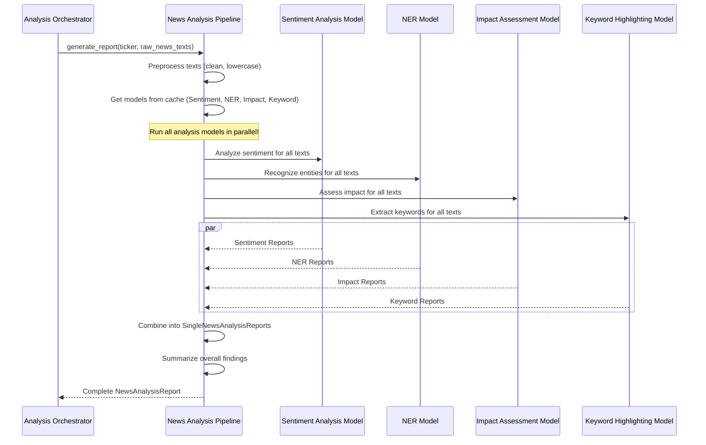

# Chapter 10: News Analysis Pipeline

Welcome back, future AI architect! In our last chapter, [Chapter 9: Forecasting Pipeline](09_forecasting_pipeline_.md), we learned how our system tries to predict future stock prices using clever AI models. Knowing if a stock is likely to go up or down is incredibly powerful, but predictions alone don't tell the whole story. What if there's a major news event that suddenly changes everything?

This is where our **News Analysis Pipeline** comes in! It's like having a dedicated "Newsroom Analyst" constantly reading and understanding all the latest headlines, so you don't miss crucial market-moving information.

## The Problem: Drowning in News (and Not Knowing What's Important)

Imagine you're trying to make an investment decision about a company like Apple (AAPL). Every day, hundreds of news articles, reports, and social media posts appear. You need to know:

*   Is the overall **sentiment** of the news positive, negative, or neutral? (Is everyone happy or worried about Apple?)
*   What **key entities** (people, organizations, products) are being mentioned most often? (Is it about Tim Cook, a new iPhone, or a competitor?)
*   How **significant** is this news? Will it actually impact the stock price, or is it just minor chatter?
*   What are the **keywords** that prove the sentiment or impact? (e.g., "record profits" vs. "recall scandal").

Manually reading and analyzing all this news, connecting it to market movements, and identifying the important bits is impossible for a human. This is the problem our **News Analysis Pipeline** solves. It's designed to be your automated "Newsroom Analyst," quickly sifting through raw news articles to extract market-relevant insights.

## Meet the News Analysis Pipeline: Your Automated Newsroom Analyst

Think of the **News Analysis Pipeline** as the highly skilled "Head of News Intelligence" in our AI company. Its job isn't to generate price data or make predictions, but to understand the *narrative* around a stock. It takes raw news articles and processes them, providing a concise report of what the news *means* for the market.

Its main responsibilities are:

1.  **Sentiment Analysis:** Reading articles and determining if the overall tone is positive, negative, or neutral. (e.g., "Apple stock *soars* on new product announcement" vs. "Apple faces *fine* over antitrust concerns").
2.  **Named Entity Recognition (NER):** Identifying and categorizing important names mentioned in the text, such as companies (ORG), people (PERSON), locations (LOC), products (PRODUCT), or monetary values (MONEY).
3.  **Impact Assessment:** Evaluating how significant a piece of news is likely to be for the market. Is it a "high impact" headline or just "low impact" background noise?
4.  **Keyword Highlighting:** Pinpointing specific words or phrases that provide evidence for the detected sentiment or impact. This helps you understand *why* the AI made its assessment.
5.  **Report Compiling:** Bringing all these insights together into a clear, concise `NewsAnalysisReport` for each article, and an overall summary.

This pipeline ensures that our [Analysis Orchestrator (Deputy CEO)](05_analysis_orchestrator__deputy_ceo__.md) (our "Head of Research") gets a deep understanding of qualitative market factors, which are then used by the [Rules Orchestrator (Deputy CEO)](04_rules_orchestrator__deputy_ceo__.md) and [Advisor Orchestrator (Deputy CEO)](03_advisor_orchestrator__deputy_ceo__.md) for informed decisions.

## How the Analysis Orchestrator Uses the News Analysis Pipeline

As we saw in [Chapter 5: Analysis Orchestrator (Deputy CEO)](05_analysis_orchestrator__deputy_ceo__.md), the `AnalysisOrchestrator` needs a complete market picture. It delegates the task of news analysis to our `NewsOrchestrator` (which manages the News Analysis Pipeline).

The `AnalysisOrchestrator` calls a specific method on the `NewsOrchestrator` to get its report. But first, it needs the raw news texts, which come from the [Data Preparation Orchestrator](07_data_preparation_orchestrator_.md).

Let's look at a simplified code snippet from the `AnalysisOrchestrator` to see how it asks for a news analysis:

```python
# app/analysis/orchestrator.py (Simplified)

class AnalysisOrchestrator:
    # ... __init__ method where self.news_analyzer is set ...

    async def get_full_analysis_report(
        self, ticker: str, # e.g., "AAPL"
        # ... other parameters ...
    ):
        # 1. FETCH RAW DATA (from Data Preparation Orchestrator)
        # We need the news texts before we can analyze them!
        news_texts = self.data_preparer.get_all_news_text_for_ticker(ticker) # <---
        # This returns a list of cleaned news article texts.

        # 2. RUN ALL MODULES IN PARALLEL (including News Analysis)
        # This calls our News Analysis Pipeline to process the news texts
        news_task = self._prepare_and_run_news_analysis(ticker, news_texts) # <---

        results = await asyncio.gather( # runs tasks concurrently
            technical_task,
            forecasting_task,
            news_task, # Waits for the news analysis to complete
            return_exceptions=True,
        )

        technical_report, forecasting_report, news_report = results
        # ... then creates the final QuickCheckAnalysisReport ...
```

**What's happening here?**

1.  First, the `AnalysisOrchestrator` asks the `data_preparer` (our [Data Preparation Orchestrator](07_data_preparation_orchestrator_.md)) to `get_all_news_text_for_ticker(ticker)`. This provides a list of plain text news articles.
2.  Then, it calls `self._prepare_and_run_news_analysis(ticker, news_texts)`. This helper method (which we'll see next) takes the raw news texts and the `ticker`, and then asks our `NewsOrchestrator` (our Newsroom Analyst) to generate its report.
3.  The `await asyncio.gather(...)` line is crucial: it means the news analysis task runs *at the same time* as the technical analysis and forecasting, making the whole process much faster!
4.  The `NewsOrchestrator` then returns a `NewsAnalysisReport`, which becomes a part of the overall `QuickCheckAnalysisReport`.

## Under the Hood: The News Analysis Workflow

When the `Analysis Orchestrator` asks for news analysis, here's a simplified look at the steps inside the **News Analysis Pipeline** (managed by the `NewsOrchestrator`):



As you can see, the `NewsOrchestrator` is an efficient manager:

1.  It first **preprocesses** the raw news texts (cleaning them up for analysis).
2.  It then efficiently gets all the necessary **specialized models** (Sentiment, NER, Impact, Keyword) from an in-memory cache.
3.  Crucially, it dispatches these four different analysis tasks to their respective models, and these tasks are run **at the same time (in parallel)** using `asyncio.gather`. This makes the whole news analysis process very fast!
4.  Finally, it collects all the individual results, combines them into detailed `SingleNewsAnalysisReport` objects (one for each article), generates an overall `SummaryReport`, and packages everything into a `NewsAnalysisReport` to send back to the `AnalysisOrchestrator`.

## The Code: News Analysis Pipeline

Let's look at the actual code for the `NewsOrchestrator` and its core components.

### 1. Initialization: Equipping the Newsroom Analyst

The `NewsOrchestrator` is initialized once when the application starts up, in `app/dependencies.py`.

```python
# app/dependencies.py (Simplified)

# ... other imports ...
from .analysis.news import NewsOrchestrator

# ... inside create_dependencies() ...

news_orc = NewsOrchestrator() # <--- Our News Analysis Pipeline manager

# ... later, the Analysis Orchestrator gets this news_orc ...
analysis_orc = AnalysisOrchestrator(
    # ... other dependencies ...
    news_analyzer=news_orc, # The Analysis Orchestrator gets our News Orchestrator
)
```

**Explanation:**
The `NewsOrchestrator` is created and then passed to the `AnalysisOrchestrator`, which will use it for all news analysis tasks. It manages its own specialized models internally using a cache.

### 2. The `NewsOrchestrator`: Generating the Report (`generate_report`)

The main method the `AnalysisOrchestrator` calls is `generate_report` in `app/analysis/news/orchestrator.py`. This is where it orchestrates all the news analysis tasks.

```python
# app/analysis/news/orchestrator.py (Simplified)

class NewsOrchestrator:
    def __init__(self):
        self.model_cache = AsyncInMemoryCache() # Stores models in memory for speed

    async def generate_report(
        self, ticker: str, texts: List[str]
    ) -> NewsAnalysisReport:
        logger.info(f"News: Preprocessing {len(texts)} texts ...")
        # 1. Preprocess the raw news texts
        processed_texts = preprocess_news_texts(texts) # <--- Cleaning step

        logger.info("News: Getting required analysis models from cache...")
        # 2. Get all specialized models from cache (or load them)
        sentiment_model = await self._get_or_load_element("sentiment")
        ner_model = await self._get_or_load_element("ner")
        impact_model = await self._get_or_load_element("impact-assessment")
        keyword_model = await self._get_or_load_element("keyword-highlight")
        summary_model = await self._get_or_load_element("summary")

        logger.info("News: Running sentiment, NER, impact, keyword analysis in parallel...")
        loop = asyncio.get_running_loop()

        # 3. Run all heavy analysis tasks concurrently!
        sentiment_analysis_reports, ner_reports, impact_reports, keyword_reports = (
            await asyncio.gather(
                loop.run_in_executor(None, sentiment_model.analysis_sentiment, processed_texts), # Sentiment
                loop.run_in_executor(None, ner_model.recognize, processed_texts), # NER
                loop.run_in_executor(None, impact_model.assess, processed_texts), # Impact
                loop.run_in_executor(None, keyword_model.extract, processed_texts), # Keywords
            )
        )

        # 4. Combine results for each individual news article
        single_reports: List[SingleNewsAnalysisReport] = []
        for i in range(len(processed_texts)):
            single_reports.append(
                SingleNewsAnalysisReport(
                    text=texts[i], # Original text
                    sentiment_analysis=sentiment_analysis_reports[i],
                    ner=ner_reports[i],
                    impact_assessment=impact_reports[i],
                    keyword_highlighting_evidence=keyword_reports[i],
                )
            )
        
        # 5. Generate an overall summary
        summary = summary_model.summary(single_reports)

        return NewsAnalysisReport(
            ticker=ticker, reports=single_reports, summary=summary
        )
```

**Explanation:**

1.  `processed_texts = preprocess_news_texts(texts)`: This is the first step, cleaning up the input texts. The helper function `preprocess_news_texts` (from `app/analysis/news/utils.py`) might convert text to lowercase or remove irrelevant symbols.
2.  `await self._get_or_load_element("sentiment")`: This is how the `NewsOrchestrator` gets each specialized analysis model. It intelligently checks if the model is already in its `model_cache`. If not, it loads it (which can be a slow, blocking operation) but does so in a way that doesn't freeze the entire application (using `run_in_executor`, as we'll see next).
3.  `await asyncio.gather(...)`: This is the core of the parallelism. It tells Python to run the `sentiment_model.analysis_sentiment`, `ner_model.recognize`, `impact_model.assess`, and `keyword_model.extract` methods for *all* the news texts *at the same time*. Each of these methods processes the `processed_texts` and returns a list of reports.
4.  The `for i in range(...)` loop then combines the individual reports (one from each analysis model) into a `SingleNewsAnalysisReport` for each news article.
5.  Finally, `summary_model.summary(single_reports)` calculates an overall summary of all the news, and everything is packaged into the final `NewsAnalysisReport`.

### 3. Getting or Loading Elements (`_get_or_load_element`)

This method (in `app/analysis/news/orchestrator.py`) handles fetching or loading the different news analysis models.

```python
# app/analysis/news/orchestrator.py (Simplified)

class NewsOrchestrator:
    # ... __init__ and generate_report ...

    async def _get_or_load_element(
        self,
        element_type: Literal[
            "sentiment", "ner", "impact-assessment", "keyword-highlight", "summary"
        ],
    ):
        element = NewsOrchestrator.TO_CACHE_ELEMENTS[element_type]
        key = element["key"] # Unique key for the model in cache
        func = element["func"] # The function to call to create the model

        async def model_factory():
            logger.info(f"News: CACHE MISS - Creating {element_type} model...")
            loop = asyncio.get_running_loop()
            # Run the synchronous model creation function in a separate thread
            return await loop.run_in_executor(None, func)

        # Try to get from cache, if not found, use model_factory to load and then cache it
        return await self.model_cache.get_or_set_with_lock(key, model_factory)
```

**Explanation:**

*   `element = NewsOrchestrator.TO_CACHE_ELEMENTS[element_type]`: This retrieves configuration for the specific model type (e.g., "sentiment" or "ner"). It includes a unique `key` for caching and a `func` (a Python function) that knows how to create that specific model.
*   `async def model_factory(): ...`: This defines *how* to create the model if it's not in the cache. Since model loading/initialization can be a "blocking" (slow) operation, `await loop.run_in_executor(None, func)` ensures that this loading happens in a separate thread. This prevents the entire application from pausing while a model is being set up.
*   `await self.model_cache.get_or_set_with_lock(key, model_factory)`: This is a smart caching mechanism. It first checks if the model (identified by `key`) exists in our fast, in-memory `model_cache`. If yes, it returns it instantly. If not, it runs our `model_factory` (which creates the model using `run_in_executor`), and then stores the result in the cache for next time.

This ensures that once a model is loaded, it's quickly available for all subsequent analysis, dramatically speeding up the process.

### 4. Dive into Individual Models (Simplified)

Now, let's briefly look at some of the actual models that perform the specialized tasks within the pipeline.

#### 4.1. Sentiment Analysis (`app/analysis/news/sentiment_analysis.py`)

This model uses a powerful **transformer** (a type of deep learning AI model) to understand the emotional tone of text.

```python
# app/analysis/news/sentiment_analysis.py (Simplified)

from transformers import pipeline

class SentimentAnalysisModel:
    def __init__(self, model_name: str):
        # Uses a pre-trained transformer model from Hugging Face
        self.pipe = pipeline("sentiment-analysis", model=model_name, device="cpu")

    def analysis_sentiment(self, texts: List[str]) -> List[SentimentAnalysisReport]:
        """Analyze sentiment of texts."""
        analysis_dicts = self.pipe(texts, truncation=True, padding=True)
        # The pipeline returns a list of dictionaries like
        # [{'label': 'POSITIVE', 'score': 0.999}]
        return [
            SentimentAnalysisReport(
                label=analysis_dict["label"].lower(), # e.g., "positive"
                score=round(analysis_dict["score"], 3), # e.g., 0.999
            )
            for analysis_dict in analysis_dicts
        ]
```

**Explanation:**
The `SentimentAnalysisModel` uses `transformers.pipeline` (a popular library for advanced AI language models). You just give it a `model_name` (like "distilbert-base-uncased-finetuned-sst-2-english"), and it handles all the complex AI magic to classify text as "positive," "negative," or "neutral" with a confidence `score`.

#### 4.2. Named Entity Recognition (NER) (`app/analysis/news/ner.py`)

This model identifies and labels important "entities" within the text. We use `spaCy` for this, a powerful library for natural language processing.

```python
# app/analysis/news/ner.py (Simplified)

import spacy
from spacy.language import Language

class SpacyNERModel:
    def __init__(self, model_name: str):
        # Loads a pre-trained spaCy language model (e.g., "en_core_web_sm")
        self.nlp: Language = spacy.load(self.model_name)

    def recognize(self, texts: List[str]) -> List[NERReport]:
        """Recognize named entities in texts using spaCy."""
        docs = self.nlp.pipe(texts) # Process texts efficiently

        all_reports = []
        for doc in docs:
            found_entities = [
                NERElement(word=ent.text, entity_group=ent.label_)
                for ent in doc.ents # Iterate through recognized entities
            ]
            all_reports.append(NERReport(entities=found_entities))
        return all_reports
```

**Explanation:**
The `SpacyNERModel` initializes a `spaCy` language model (`self.nlp`). When `recognize` is called, it processes the texts, and `doc.ents` automatically provides a list of recognized entities (like "Apple" as `ORG`, "Tim Cook" as `PERSON`, "$1 billion" as `MONEY`).

#### 4.3. Impact Assessment (`app/analysis/news/impact_assessment.py`)

This model assesses the market impact of news based on predefined lists of keywords.

```python
# app/analysis/news/impact_assessment.py (Simplified)

from typing import List, Set

class WordBasedImpactAssessmentModel:
    def __init__(
        self,
        high_impact_dictionary: Set[str], # e.g., {"acquisition", "bankruptcy", "earnings miss"}
        moderate_impact_dictionary: Set[str],
        low_impact_dictionary: Set[str],
    ):
        self.high_impact_dictionary = high_impact_dictionary
        # ... and other dictionaries ...

    def _find_matched_keywords(self, text: str) -> Tuple[ImpactLabel, List[str]]:
        """Scans text and returns both label and matched keywords."""
        high_matches = [
            keyword for keyword in self.high_impact_dictionary if keyword in text
        ]
        if high_matches:
            return "high", high_matches # If high impact word found, it's high impact

        # ... logic for moderate and low impact ...

        return "unknown", []

    def assess(self, texts: List[str]) -> List[ImpactAssessmentReport]:
        """Assess impact for one or more texts."""
        reports = []
        for text in texts:
            label, matched_keywords = self._find_matched_keywords(text)
            reports.append(ImpactAssessmentReport(level=label, words=matched_keywords))
        return reports
```

**Explanation:**
This `WordBasedImpactAssessmentModel` is simpler. It holds three sets of words: `high_impact_dictionary`, `moderate_impact_dictionary`, and `low_impact_dictionary`. When it analyzes a `text`, it checks if any words from the `high_impact_dictionary` are present. If so, it immediately labels the news as "high" impact and notes the matching keywords. If not, it checks for "moderate," then "low." This provides a quick and effective way to gauge news significance.

#### 4.4. Keyword Highlighting (`app/analysis/news/keyword_highlight.py`)

This model identifies specific positive or negative keywords in the news, providing evidence for the sentiment.

```python
# app/analysis/news/keyword_highlight.py (Simplified)

from typing import List, Set

class WordBasedKeywordHighlightingModel:
    def __init__(self, positive_dictionary: Set[str], negative_dictionary: Set[str]):
        self.positive_words = positive_dictionary # e.g., {"grow", "innovate", "strong"}
        self.negative_words = negative_dictionary # e.g., {"decline", "warn", "loss"}

    def extract(self, texts: List[str]) -> List[KeywordHighlightingReport]:
        """Extract sentiment evidence for one or more texts."""
        reports = []
        for text in texts:
            words_in_text = set(text.split()) # Split text into individual words

            found_positive = [
                word for word in words_in_text if word in self.positive_words
            ]
            found_negative = [
                word for word in words_in_text if word in self.negative_words
            ]

            reports.append(
                KeywordHighlightingReport(
                    positive_keywords=found_positive, negative_keywords=found_negative
                )
            )
        return reports
```

**Explanation:**
Similar to the Impact Assessment model, this model uses `positive_dictionary` and `negative_dictionary` (lists of known positive and negative words). It scans the news `text`, identifies which of these words are present, and returns them as `positive_keywords` and `negative_keywords`. This gives clear evidence for the sentiment analysis.

### 5. News Explanation (`app/analysis/explainer/news.py`)

Finally, to make all this rich news analysis accessible, we have a dedicated explainer module, as discussed in [Chapter 6: Explainer Modules](06_explainer_modules_.md). The `NewsAnalysisExplainer` takes the structured `NewsAnalysisReport` and converts it into human-readable text.

```python
# app/analysis/explainer/news.py (Simplified)

class _SentimentExplainer: # Helper to explain sentiment
    _TEMPLATE = "The overall sentiment is '{label}' with a confidence score of {score_pct:.0f}%."
    def explain(self, report: SentimentAnalysisReport) -> str:
        return self._TEMPLATE.format(label=report.label, score_pct=report.score * 100)

class _SingleNewsExplainer: # Explains one news article
    def __init__(self):
        self.sentiment_explainer = _SentimentExplainer()
        self.ner_explainer = _NERExplainer() # (similar helper for NER)
        self.impact_explainer = _ImpactExplainer() # (similar helper for Impact)
        # ...

    def explain(self, report: SingleNewsAnalysisReport) -> str:
        title = " ".join(report.text.split()[:20]) + "..." # Get first 20 words for title
        sentiment_exp = self.sentiment_explainer.explain(report.sentiment_analysis)
        impact_exp = self.impact_explainer.explain(report.impact_assessment)
        # ... other explanations ...
        full_explanation = " ".join(filter(None, [sentiment_exp, impact_exp, ner_exp, evidence_exp]))
        return f'"{title}": {full_explanation}'

class NewsAnalysisExplainer: # Explains the full report
    _HEADER = "News Analysis Summary:"
    _NO_NEWS = "No recent news available for analysis."

    def __init__(self):
        self.single_news_explainer = _SingleNewsExplainer()

    def explain(self, report: NewsAnalysisReport) -> str:
        if not report or not report.reports:
            return self._NO_NEWS

        # Sort news by impact and sentiment for clearer summary
        sorted_reports = sorted(report.reports, key=lambda r: (r.impact_assessment.level_order, -abs(r.sentiment_analysis.score - 0.5)))

        summaries = [self.single_news_explainer.explain(r) for r in sorted_reports[:3]] # Explain top 3 news

        # Generate an overall summary count
        num_reports = len(report.reports)
        num_positive = sum(1 for r in report.reports if r.sentiment_analysis.label == "positive")
        num_high_impact = sum(1 for r in report.reports if r.impact_assessment and r.impact_assessment.level == "high")

        overall_summary = (
            f"Overall, an analysis of {num_reports} recent news items found {num_positive} positive stories. "
            f"Notably, {num_high_impact} items were assessed as having high market impact."
        )

        return (
            f"{self._HEADER}\n{overall_summary}\n\nKey Highlights:\n- "
            + "\n- ".join(summaries)
        )
```

**Explanation:**
The `NewsAnalysisExplainer` orchestrates the explanations. It uses `_SingleNewsExplainer` to explain *each individual news article*, detailing its sentiment, entities, and impact. Then, it combines these individual explanations with an `overall_summary` (e.g., "Out of 10 articles, 7 were positive and 2 had high impact") and sorts the key highlights to present the most relevant information first. This turns a complex technical report into easily digestible insights.

## Conclusion

In this chapter, we've explored the **News Analysis Pipeline**, our system's "Newsroom Analyst." We learned how it processes raw news articles by performing crucial NLP tasks: sentiment analysis, named entity recognition, and impact assessment. It also identifies key keywords as evidence for its findings. By using multiple specialized AI models running in parallel, this pipeline efficiently compiles all these insights into a concise `NewsAnalysisReport` and human-readable explanations. This qualitative analysis is vital for a comprehensive market understanding and plays a key role in the overall investment recommendation process.

With this chapter, we've completed our journey through the core components of the AI Service Quick project, from the top-level orchestrator down to the specialized analysis pipelines. Congratulations, future AI architect! You now have a solid understanding of how all these parts work together to provide intelligent, personalized financial insights.

---

Generated by [AI Codebase Knowledge Builder](https://github.com/The-Pocket/Tutorial-Codebase-Knowledge)