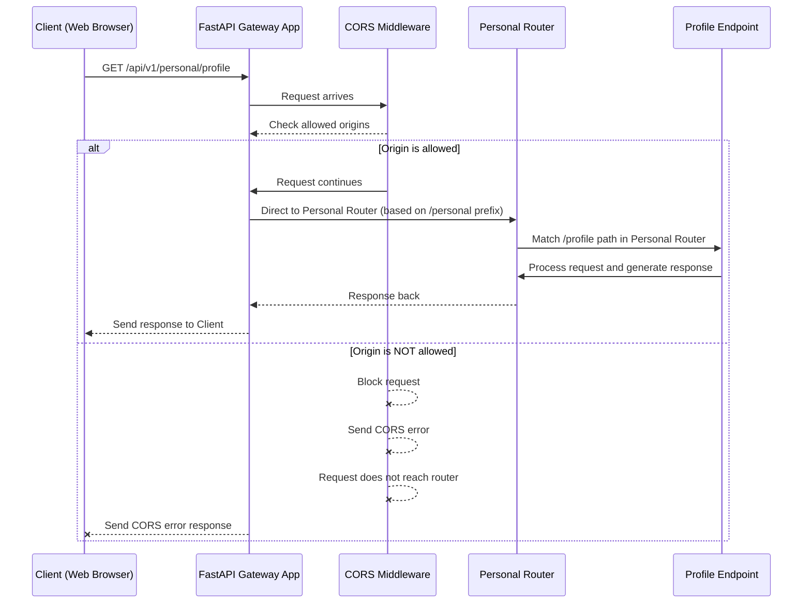

# Chapter 1: FastAPI Gateway Application

Welcome to the exciting world of API Gateways! In this first chapter, we'll dive into the heart of our `api_gateway` project: the "FastAPI Gateway Application" itself. Think of it as the central control room of a very busy and important train station.

### Why Do We Need a Control Room?

Imagine you're trying to send a letter, but instead of one post office, there are dozens, each handling a different type of mail (local, international, packages, etc.). It would be very confusing to know where to send your letter!

An API Gateway solves this problem for web applications. Our `api_gateway` acts as a single, friendly entry point for all client requests. Whether a user wants to:

*   Fetch their profile information.
*   Ask an AI a question.
*   Log in to the system.

...they always send their request to *our API Gateway*. This "control room" then knows exactly where to direct that request, apply any necessary rules, and make sure everything runs smoothly. Without it, clients would have to know about many different services, making the system complex and harder to manage.

Our goal in this chapter is to understand how this main control room, built with FastAPI, starts up, sets its rules, and gets ready to direct traffic.

### The Brains of the Operation: `app/main.py`

The core of our FastAPI Gateway Application lives in a file named `app/main.py`. This file is like the blueprint for our control room. It defines:

1.  **How the service starts and stops:** Like the station's opening and closing procedures.
2.  **Global rules:** Such as who is allowed to enter the station (security checks).
3.  **How to direct requests:** Guiding each train (request) to its correct platform (API endpoint).

Let's look at the very first part of our `app/main.py` file:

```python
# app/main.py
# ... (imports) ...

from fastapi import FastAPI

# This is where we create our main API application!
app = FastAPI(
    title="ITAPIA API Service",
    description="API Gateway for the ITAPIA system, serving data and coordinating AI tasks.",
    version="1.0.0",
    # lifespan=lifespan, # We'll talk about this soon!
)
```

Here, `app = FastAPI(...)` is the magic line. It creates our entire API Gateway application. `FastAPI` is a modern, fast web framework for building APIs with Python. We give it a `title`, `description`, and `version` to make it easy to understand what our API does.

### Setting Up Global Rules: CORS Middleware

Before any request gets processed, our control room needs to apply some global rules. One of the most important is called **CORS** (Cross-Origin Resource Sharing).

Imagine our train station needs to decide which external companies are allowed to operate their trains on our tracks. CORS does something similar for web browsers. It dictates which websites (called "origins") are allowed to make requests to our API. This is a crucial security measure.

Our API Gateway uses `CORSMiddleware` to enforce these rules:

```python
# app/main.py
# ... (after FastAPI app creation) ...

from fastapi.middleware.cors import CORSMiddleware
from app.core.config import GATEWAY_ALLOW_ORIGINS # Import from Configuration Management

# Define the list of allowed origins (frontend sources)
origins = GATEWAY_ALLOW_ORIGINS # This comes from our configuration!

# Add CORS middleware to the FastAPI application
app.add_middleware(
    CORSMiddleware,
    allow_origins=origins,       # Only these websites can talk to us
    allow_credentials=True,      # Allow sending cookies (important for login)
    allow_methods=["*"],         # Allow all actions (GET, POST, etc.)
    allow_headers=["*"],         # Allow all types of information in the request header
)
```

This code snippet adds a "middleware" to our application. A middleware is like a security checkpoint that every incoming request passes through *before* it reaches the specific part of our API that handles it. The `origins` list comes from our [Configuration Management](06_configuration_management_.md) and specifies which front-end applications (like a web browser running your user interface) are allowed to communicate with our API Gateway.

### Directing Traffic: Including Routers

Once the global rules are applied, the next job of our control room is to direct the incoming request to the right handler. In FastAPI, we do this using "routers." Each router is like a dedicated section of our train station that handles specific types of trains (requests).

For example, all requests related to `users` might go to the "users router," and all requests related to `profiles` might go to the "profiles router."

```python
# app/main.py
# ... (after CORS middleware) ...

from app.api.v1.endpoints import users, profiles, auth # ... and many more

# The base route for all our API endpoints
from app.core.config import GATEWAY_V1_BASE_ROUTE

# Include routers from all endpoint modules
app.include_router(users.router, prefix=GATEWAY_V1_BASE_ROUTE)
app.include_router(profiles.router, prefix=GATEWAY_V1_BASE_ROUTE)
app.include_router(auth.router, prefix=GATEWAY_V1_BASE_ROUTE)
# ... many more routers for different services ...
```

The `app.include_router()` line tells our main application, "Hey, when you get a request that matches paths defined in `users.router` (like `/users`), send it there!" The `prefix=GATEWAY_V1_BASE_ROUTE` adds a common starting part to all these routes, typically `/api/v1`, so our URLs look clean (e.g., `/api/v1/users` instead of just `/users`). We'll dive much deeper into what these routers contain in [Chapter 2: API Endpoints](02_api_endpoints_.md).

### Application Lifespan: Opening and Closing Procedures

Just like a train station has opening and closing procedures, our API Gateway needs to perform tasks when it starts up and when it shuts down. This is managed by the `lifespan` function.

```python
# app/main.py
# ... (imports for lifespan) ...
from contextlib import asynccontextmanager
from app.clients.ai_quick_advisor import ai_quick_advisor_client
from app.clients.ai_quick_analysis import ai_quick_analysis_client
from app.clients.ai_rules import ai_rules_client

@asynccontextmanager
async def lifespan(app: FastAPI):
    """
    Application lifespan manager.
    Initializes and cleans up resources (like connecting to other AI services).
    """
    # Code executed when the application starts
    # Reuse clients to open connection pools
    async with ai_quick_analysis_client:
        async with ai_quick_advisor_client:
            async with ai_rules_client:
                yield # Application is now ready to receive requests

    # Code executed when the application is shutting down
    # (Clients will be closed automatically when exiting 'async with')
```

The `lifespan` function, marked with `@asynccontextmanager`, runs code when the application starts and when it stops. In our case, when the Gateway starts, it establishes connections to various [AI Service Clients](05_ai_service_clients_.md). This is important because it sets up these connections once, at the beginning, making future requests much faster. The `yield` keyword signifies the point where the application is fully running and ready to serve requests.

Remember, this `lifespan` function is connected to our `FastAPI` app like this:

```python
# app/main.py
app = FastAPI(
    title="ITAPIA API Service",
    # ... other settings ...
    lifespan=lifespan, # This connects our lifespan function!
)
```

### How a Request Flows Through the Gateway

Let's imagine a user's web browser wants to get information about their profile. It sends a request like `GET /api/v1/personal/profile`. Here's what happens inside our "FastAPI Gateway Application" control room:



1.  **Client Request:** Your web browser sends a `GET` request to `/api/v1/personal/profile`.
2.  **FastAPI Gateway App Receives:** Our `app` instance in `main.py` is the first to receive this request.
3.  **CORS Middleware Check:** The request immediately passes through the `CORSMiddleware`. It checks if the website (`origin`) making the request is in our `GATEWAY_ALLOW_ORIGINS` list. If not, it blocks the request with a security error.
4.  **Router Direction:** If allowed, the `FastAPI` app looks at its registered routers. It sees `app.include_router(personal.router, prefix=GATEWAY_V1_BASE_ROUTE)` and recognizes that `/api/v1/personal` part of the URL matches this router's prefix.
5.  **Endpoint Handling:** The request is then passed to the `personal.router`. Inside this router, there's a specific "endpoint" designed to handle `GET /profile` requests. This endpoint does the actual work (like fetching profile data from a database or another service).
6.  **Response:** The endpoint generates a response, which travels back through the router, then through the main FastAPI app, and finally to the client.

### Configuration Management: The Secret Sauce

You might have noticed that `GATEWAY_ALLOW_ORIGINS` and `GATEWAY_V1_BASE_ROUTE` come from `app.core.config`. This file (which we'll explore in [Chapter 6: Configuration Management](06_configuration_management_.md)) is vital for keeping our application flexible.

```python
# app/core/config.py
# ... (imports) ...

from dotenv import load_dotenv

# Load environment variables from a .env file
# This allows us to change settings without changing code!
env_path = Path(__file__).parent.parent.parent.parent / ".env"
load_dotenv(dotenv_path=env_path)

# API Configuration
GATEWAY_V1_BASE_ROUTE = os.getenv("GATEWAY_V1_BASE_ROUTE", "/api/v1")
GATEWAY_ALLOW_ORIGINS = os.getenv("GATEWAY_ALLOW_ORIGINS", "").split(",")

# ... other configurations ...
```

This `config.py` file loads settings from an `.env` file (a simple text file for storing configuration). This means we can change things like the allowed origins or the base API route *without* touching our Python code in `main.py`. It's like having a separate settings panel for our control room!

### Conclusion

In this chapter, we've taken our first steps into understanding the "FastAPI Gateway Application." We learned that `app/main.py` is the central hub where:

*   The FastAPI application is initialized.
*   Global rules like CORS are applied to ensure security.
*   Incoming requests are directed to the correct handling parts (routers).
*   Application startup/shutdown procedures (lifespan) are managed.

This control room sets the stage for every interaction with our API. It's the foundation upon which all our other services are built and coordinated.

Now that we understand how the main application is set up and how it directs traffic, let's zoom in on the specific "platforms" or handlers that process these requests.

[Next Chapter: API Endpoints](02_api_endpoints_.md)

---

Generated by [AI Codebase Knowledge Builder](https://github.com/The-Pocket/Tutorial-Codebase-Knowledge)