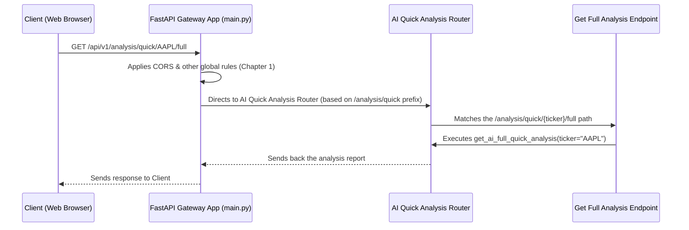

# Chapter 2: API Endpoints

Welcome back! In our last chapter, [FastAPI Gateway Application](01_fastapi_gateway_application_.md), we learned that our `api_gateway` is like the central control room of a bustling train station. It's the first place all incoming requests arrive, and it has global rules like security checks (CORS middleware) and procedures for starting and stopping.

Now, imagine you're at that control room. You know your train (request) has arrived at the station, but where do you go next? Do you need a ticket? Do you want to check your luggage? Or are you looking for information? You wouldn't go to the same counter for all these tasks, right?

### What is an API Endpoint? The Specific Doors

This is where **API Endpoints** come in!

**API Endpoints are the specific "doors" or "counters" within our API Gateway through which clients can send requests to perform different tasks.** Each endpoint is like a dedicated counter designed for a different purpose.

Think of it this way:

*   **Ticket Counter:** For buying tickets (`GET /tickets`, `POST /tickets`).
*   **Luggage Check-in:** For dropping off luggage (`POST /luggage`).
*   **Information Desk:** For asking questions (`GET /information`).

In our `api_gateway` project, each file like `ai_quick_analysis.py` or `profiles.py` groups related "counters" (endpoints). This keeps our API organized and easy for other applications to understand and use.

### Our Goal: Getting a Market Analysis Report

Let's imagine a concrete use case: A user wants to get a "full market analysis report" for a specific stock, like Apple (AAPL). How does our API Gateway provide this? It uses a specific API Endpoint!

A client (like a web browser) needs to know *exactly* which "door" to approach and *what kind* of request to make.

### Anatomy of an API Endpoint

An API endpoint has two main parts:

1.  **A URL Path:** This is the specific address, like `/analysis/quick/AAPL/full`.
2.  **An HTTP Method:** This describes the *type* of action you want to perform, like `GET` (to retrieve information) or `POST` (to send information).

Let's look at an example from our project:

```python
# app/api/v1/endpoints/ai_quick_analysis.py

from fastapi import APIRouter
# ... other imports ...

router = APIRouter() # This creates a group of related endpoints

@router.get( # This defines a GET endpoint
    "/analysis/quick/{ticker}/full", # The URL path with a placeholder!
    tags=["AI Quick Analysis"],
    summary="Get full market analysis report from AI Quick Service",
)
async def get_ai_full_quick_analysis(ticker: str):
    """
    Handles requests to get a full market analysis report.
    """
    # In a real scenario, this would talk to an AI service to get the report.
    # For now, let's imagine it does the work and returns something.
    print(f"Generating full analysis for stock ticker: {ticker}")
    return {"ticker": ticker, "report_status": "Analysis completed!"}

```

Let's break down this code:

*   **`router = APIRouter()`**: In FastAPI, an `APIRouter` is like a small, self-contained mini-application that handles a specific set of related endpoints. We group all our AI Quick Analysis endpoints inside this router.
*   **`@router.get(...)`**: This is a special decorator in Python. It tells FastAPI that the function right below it (`get_ai_full_quick_analysis`) should be called when a `GET` request comes in for the specified URL path.
    *   **`"/analysis/quick/{ticker}/full"`**: This is the important URL path. The curly braces `{ticker}` mean that "ticker" is a **path parameter**. It's a placeholder for a value that will be part of the URL, like `AAPL` or `MSFT`.
    *   **`tags=["AI Quick Analysis"]`**: This helps organize our API documentation.
    *   **`summary="..."`**: A short description for our API documentation.
*   **`async def get_ai_full_quick_analysis(ticker: str):`**: This is the Python function that "does the work" for this endpoint.
    *   Notice `ticker: str` here. FastAPI automatically takes the value from the `{ticker}` part of the URL path and passes it to this function!

### How to Use This Endpoint (Conceptually)

If a client wants to get the full market analysis for **Google (GOOGL)**, they would send a `GET` request to:

`YOUR_GATEWAY_ADDRESS/api/v1/analysis/quick/GOOGL/full`

Where `YOUR_GATEWAY_ADDRESS` is where your `api_gateway` is running (e.g., `http://localhost:8000`).

The `api_gateway` will receive this request, route it to this specific endpoint, and the `get_ai_full_quick_analysis` function will be called with `ticker="GOOGL"`.

### Diving Deeper: Path Parameters vs. Query Parameters

Endpoints can get data from the URL in a couple of ways:

1.  **Path Parameters:** These are essential parts of the URL that identify *what* resource you're asking for. They appear in the path like `{ticker}`.
    *   Example: `/analysis/quick/AAPL/full` (`AAPL` is the path parameter).

2.  **Query Parameters:** These are optional additions to the URL, usually used for filtering, pagination, or other settings. They come after a `?` in the URL, like `?limit=10`.

Let's look at another endpoint that uses both:

```python
# From app/api/v1/endpoints/ai_quick_advisor.py

from fastapi import APIRouter
# ... other imports ...

router = APIRouter()

@router.post( # This defines a POST endpoint
    "/advisor/quick/{ticker}/full",
    tags=["AI Quick Advisor"],
    summary="Get full advisor report from AI Quick Service",
)
async def get_ai_full_quick_advisor(
    ticker: str,         # This is a PATH parameter
    limit: int = 10      # This is a QUERY parameter (optional, defaults to 10)
    # ... (there might be more complex request body data here, but we'll simplify)
):
    """
    Get full advisor report from AI Quick Service.
    """
    print(f"Advisor report for {ticker} with a limit of {limit} rules.")
    return {"ticker": ticker, "limit": limit, "message": "Advisor report generated"}

```

Here:
*   `ticker: str` is a **path parameter**. It's part of the core URL (`/advisor/quick/MSFT/full`).
*   `limit: int = 10` is a **query parameter**. If you don't provide it, it defaults to `10`. You can provide it like: `/api/v1/advisor/quick/MSFT/full?limit=5`.

### How a Request Reaches an Endpoint: The Journey

Let's trace how a `GET /api/v1/analysis/quick/AAPL/full` request flows from a client to our specific endpoint:



1.  **Client Sends Request:** Your web browser (the Client) sends a `GET` request to `YOUR_GATEWAY_ADDRESS/api/v1/analysis/quick/AAPL/full`.
2.  **Gateway Receives:** Our `FastAPI Gateway App` (`app` in `app/main.py`) receives this request first.
3.  **Global Rules:** It applies any global rules, like the CORS middleware (as discussed in [Chapter 1: FastAPI Gateway Application](01_fastapi_gateway_application_.md)).
4.  **Router Direction:** The main `FastAPI` application looks at all the routers it has included. It sees that `app.include_router(ai_quick_analysis.router, prefix=GATEWAY_V1_BASE_ROUTE)` is responsible for paths starting with `/api/v1/analysis/quick`. So, it directs the request to the `ai_quick_analysis.router`.
5.  **Endpoint Matching:** Inside the `ai_quick_analysis.router`, FastAPI finds the specific endpoint (`@router.get("/analysis/quick/{ticker}/full")`) that matches the request's method (`GET`) and path.
6.  **Function Execution:** The `get_ai_full_quick_analysis` function is called, and `AAPL` is passed as the `ticker` argument. This function then performs its specific task.
7.  **Response:** The function's return value is automatically converted into a JSON response by FastAPI and sent back through the gateway to the client.

### How Routers are Included (Connecting the Doors to the Station)

You saw in [Chapter 1: FastAPI Gateway Application](01_fastapi_gateway_application_.md) that `app.include_router()` lines connect our individual router files to the main application. This is how the main gateway knows about all its specific "doors."

```python
# app/main.py (Simplified)

from fastapi import FastAPI
from app.api.v1.endpoints import ai_quick_analysis # Import our specific router file
from app.core.config import GATEWAY_V1_BASE_ROUTE # From Configuration Management

app = FastAPI(...) # Our main FastAPI application

# ... CORS middleware setup ...

# Include routers from all endpoint modules
app.include_router(ai_quick_analysis.router, prefix=GATEWAY_V1_BASE_ROUTE)
# app.include_router(users.router, prefix=GATEWAY_V1_BASE_ROUTE)
# app.include_router(profiles.router, prefix=GATEWAY_V1_BASE_ROUTE)
# ... many more routers ...

```

Here:
*   We `import ai_quick_analysis` which, behind the scenes, creates an `APIRouter` instance named `router` inside that file.
*   `app.include_router(ai_quick_analysis.router, ...)` adds all the endpoints defined in `ai_quick_analysis.py` to our main API Gateway. The `prefix=GATEWAY_V1_BASE_ROUTE` ensures all these endpoints start with `/api/v1`, making our URLs consistent.

This structure allows us to keep our code organized. All endpoints related to AI Quick Analysis are in one file, all user-related endpoints in another, and so on.

### Conclusion

In this chapter, we explored the crucial concept of **API Endpoints**. We learned that they are the specific URL paths and HTTP methods that define individual actions our API Gateway can perform. They are like dedicated "doors" or "counters" that organize our API's functionalities.

We saw how:
*   `APIRouter` helps group related endpoints.
*   `@router.get` and `@router.post` decorators define an endpoint's method and path.
*   Path parameters and query parameters allow us to send dynamic data with our requests.
*   The main `FastAPI` application connects these routers to create a complete, navigable API.

Now that we understand where requests go, the next logical step is to understand *who* is allowed to access these doors. Not everyone should be able to get sensitive information or make changes!

[Next Chapter: Authentication & Authorization](03_authentication___authorization_.md)

---

Generated by [AI Codebase Knowledge Builder](https://github.com/The-Pocket/Tutorial-Codebase-Knowledge)