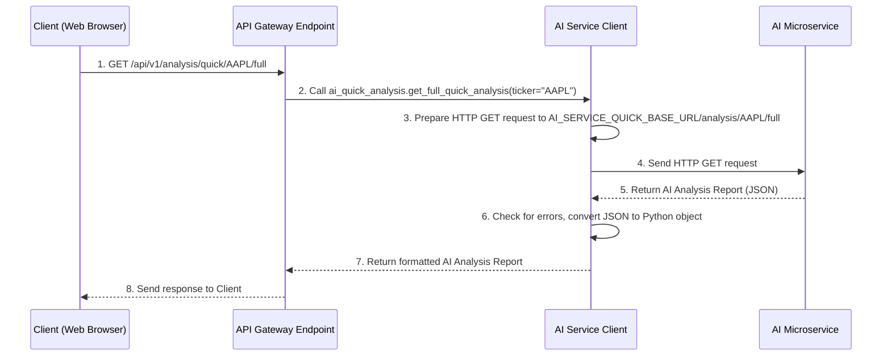

# Chapter 5: AI Service Clients

Welcome back! In our last chapter, [User and Profile Management Services](04_user_and_profile_management_services_.md), we explored how our API Gateway manages essential user information and their personalized investment profiles. We learned how users log in, and how their data is securely stored and retrieved.

Now, imagine that a user, after setting up their investment profile, wants to ask a super-smart AI assistant for advice or a deep market analysis. Our API Gateway is a central hub, but it doesn't *do* the AI analysis itself. Instead, it relies on specialized external AI microservices (smaller, independent applications) for that heavy lifting.

### The Dedicated Liaisons: What Problem Do We Solve?

Think of our API Gateway as the main headquarters of a large company. Different departments (our API Endpoints) handle various tasks. When one department needs expert advice or a specific report from an external specialist firm (an AI microservice), they don't all call that firm directly. That would be chaotic!

Instead, the company has **dedicated liaisons or specialized messengers** whose job it is to know exactly how to talk to each external specialist. These liaisons handle all the communication details: finding the right contact, speaking their language, sending the requests, waiting for replies, and dealing with any misunderstandings.

In our `api_gateway` project, **AI Service Clients** are these dedicated liaisons. They are specialized modules responsible for communicating with external AI microservices. They abstract away the complex details of sending requests and receiving responses, allowing our API Gateway to focus on its primary role of directing traffic and securing access.

**Our central use case for this chapter:** A user wants to get a "Full Market Analysis Report" for a specific stock (e.g., `AAPL`) from an external "AI Quick Analysis" microservice. How does our API Gateway efficiently and reliably get this information?

### Key Concepts: Specialized Messengers for AI Services

1.  **Specialized Modules:** Each AI Service Client is typically a Python file (e.g., `ai_quick_analysis.py`) dedicated to interacting with *one* specific AI microservice.
2.  **`httpx.AsyncClient`:** We use `httpx.AsyncClient` to make HTTP requests. The `Async` part means these clients can send requests and wait for responses without blocking our Gateway, making it very efficient. Crucially, we create these clients once and reuse them for many requests. This helps maintain a "connection pool," meaning connections to the AI services are kept open and ready, making subsequent requests much faster.
3.  **Request & Response Handling:** These clients know:
    *   The correct URL for the AI service.
    *   How to format the request (e.g., `GET`, `POST`, what parameters to send).
    *   How to interpret the response (e.g., convert JSON into Python objects).
    *   How to handle errors (e.g., if the AI service is down or sends back an error).

### Solving Our Use Case: Getting a Full Market Analysis

Let's see how an API Endpoint in our Gateway uses an AI Service Client to get a full market analysis.

First, recall our `ai_quick_analysis` endpoint from [Chapter 2: API Endpoints](02_api_endpoints_.md). It's the "door" for users to request market analysis:

```python
# app/api/v1/endpoints/ai_quick_analysis.py (Simplified)

from fastapi import APIRouter
from app.clients import ai_quick_analysis # This is our AI Service Client!
from itapia_common.schemas.api.analysis import QuickCheckReportResponse

router = APIRouter()

@router.get(
    "/analysis/quick/{ticker}/full",
    response_model=QuickCheckReportResponse,
    tags=["AI Quick Analysis"],
    summary="Get full market analysis report from AI Quick Service",
)
async def get_ai_full_quick_analysis(ticker: str):
    """
    Handles requests to get a full market analysis report.
    This endpoint calls our AI Service Client to do the actual work.
    """
    # *** THIS IS WHERE WE USE THE AI SERVICE CLIENT! ***
    report = await ai_quick_analysis.get_full_quick_analysis(ticker=ticker)
    return report

```

**Explanation:**
*   **`from app.clients import ai_quick_analysis`**: This line imports our specialized messenger for the "AI Quick Analysis" service.
*   **`report = await ai_quick_analysis.get_full_quick_analysis(ticker=ticker)`**: This is the core line! Instead of writing complex HTTP request logic here, the endpoint simply calls a function on our `ai_quick_analysis` client. It passes the `ticker` (like `AAPL`), and the client handles all the communication with the external AI service.
*   **`await`**: Because `httpx.AsyncClient` works asynchronously, we use `await` to tell our program to "wait here until the AI service client finishes its job, but don't stop the whole Gateway; go do other tasks in the meantime."

If a user sends a `GET /api/v1/analysis/quick/AAPL/full` request, this endpoint will call the `ai_quick_analysis` client, which will then talk to the external AI service, get the report for `AAPL`, and return it to the user.

### What Happens Under the Hood? (Internal Implementation)

Let's trace the journey of a request for a market analysis report:



1.  **Client Request:** A user's web browser (`C`) sends a `GET` request to our API Gateway Endpoint (`AG_E`) asking for a full analysis of `AAPL`.
2.  **Endpoint Calls Client:** The `get_ai_full_quick_analysis` endpoint in `app/api/v1/endpoints/ai_quick_analysis.py` calls `ai_quick_analysis.get_full_quick_analysis()`, passing `ticker="AAPL"`.
3.  **Client Prepares Request:** Inside `app/clients/ai_quick_analysis.py`, the client function uses its `httpx.AsyncClient` instance to prepare an actual HTTP request to the external AI microservice. It constructs the full URL using `AI_SERVICE_QUICK_BASE_URL` (from [Configuration Management](06_configuration_management_.md)).
4.  **Client Sends Request to AI Microservice:** The `httpx.AsyncClient` sends this `GET` request to the "AI Quick Analysis" microservice (`AIM`).
5.  **AI Microservice Responds:** The AI microservice processes the request and sends back a JSON response containing the analysis report.
6.  **Client Handles Response:** Our `ai_quick_analysis` client receives the response. It checks for HTTP errors (`raise_for_status()`) and then parses the JSON into a structured Python object using `QuickCheckReportResponse.model_validate(response.json())`.
7.  **Client Returns Data to Endpoint:** The formatted Python object is returned to our Gateway's API Endpoint.
8.  **Endpoint Returns Data to Client:** The Gateway endpoint then sends this report back to the user's web browser as the final response.

#### Diving into the AI Service Client Code (`app/clients/ai_quick_analysis.py`)

Let's look at how one of these specialized messengers is built:

```python
# app/clients/ai_quick_analysis.py (Simplified)

import httpx
from app.core.config import AI_SERVICE_QUICK_BASE_URL # Where our AI service lives
from fastapi import HTTPException
from itapia_common.schemas.api.analysis import QuickCheckReportResponse # Expected format

# 1. Create a reusable HTTP client instance
ai_quick_analysis_client = httpx.AsyncClient(
    base_url=AI_SERVICE_QUICK_BASE_URL, timeout=30.0
)

async def get_full_quick_analysis(
    ticker: str,
    # ... other optional parameters ...
) -> QuickCheckReportResponse:
    try:
        print(f"Calling AI service for: {ticker} at {ai_quick_analysis_client.base_url}/analysis/{ticker}/full")
        # 2. Send the actual HTTP request
        response = await ai_quick_analysis_client.get(
            f"/analysis/{ticker}/full",
            # params={...} if there were query parameters
        )
        response.raise_for_status() # 3. Check for HTTP errors (e.g., 404, 500)
        # 4. Parse the JSON response into a structured Python object
        return QuickCheckReportResponse.model_validate(response.json())
    except httpx.HTTPStatusError as e:
        # 5. Handle errors from the AI service itself
        detail = e.response.json().get("detail") or "Unknown error from AI Service"
        raise HTTPException(status_code=e.response.status_code, detail=detail)
    except httpx.RequestError as e:
        # 6. Handle connection errors (e.g., AI service is unreachable)
        raise HTTPException(
            status_code=503, detail=f"AI Service is unavailable: {type(e).__name__}"
        )

```

**Explanation:**
1.  **`ai_quick_analysis_client = httpx.AsyncClient(...)`**: This creates our persistent `httpx` client. We define its `base_url` (where the AI service is located, coming from [Configuration Management](06_configuration_management_.md)) and a `timeout` so we don't wait forever for a response.
2.  **`await ai_quick_analysis_client.get(...)`**: This line uses the configured client to send an HTTP `GET` request. The `f-string` builds the specific path to the AI service's endpoint (e.g., `/analysis/AAPL/full`).
3.  **`response.raise_for_status()`**: This is a powerful `httpx` feature. If the AI service responds with an HTTP status code indicating an error (e.g., 4xx or 5xx), this line will immediately raise an `httpx.HTTPStatusError`.
4.  **`QuickCheckReportResponse.model_validate(response.json())`**: If the request was successful, the response body (which is JSON) is parsed into a Python dictionary (`response.json()`), and then validated against our `QuickCheckReportResponse` schema (a predefined structure for the report data). This ensures we get the data in the expected format.
5.  **`except httpx.HTTPStatusError`**: This block catches errors where the AI service *responded* but indicated an error (e.g., "invalid ticker"). We extract the error message from the AI service's response and re-raise it as an `HTTPException` that FastAPI understands.
6.  **`except httpx.RequestError`**: This block catches errors where we couldn't even connect to the AI service (e.g., the AI service is offline). We return a `503 Service Unavailable` error.

Other AI Service Clients, like `app/clients/ai_quick_advisor.py` and `app/clients/ai_rules.py`, follow a similar pattern, each tailored to the specific endpoints and data formats of their respective AI microservices.

#### Initializing Clients in the Lifespan Function

For optimal performance, our `httpx.AsyncClient` instances are created once when the `api_gateway` starts up and properly closed when it shuts down. This is managed by the `lifespan` function, which we briefly touched on in [Chapter 1: FastAPI Gateway Application](01_fastapi_gateway_application_.md).

```python
# app/main.py (Simplified)

from contextlib import asynccontextmanager
from app.clients.ai_quick_advisor import ai_quick_advisor_client
from app.clients.ai_quick_analysis import ai_quick_analysis_client
from app.clients.ai_rules import ai_rules_client
from fastapi import FastAPI

@asynccontextmanager
async def lifespan(app: FastAPI):
    """
    Application lifespan manager.
    Initializes and cleans up resources (like connecting to other AI services).
    """
    # Code executed when the application starts
    # Reuse clients to open connection pools
    async with ai_quick_analysis_client:
        async with ai_quick_advisor_client:
            async with ai_rules_client:
                yield # Application is now ready to receive requests

    # Code executed when the application is shutting down
    # (Clients will be closed automatically when exiting 'async with')

app = FastAPI(
    # ... other settings ...
    lifespan=lifespan, # Connects our lifespan function!
)
```

**Explanation:**
*   **`async with ai_quick_analysis_client:`**: This syntax ensures that `ai_quick_analysis_client` (and others) are properly initialized (e.g., opening connection pools) when the Gateway starts.
*   **`yield`**: This keyword indicates that the application is now fully running and ready to accept requests.
*   When the Gateway shuts down, the `async with` blocks will automatically ensure the clients release their resources cleanly. This prevents resource leaks and ensures efficient operation.

### Configuration Management: Knowing Where to Send Messages

The `base_url` for each AI microservice client (like `AI_SERVICE_QUICK_BASE_URL`) comes from our [Configuration Management](06_configuration_management_.md). This is crucial because it means we can change the address of an AI service without modifying our code. If an AI service moves to a different server or port, we just update an environment variable!

```python
# app/core/config.py (Snippet)

import os
# ... imports ...

# Client Configuration
AI_SERVICE_QUICK_HOST = os.getenv("AI_QUICK_HOST", "localhost")
AI_SERVICE_QUICK_PORT = os.getenv("AI_QUICK_PORT", 8000)
AI_SERVICE_QUICK_V1_BASE_ROUTE = os.getenv("AI_QUICK_V1_BASE_ROUTE", "/api/v1")

# The full URL constructed from environment variables
AI_SERVICE_QUICK_BASE_URL = f"http://{AI_SERVICE_QUICK_HOST}:{AI_SERVICE_QUICK_PORT}{AI_SERVICE_QUICK_V1_BASE_ROUTE}"

# ... other configurations ...
```

This configuration ensures that our AI Service Clients always know where to find their respective AI microservices without hardcoding the addresses.

### Conclusion

In this chapter, we've learned about **AI Service Clients**, the dedicated "liaisons" that enable our `api_gateway` to communicate effectively with external AI microservices. We discovered:

*   They are specialized modules that abstract away the complexity of making HTTP requests.
*   They use `httpx.AsyncClient` for efficient, asynchronous communication.
*   They handle request preparation, response parsing, and robust error management.
*   They are initialized once during the application's `lifespan` for optimal performance.
*   Their target AI service URLs are managed through [Configuration Management](06_configuration_management_.md) for flexibility.

This design keeps our API Gateway clean and focused, letting it orchestrate user requests while delegating complex AI tasks to specialized external services, all coordinated by our reliable AI Service Clients.

Now that we understand how different parts of our Gateway talk to each other and to external services, let's dive deeper into how all these crucial settings and addresses are managed.

[Next Chapter: Configuration Management](06_configuration_management_.md)

---

Generated by [AI Codebase Knowledge Builder](https://github.com/The-Pocket/Tutorial-Codebase-Knowledge)