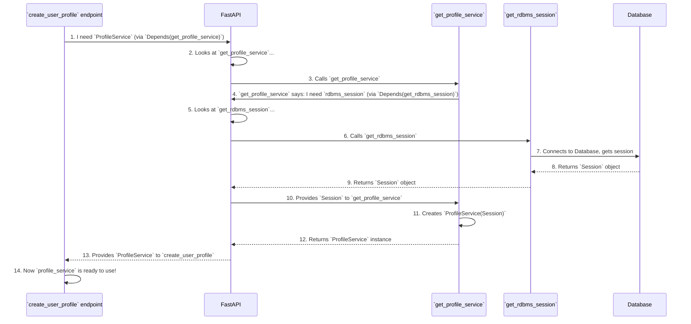

# Chapter 7: Dependency Injection

Welcome back! In our last chapter, [Configuration Management](06_configuration_management_.md), we learned how our `api_gateway` centrally manages all its crucial settings and external addresses. We saw that our application needs to know *where* to find AI services or *what* secret key to use for security.

Now, imagine our API Gateway is like a busy chef in a restaurant kitchen. The chef (our code) needs various tools and ingredients (like a knife, a cutting board, a fresh tomato, or a database connection) to prepare a dish (handle a request).

Would it be efficient for the chef to stop cooking, run to the store to buy a new knife, or personally pick tomatoes from a farm every single time they need one? No! A good kitchen has assistants who automatically place the right tools and ingredients right at the chef's fingertips, exactly when needed.

### The Helpful Assistant: What Problem Do We Solve?

This is exactly what **Dependency Injection** (often shortened to DI) does for our `api_gateway` application.

**Dependency Injection is like having a helpful assistant who automatically provides your functions with the right tools or information exactly when they need them.**

Instead of a function having to figure out how to:
*   Open a new database connection for every single request.
*   Create a new instance of a "Profile Service" to manage user profiles.
*   Go and verify a user's login token.

...it just declares what it needs. FastAPI, our "helpful assistant," then "injects" (provides) the correct, pre-configured instances or data into your functions.

This makes our code:
*   **Cleaner:** Functions focus on *what* they do, not *how* to get their tools.
*   **More Modular:** Each part of the code is independent and easier to understand.
*   **Easier to Test:** We can easily swap out a "real" database connection for a "fake" one during testing, for example.

**Our central use case for this chapter:** How does an API endpoint like `create_user_profile` (from [Chapter 4: User and Profile Management Services](04_user_and_profile_management_services_.md)) get a `ProfileService` and the `current_user` object without creating them itself?

### Key Concepts: Your Toolkit for Injection

1.  **Dependency:** Anything a piece of code needs to do its job. For example, our `ProfileService` needs a database session. Our `create_user_profile` endpoint needs an authenticated user and a `ProfileService`.
2.  **`Depends()`:** This is FastAPI's magical function. When you use `Depends()` in your function's signature, you're telling FastAPI, "Hey, I need *this* (the thing inside `Depends()`), please provide it to me."
3.  **Injecting:** The act of FastAPI automatically providing the required dependency to your function.
4.  **"Providers" or "Dependables":** These are the functions that FastAPI calls to "provide" the dependency. They know how to create, configure, or fetch the required tool/data.

### How to Use It: Declaring Your Needs with `Depends()`

Let's look at an example from our `app/api/v1/endpoints/profiles.py` file, where an endpoint needs a `ProfileService` and the `current_user` information.

```python
# app/api/v1/endpoints/profiles.py (Simplified)

from fastapi import APIRouter, Depends, status
# ... other imports ...
from app.dependencies import get_current_user_dep, get_profile_service # Our dependency providers!
from app.services.profiles import ProfileService
from itapia_common.schemas.entities.users import UserEntity

router = APIRouter()

@router.post("/profiles", ...)
def create_user_profile(
    profile_in: ProfileCreateRequest,
    # This function needs a ProfileService. FastAPI will call get_profile_service to provide it.
    profile_service: ProfileService = Depends(get_profile_service),
    # This function also needs the currently logged-in user. FastAPI will call get_current_user_dep.
    current_user: UserEntity = Depends(get_current_user_dep),
):
    """
    Handles creating a new investment profile.
    Only the logged-in user can create a profile for themselves.
    """
    # Now, `profile_service` and `current_user` are ready to be used!
    created_profile = profile_service.create_profile(
        profile_in=ProfileCreate.model_validate(profile_in.model_dump()),
        user_id=current_user.user_id, # We use the user_id from the injected current_user
    )
    return created_profile
```

**Explanation:**
*   `profile_service: ProfileService = Depends(get_profile_service)`: Here, we tell FastAPI that our `create_user_profile` function needs an object of type `ProfileService`. We also tell it *how* to get one: by calling the `get_profile_service` function. FastAPI takes care of calling `get_profile_service` and then passes the resulting `ProfileService` instance to our `profile_service` variable.
*   `current_user: UserEntity = Depends(get_current_user_dep)`: Similarly, we need the `UserEntity` of the person making the request. We declare this, and FastAPI calls `get_current_user_dep` (which we discussed in [Chapter 3: Authentication & Authorization](03_authentication___authorization_.md)) to provide the authenticated user object.

Our `create_user_profile` function doesn't have to worry about the details of how `ProfileService` or `current_user` are created or fetched. It just declares its needs, and FastAPI's Dependency Injection system handles the rest.

### What Happens Under the Hood? The Injection Process

Let's trace how FastAPI resolves these "requests" for tools and ingredients. Consider `profile_service: ProfileService = Depends(get_profile_service)`.

The `get_profile_service` function itself might need *another* tool: a database session!

```python
# app/dependencies.py (Simplified)

from fastapi import Depends
from sqlalchemy.orm import Session
from itapia_common.dblib.session import get_rdbms_session # Provides a database session!

from .services.profiles import ProfileService

# This function provides an instance of our ProfileService
def get_profile_service(
    # To create a ProfileService, we first need a database session.
    # FastAPI will call get_rdbms_session to provide it.
    rdbms_session: Session = Depends(get_rdbms_session),
) -> ProfileService:
    # Once we have the session, we create and return the ProfileService.
    return ProfileService(rdbms_session)

# The function that knows how to get a database session ready.
# In a real app, this would set up connection pools, etc.
def get_rdbms_session():
    # Imagine this function connects to the database and provides a session.
    # We'll learn more about database interaction in advanced chapters.
    # For now, just know it gives us `Session` object.
    db_session = "DATABASE_SESSION_OBJECT_HERE" # Placeholder for actual session
    try:
        yield db_session # Provides the session
    finally:
        # Code here would close the session cleanly after use.
        pass # Simplified for tutorial
```

**Explanation:**
*   `get_profile_service` is itself a "provider" or "dependable" function. It takes `rdbms_session: Session = Depends(get_rdbms_session)`. This means that *before* `get_profile_service` can run, FastAPI first needs to call `get_rdbms_session` to get a database session.
*   `get_rdbms_session` is the lowest-level provider here, directly yielding a database `Session` object.

Here's the full flow for getting the `ProfileService` into our endpoint:



**Step-by-step breakdown:**

1.  **Endpoint Request:** When an HTTP request comes in for `/profiles`, FastAPI sees that the `create_user_profile` endpoint needs a `ProfileService` (via `Depends(get_profile_service)`).
2.  **FastAPI Checks Dependencies:** FastAPI goes to call `get_profile_service`.
3.  **Nested Dependency:** FastAPI sees that `get_profile_service` itself needs an `rdbms_session` (via `Depends(get_rdbms_session)`).
4.  **Resolve Inner Dependency:** FastAPI calls `get_rdbms_session`.
5.  **Resource Acquisition:** `get_rdbms_session` connects to the database and provides an active `Session` object.
6.  **`get_profile_service` Runs:** FastAPI now has the `Session` object, so it can run `get_profile_service`, passing the `Session` to it. `get_profile_service` then creates a `ProfileService` instance using that `Session`.
7.  **`create_user_profile` Runs:** Finally, FastAPI has the `ProfileService` instance. It can now call `create_user_profile`, injecting the `ProfileService` (and any other top-level dependencies, like `current_user`) into its arguments.

This chain of dependency resolution happens automatically. Our endpoint just "asks" for what it needs, and FastAPI figures out how to deliver it, including any nested dependencies.

### Why is Dependency Injection so Useful?

*   **Readability:** Functions are easier to understand because their inputs (`profile_service`, `current_user`) clearly state what they need, rather than hiding creation logic inside.
*   **Testability:** When testing `create_user_profile`, we can easily provide a "fake" `ProfileService` or `UserEntity` to isolate our test to just that function. We don't need a real database or a real logged-in user to test `create_user_profile`'s logic.
*   **Reusability:** A dependency provider function (like `get_profile_service`) can be reused across many different endpoints that need a `ProfileService`.
*   **Singletons/Resource Management:** FastAPI's DI system can efficiently create instances (like a database session or an AI client from [Chapter 5: AI Service Clients](05_ai_service_clients_.md)) only once per request or once for the entire application, and reuse them. This is often called a "singleton" pattern for resources. For example, a new database session is typically provided *per request*, while the `httpx.AsyncClient` for AI services is created *once at application startup* (see the `lifespan` function in [Chapter 1: FastAPI Gateway Application](01_fastapi_gateway_application_.md)).

The `app/dependencies.py` file is where we centralize all these "provider" functions. It's like the main office for our helpful assistants, where we define how to get all the common tools ready.

### Conclusion

In this chapter, we've demystified **Dependency Injection**. We learned that it's a powerful pattern, elegantly implemented by FastAPI's `Depends()` function, that allows our code to declare its needs without worrying about *how* those needs are met.

We saw:
*   How FastAPI acts as a "helpful assistant," providing necessary "tools" (like `ProfileService` or `UserEntity`) to our functions.
*   How `Depends()` is used to request these dependencies.
*   How FastAPI automatically resolves complex chains of nested dependencies.
*   The benefits of cleaner, more modular, and easier-to-test code.

Dependency Injection is a fundamental concept for building robust and maintainable applications like our `api_gateway`. It ensures that each part of our system gets exactly what it needs, exactly when it needs it, without unnecessary complexity.

This is the final chapter of our beginner-friendly tutorial. You now have a foundational understanding of the core components and principles behind the `api_gateway` project. From the main application structure to API endpoints, authentication, user management, AI service integration, configuration, and now dependency injection – you've covered a lot of ground!

We hope this journey has been insightful and equipped you with the knowledge to further explore and contribute to the project!

---

Generated by [AI Codebase Knowledge Builder](https://github.com/The-Pocket/Tutorial-Codebase-Knowledge)