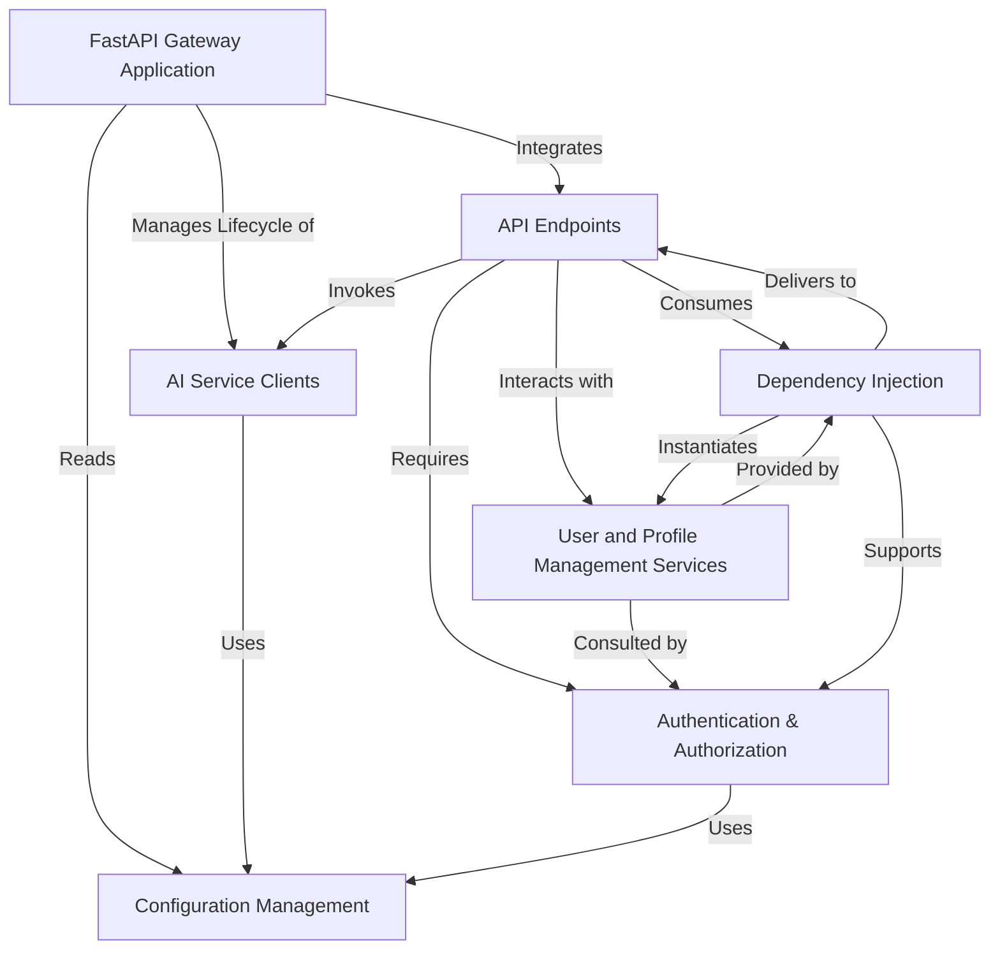

# Tutorial: api_gateway

The ITAPIA API Gateway acts as a *central hub* for various financial services. It **organizes** access to different *AI-powered analytics*, *advisor tools*, and *market data viewers*, while also managing **user accounts** and *investment profiles*. The gateway securely handles **user authentication** and ensures proper routing and configuration for all requests.

**Source Repository:** [None](None)

## Chapters

1. [FastAPI Gateway Application
](01_fastapi_gateway_application_.md)
2. [API Endpoints
](02_api_endpoints_.md)
3. [Authentication & Authorization
](03_authentication___authorization_.md)
4. [User and Profile Management Services
](04_user_and_profile_management_services_.md)
5. [AI Service Clients
](05_ai_service_clients_.md)
6. [Configuration Management
](06_configuration_management_.md)
7. [Dependency Injection
](07_dependency_injection_.md)

---

Generated by [AI Codebase Knowledge Builder](https://github.com/The-Pocket/Tutorial-Codebase-Knowledge)