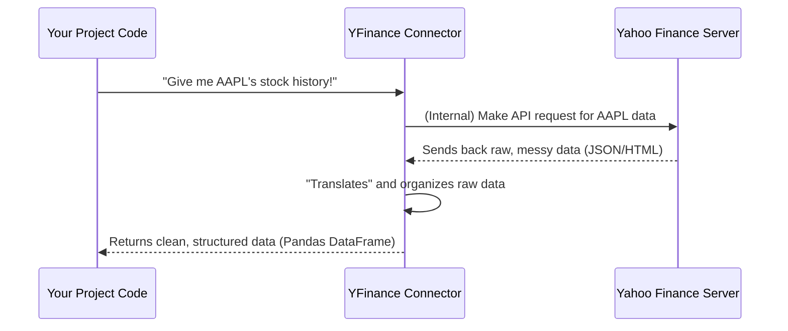

# Chapter 1: External Data Connectors

Welcome to the `data_processing` project tutorial! In this first chapter, we're going to dive into how our project gets information from the outside world. Think of it like a specialized shopping trip where we need to gather specific ingredients for our financial analysis recipes.

### What's the Problem We're Solving?

Imagine you want to know the latest stock price for Apple (AAPL) or read the news about Google (GOOGL). Where does this information come from? It's not stored directly inside our `data_processing` project. Instead, it lives on websites or services managed by other companies, like Yahoo Finance or Google News.

The challenge is that each of these external sources might speak a different "language" or have a different way of giving us information. It's like trying to order food in a foreign country where each restaurant has a unique menu and ordering system.

### Introducing "External Data Connectors"

This is where **External Data Connectors** come in!

These are special tools (usually Python libraries or modules) that act as "translators" or "couriers." Their job is to know how to talk to a specific external data provider, make the right requests, and bring back the raw information. They hide all the complicated details of talking to these external services from you.

Our project uses two main types of these connectors:

1.  **`yfinance`**: This library helps us communicate with **Yahoo Finance**. We use it to get things like historical stock prices, real-time prices, and financial news related to specific companies.
2.  **`gnews`**: This library helps us communicate with **Google News**. We use it to fetch general news articles based on keywords or topics, providing a broader view of market sentiment.

You can imagine them as specialized "interpreters" who know exactly how to ask Yahoo Finance for stock data or Google News for articles, and then they bring back the initial, raw data for us to use.

### Our First Use Case: Getting Stock Prices

Let's start with a concrete example: how do we get the daily historical stock prices for a company like Apple (AAPL)?

We will use the `yfinance` connector for this.

#### How to Use `yfinance` to Fetch Data

Here’s a simplified look at how `yfinance` helps us get stock prices. You ask `yfinance` for a ticker, and then you ask that ticker for its history.

```python
import yfinance as yf # We give yfinance a shorter name, 'yf'

# Let's say we want data for Apple (AAPL)
ticker_symbol = "AAPL"

# Ask yfinance to create a "Ticker" object for AAPL
apple_ticker = yf.Ticker(ticker_symbol)

# Now, ask this ticker object for its historical data
# We'll just ask for a short period for this example
# Output: A table (Pandas DataFrame) with daily prices
raw_stock_data = apple_ticker.history(period="7d")

print(raw_stock_data)
```

**What this code does:**

1.  We import the `yfinance` library.
2.  We tell `yfinance` which stock we're interested in (`"AAPL"`).
3.  We then call the `.history()` method on the `apple_ticker` object. This tells `yfinance` to go fetch the daily price data for the last 7 days (`period="7d"`) from Yahoo Finance.
4.  `yfinance` handles all the complex communication, retrieves the data, and presents it to us in a neat table format (a Pandas DataFrame).

The output would look something like this (dates and values would vary):

```
                  Open        High         Low       Close    Volume  Dividends  Stock Splits
Date
2024-06-18  215.179993  216.699997  213.000000  216.699997  75599000          0             0
2024-06-19  216.899994  217.289993  214.100006  215.000000  50485700          0             0
2024-06-20  213.910004  214.289993  208.500000  209.070007  85994200          0             0
2024-06-21  209.289993  211.889999  208.600006  210.020004  68065000          0             0
2024-06-24  210.160004  213.979996  207.250000  208.100000  84122100          0             0
2024-06-25  209.110001  210.389999  206.339996  209.430000  63659400          0             0
2024-06-26  210.500000  211.550003  208.410004  209.680004  56578500          0             0
```

#### How to Use `gnews` to Fetch News

Similarly, `gnews` helps us get news articles.

```python
from gnews import GNews # Import the GNews connector

# Create a GNews client - we can specify language and country
google_news = GNews(language='en', country='US', max_results=5)

# Fetch news articles about a specific keyword
news_articles = google_news.get_news('Apple Inc.')

# Each item in news_articles is a dictionary representing an article
for article in news_articles:
    print(f"Title: {article['title']}")
    print(f"Publisher: {article['publisher']['title']}")
    print(f"Link: {article['url']}\n")
    # We'll only print a few details for brevity
    if len(news_articles) > 5:
        break
```

**What this code does:**

1.  We import the `GNews` library.
2.  We create a `GNews` object, configuring it to get news in English (`'en'`) from the US (`'US'`), and to return up to 5 articles (`max_results=5`).
3.  We call the `.get_news()` method with a keyword, `"Apple Inc."`.
4.  `GNews` connects to Google News, fetches articles, and returns them as a list of dictionaries. Each dictionary contains details about one news article.

### Under the Hood: How Connectors Work

So, what exactly happens when you call these connectors? Let's take the `yfinance` example again:

1.  **Your Code (Our Project):** You write `apple_ticker.history()`.
2.  **Connector (e.g., `yfinance`):** `yfinance` takes your request (ticker, date range) and transforms it into a specific web address (URL) that Yahoo Finance understands. It then uses Python's networking tools to "visit" that web address.
3.  **External Data Provider (e.g., Yahoo Finance):** Yahoo Finance receives `yfinance`'s request. It looks up the data in its own systems and sends back a response. This response is usually in a raw, structured text format like JSON (JavaScript Object Notation) or sometimes even HTML (web page code).
4.  **Connector (e.g., `yfinance`):** `yfinance` receives this raw text. It then "parses" or "reads" this messy text and extracts the useful bits (like Open, High, Low, Close prices, Volume). It then neatly organizes these bits into an easy-to-use format, like a Pandas DataFrame.
5.  **Your Code (Our Project):** `yfinance` returns this clean, organized data to your program.

Here's a simple diagram illustrating this process:



#### Code Deep Dive: `yfinance` in Our Project

In our `data_processing` project, we use `yfinance` in scripts like `scripts\fetch_daily_prices.py` to get historical data and `scripts\fetch_realtime_prices.py` for real-time prices.

Let's look at a very simplified snippet from `scripts\fetch_daily_prices.py` that focuses on the `_extract_raw_data` function.

```python
# File: scripts\fetch_daily_prices.py
import yfinance as yf
import pandas as pd # Used to handle data tables

def _extract_raw_data(tickers, start_collect_date, end_collect_date):
    """
    Extract raw stock price data for a list of tickers.
    """
    # yfinance needs dates as strings
    _start_date_str = start_collect_date.strftime("%Y-%m-%d")
    _end_date_str = end_collect_date.strftime("%Y-%m-%d")

    # This is where yfinance connects to Yahoo Finance
    raw_df = yf.Tickers(tickers).history(
        period="max",
        interval="1d",
        start=_start_date_str,
        end=_end_date_str,
        # ... other complex yfinance settings are skipped for clarity
    )
    if raw_df is None:
        raise Exception("Error while fetch raw data from YFinance!") # Simplified error
    return raw_df
```

**Explanation:**

*   This function takes a list of `tickers` (like `["AAPL", "MSFT"]`) and a `start` and `end` date.
*   It formats the dates into strings that `yfinance` understands.
*   The key line is `yf.Tickers(tickers).history(...)`. This is the `yfinance` connector making the actual call to Yahoo Finance. It asks for the "max" available period, but limited by our `start` and `end` dates, with a daily (`"1d"`) interval.
*   The result, `raw_df`, is a Pandas DataFrame containing the raw daily prices.

Similarly, in `scripts\fetch_realtime_prices.py`, `yfinance` is used to get quick "fast info" for real-time updates:

```python
# File: scripts\fetch_realtime_prices.py
import yfinance as yf
# ... other imports and code

def _process_single_ticker(ticker_sym, prices_service):
    """
    Fetches real-time price info for a single ticker.
    """
    # This gets very quick, often cached information about the ticker
    info = yf.Ticker(ticker_sym).fast_info

    # We then extract specific pieces of information we need
    # like lastPrice, dayHigh, dayLow, etc.
    # ... (details for extracting info are skipped for clarity)
```

**Explanation:**

*   For real-time data, `yfinance.Ticker(ticker_sym).fast_info` is a lightweight way to get the latest available market data for a stock without fetching its entire history. This is perfect for frequent, quick updates.

#### Code Deep Dive: `gnews` in Our Project

For news, our project uses `gnews` in `scripts\fetch_universal_news.py`.

```python
# File: scripts\fetch_universal_news.py
from gnews import GNews
# ... other imports and code

def _extract_news_data_by_keyword(keywords, period_days, max_results):
    """
    Extracts news data from Google News for a list of keywords.
    """
    # Initialize the GNews client with preferred settings
    gnews_client = GNews(
        language="en",
        country="US",
        max_results=max_results,
        period=f"{period_days}d", # e.g., "5d" for 5 days back
    )

    all_news_data = []
    for keyword in keywords:
        # This is where gnews connects to Google News
        news_for_keyword = gnews_client.get_news(keyword)
        # ... (code to attach keyword and priority is skipped for clarity)
        all_news_data.extend(news_for_keyword)
    return all_news_data
```

**Explanation:**

*   This function sets up a `GNews` client specifying the language, country, maximum number of results, and how far back to look for news (`period`).
*   The core interaction is `gnews_client.get_news(keyword)`. This method sends a request to Google News, asking for articles related to the given `keyword`.
*   The `gnews` connector then retrieves the raw news data and organizes it into a list of dictionaries, which our project then uses.

### Conclusion

In this chapter, we learned that getting data from external sources is a crucial first step for our `data_processing` project. We understood that **External Data Connectors** like `yfinance` and `gnews` are our specialized tools for speaking to different data providers (like Yahoo Finance and Google News). They handle the heavy lifting of making requests, parsing raw responses, and giving us structured data.

Now that we know how to fetch raw data, what's next? The data might still be a bit messy or need some common handling before it's ready to be stored or analyzed. In the next chapter, we'll explore how our project handles these common tasks using [Shared Utilities & Configuration](02_shared_utilities___configuration_.md).

---

Generated by [AI Codebase Knowledge Builder](https://github.com/The-Pocket/Tutorial-Codebase-Knowledge)