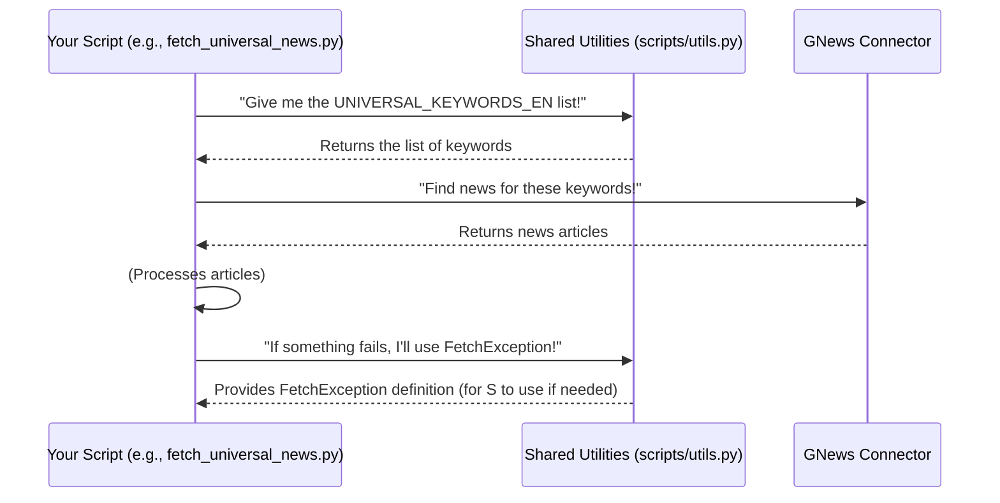

# Chapter 2: Shared Utilities & Configuration

Welcome back! In [Chapter 1: External Data Connectors](01_external_data_connectors_.md), we learned how our `data_processing` project talks to the outside world to fetch raw data using tools like `yfinance` and `gnews`. We saw that these connectors bring back information like stock prices or news articles.

Now, imagine you've just received a big delivery of ingredients for a recipe. Some ingredients might be fine, but others might be damaged, or you might need a specific type of sugar that everyone on the team always uses. This is where "Shared Utilities & Configuration" comes in.

### What Problem Are We Solving?

As a project grows, different parts of your code (think of them as different chefs in our kitchen) will need to do similar things:

1.  **Handle Errors Consistently:** What if the `yfinance` connector from Chapter 1 fails to fetch data? We need a standard way for *all* parts of our project to say, "Hey, I tried to fetch data, and it didn't work!" without everyone inventing their own error messages.
2.  **Use Consistent Settings & Information:** When we search for news using `gnews`, we might want to search for the *same* important keywords every time, no matter which script is doing the searching. We also might need a common "starting date" or other fixed values.
3.  **Avoid Repeating Code:** If five different scripts need to do the exact same small task, we don't want to copy and paste that code five times. That's a recipe for mistakes and makes updates difficult.

**Shared Utilities & Configuration** is like our project's central "toolbox" and "handbook." It contains common helper functions, special error messages (custom exceptions), and important lists or values (constants) that *everyone* in the project can use. This makes our code consistent, easier to manage, and prevents errors.

### Our Shared Toolbox and Handbook

Let's break down the main things you'll find in our "Shared Utilities & Configuration":

#### 1. Custom Alarm Bells: `FetchException`

Imagine you have a special alarm bell that only rings when something goes wrong during data fetching. When this bell rings, everyone immediately knows *what* happened.

In programming, these "special alarm bells" are called **custom exceptions**. Our project has `FetchException`, which is specifically designed to signal that something went wrong while trying to get data from an external source. It's much clearer than a generic `Exception` because it tells us the *type* of error right away.

#### 2. The Project Handbook: Keywords, Topics, and Default Dates

Our project needs specific information to run consistently. This includes:

*   **Universal Keywords:** Standard lists of words or phrases (like `"US economy forecast"`) that we always use when searching for news related to the US market, or specific keywords for the Vietnamese market (`"kinh tế vĩ mô Việt Nam"`). These ensure our news searches are always focused on important, pre-defined topics.
*   **Universal Topics:** General news categories (like `"BUSINESS"`, `"TECHNOLOGY"`) that we might want to filter or categorize news by.
*   **Default Dates:** A standard starting date (`DEFAULT_RETURN_DATE`) that can be used if a specific date isn't provided, ensuring consistency in historical data queries.

These are called **constants** because their values don't change during the program's execution. They are defined once in a central place.

### How to Use Our Shared Tools

Let's look at how we'd use these in our project.

#### Use Case 1: Ringing the `FetchException` Alarm Bell

If our `yfinance` connector from Chapter 1 fails to get stock prices, instead of a vague error, we can use our specific `FetchException`.

```python
from scripts.utils import FetchException # Import our special alarm bell

def get_stock_data_safely(ticker):
    # Imagine this function tries to fetch data
    # For now, let's simulate a failure
    data_fetch_successful = False

    if not data_fetch_successful:
        # Ring our custom alarm bell!
        raise FetchException(f"Failed to fetch data for {ticker}. The external service is down.")

# Example of calling our function
try:
    get_stock_data_safely("AAPL")
except FetchException as e:
    print(f"Caught a specific data fetching error: {e.msg}")
except Exception as e:
    print(f"Caught a general error: {e}")
```

**What this code does:**

1.  We import `FetchException` from `scripts.utils`.
2.  Inside `get_stock_data_safely`, if data fetching doesn't work, we use `raise FetchException(...)` to signal a specific problem.
3.  The `try...except FetchException` block catches *only* our special alarm bell, allowing us to handle data fetching errors differently from other, more general errors. The output will be: `Caught a specific data fetching error: Failed to fetch data for AAPL. The external service is down.`

#### Use Case 2: Using Consistent News Search Keywords

When our news fetching script (`fetch_universal_news.py`) wants to get articles, it can simply refer to our `UNIVERSAL_KEYWORDS_EN` list.

```python
from scripts.utils import UNIVERSAL_KEYWORDS_EN
from gnews import GNews # From Chapter 1

def fetch_important_news():
    # Initialize GNews connector (from Chapter 1)
    google_news = GNews(language='en', country='US', max_results=3)

    all_news = []
    # Loop through our standardized keywords from the handbook
    for keyword in UNIVERSAL_KEYWORDS_EN[:2]: # Just take the first 2 for example
        print(f"Fetching news for: {keyword}")
        news_items = google_news.get_news(keyword)
        for item in news_items:
            all_news.append(item['title'])
        # We'll stop after a few to keep the example short
        if len(all_news) > 5:
            break
    
    print("\n--- Fetched News Titles ---")
    for title in all_news[:5]: # Print first 5 titles
        print(f"- {title}")

# Let's run it!
fetch_important_news()
```

**What this code does:**

1.  We import `UNIVERSAL_KEYWORDS_EN` from `scripts.utils`.
2.  Our `fetch_important_news` function then iterates through these predefined keywords.
3.  Each keyword is passed to the `gnews` connector (from Chapter 1) to fetch relevant articles. This ensures that every time this function runs, it uses the exact same, important list of keywords for its search, keeping our data collection consistent.

The output would show `Fetching news for: US economy forecast` then `Fetching news for: Federal Reserve policy`, followed by a list of news titles related to these topics.

### Under the Hood: The `scripts/utils.py` File

So, how does this "shared toolbox and handbook" actually work? It's all stored in a single, dedicated Python file in our project: `scripts/utils.py`.

Think of `scripts/utils.py` as a central bulletin board or a shared document that everyone on the team has access to. When a script needs a specific keyword list or wants to raise a `FetchException`, it simply "looks up" or "imports" these items from `scripts/utils.py`.

Here's a simplified view of how different parts of our project interact with this central utility file:



#### Code Deep Dive: `scripts/utils.py`

Let's look at what's actually inside our `scripts/utils.py` file, where all these shared items are defined.

```python
# File: scripts\utils.py
from datetime import datetime, timezone

class FetchException(Exception):
    """Custom exception for data fetching errors."""
    def __init__(self, msg: str):
        super().__init__()
        self.msg = msg

DEFAULT_RETURN_DATE = datetime(2017, 12, 31, tzinfo=timezone.utc)

# English keywords (for US market)
UNIVERSAL_KEYWORDS_EN = [
    "US economy forecast",
    "Federal Reserve policy",
    "US inflation report CPI",
    # ... many more keywords are listed here ...
]

UNIVERSAL_TOPIC_EN = [
    "WORLD",
    "NATION",
    "BUSINESS",
    # ... more topics ...
]

# Vietnamese keywords (for Vietnamese market)
UNIVERSAL_KEYWORDS_VI = [
    "kinh tế vĩ mô Việt Nam",
    "lãi suất ngân hàng nhà nước",
    # ... more Vietnamese keywords ...
]
```

**Explanation:**

*   **`class FetchException(Exception):`**: This line defines our custom error type. By inheriting from `Exception`, it behaves like any other Python error but has our special name. The `__init__` method simply allows us to pass a specific message (`msg`) when the error occurs.
*   **`DEFAULT_RETURN_DATE = ...`**: This line defines a `constant`. It's a `datetime` object representing a specific date, ensuring that if any part of our project needs a default starting point for historical data, it uses this exact value.
*   **`UNIVERSAL_KEYWORDS_EN = [...]`**: This defines a `list` of strings. Each string is a keyword. Because it's defined here, any script that imports `UNIVERSAL_KEYWORDS_EN` will get the exact same list, guaranteeing consistency across all news searches.
*   Similar explanations apply to `UNIVERSAL_TOPIC_EN` and `UNIVERSAL_KEYWORDS_VI`. They are all central reference points.

By putting all these common elements in `scripts/utils.py`, we make sure everyone in the project speaks the same language when it comes to errors, default settings, and important search terms.

### Conclusion

In this chapter, we explored **Shared Utilities & Configuration**, our project's central toolbox and handbook. We learned about `FetchException` for standardized error reporting and how constants like `UNIVERSAL_KEYWORDS_EN` ensure consistent data fetching across our project. Using these shared resources helps us keep our code clean, consistent, and easy to maintain.

Now that we know how to fetch raw data and use shared tools, our data might still be in a raw, unprocessed form. In the next chapter, we'll learn about [Data Transformation & Normalization](03_data_transformation___normalization_.md), which is about cleaning and organizing this raw data into a useful format.

---

Generated by [AI Codebase Knowledge Builder](https://github.com/The-Pocket/Tutorial-Codebase-Knowledge)