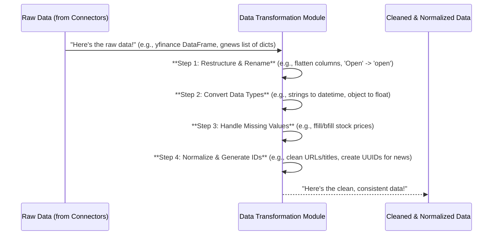

# Chapter 3: Data Transformation & Normalization

Welcome back! In [Chapter 1: External Data Connectors](01_external_data_connectors_.md), we learned how our `data_processing` project fetches raw information from the internet, like stock prices from Yahoo Finance or news articles from Google News. Then, in [Chapter 2: Shared Utilities & Configuration](02_shared_utilities___configuration_.md), we discovered our project's central toolbox for consistent error handling and shared settings.

Now, imagine you've just returned from a shopping trip with all your raw ingredients – fresh vegetables, raw meat, spices. Are they ready to be cooked immediately? Probably not! You need to wash the vegetables, chop them, marinate the meat, and organize everything. This is exactly what "Data Transformation & Normalization" is about in our project.

### What Problem Are We Solving?

The raw data we get from external sources, even though it's structured by our connectors, isn't always in the perfect shape for us to use or store directly. It might have several issues:

*   **Messy Column Names:** Column names might be long, inconsistent, or contain special characters (e.g., `"Published date"` instead of `"publish_time"`).
*   **Wrong Data Types:** Numbers might be stored as text, or dates as plain strings, making calculations or sorting difficult.
*   **Missing Information:** Sometimes, a piece of data is simply missing (e.g., a stock price for a holiday, or a news article without a summary).
*   **Inconsistent Structure:** Data from different sources might have slightly different ways of organizing similar information.
*   **No Unique ID:** How do we tell two news articles apart if they have similar titles? We need a unique fingerprint for each piece of data.

**Data Transformation & Normalization** is like our project's "quality control and packaging department." It takes these raw ingredients, refines them, cleans them up, makes sure they follow strict standards, and prepares them into a consistent and usable format before they are sent to storage.

### Introducing Data Transformation & Normalization

This phase covers processes such as:

1.  **Renaming Columns:** Changing confusing column names to clear, consistent ones (e.g., `Close` to `close`).
2.  **Converting Data Types:** Ensuring numbers are actually numbers, and dates are proper date objects (e.g., `216.699997` as a `float`, `2024-06-18` as a `datetime`).
3.  **Handling Missing Values:** Deciding what to do when data is absent – perhaps filling it in with the last known value or a default.
4.  **Restructuring Data:** Changing the layout of tables to make them easier to work with (e.g., from wide tables to tall tables).
5.  **Generating Unique Identifiers (UUIDs):** Creating a special, globally unique "fingerprint" for each item, like a news article, to prevent duplicates and make it easy to find.
6.  **Normalizing Text and URLs:** Cleaning up text and web addresses to remove inconsistencies, which helps in generating stable UUIDs and comparing data.

Let's look at how our project applies these steps.

### Our First Use Case: Preparing Daily Stock Price Data

Remember the `raw_stock_data` we got from `yfinance` in Chapter 1? It looked like this:

```
                  Open        High         Low       Close    Volume  Dividends  Stock Splits
Date
2024-06-18  215.179993  216.699997  213.000000  216.699997  75599000          0             0
...
```
If we were getting data for *multiple* tickers, `yfinance` would return it with even more complex column names, like `('AAPL', 'Open')`, `('MSFT', 'Open')`. This "multi-level" column structure is powerful but can be tricky to work with directly.

Our transformation process for stock prices makes sure this data is clean and consistently formatted.

#### How Our Project Transforms Stock Prices

Our project's `scripts/fetch_daily_prices.py` script contains functions specifically for this. Let's look at simplified versions of what they do.

First, we need to restructure the data and rename columns.

```python
# Simplified snippet from scripts/fetch_daily_prices.py

def _reconstruct_table(raw_df):
    # Imagine raw_df has complex columns like (Ticker, Open), (Ticker, Close)
    
    # 1. Restructure: "Un-stack" columns to make 'Ticker' a regular column
    stacked_df = raw_df.stack(level="Ticker", future_stack=True)
    stacked_df.reset_index(inplace=True) # Turn 'Date' index into a column

    # 2. Rename Columns: Make names clear and consistent
    stacked_df.rename(
        columns={
            "Date": "collect_date",
            "Ticker": "ticker",
            "Open": "open",
            "High": "high",
            "Low": "low",
            "Close": "close",
            "Volume": "volume",
            # ... other columns like 'Dividends' will be dropped later
        },
        inplace=True,
    )
    
    # 3. Convert Data Types: Ensure numeric columns are actually numbers (float32)
    for col in ["open", "high", "low", "close", "volume"]:
        stacked_df[col] = stacked_df[col].astype("float32") # Save memory with float32

    return stacked_df # Returns a clean, restructured table
```
**What this code does:**

1.  It takes a raw table (`raw_df`) that might have complex column headers.
2.  `stack()` and `reset_index()` reshapes the table, so instead of having `AAPL` and `MSFT` as parts of column names, `ticker` becomes its own column.
3.  `rename()` changes the column names to standard, lowercase, easy-to-use versions (e.g., `Close` becomes `close`).
4.  It converts the price and volume columns to a more efficient numeric type (`float32`), which is great for performance and storage.

After this step, our data would look much cleaner, like this (simplified example):

```
  collect_date ticker     open     high      low    close    volume
0   2024-06-18   AAPL  215.180  216.700  213.000  216.700  75599000
1   2024-06-19   AAPL  216.900  217.290  214.100  215.000  50485700
...
```

But what if some days are missing data? We need to handle that too!

```python
# Simplified snippet from scripts/fetch_daily_prices.py

def _handle_missing_data(df, start_date, end_date, features):
    # Ensure 'collect_date' is a proper datetime object
    df["collect_date"] = pd.to_datetime(df["collect_date"], utc=True)

    # Fill missing values:
    # ffill() fills forward (uses the last known valid value)
    # bfill() fills backward (uses the next known valid value)
    df[features] = df.groupby("ticker")[features].ffill().bfill()
    
    # Filter data to only include the dates we care about
    filtered_df = df[
        (df["collect_date"] >= pd.Timestamp(start_date)) & 
        (df["collect_date"] <= pd.Timestamp(end_date))
    ]

    return filtered_df # Returns data with missing values filled
```
**What this code does:**

1.  It ensures the `collect_date` column is correctly interpreted as dates.
2.  `ffill().bfill()` is a powerful technique: `ffill()` fills any gaps using the *previous* valid value, and then `bfill()` fills any remaining gaps (like at the very beginning of the data) using the *next* valid value. This helps us ensure we have continuous data for each stock.
3.  Finally, it filters the data to ensure we only keep records within our desired date range.

These functions work together to prepare the raw stock price data for storage and analysis.

### Another Use Case: Standardizing News Articles

News articles are even more varied! They come with different fields, formats, and no built-in unique ID. When we fetch news from `gnews` (Chapter 1), each article is a dictionary like this (simplified):

```python
# Example of raw news data from gnews
raw_gnews_article = {
    "title": "Apple's stock rises after new AI features unveiled",
    "description": "Cupertino tech giant announced several new AI features...",
    "published date": "Tue, 18 Jun 2024 10:00:00 GMT",
    "publisher": {"title": "TechNews Today"},
    "url": "https://www.technewstoday.com/apple-ai-stock-june-2024",
    "keyword": "Apple Inc.", # Added by our project in _extract_news_data_by_keyword
    "prior": 2 # Added by our project
}
```

Our goal is to transform this into a consistent format for our database, ensure each article has a unique identifier, and prevent duplicates.

#### How Our Project Transforms News Data

Our `scripts/fetch_universal_news.py` and `scripts/fetch_relevant_news.py` files contain the logic for transforming news articles. A key challenge is creating a unique ID. If two different news sources publish the *same* article, or very similar ones, how do we know it's the same and avoid storing duplicates? We use **UUIDs (Universally Unique Identifiers)**.

To make these UUIDs consistent, we first need to *normalize* the text and URLs.

```python
# Simplified snippet from scripts/fetch_universal_news.py

import re
import uuid
from urllib.parse import urlparse, urlunparse
import hashlib

def _normalize_text(text: str) -> str:
    if not text: return ""
    text = text.lower() # Convert to lowercase
    text = re.sub(r"[^\w\s]", "", text) # Remove punctuation
    text = " ".join(text.split()) # Remove extra spaces
    return text

def _normalize_url(url: str) -> str:
    if not url: return ""
    parsed = urlparse(url)
    # Reconstruct URL with scheme, netloc (domain), and path only
    clean_url = urlunparse((parsed.scheme, parsed.netloc, parsed.path, "", "", ""))
    return clean_url.lower()

def _generate_article_uuid(link: str, title: str) -> str:
    # Normalize link and title for consistent UUID generation
    normalized_link = _normalize_url(link)
    normalized_title = _normalize_text(title)
    
    # Combine them with a separator to prevent collisions
    canonical_string = f"{normalized_link}|{normalized_title}"
    
    # Generate a UUID v5 (stable and consistent) based on this string
    return str(uuid.uuid5(uuid.NAMESPACE_URL, canonical_string))

def _create_content_hash(text: str) -> str:
    normalized = _normalize_text(text)
    # Use SHA-256 to create a unique fingerprint of the title
    return hashlib.sha256(normalized.encode("utf-8")).hexdigest()
```
**What this code does:**

1.  **`_normalize_text`**: Takes any text (like a title) and cleans it up by making it lowercase, removing punctuation, and tidying up spaces. This ensures `"Apple's Stock"` and `"apples stock"` are treated the same.
2.  **`_normalize_url`**: Cleans up a web address by removing extra parts like tracking codes or fragments, ensuring `https://example.com/page?ref=a` and `https://example.com/page#section` both become `https://example.com/page`.
3.  **`_generate_article_uuid`**: This is crucial! It uses the `uuid.uuid5` function, which creates a *consistent* UUID based on specific inputs (the normalized link and title). This means if we get the exact same article (with the same link and title) from a different source later, it will generate the *same* UUID, helping us detect duplicates.
4.  **`_create_content_hash`**: Creates a very short, unique "fingerprint" of the article's title. This is another way to quickly check for duplicate titles in our database.

With these helpers, we can now transform a raw news article dictionary into a clean format suitable for our database:

```python
# Simplified snippet from scripts/fetch_universal_news.py

from datetime import datetime, timezone # For handling dates

def _transform_element(element: dict):
    transformed = {}

    link = element.get("url")
    title = element.get("title")

    # 1. Generate Unique ID
    transformed["news_uuid"] = _generate_article_uuid(link, title)

    # 2. Rename and Clean Fields
    transformed["title"] = title
    transformed["title_hash"] = _create_content_hash(title) # Use the hash for quick duplicate checks

    # GNews uses 'description' for summary, rename it
    transformed["summary"] = element.get("description", "") 

    # 3. Convert Data Types (especially dates)
    pub_date_str = element.get("published date")
    if pub_date_str:
        # Parse the specific date format from GNews
        transformed["publish_time"] = datetime.strptime(
            pub_date_str, "%a, %d %b %Y %H:%M:%S %Z"
        ).replace(tzinfo=timezone.utc)
    else:
        # If no publish date, we might skip or use a default
        logger.warn(f"News with link {link} is missing 'published date'.")

    transformed["collect_time"] = datetime.now(timezone.utc) # Record when we collected it

    # Extract publisher title
    publisher_info = element.get("publisher")
    transformed["provider"] = publisher_info.get("title", "") if publisher_info else ""
    transformed["link"] = link
    transformed["keyword"] = element["keyword"]
    transformed["news_prior"] = element["prior"]

    return transformed
```
**What this code does:**

1.  It uses `_generate_article_uuid` to create a stable `news_uuid` for each article.
2.  It renames fields, like using `summary` for `description`.
3.  It parses the `published date` string into a proper `datetime` object, which is much better for sorting and filtering.
4.  It adds a `collect_time` to know exactly when we fetched the article.
5.  It safely extracts information like the publisher's title and adds other relevant fields like `keyword` and `news_prior` that we added during fetching.

After this `_transform_element` function (which `_transform` calls for a list of articles), our news article data is standardized and ready!

### Under the Hood: The Transformation Process

Think of the transformation process as a multi-stage production line in our data factory:

1.  **Input:** Raw, unprocessed data arrives from the [External Data Connectors](01_external_data_connectors_.md).
2.  **Quality Control (Cleaning):** Data types are checked, missing values are addressed, and text is normalized.
3.  **Restructuring:** The data's shape is adjusted to fit our internal standards.
4.  **Unique ID Assignment (Packaging):** Each piece of data gets a unique "product code" (like a UUID) for easy tracking and to prevent duplicates.
5.  **Output:** Clean, standardized, and ready-to-use data.

Here's a simplified diagram of this process:



#### Code Deep Dive: Transformation Functions

Let's look at where these functions live in our project's code.

**1. Stock Price Transformation (`scripts/fetch_daily_prices.py`)**

The `_reconstruct_table` and `_handle_missing_data` functions are crucial for our stock price pipeline. They are called sequentially within the `full_pipeline` function.

```python
# File: scripts\fetch_daily_prices.py (simplified)
import pandas as pd
import yfinance as yf # For getting raw data
from datetime import datetime, timedelta, timezone

# ... other imports and definitions (like from scripts.utils) ...

# (Function to extract raw data, as shown in Chapter 1)
def _extract_raw_data(tickers, start_date, end_date):
    # ... uses yf.Tickers(...).history(...) to get raw_df ...
    # This raw_df will have multi-level columns if multiple tickers are fetched
    return raw_df 

# (The _reconstruct_table function as shown above)
def _reconstruct_table(raw_df, numeric_type="float32"):
    # ... logic to stack, rename, and convert types ...
    return stacked_df

# (The _handle_missing_data function as shown above)
def _handle_missing_data(df, start_date, end_date, features):
    # ... logic to ffill, bfill, and filter dates ...
    return filtered_df

def full_pipeline(metadata_service, prices_service):
    # ... logic to determine dates and get tickers ...
    raw_df = _extract_raw_data(tickers, start_collect_date, end_collect_date)

    # Calling the transformation functions:
    reconstructed_df = _reconstruct_table(raw_df, "float32")
    cleaned_df = _handle_missing_data(
        reconstructed_df,
        start_date,
        end_date,
        features=["open", "high", "low", "close", "volume"],
    )
    # ... cleaned_df is then ready to be loaded into the database ...
```
**Explanation:**

*   The `full_pipeline` function orchestrates the entire process.
*   It first gets `raw_df` using `_extract_raw_data` (from Chapter 1 logic).
*   Then, `_reconstruct_table` is called to reshape and rename the columns, returning `reconstructed_df`.
*   Finally, `_handle_missing_data` takes this `reconstructed_df` and fills in any gaps, producing `cleaned_df`, which is the fully transformed data ready for storage.

**2. News Article Transformation (`scripts/fetch_universal_news.py`)**

For news, the `_normalize_text`, `_normalize_url`, `_generate_article_uuid`, `_create_content_hash`, and `_transform_element` functions are all used together to process each raw news article.

```python
# File: scripts\fetch_universal_news.py (simplified)
import uuid
import hashlib
import re
from datetime import datetime, timezone
from urllib.parse import urlparse, urlunparse

# ... other imports and definitions ...

# (The _normalize_text, _normalize_url, _generate_article_uuid, _create_content_hash functions as shown above)
# ... definitions for these helper functions ...

# (The _transform_element function as shown above)
def _transform_element(element: dict):
    # ... uses _generate_article_uuid, _create_content_hash, parses dates, etc. ...
    return transformed_dict

def _transform(data: list[dict]):
    """Applies _transform_element to a list of raw news dictionaries."""
    transformed_data = []
    for element in data:
        try:
            transformed_data.append(_transform_element(element))
        except Exception as e: # Simplified error handling
            # If an element can't be transformed, we might skip it
            print(f"Skipping bad news article: {e}")
            continue
    return transformed_data

def full_pipeline(news_service, keywords, topics, period_days):
    # ... logic to extract raw news data (like from Chapter 1) ...
    raw_data = raw_data_from_keywords + raw_data_from_topics

    # Calling the transformation function:
    transformed_data = _transform(raw_data)

    # ... transformed_data is then ready to be loaded into the database ...
```
**Explanation:**

*   `_transform_element` is the core function that takes a single raw news dictionary and converts it into our standardized format, utilizing the normalization and UUID generation helpers.
*   The `_transform` function then iterates through an entire list of raw news articles, applying `_transform_element` to each one. It also handles cases where an individual article might be problematic and can't be transformed (by skipping it).
*   The `full_pipeline` for universal news collects raw news, and then calls `_transform` on the entire batch to prepare it.

### Conclusion

In this chapter, we unpacked the essential concept of **Data Transformation & Normalization**. We learned that raw data is rarely ready for immediate use and needs cleaning, restructuring, and standardizing. Our project employs techniques like renaming columns, converting data types, handling missing values, and generating unique identifiers (UUIDs) for news articles to achieve this. These steps ensure that the data is consistent, reliable, and perfectly prepared for the next stage.

Now that our data is fetched, cleaned, and organized, the next logical step is to store it safely and efficiently. In the next chapter, we'll explore [Data Storage Services](04_data_storage_services_.md).

---

Generated by [AI Codebase Knowledge Builder](https://github.com/The-Pocket/Tutorial-Codebase-Knowledge)