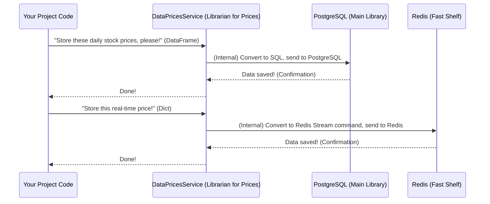

# Chapter 4: Data Storage Services

Welcome back! In [Chapter 1: External Data Connectors](01_external_data_connectors_.md), we learned how to get raw data from the internet. Then, in [Chapter 2: Shared Utilities & Configuration](02_shared_utilities___configuration_.md), we found our project's central toolbox for consistent error handling and shared settings. Most recently, in [Chapter 3: Data Transformation & Normalization](03_data_transformation___normalization_.md), we took that raw data and meticulously cleaned, standardized, and organized it, making it perfect for use.

Now, imagine you've just finished preparing a magnificent meal. The ingredients are washed, chopped, cooked, and perfectly arranged. What's the next step? You need to serve it, or perhaps store leftovers in the fridge for later! This is exactly the problem **Data Storage Services** solve in our `data_processing` project.

### What Problem Are We Solving?

We have beautifully prepared data (like clean stock prices or standardized news articles), but where do we put it? We can't just keep it in our computer's memory, because it will disappear when the program stops. We need a reliable place to store it for the long term, and sometimes, a super-fast place for temporary, frequently accessed data.

The challenge is:
*   **Different Storage Needs:** Some data needs to be stored permanently in a structured way (like historical stock prices in a database). Other data might need to be accessed incredibly quickly for real-time updates (like current stock prices).
*   **Complex Database Interaction:** Talking to a database often involves specialized "languages" (like SQL) and complex setup. We don't want every part of our project to have to learn these low-level details.
*   **Consistency:** Every time we store or retrieve data, we want to do it in a standard way to avoid mistakes.

**Data Storage Services** are like dedicated librarians or warehouse managers for our project. They know exactly where everything goes, how to put it away, and how to find it when someone asks. They provide a simple, clean interface, so our data processing pipelines (our "cooks") don't need to worry about the intricate details of databases or caching. They just hand over the data and trust the service to handle it.

### Introducing Data Storage Services

Our project uses two main types of storage:

1.  **PostgreSQL (Our Main Library):** This is a powerful database that acts as our project's main, long-term library. We store all our important historical data here, like daily stock prices, company metadata, and historical news articles. It's robust and ensures data is saved even if the power goes out.
2.  **Redis (Our Fast-Access Shelf/Cache):** This is an incredibly fast, in-memory database often used for caching or real-time data. Think of it as a small, super-organized shelf right next to the librarian's desk, holding information that's frequently needed *right now*, like the latest real-time stock prices.

To interact with these storage systems, our project has specialized "librarians," which we call **Services**:

*   **`DataMetadataService`**: This librarian manages information *about* things, like which stock tickers we track, their company names, and when their markets open and close. It keeps this info ready for other parts of the project.
*   **`DataPricesService`**: This librarian is in charge of *all* price data. It knows how to store historical daily prices (in PostgreSQL) and rapidly update real-time, intraday prices (in Redis).
*   **`DataNewsService`**: This librarian handles all news articles. It knows how to store both universal news (general market news) and relevant news (news specific to a company) in PostgreSQL.

Each service is an expert in its domain, providing a simple way to store, retrieve, and manage data without anyone else needing to know the low-level database commands.

### Our Use Case: Storing Our Cleaned Data

Let's revisit the perfectly cleaned data from [Chapter 3: Data Transformation & Normalization](03_data_transformation___normalization_.md). We had:

*   A Pandas DataFrame of cleaned daily stock prices.
*   A dictionary of real-time stock prices for a single ticker.
*   A list of dictionaries for transformed news articles.

How do we get these into our PostgreSQL and Redis storage? We simply call the appropriate methods on our `DataPricesService` and `DataNewsService` librarians.

### How to Use Data Storage Services

Let's look at how our project uses these services.

#### 1. Storing Daily Stock Prices (in PostgreSQL)

After fetching and transforming daily stock prices, the `fetch_daily_prices.py` script needs to save them. It uses `DataPricesService`.

```python
# Simplified snippet from scripts/fetch_daily_prices.py

# ... (after data has been extracted and transformed into cleaned_df) ...

# 1. Prepare data (example: select only relevant columns)
selected_cols = ["collect_date", "ticker", "open", "high", "low", "close", "volume"]
selected_df = cleaned_df[selected_cols].copy()

# 2. Use the Prices Service to add the data to PostgreSQL
# prices_service is our DataPricesService librarian
prices_service.add_daily_prices(
    data=selected_df,          # The cleaned Pandas DataFrame
    unique_cols=["collect_date", "ticker"] # Columns to check for duplicates
)

print(f"Successfully saved {len(selected_df)} daily price records.")
```
**What this code does:**

1.  It prepares the `cleaned_df` (from Chapter 3) by selecting only the columns we want to save.
2.  It then calls the `add_daily_prices` method on the `prices_service` (our `DataPricesService` object). We pass our clean DataFrame and tell the service which columns (`collect_date`, `ticker`) uniquely identify each record. This helps the service avoid saving the same data twice.
3.  The `DataPricesService` handles all the complex interactions with PostgreSQL to insert this data.

#### 2. Storing Real-time Stock Prices (in Redis)

For fast-access real-time prices, the `fetch_realtime_prices.py` script uses `DataPricesService` to store data in Redis.

```python
# Simplified snippet from scripts/fetch_realtime_prices.py

def _process_single_ticker(ticker_sym, prices_service):
    # Imagine 'info' is raw data from yfinance (Chapter 1)
    # And 'provisional_candle' is the transformed data (Chapter 3)
    
    provisional_candle = {
        "open": 210.0,
        "high": 211.5,
        "low": 208.7,
        "close": 210.3,
        "volume": 75000000,
        "last_update_utc": "2024-07-01T14:30:00Z",
    }

    # Use the Prices Service to add the real-time data to Redis
    prices_service.add_intraday_prices(
        ticker=ticker_sym,    # The stock ticker symbol
        candle_data=provisional_candle # The real-time price dictionary
    )

    print(f"Successfully updated real-time price for {ticker_sym}.")

# Example call:
# _process_single_ticker("AAPL", prices_service_object)
```
**What this code does:**

1.  After fetching and transforming a single ticker's real-time price information into a dictionary (`provisional_candle`), the `_process_single_ticker` function calls `add_intraday_prices` on the `prices_service`.
2.  The `DataPricesService` then takes this data and sends it to Redis, usually into a special data structure called a "Stream," which is perfect for time-series data like real-time prices.

#### 3. Storing News Articles (in PostgreSQL)

Whether it's universal news or relevant stock news, the process is similar. Here's how `fetch_universal_news.py` stores news using `DataNewsService`:

```python
# Simplified snippet from scripts/fetch_universal_news.py

# ... (after raw data is extracted and transformed into transformed_data) ...

# transformed_data is a list of dictionaries, each dict is a cleaned news article
# Example: [{"news_uuid": "...", "title": "...", "link": "...", ...}]

# Use the News Service to add the data to PostgreSQL
# news_service is our DataNewsService librarian
news_service.add_news(
    data=transformed_data,  # The list of cleaned news articles
    type="universal",       # A label for this type of news
    unique_cols=["title_hash"] # Columns to check for duplicates (from Chapter 3)
)

print(f"Successfully saved {len(transformed_data)} universal news articles.")
```
**What this code does:**

1.  It takes `transformed_data` (the list of cleaned news article dictionaries from Chapter 3).
2.  It calls `add_news` on the `news_service` (our `DataNewsService` object). It provides the `type` of news (e.g., "universal" or "relevant") and specifies `title_hash` as the unique identifier for checking duplicates.
3.  The `DataNewsService` then ensures these articles are correctly inserted into the PostgreSQL database.

#### 4. Getting Metadata (from Cache/PostgreSQL)

Before fetching or storing prices, our pipelines often need to know which tickers to process. `DataMetadataService` provides this:

```python
# Simplified snippet from scripts/fetch_daily_prices.py

# metadata_service is our DataMetadataService librarian
tickers = metadata_service.get_all_tickers()

print(f"Found {len(tickers)} tickers to process: {tickers[:3]}...") # e.g., ['AAPL', 'MSFT', 'GOOG']
```
**What this code does:**

1.  The `get_all_tickers()` method on `metadata_service` is called.
2.  This service first checks its super-fast internal cache for the list of active tickers. If found, it returns them immediately.
3.  If not in the cache, it then fetches them from the PostgreSQL database, stores them in its cache for future fast access, and then returns them. This keeps our system efficient!

### Under the Hood: How Services Work

When our project calls a method like `prices_service.add_daily_prices()`, what happens inside the "librarian's office"?

1.  **Your Project Code:** You call `prices_service.add_daily_prices(data=my_df, ...)`.
2.  **Service (e.g., `DataPricesService`):** The service receives your clean data. It knows:
    *   Which database table this data belongs to (e.g., `daily_prices`).
    *   How to connect to PostgreSQL.
    *   How to turn your Pandas DataFrame (or list of dicts) into database-friendly commands (like `INSERT` or `UPDATE` statements in SQL).
    *   How to handle potential errors (e.g., database connection lost).
3.  **Database (PostgreSQL or Redis):** The database receives the commands from the service, processes them, and stores the data.
4.  **Service:** The service gets a confirmation (or an error) from the database and passes it back (or handles it internally).

Here's a simple diagram illustrating the process:



#### Code Deep Dive: `itapia_common.dblib.services`

The actual implementation of these services lives in an external library called `itapia_common.dblib.services`. Our `data_processing` project *uses* these services, rather than defining them directly. This makes them reusable across multiple projects.

Let's look at simplified conceptual examples of what these services might do:

**1. `DataPricesService` (`itapia_common.dblib.services`)**

This service would contain methods like `add_daily_prices` and `add_intraday_prices`.

```python
# Conceptual simplified code (NOT from our project, but what the service does)
from sqlalchemy import create_engine, text
import pandas as pd
import redis

class DataPricesService:
    def __init__(self, db_engine, redis_client=None):
        self.db_engine = db_engine # Connection to PostgreSQL
        self.redis_client = redis_client # Connection to Redis

    def add_daily_prices(self, data: pd.DataFrame, unique_cols: list[str]):
        # This is simplified! Real implementation would be more robust.
        # It typically uses pandas.DataFrame.to_sql for bulk inserts
        # or SQLAlchemy's ORM for more complex operations.
        print(f"DataPricesService: Inserting {len(data)} daily prices into PostgreSQL.")
        data.to_sql(
            "daily_prices", # The table name in PostgreSQL
            con=self.db_engine,
            if_exists="append", # Add new rows
            index=False
            # On conflict (e.g., unique_cols match), it might UPDATE existing rows
            # This 'upsert' logic is more complex and handled internally
        )
        print("DataPricesService: Daily prices saved in PostgreSQL.")

    def add_intraday_prices(self, ticker: str, candle_data: dict):
        if not self.redis_client:
            print("DataPricesService: Redis client not configured for intraday prices.")
            return

        # Redis Stream commands (simplified)
        stream_key = f"realtime:prices:{ticker}"
        self.redis_client.xadd(stream_key, candle_data)
        print(f"DataPricesService: Real-time price for {ticker} saved in Redis Stream.")

# How our scripts get these services (from itapia_common.dblib.session)
# engine = get_singleton_rdbms_engine()
# redis_client = get_singleton_redis_client()
# prices_service = DataPricesService(engine, redis_client)
```
**Explanation:**

*   The `DataPricesService` takes an `engine` (for PostgreSQL) and `redis_client` (for Redis) when it's created. These are special objects that handle the actual connection to the databases.
*   The `add_daily_prices` method takes a Pandas DataFrame and uses `to_sql` to directly send it to the `daily_prices` table in PostgreSQL. The `if_exists="append"` means it adds new data. (A real system might "upsert" - update if exists, insert if new).
*   The `add_intraday_prices` method uses `self.redis_client.xadd` to add a new entry to a Redis Stream, ensuring real-time data is stored for quick access.

**2. `DataNewsService` (`itapia_common.dblib.services`)**

Similar to `DataPricesService`, this service would contain the `add_news` method.

```python
# Conceptual simplified code (NOT from our project, but what the service does)
from sqlalchemy.orm import sessionmaker
from sqlalchemy import create_engine
# Imagine there are SQLAlchemy models for news articles

class DataNewsService:
    def __init__(self, db_engine):
        self.Session = sessionmaker(bind=db_engine) # Tool to talk to DB
        self.db_engine = db_engine

    def add_news(self, data: list[dict], news_type: str, unique_cols: list[str]):
        print(f"DataNewsService: Inserting {len(data)} '{news_type}' news articles into PostgreSQL.")
        session = self.Session()
        try:
            for item in data:
                # In a real service, this would involve checking for existing
                # articles based on 'unique_cols' (like news_uuid or title_hash)
                # and either inserting new ones or skipping/updating.
                # Simplified: just "pretend" to add
                print(f"  - Adding news: {item.get('title', 'N/A')}")
            session.commit() # Save all changes
            print("DataNewsService: News articles saved in PostgreSQL.")
        except Exception as e:
            session.rollback() # Undo changes if an error occurs
            print(f"DataNewsService: Error saving news: {e}")
        finally:
            session.close() # Always close the session

# How our scripts get this service
# engine = get_singleton_rdbms_engine()
# news_service = DataNewsService(engine)
```
**Explanation:**

*   The `DataNewsService` also takes a `db_engine` for PostgreSQL.
*   The `add_news` method iterates through the list of news dictionaries. In a real system, it would translate each dictionary into an "object" that SQLAlchemy (a Python library for databases) understands, then try to add it. It would also handle logic to prevent duplicate entries based on `unique_cols`.
*   The `session.commit()` is how changes are permanently saved to the database.

By using these services, our data processing pipelines remain simple and focused on fetching and transforming data. They trust the services to handle the complexities of robust data storage.

### Conclusion

In this chapter, we explored **Data Storage Services**, our project's dedicated "librarians" and "warehouse managers." We learned how services like `DataPricesService` and `DataNewsService` provide a clean and consistent way to store our perfectly transformed data in long-term databases like PostgreSQL and fast-access caches like Redis. These services hide the complex details of database interaction, making our project organized and efficient.

Now that our data is safely stored, the next crucial step is to understand how the entire data fetching process comes together, from getting raw data to storing it. In the next chapter, we'll dive into [Data Fetching Pipelines](05_data_fetching_pipelines_.md).

---

Generated by [AI Codebase Knowledge Builder](https://github.com/The-Pocket/Tutorial-Codebase-Knowledge)