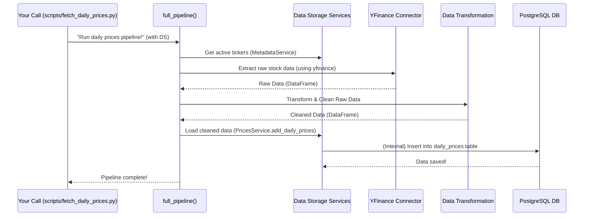

# Chapter 5: Data Fetching Pipelines

Welcome back! In our journey through the `data_processing` project:

*   In [Chapter 1: External Data Connectors](01_external_data_connectors_.md), we learned how to get raw data (like stock prices or news) from the internet.
*   In [Chapter 2: Shared Utilities & Configuration](02_shared_utilities___configuration_.md), we set up our project's toolbox for consistent error handling and shared settings.
*   In [Chapter 3: Data Transformation & Normalization](03_data_transformation___normalization_.md), we meticulously cleaned, standardized, and organized that raw data.
*   And in [Chapter 4: Data Storage Services](04_data_storage_services_.md), we learned how to safely store our perfectly prepared data in databases like PostgreSQL and Redis.

Now, imagine you're running a busy kitchen. You have ingredients delivered, skilled chefs to prepare them, and a pantry to store the finished dishes. But how do you make sure that a specific dish—say, "Daily Stock Price Data"—is consistently prepared, from start to finish, every single day?

### What Problem Are We Solving?

Each type of financial data (daily stock prices, real-time prices, news articles) needs to be gathered, cleaned, and stored in a very specific way. It's not enough to just know *how* to do each step; we need a complete, end-to-end process that connects all these steps logically.

The challenge is to:
*   **Orchestrate the entire process:** Make sure raw data is fetched first, then transformed, then stored – in the correct order.
*   **Handle specific data types:** The process for daily prices is different from real-time prices or news.
*   **Make it repeatable:** We want to run this process reliably over and over again.

This is where **Data Fetching Pipelines** come in!

### Introducing "Data Fetching Pipelines"

Think of a **Data Fetching Pipeline** as a specialized assembly line. Each assembly line is designed to produce a particular type of refined financial dataset from raw inputs. It takes all the individual steps we've learned about (fetching, transforming, storing) and combines them into one seamless, automated flow.

Each pipeline has distinct stages:

1.  **Determine What to Fetch:** Decide which stocks or keywords to look for, and for what time period.
2.  **Connect to External Source:** Use our [External Data Connectors](01_external_data_connectors_.md) (like `yfinance` or `gnews`) to pull raw data.
3.  **Clean and Transform:** Use our [Data Transformation & Normalization](03_data_transformation___normalization_.md) logic to refine the raw data.
4.  **Save to Storage:** Use our [Data Storage Services](04_data_storage_services_.md) (for PostgreSQL or Redis) to save the final, clean data.

Our project has different pipelines for different kinds of data: one for daily stock prices, another for real-time prices, and others for various types of news.

### Our Use Case: The Daily Stock Price Pipeline

Let's use the daily stock prices as our main example. We want to consistently fetch historical daily prices for a list of stocks, process them, and store them in our PostgreSQL database. This entire flow is handled by a single "Daily Stock Price Pipeline."

#### How Our Project Runs a Pipeline

In our project, each pipeline is typically represented by a `full_pipeline` function within a script. For daily prices, this is `scripts/fetch_daily_prices.py`.

To run this pipeline, you simply call its `full_pipeline` function, providing it with the necessary "librarians" (our [Data Storage Services](04_data_storage_services_.md)).

```python
# From scripts/fetch_daily_prices.py (simplified main execution block)
from itapia_common.dblib.services import DataMetadataService, DataPricesService
from itapia_common.dblib.session import get_singleton_rdbms_engine

# ... (full_pipeline function defined above) ...

if __name__ == "__main__":
    # Get connections to our database
    engine = get_singleton_rdbms_engine()
    
    # Create our "librarians" (Data Storage Services)
    prices_service = DataPricesService(engine)
    metadata_service = DataMetadataService(engine)
    
    # Run the daily prices pipeline!
    full_pipeline(metadata_service=metadata_service, prices_service=prices_service)
```

**What this code does:**

1.  It first gets the necessary database connection (`engine`).
2.  Then, it creates instances of our `DataMetadataService` and `DataPricesService` (our "librarians" from Chapter 4) because the pipeline will need them to get information (like which tickers to fetch) and to save data.
3.  Finally, it calls the `full_pipeline` function, passing these services to it. This single call kicks off the entire assembly line!

### Under the Hood: The Pipeline's Assembly Line

When you call `full_pipeline`, it orchestrates all the steps we've discussed in previous chapters. Let's trace the journey of daily stock price data:

1.  **Initialization:** The `full_pipeline` starts by figuring out what data needs to be fetched (e.g., from the last collected date until yesterday). It asks the `DataMetadataService` for a list of active tickers.
2.  **Extraction (Chapter 1):** It uses `yfinance` (our [External Data Connector](01_external_data_connectors_.md)) to pull raw historical stock data from Yahoo Finance.
3.  **Transformation (Chapter 3):** The raw data is then passed to internal helper functions (`_reconstruct_table`, `_handle_missing_data`) that clean, reshape, and normalize it, making sure it's in the perfect format.
4.  **Loading (Chapter 4):** Finally, the cleaned data is handed over to the `DataPricesService` (our [Data Storage Service](04_data_storage_services_.md)) which knows exactly how to insert it into our PostgreSQL database.

Here's a diagram illustrating this flow:



### Code Deep Dive: Inside the `full_pipeline` Functions

Each `full_pipeline` function acts as the conductor for its specific data type. Let's look at simplified versions of how they orchestrate the steps.

#### 1. Daily Prices Pipeline (`scripts/fetch_daily_prices.py`)

This pipeline focuses on getting historical daily prices and storing them in PostgreSQL.

```python
# File: scripts\fetch_daily_prices.py (simplified)
from datetime import datetime, timedelta, timezone
import pandas as pd
# Services from Chapter 4
from itapia_common.dblib.services import DataMetadataService, DataPricesService
# Connector from Chapter 1, Utils from Chapter 2, Transform functions from Chapter 3
from .utils import DEFAULT_RETURN_DATE
# _extract_raw_data, _reconstruct_table, _handle_missing_data are defined here

def full_pipeline(
    metadata_service: DataMetadataService, prices_service: DataPricesService
):
    # 1. Determine timing and get tickers (uses metadata_service)
    #    This gets `start_collect_date`, `end_collect_date`, `tickers`
    tickers = metadata_service.get_all_tickers()
    # ... logic to calculate start/end dates ...

    # 2. Extract Raw Data (Chapter 1)
    raw_df = _extract_raw_data(tickers, start_collect_date, end_collect_date)

    # 3. Transform Data (Chapter 3)
    reconstructed_df = _reconstruct_table(raw_df, "float32")
    cleaned_df = _handle_missing_data(
        reconstructed_df,
        start_date,
        end_date,
        features=["open", "high", "low", "close", "volume"],
    )

    # 4. Load Data (Chapter 4)
    prices_service.add_daily_prices(
        data=cleaned_df, unique_cols=["collect_date", "ticker"]
    )
    # ... log success ...
```
**Explanation:**

*   The `full_pipeline` function takes `metadata_service` and `prices_service` as inputs.
*   It first uses `metadata_service.get_all_tickers()` to know *which* stocks to fetch.
*   Then, `_extract_raw_data` (using `yfinance` internally, from Chapter 1) gets the raw data.
*   Next, `_reconstruct_table` and `_handle_missing_data` (our transformation steps from Chapter 3) clean and organize this data.
*   Finally, `prices_service.add_daily_prices()` (our storage service from Chapter 4) saves the result to PostgreSQL.

#### 2. Real-time Prices Pipeline (`scripts/fetch_realtime_prices.py`)

This pipeline fetches current prices for active markets and stores them in Redis for fast access.

```python
# File: scripts\fetch_realtime_prices.py (simplified)
import time
from datetime import datetime, timezone
# Services from Chapter 4
from itapia_common.dblib.services import DataMetadataService, DataPricesService
# _is_market_open_for_ticker, _process_single_ticker are defined here

def full_pipeline(
    metadata_service: DataMetadataService,
    prices_service: DataPricesService,
    relax_time: int = 2,
):
    # 1. Get info about all active tickers (from metadata_service's cache)
    active_tickers_info = metadata_service.metadata_cache
    
    # 2. Filter tickers if their market is open
    tickers_to_process = []
    for ticker, info in active_tickers_info.items():
        if _is_market_open_for_ticker(info): # Checks if it's trading hours
            tickers_to_process.append(ticker)
    
    # 3. Process each open ticker
    for ticker in tickers_to_process:
        try:
            # _process_single_ticker handles Extract, Transform, Load for one ticker
            _process_single_ticker(ticker, prices_service) 
        except Exception as e:
            # ... log error ...
        time.sleep(relax_time) # Pause to avoid hitting API limits
```
**Explanation:**

*   This `full_pipeline` also uses `metadata_service` to get information about tickers, specifically checking if their markets are open.
*   It then iterates through each eligible ticker.
*   For each ticker, `_process_single_ticker` (which internally uses `yfinance.Ticker(...).fast_info` for extraction, transforms the data, and then calls `prices_service.add_intraday_prices()` for loading into Redis) performs the E-T-L cycle.
*   A `time.sleep()` is included to avoid making too many requests too quickly to the external source.

#### 3. Universal News Pipeline (`scripts/fetch_universal_news.py`)

This pipeline collects general news based on keywords and topics and stores it in PostgreSQL.

```python
# File: scripts\fetch_universal_news.py (simplified)
import time
# Service from Chapter 4
from itapia_common.dblib.services import DataNewsService
# Utils from Chapter 2, Extract/Transform functions from Chapter 1/3
from .utils import UNIVERSAL_KEYWORDS_EN, UNIVERSAL_TOPIC_EN

# _extract_news_data_by_keyword, _extract_news_data_by_topic, _transform are defined here

def full_pipeline(
    news_service: DataNewsService,
    keywords: list[str],
    topics: list[str],
    period_days: int = 5,
):
    # 1. Extract Raw Data (from keywords, using gnews from Chapter 1)
    raw_data1 = _extract_news_data_by_keyword(keywords, period_days, sleep_time=5)

    # 2. Extract Raw Data (from topics, using gnews from Chapter 1)
    raw_data2 = _extract_news_data_by_topic(topics, period_days, sleep_time=5)

    raw_data = raw_data1 + raw_data2

    # 3. Transform Data (Chapter 3)
    transformed_data = _transform(raw_data) # This calls _transform_element for each article

    # 4. Load Data (Chapter 4)
    news_service.add_news(
        data=transformed_data, type="universal", unique_cols=["title_hash"]
    )
    # ... log success ...
```
**Explanation:**

*   This `full_pipeline` takes `news_service` and lists of `keywords` and `topics` (which usually come from [Shared Utilities & Configuration](02_shared_utilities___configuration_.md)).
*   It calls `_extract_news_data_by_keyword` and `_extract_news_data_by_topic` (which use `gnews` internally, from Chapter 1) to get raw news data.
*   Then, `_transform` (our transformation logic from Chapter 3) cleans and standardizes all the collected news articles, including generating unique IDs.
*   Finally, `news_service.add_news()` (our storage service from Chapter 4) saves the transformed news to PostgreSQL.

#### 4. Relevant News Pipeline (`scripts/fetch_relevant_news.py`)

This pipeline fetches news specific to stock tickers from Yahoo Finance and stores it in PostgreSQL.

```python
# File: scripts\fetch_relevant_news.py (simplified)
import time
# Services from Chapter 4
from itapia_common.dblib.services import DataMetadataService, DataNewsService

# _extract_news_data, _transform are defined here (different from universal news)

def full_pipeline(
    metadata_service: DataMetadataService,
    news_service: DataNewsService,
    max_news: int = 10,
):
    # 1. Get active tickers
    tickers = metadata_service.get_all_tickers()

    # 2. Extract Raw Data (for each ticker, using yfinance from Chapter 1)
    data = _extract_news_data(tickers, sleep_time=5, max_news=max_news)

    # 3. Transform Data (Chapter 3)
    transformed_data = _transform(data) # This uses _transform_element specific to yfinance news

    # 4. Load Data (Chapter 4)
    news_service.add_news(
        transformed_data,
        "relevant",
        unique_cols=["news_uuid"],
    )
    # ... log success ...
```
**Explanation:**

*   Similar to the daily prices, this pipeline first gets a list of `tickers` from `metadata_service`.
*   It then calls `_extract_news_data` (which uses `yfinance` to get news for each ticker, from Chapter 1).
*   The `_transform` function (with its `_transform_element` tailored for Yahoo Finance news, from Chapter 3) cleans this data.
*   Finally, `news_service.add_news()` saves the relevant news to PostgreSQL.

### Conclusion

In this chapter, we've brought everything together to understand **Data Fetching Pipelines**. We learned that these are the complete, end-to-end assembly lines that orchestrate all the individual steps—from fetching raw data, transforming it, to finally storing it—to produce specific, refined datasets like daily stock prices or news articles. Each `full_pipeline` function acts as the conductor, ensuring that our data is consistently processed and made ready for use.

Now that we have these robust pipelines for gathering and storing our data, the next logical question is: How do we make sure these pipelines run automatically at the right times, without us having to manually start them every time? In the next chapter, we'll explore [Scheduled Task Orchestration](06_scheduled_task_orchestration_.md), which is all about automating these pipelines!

---

Generated by [AI Codebase Knowledge Builder](https://github.com/The-Pocket/Tutorial-Codebase-Knowledge)