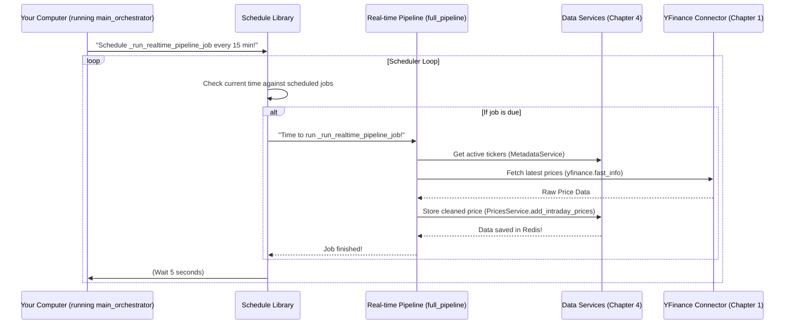

# Chapter 6: Scheduled Task Orchestration

Welcome back! In [Chapter 5: Data Fetching Pipelines](05_data_fetching_pipelines_.md), we learned how to build entire "assembly lines" that fetch, transform, and store different kinds of financial data, like daily stock prices or news articles. These pipelines are powerful!

Now, imagine you've set up these amazing assembly lines, but you still have to manually press the "start" button every time you want them to run. If you need real-time stock prices updated every 15 minutes, you'd have to remember to click that button *every 15 minutes*! That's not very automated, is it?

### What Problem Are We Solving?

We want our data fetching pipelines to run **automatically** at specific times or regular intervals. We don't want to be tied to our computers, manually triggering processes. We need a way to say, "Hey computer, run this real-time price pipeline at 9:30 AM, then again at 9:45 AM, then 10:00 AM, and so on, every single day!"

This is where **Scheduled Task Orchestration** comes in!

Think of **Scheduled Task Orchestration** like an automated alarm clock, or even better, a factory manager who makes sure that specific machines (our pipelines) start exactly when they are supposed to, keeping operations running smoothly without any human needing to intervene.

In our `data_processing` project, this concept is primarily used for our real-time price fetching pipeline, ensuring it runs every 15 minutes to keep our fast-access data (in Redis, from [Chapter 4: Data Storage Services](04_data_storage_services_.md)) up-to-date.

### Introducing the `schedule` Library

To achieve this "automated alarm clock" functionality, our project uses a friendly Python library called `schedule`. This library makes it incredibly easy to define when a task should run. You can tell it:

*   "Run this task `every()` `minute()`"
*   "Run this task `every()` `hour()` `at(":30")` (meaning at 30 minutes past the hour)"
*   "Run this task `every()` `day()` `at("10:30")`"

Once you tell `schedule` what to do, you just start a loop, and `schedule` takes care of checking the time and running your tasks when they are due.

### Our Core Use Case: Real-time Price Updates

Let's focus on our main example: ensuring the real-time price fetching pipeline runs every 15 minutes. This pipeline lives in `scripts/fetch_realtime_prices.py` and its main function is `full_pipeline` (as we saw in [Chapter 5: Data Fetching Pipelines](05_data_fetching_pipelines_.md)).

We need to tell the `schedule` library to repeatedly call this `full_pipeline` function at specific times, like on the hour (`:00`), then `15` minutes past (`:15`), `30` minutes past (`:30`), and `45` minutes past (`:45`).

#### How to Schedule a Task with `schedule`

To make our real-time price pipeline run automatically, we use a special function called `main_orchestrator` in `scripts/fetch_realtime_prices.py`. This function is like our factory manager setting up the schedule.

Here's a simplified look at how it works:

```python
# From scripts/fetch_realtime_prices.py (simplified)
import time
import schedule # This is our scheduling library
# ... other imports for full_pipeline and services ...

def full_pipeline(metadata_service, prices_service, relax_time):
    # This is the pipeline from Chapter 5 that fetches and stores real-time prices
    # We will call this function automatically.
    print(f"Running real-time pipeline at {time.strftime('%H:%M:%S')}")
    # ... actual pipeline logic ...

def main_orchestrator():
    print("--- REAL-TIME ORCHESTRATOR STARTED ---")
    
    # 1. Initialize our database connections and services (from Chapter 4)
    #    These are needed by the full_pipeline function.
    #    (Details are skipped, but they are set up here)
    # engine = get_singleton_rdbms_engine()
    # redis_client = get_singleton_redis_client()
    # metadata_service = DataMetadataService(engine)
    # prices_service = DataPricesService(engine, redis_client)

    # For the example, let's pretend we have these services available
    class MockService:
        def __init__(self, name): self.name = name
    metadata_service_mock = MockService("Metadata")
    prices_service_mock = MockService("Prices")

    # 2. Define the "job" that schedule will run
    def _run_realtime_pipeline_job():
        # This function simply calls our full_pipeline from Chapter 5
        # It uses the services we just prepared
        full_pipeline(
            metadata_service=metadata_service_mock, # Use our mock services
            prices_service=prices_service_mock,
            relax_time=4,
        )

    # 3. Tell schedule WHEN to run our job
    print("Scheduling real-time pipeline to run every 15 minutes...")
    schedule.every().hour.at(":00").do(_run_realtime_pipeline_job)
    schedule.every().hour.at(":15").do(_run_realtime_pipeline_job)
    schedule.every().hour.at(":30").do(_run_realtime_pipeline_job)
    schedule.every().hour.at(":45").do(_run_realtime_pipeline_job)

    # 4. Start the scheduler's main loop
    #    This loop keeps checking if any scheduled jobs are due.
    print("Scheduler loop started. Waiting for tasks...")
    while True:
        schedule.run_pending() # Check if any jobs should run now
        time.sleep(5)          # Wait 5 seconds before checking again (saves CPU)

if __name__ == "__main__":
    main_orchestrator()
```
**What this code does:**

1.  We import the `schedule` library.
2.  Inside `main_orchestrator`, we first prepare all the necessary `metadata_service` and `prices_service` "librarians" (from [Chapter 4: Data Storage Services](04_data_storage_services_.md)) that our `full_pipeline` will need.
3.  We define a small helper function, `_run_realtime_pipeline_job`, which simply calls our `full_pipeline` (from [Chapter 5: Data Fetching Pipelines](05_data_fetching_pipelines_.md)) with these prepared services. This is the "task" that `schedule` will execute.
4.  Then, we use `schedule.every().hour.at(":XX").do(_run_realtime_pipeline_job)` to tell the scheduler exactly when to run this task: at 00, 15, 30, and 45 minutes past every hour.
5.  Finally, the `while True: schedule.run_pending(); time.sleep(5)` loop is started. This loop never ends. It constantly asks `schedule` "Are there any jobs due to run right now?". If `schedule` says yes, it runs the job. Then, it waits for 5 seconds and checks again. This is how the automation keeps running!

When you run this script, you'll see messages like:
```
--- REAL-TIME ORCHESTRATOR STARTED ---
Scheduling real-time pipeline to run every 15 minutes...
Scheduler loop started. Waiting for tasks...
(After some time, e.g., at 10:00:00)
Running real-time pipeline at 10:00:00
--- COMPLETED PIPELINE CYCLE --- (from full_pipeline)
(Waits... then at 10:15:00)
Running real-time pipeline at 10:15:00
--- COMPLETED PIPELINE CYCLE ---
... and so on ...
```
This shows that the `full_pipeline` is being called automatically according to the schedule we set.

### Under the Hood: How the Scheduler Works

When you run the `main_orchestrator` function, here's a simplified view of what happens:

1.  **Setup Phase:** Your code initializes the `schedule` library and defines all the tasks (`_run_realtime_pipeline_job`) and their timing rules (`every().hour.at(":15")`). `schedule` keeps a list of all these jobs internally.
2.  **Looping and Checking:** The `while True` loop starts. In each cycle:
    *   `schedule.run_pending()` looks at its list of jobs. For each job, it checks the current time against the job's scheduled time.
    *   If a job's time has arrived, `schedule` executes the function associated with that job (in our case, `_run_realtime_pipeline_job`).
    *   `time.sleep(5)` then pauses the program for 5 seconds, preventing it from constantly checking and using up too much computer power.
3.  **Job Execution:** When `_run_realtime_pipeline_job` is executed, it, in turn, calls our `full_pipeline` (from [Chapter 5: Data Fetching Pipelines](05_data_fetching_pipelines_.md)). This `full_pipeline` then does all its work: asking the `DataMetadataService` for tickers, fetching data from `yfinance`, transforming it, and saving it with `DataPricesService` into Redis.

Here's a simple diagram illustrating this process:



#### Code Deep Dive: `main_orchestrator` in `scripts/fetch_realtime_prices.py`

Let's look at the actual code in `scripts/fetch_realtime_prices.py` that handles this scheduling.

```python
# File: scripts\fetch_realtime_prices.py
import time
from functools import partial # Used for functions with arguments
import schedule
from itapia_common.dblib.services import DataMetadataService, DataPricesService
from itapia_common.dblib.session import (
    get_singleton_rdbms_engine,
    get_singleton_redis_client,
)
# ... full_pipeline function is also defined in this file ...

def main_orchestrator():
    """Main entry point that sets up and runs the real-time data collection schedule."""
    # ... logging startup message ...

    # 1. Get database connections and initialize services
    engine = get_singleton_rdbms_engine() # Connects to PostgreSQL
    redis_client = get_singleton_redis_client() # Connects to Redis

    metadata_service = DataMetadataService(engine) # Our metadata librarian
    prices_service = DataPricesService(engine, redis_client) # Our price librarian

    # 2. Prepare the job for schedule
    # 'partial' helps us create a new function where some arguments for full_pipeline
    # are already filled in (like our initialized services).
    partial_job = partial(
        full_pipeline,
        metadata_service=metadata_service,
        prices_service=prices_service,
        relax_time=4, # Value for pausing between requests
    )

    # 3. Tell schedule WHEN to run the 'partial_job'
    schedule.every().hour.at(":00").do(partial_job)
    schedule.every().hour.at(":15").do(partial_job)
    schedule.every().hour.at(":30").do(partial_job)
    schedule.every().hour.at(":45").do(partial_job)

    # 4. Start the scheduler's execution loop
    while True:
        schedule.run_pending() # Check and run any due jobs
        time.sleep(5)          # Wait 5 seconds to reduce CPU usage

if __name__ == "__main__":
    main_orchestrator()
```
**Explanation:**

*   This `main_orchestrator` function is the main entry point when this script is run directly.
*   It starts by setting up connections to our databases (`engine`, `redis_client`) and creating instances of our `DataMetadataService` and `DataPricesService` (from [Chapter 4: Data Storage Services](04_data_storage_services_.md)). These services are crucial because our `full_pipeline` (from [Chapter 5: Data Fetching Pipelines](05_data_fetching_pipelines_.md)) needs them to function.
*   The `partial` function from Python's `functools` library is used here. It's a clever way to take our `full_pipeline` function (which requires arguments like `metadata_service` and `prices_service`) and create a *new* function called `partial_job` that already has these arguments filled in. This `partial_job` is what `schedule.do()` expects: a function that doesn't need any more arguments when it's called.
*   The `schedule.every().hour.at(":XX").do(partial_job)` lines define the schedule. They tell `schedule` to run `partial_job` four times every hour at the specified minute marks.
*   Finally, the `while True` loop ensures that the scheduler is constantly running in the background, checking for and executing tasks when their scheduled time arrives.

### Conclusion

In this chapter, we learned about **Scheduled Task Orchestration**, the automated "alarm clock" for our `data_processing` project. We saw how the `schedule` library helps us define precise timings for our data fetching pipelines, ensuring they run automatically without manual intervention. This is essential for keeping our real-time price data constantly updated, making our entire system reliable and efficient.

This marks the end of our tutorial chapters, which have covered everything from connecting to external data, handling utilities, transforming and storing data, to orchestrating complex pipelines on a schedule. You now have a comprehensive understanding of how our `data_processing` project collects, cleans, and manages financial data!

---

Generated by [AI Codebase Knowledge Builder](https://github.com/The-Pocket/Tutorial-Codebase-Knowledge)