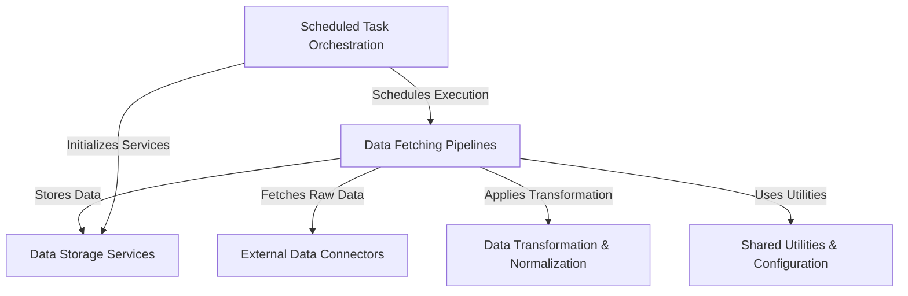

# Tutorial: data_processing

This project is designed to **automatically collect, process, and store** various types of *financial data*. It gathers information like daily and real-time stock prices from sources like Yahoo Finance, and news articles from Google News. The collected raw data is then *cleaned, transformed, and standardized* before being saved into databases or a caching layer, making it ready for further use and analysis. Specific tasks are also *scheduled* to run automatically at predetermined intervals.

**Source Repository:** [None](None)

## Chapters

1. [External Data Connectors
](01_external_data_connectors_.md)
2. [Shared Utilities & Configuration
](02_shared_utilities___configuration_.md)
3. [Data Transformation & Normalization
](03_data_transformation___normalization_.md)
4. [Data Storage Services
](04_data_storage_services_.md)
5. [Data Fetching Pipelines
](05_data_fetching_pipelines_.md)
6. [Scheduled Task Orchestration
](06_scheduled_task_orchestration_.md)

---

Generated by [AI Codebase Knowledge Builder](https://github.com/The-Pocket/Tutorial-Codebase-Knowledge)